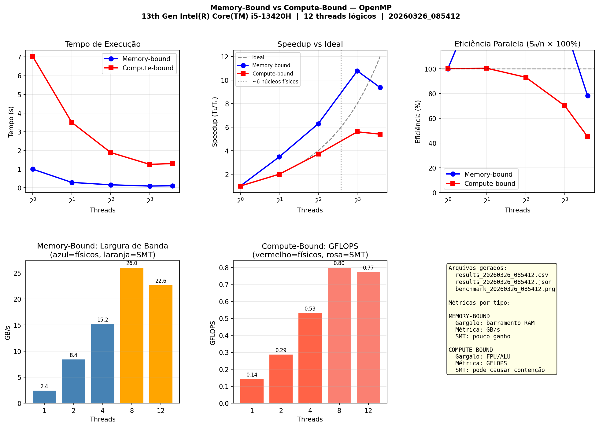

# Entendendo os Gráficos — Tarefa 4

> Arquivo de apoio pessoal. Explica em detalhe cada painel do gráfico gerado pelo benchmark.

---

## Painel 1 — Tempo de Execução



Este é o gráfico mais direto: quanto tempo cada programa levou para terminar conforme o número de threads aumenta.

**O que o eixo X representa:**
O eixo X mostra o número de threads em escala logarítmica base 2 (1, 2, 4, 8, 12). Essa escala é usada porque dobramos os threads a cada passo — em escala linear, os pontos de 1 e 2 ficariam colados e o de 8 e 12 pareceriam muito próximos.

**O que acontece com o compute-bound (linha vermelha):**
Parte de ~7 segundos com 1 thread e cai de forma suave e gradual. Cada thread adicional contribui com poder de cálculo real, então o tempo cai proporcionalmente. A curva "achata" depois de 8 threads porque os threads extras vão para núcleos mais lencos e o ganho marginal diminui.

**O que acontece com o memory-bound (linha azul):**
Parte de ~1 segundo com 1 thread — já bem mais rápido que o compute-bound porque a operação `A+B` é trivial matematicamente. Cai muito rápido até 8 threads (~0.09s), depois **sobe levemente** em 12 threads (~0.10s). Esse aumento é o sinal de saturação: o barramento de memória já estava no limite, e adicionar mais threads só aumenta a fila de espera.

**Por que o memory-bound começa mais rápido que o compute-bound?**
Porque fazer `A[i] + B[i]` é uma soma. O processador executa isso em nanossegundos. O programa é lento apenas quando precisa buscar os dados na RAM. Já o compute-bound faz 10.000 operações de `sin` e `cos` por elemento — cada uma dessas funções trigonométricas exige dezenas de ciclos de CPU para ser calculada.

---

## Painel 2 — Speedup vs Ideal

**O que é Speedup?**
Speedup é a resposta para: *"quantas vezes o programa ficou mais rápido?"*

```
S = T(1 thread) / T(n threads)
```

Se com 1 thread levou 7s e com 4 threads levou 1.88s, o speedup é `7 / 1.88 = 3.72x`.

**O que é a linha ideal (pontilhada preta)?**
A linha ideal representa o caso perfeito: com 2 threads, o speedup seria exatamente 2x; com 4, seria 4x; e assim por diante. Isso significaria que cada thread adicional contribui 100% sem nenhum overhead. Na prática, isso nunca acontece — há custo de criação de threads, sincronização, concorrência por recursos, etc.

**Por que o memory-bound (azul) ultrapassa a linha ideal?**
Isso é chamado de **speedup super-linear** — a eficiência passa de 100%. Parece impossível, mas acontece por dois motivos combinados:

1. **Baseline ruim:** O tempo com 1 thread teve muita variação (entre 0.3s e 2.9s nas 3 execuções). A mediana escolhida foi 0.99s — provavelmente uma execução onde o cache estava frio ou o SO agendou a tarefa de forma ruim. Isso "infla" o numerador do speedup.

2. **Memory-Level Parallelism:** Com múltiplos threads, o controlador de memória recebe várias requisições independentes ao mesmo tempo e consegue servi-las em paralelo, usando ambos os canais de memória (dual-channel). Com 1 thread, apenas um canal é exercitado por vez.

**O que acontece em 12 threads (queda no final)?**
Ambas as linhas caem de 8 para 12 threads. Os threads extras ocupam núcleos mais lentos que não conseguem compensar o overhead que introduzem. O speedup **diminui** — o programa fica mais lento do que com 8 threads.

---

## Painel 3 — Eficiência Paralela

**O que é Eficiência?**
A eficiência responde: *"estou aproveitando bem cada thread que adicionei?"*

```
E = (Speedup / número de threads) × 100%
```

Com 4 threads e speedup de 3.72x: `E = (3.72 / 4) × 100 = 93%`. Isso significa que cada thread está sendo aproveitado em 93% do seu potencial.

**Por que a eficiência sempre cai com mais threads?**
Porque o overhead de paralelismo (criar threads, sincronizar, distribuir trabalho, esperar na barreira do `parallel for`) cresce com o número de threads, enquanto o ganho de desempenho cresce cada vez menos.

**O que os valores dizem sobre cada programa:**

| Ponto | Memory-Bound | Compute-Bound | Interpretação |
|-------|-------------|---------------|---------------|
| 2 threads | 174% | 100% | MB: super-linear. CB: perfeito |
| 4 threads | 157% | 93% | Ainda bom nos dois |
| 8 threads | 135% | 70% | CB começa a mostrar desgaste |
| 12 threads | 78% | 45% | Ambos: overhead supera o ganho |

A eficiência de **45% no compute-bound com 12 threads** significa que mais da metade do trabalho dos threads está sendo desperdiçado em espera e sincronização.

---

## Painel 4 — Largura de Banda em GB/s (Memory-Bound)

**O que é GB/s (Gigabytes por segundo)?**
É a quantidade de dados que transitam entre a RAM e o processador por segundo. É a métrica correta para programas memory-bound porque o gargalo não é o cálculo — é a velocidade com que os dados chegam ao processador.

**Por que não usar GFLOPS aqui?**
Porque `A[i] + B[i]` é uma soma. Independente de quantas threads você use, são apenas ~100 milhões de somas — triviais. Se você medisse GFLOPS, o número seria alto e constante, não revelando nada sobre o verdadeiro gargalo. O que importa é: *em quanto tempo os 2.4 GB de dados conseguiram passar pelo barramento?*

**Como é calculado:**
```
GB/s = (bytes lidos + bytes escritos) / tempo / 1_000_000_000
     = (N × 3 × 8 bytes) / tempo / 1e9
```
São 3 acessos por elemento: leitura de A, leitura de B, escrita em C. Com N=100 milhões e doubles de 8 bytes: `100M × 3 × 8 = 2.4 GB`.

**O que as barras mostram:**
- As barras crescem de 2.4 GB/s (1 thread) até **26 GB/s** (8 threads) — o pico de banda disponível no hardware.
- Em 12 threads a barra cai para 22.6 GB/s: o barramento está saturado e os threads a mais criam contenção, *reduzindo* a eficiência do controlador de memória.
- A diferença de cor (azul → laranja) marca a transição para núcleos de menor desempenho.

**O que significa "saturar o barramento"?**
O barramento de memória é o caminho físico entre CPU e RAM. Ele tem uma largura de banda máxima determinada pelo hardware (frequência do barramento × largura em bits). Quando múltiplos threads enviam requisições mais rápido do que o barramento consegue atender, as requisições formam fila. A partir daí, adicionar mais threads só aumenta a espera — como colocar mais carros numa rodovia que já está em congestionamento total.

---

## Painel 5 — GFLOPS (Compute-Bound)

**O que é GFLOPS?**
GFLOPS = *Giga Floating Point Operations Per Second* = bilhões de operações de ponto flutuante por segundo.

É a métrica correta para compute-bound porque o gargalo é a capacidade de cálculo do processador, não a memória. Mede diretamente o quanto de trabalho matemático foi feito por unidade de tempo.

**Por que não usar GB/s aqui?**
Porque o programa acessa apenas um array pequeno (50.000 doubles = ~400 KB), que cabe inteiro no cache L2/L3. Os dados nunca precisam ir à RAM durante o cálculo. A banda de memória não é o gargalo — as FPUs (unidades de ponto flutuante) é que estão sobrecarregadas.

**Como é calculado:**
```
GFLOPS = (N × iterações_internas × operações_por_iteração) / tempo / 1e9
       = (50.000 × 10.000 × 2) / tempo / 1e9
```
São 2 operações por iteração interna: `sin` + `cos`. Total: 1 bilhão de operações.

**O que as barras mostram:**
- Crescimento consistente de 0.14 (1 thread) até 0.80 GFLOPS (8 threads).
- Leve queda para 0.77 GFLOPS em 12 threads — os threads extras nos núcleos mais lentos terminam depois, e a barreira de sincronização faz todos esperarem. O tempo total aumenta, diminuindo os GFLOPS médios.
- A cor mais intensa (vermelho) marca os núcleos de alto desempenho; a mais clara (rosa/salmão) os núcleos que causam desbalanceamento.

**Por que o escalonamento não é perfeito (1 → 8 threads deveria dar 8x, mas dá ~5.6x)?**
Porque `schedule(static)` divide o trabalho em fatias iguais entre os threads. Se alguns threads terminam sua fatia antes (por rodarem em núcleos mais rápidos), eles ficam ociosos esperando os mais lentos na barreira implícita do `parallel for`. A eficiência total é limitada pelo thread mais lento — isso é chamado de **efeito do elo mais fraco**.

---

## Resumo: qual métrica usar e por quê

| Situação | Métrica | Raciocínio |
|---|---|---|
| O programa passa a maior parte do tempo esperando dados da RAM | **GB/s** | O gargalo é o caminho entre RAM e CPU. Otimizar significa aumentar o fluxo de dados. |
| O programa passa a maior parte do tempo fazendo cálculos | **GFLOPS** | O gargalo são as unidades de cálculo. Otimizar significa fazer mais contas por segundo. |
| Quero saber se vale adicionar mais threads | **Eficiência (%)** | Revela o retorno marginal. Abaixo de ~70%, cada thread adicional está custando mais do que entregando. |
| Quero comparar versão paralela com sequencial | **Speedup** | Resposta direta: "ficou X vezes mais rápido". |
