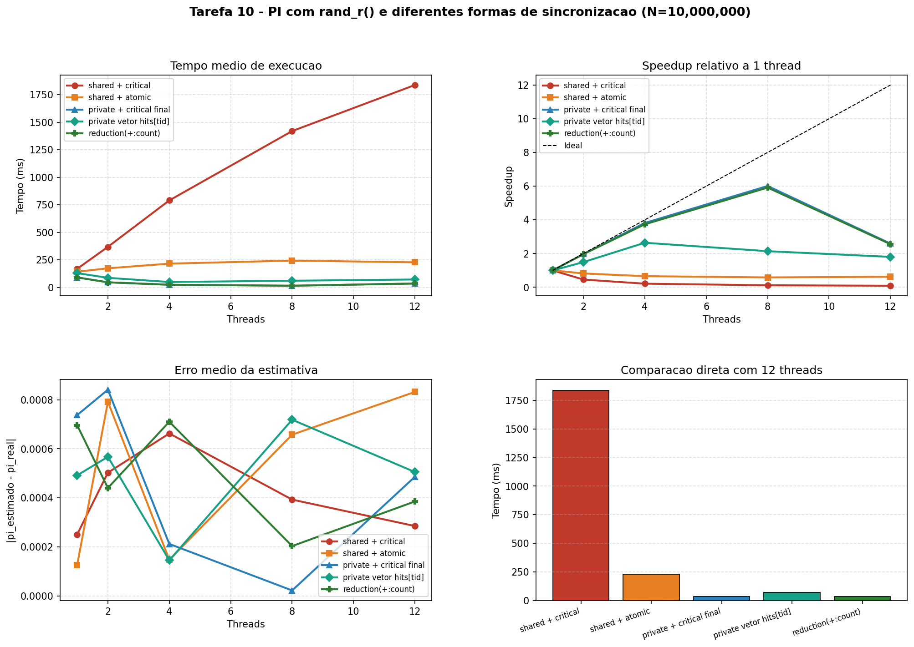

# Tarefa 10 - Comparacao entre `critical`, `atomic`, contadores privados e `reduction` no estimador de PI

#### Vinicius Barbosa Ventura Mergulhao

**Ambiente:** Linux/WSL, 12 threads logicos, Python 3.12.3

---

## 1. Programas implementados

| Programa | Estrategia de acumulacao | Diretivas / recursos OpenMP | Observacao principal |
|---|---|---|---|
| `pi_randr_shared_critical.c` | contador global com `critical` a cada acerto | `parallel`, `for`, `critical` | pior caso de serializacao |
| `pi_randr_shared_atomic.c` | contador global com `atomic` a cada acerto | `parallel`, `for`, `atomic` | melhor que `critical` para incremento simples |
| `pi_randr_private_critical.c` | contador local por thread + `critical` final | `parallel`, `for`, `critical` | reduz sincronizacao para 1 entrada por thread |
| `pi_randr_private_vector.c` | `hits[tid]` em vetor compartilhado | `parallel`, `for` | pode sofrer false sharing |
| `pi_randr_reduction.c` | `reduction(+:count)` | `parallel`, `for`, `reduction` | solucao mais direta para soma associativa |

Todos os programas usam:

- `rand_r()` com seed privada por thread
- `schedule(static)` para reduzir ruido experimental
- `omp_get_wtime()` para medicao de tempo
- o mesmo protocolo de saida:
  `CONFIG program=<id> n=<N> threads=<T>`
  `RESULT pi=<...> count=<...> total=<...> error=<...> elapsed=<...>`

---

## 2. Objetivo do experimento

O foco desta tarefa nao e mais o gerador de numeros aleatorios, e sim o **custo da sincronizacao** para acumular os acertos do metodo de Monte Carlo.

As perguntas centrais sao:

1. Trocar `critical` por `atomic` resolve o gargalo quando ha um contador compartilhado?
2. Vale mais a pena reduzir o custo da trava ou **eliminar a sincronizacao por iteracao**?
3. O vetor `hits[tid]` continua competitivo ou o false sharing aparece claramente?
4. `reduction` entrega a melhor combinacao entre desempenho e simplicidade?

O benchmark executou:

- `N = 10.000.000` pontos por execucao
- `10` rodadas por configuracao
- `1, 2, 4, 8 e 12` threads

---

## 3. Corretude

Todas as configuracoes registradas em `Tarefa-10/dados/tarefa10_summary.json` foram validadas como corretas:

- `count <= N` em 100% das execucoes
- `total == N` em 100% das execucoes
- nenhuma falha de parse do protocolo `CONFIG` / `RESULT`
- nenhuma execucao invalida no resumo final (`all_valid = true` para todos os programas e todas as contagens de threads)

Os erros medios de PI ficaram sempre na faixa esperada para Monte Carlo com `N = 10.000.000`, tipicamente entre `2e-05` e `8e-04`, sem indicio de regressao numerica causado pela estrategia de sincronizacao.

---

## 4. Resultados

### 4.1 `shared_critical`

| Threads | Rodadas | Media (ms) | Min (ms) | Max (ms) | Erro medio |
|---|---|---|---|---|---|
| 1  | 10 | 168.628 | 161.405 | 187.999 | 0.00025082 |
| 2  | 10 | 368.163 | 311.977 | 415.952 | 0.00050277 |
| 4  | 10 | 789.934 | 736.393 | 828.660 | 0.00066273 |
| 8  | 10 | 1419.328 | 1341.667 | 1515.459 | 0.00039290 |
| 12 | 10 | 1837.724 | 1543.347 | 2121.558 | 0.00028492 |

### 4.2 `shared_atomic`

| Threads | Rodadas | Media (ms) | Min (ms) | Max (ms) | Erro medio |
|---|---|---|---|---|---|
| 1  | 10 | 142.229 | 132.342 | 171.444 | 0.00012614 |
| 2  | 10 | 173.391 | 118.700 | 231.093 | 0.00079223 |
| 4  | 10 | 215.843 | 150.640 | 245.525 | 0.00014693 |
| 8  | 10 | 243.263 | 181.047 | 268.592 | 0.00065770 |
| 12 | 10 | 227.864 | 182.085 | 267.126 | 0.00083228 |

### 4.3 `private_critical`

| Threads | Rodadas | Media (ms) | Min (ms) | Max (ms) | Erro medio |
|---|---|---|---|---|---|
| 1  | 10 | 91.081 | 83.182 | 102.374 | 0.00073785 |
| 2  | 10 | 46.262 | 42.879 | 52.284 | 0.00084129 |
| 4  | 10 | 23.872 | 22.001 | 25.982 | 0.00021185 |
| 8  | 10 | 15.158 | 14.021 | 17.468 | 0.00002215 |
| 12 | 10 | 35.137 | 15.694 | 53.641 | 0.00048613 |

### 4.4 `private_vector`

| Threads | Rodadas | Media (ms) | Min (ms) | Max (ms) | Erro medio |
|---|---|---|---|---|---|
| 1  | 10 | 129.774 | 124.203 | 135.620 | 0.00049189 |
| 2  | 10 | 86.870 | 79.987 | 95.686 | 0.00056740 |
| 4  | 10 | 49.129 | 44.503 | 52.892 | 0.00014505 |
| 8  | 10 | 60.597 | 56.707 | 65.178 | 0.00071888 |
| 12 | 10 | 71.960 | 60.688 | 86.427 | 0.00050527 |

### 4.5 `reduction`

| Threads | Rodadas | Media (ms) | Min (ms) | Max (ms) | Erro medio |
|---|---|---|---|---|---|
| 1  | 10 | 90.311 | 83.244 | 107.063 | 0.00069625 |
| 2  | 10 | 45.986 | 43.638 | 51.080 | 0.00044025 |
| 4  | 10 | 24.173 | 22.889 | 25.312 | 0.00071065 |
| 8  | 10 | 15.272 | 13.498 | 17.131 | 0.00020319 |
| 12 | 10 | 35.326 | 11.362 | 62.087 | 0.00038535 |

---

## 5. Comparacao direta em 12 threads

| Comparacao | Tempo A (ms) | Tempo B (ms) | Leitura |
|---|---|---|---|
| `shared_critical` vs `shared_atomic` | 1837.724 | 227.864 | `atomic` foi 87.6% mais rapido |
| `shared_atomic` vs `private_critical` | 227.864 | 35.137 | `private_critical` foi 84.6% mais rapido |
| `shared_critical` vs `private_critical` | 1837.724 | 35.137 | `private_critical` foi 98.1% mais rapido |
| `private_critical` vs `private_vector` | 35.137 | 71.960 | `private_vector` foi 104.8% mais lento |
| `private_critical` vs `reduction` | 35.137 | 35.326 | praticamente empate; `reduction` 0.5% mais lento |
| `private_vector` vs `reduction` | 71.960 | 35.326 | `reduction` foi 50.9% mais rapido |
| `shared_atomic` vs `reduction` | 227.864 | 35.326 | `reduction` foi 84.5% mais rapido |
| `shared_critical` vs `reduction` | 1837.724 | 35.326 | `reduction` foi 98.1% mais rapido |

---

## 6. Ranking por numero de threads

| Threads | 1 lugar | 2 lugar | 3 lugar | 4 lugar | 5 lugar |
|---|---|---|---|---|---|
| 1  | `reduction` (90.311 ms) | `private_critical` (91.081 ms) | `private_vector` (129.774 ms) | `shared_atomic` (142.229 ms) | `shared_critical` (168.628 ms) |
| 2  | `reduction` (45.986 ms) | `private_critical` (46.262 ms) | `private_vector` (86.870 ms) | `shared_atomic` (173.391 ms) | `shared_critical` (368.163 ms) |
| 4  | `private_critical` (23.872 ms) | `reduction` (24.173 ms) | `private_vector` (49.129 ms) | `shared_atomic` (215.843 ms) | `shared_critical` (789.934 ms) |
| 8  | `private_critical` (15.158 ms) | `reduction` (15.272 ms) | `private_vector` (60.597 ms) | `shared_atomic` (243.263 ms) | `shared_critical` (1419.328 ms) |
| 12 | `private_critical` (35.137 ms) | `reduction` (35.326 ms) | `private_vector` (71.960 ms) | `shared_atomic` (227.864 ms) | `shared_critical` (1837.724 ms) |

---
<div style="page-break-before: always;"></div>

## 7. Graficos gerados



O grafico foi dividido em quatro paineis:

**Painel 1 - Tempo medio de execucao:** mostra a diferenca brutal entre sincronizacao por iteracao (`shared_*`) e acumulacao privada (`private_*` / `reduction`).

**Painel 2 - Speedup relativo a 1 thread:** permite ver quais versoes realmente escalam. `shared_critical` tem speedup negativo severo; `shared_atomic` melhora, mas ainda nao escala bem. `private_critical` e `reduction` sao as unicas versoes que entregam speedup util de fato.

**Painel 3 - Erro medio da estimativa:** as curvas de erro ficam na mesma ordem de grandeza, mostrando que as diferencas de desempenho nao alteram a corretude numerica do metodo.

**Painel 4 - Comparacao direta com 12 threads:** resume visualmente o custo de cada estrategia no pior caso de pressao sobre a sincronizacao.

---

<div style="page-break-before: always;"></div>

## 8. Analise

### 8.1 `shared_critical` - o pior caso de serializacao

Essa versao entra em `critical` a cada acerto:

```c
if (x * x + y * y <= 1.0) {
    #pragma omp critical
    count++;
}
```

Na pratica, isso transforma a contagem em uma fila global. Com 12 threads, o tempo medio sobe de **168.628 ms** para **1837.724 ms**. O "speedup" relativo a 1 thread e apenas:

`0.168628 / 1.837724 = 0.092x`

Ou seja, a versao com 12 threads fica **quase 11 vezes mais lenta** que a serial. Isso confirma a expectativa teorica: um `critical` muito frequente elimina o paralelismo util.

### 8.2 `shared_atomic` - melhor que `critical`, mas ainda limitado

Trocar `critical` por `atomic` melhora muito porque o trecho protegido agora e apenas o incremento:

```c
#pragma omp atomic
count++;
```

Com 12 threads, `shared_atomic` cai para **227.864 ms**, contra **1837.724 ms** de `shared_critical`. O ganho e enorme: **87.6% mais rapido**.

Mesmo assim, `shared_atomic` ainda atualiza uma variavel global compartilhada a cada acerto. O gargalo principal deixa de ser o mecanismo da trava e passa a ser a **contencao estrutural** no contador unico. O speedup em 12 threads ainda e ruim:

`0.142229 / 0.227864 = 0.624x`

Portanto, `atomic` resolve o excesso de overhead de `critical`, mas nao resolve o problema de desenho da solucao.

### 8.3 `private_critical` - reduzir a sincronizacao vale mais que otimizar a trava

Aqui cada thread acumula localmente e entra em `critical` apenas uma vez:

```c
long local_count = 0;
...
if (x * x + y * y <= 1.0) {
    local_count++;
}
...
#pragma omp critical
count += local_count;
```

Essa simples mudanca altera completamente o comportamento. Em 12 threads, o tempo medio cai para **35.137 ms**, contra **227.864 ms** de `shared_atomic` e **1837.724 ms** de `shared_critical`.

Os ganhos sao os mais importantes do experimento:

- contra `shared_atomic`: **84.6% mais rapido**
- contra `shared_critical`: **98.1% mais rapido**

O ponto central aqui e didatico: **evitar sincronizacao por iteracao vale muito mais do que escolher entre `critical` e `atomic`**.

### 8.4 `private_vector` - sem corrida, mas com false sharing

`private_vector` tambem evita o contador global por iteracao, mas materializa os contadores em um vetor compartilhado:

```c
if (x * x + y * y <= 1.0) {
    hits[tid]++;
}
```

Cada thread escreve em uma posicao distinta, entao nao ha corrida de dados. O problema e que posicoes adjacentes podem cair no mesmo cache line. O protocolo de coerencia passa a invalidar linhas de cache entre threads, caracterizando false sharing.

Os dados sustentam essa leitura:

- em 12 threads, `private_vector` leva **71.960 ms**
- no mesmo ponto, `private_critical` leva **35.137 ms**

Isso faz `private_vector` ficar **104.8% mais lento** que `private_critical`. Ou seja, as duas estrategias removem a disputa no contador global, mas a versao com vetor reintroduz custo via coerencia de cache.

### 8.5 `reduction` - melhor equilibrio entre produtividade e desempenho

`reduction` expressa diretamente o padrao do problema:

```c
#pragma omp for schedule(static) reduction(+:count)
for (long i = 0; i < N; i++) {
    ...
    if (x * x + y * y <= 1.0) {
        count++;
    }
}
```

O runtime cria acumuladores privados e faz a combinacao ao final. Em desempenho, `reduction` ficou praticamente empatado com `private_critical`:

- `private_critical`: **35.137 ms**
- `reduction`: **35.326 ms**

Diferenca de apenas **0.5%** em 12 threads.

Em produtividade, `reduction` vence:

- menos codigo
- menos chance de erro de sincronizacao
- intencao semantica explicita

Para este tipo de problema, ela e a melhor referencia geral.

### 8.6 Leitura consolidada do experimento

Os resultados sustentam claramente a hierarquia esperada:

1. `shared_critical` e o pior caso, porque serializa o contador a cada acerto.
2. `shared_atomic` melhora bastante, mas continua presa a uma variavel global disputada.
3. `private_critical` elimina quase toda a contencao e passa a escalar de forma real.
4. `private_vector` tambem elimina o contador global, mas perde para `private_critical` por false sharing.
5. `reduction` entrega desempenho equivalente ao melhor caso manual, com codigo mais simples.

---

## 9. Roteiro de escolha do mecanismo

| Situacao | Mecanismo recomendado | Motivo |
|---|---|---|
| soma / reducao associativa simples | `reduction` | mais simples, mais seguro e normalmente otimizado pelo runtime |
| incremento simples em variavel compartilhada | `atomic` | menor overhead que `critical` para operacoes elementares |
| trecho curto que nao cabe em `atomic` | `critical` | exclusao mutua geral para pequenos blocos |
| poucos recursos fixos independentes | `critical(nome)` | separa regioes criticas estaticas por recurso |
| recursos dinamicos em tempo de execucao | `omp_lock_t` | permite granularidade dinamica de bloqueio |

---

## 10. Conclusao

Esta tarefa mostra que a pergunta correta nao e apenas "qual mecanismo de sincronizacao e mais rapido?", mas sim **"com que frequencia eu preciso sincronizar?"**.

Trocar `critical` por `atomic` ajuda muito quando o problema esta restrito a um incremento simples, mas o verdadeiro salto aparece quando a acumulacao deixa de ser compartilhada a cada iteracao. `private_critical` e `reduction` vencem exatamente por isso: eles convertem um gargalo global frequente em uma combinacao local barata.

Entre desempenho e produtividade, a conclusao final e direta:

- `reduction` deve ser a escolha padrao quando o problema for uma soma associativa simples
- `private_critical` e uma boa alternativa manual quando se quer explicitar o mecanismo
- `atomic` e preferivel a `critical` para atualizacoes simples em variavel compartilhada
- `critical` fica como recurso geral, mas nao como primeira opcao para contadores muito acessados

Em resumo, os dados confirmam o roteiro classico de OpenMP: **primeiro tente remover a contencao; so depois discuta qual trava usar**.

<div style="page-break-before: always;"></div>

## Codigo

### pi_randr_shared_critical.c

```c
#include <math.h>
#include <omp.h>
#include <stdio.h>
#include <stdlib.h>
#include <time.h>
#include "portable_rand_r.h"

#ifndef M_PI
#define M_PI 3.14159265358979323846
#endif

int main(int argc, char *argv[]) {
    long N = 10000000L;
    if (argc > 1) {
        N = atol(argv[1]);
    }
    long count       = 0;
    int threads_used = 0;

    double t0 = omp_get_wtime();

    #pragma omp parallel
    {
        unsigned int seed = (unsigned int)(time(NULL))
                          ^ (unsigned int)(omp_get_thread_num() * 2654435761u);

        #pragma omp single
        threads_used = omp_get_num_threads();

        #pragma omp for schedule(static)
        for (long i = 0; i < N; i++) {
            double x = (double)rand_r(&seed) / (double)RAND_MAX;
            double y = (double)rand_r(&seed) / (double)RAND_MAX;
            if (x * x + y * y <= 1.0) {
                #pragma omp critical
                count++;
            }
        }
    }
    double elapsed = omp_get_wtime() - t0;
    double pi      = 4.0 * (double)count / (double)N;
    double error   = fabs(pi - M_PI);

    printf("CONFIG program=shared_critical n=%ld threads=%d\n", N, threads_used);
    printf("RESULT pi=%.10f count=%ld total=%ld error=%.10f elapsed=%.6f\n",
           pi, count, N, error, elapsed);

    return 0;
}
```
<div style="page-break-before: always;"></div>

### pi_randr_shared_atomic.c

```c
#include <math.h>
#include <omp.h>
#include <stdio.h>
#include <stdlib.h>
#include <time.h>
#include "portable_rand_r.h"

#ifndef M_PI
#define M_PI 3.14159265358979323846
#endif

int main(int argc, char *argv[]) {
    long N = 10000000L;
    if (argc > 1) {
        N = atol(argv[1]);
    }

    long count       = 0;
    int threads_used = 0;

    double t0 = omp_get_wtime();

    #pragma omp parallel
    {
        unsigned int seed = (unsigned int)(time(NULL))
                          ^ (unsigned int)(omp_get_thread_num() * 2654435761u);

        #pragma omp single
        threads_used = omp_get_num_threads();

        #pragma omp for schedule(static)
        for (long i = 0; i < N; i++) {
            double x = (double)rand_r(&seed) / (double)RAND_MAX;
            double y = (double)rand_r(&seed) / (double)RAND_MAX;
            if (x * x + y * y <= 1.0) {
                #pragma omp atomic
                count++;
            }
        }
    }
    double elapsed = omp_get_wtime() - t0;
    double pi      = 4.0 * (double)count / (double)N;
    double error   = fabs(pi - M_PI);

    printf("CONFIG program=shared_atomic n=%ld threads=%d\n", N, threads_used);
    printf("RESULT pi=%.10f count=%ld total=%ld error=%.10f elapsed=%.6f\n",
           pi, count, N, error, elapsed);

    return 0;
}
```
<div style="page-break-before: always;"></div>


### pi_randr_private_critical.c

```c
#include <math.h>
#include <omp.h>
#include <stdio.h>
#include <stdlib.h>
#include <time.h>
#include "portable_rand_r.h"

#ifndef M_PI
#define M_PI 3.14159265358979323846
#endif

int main(int argc, char *argv[]) {
    long N = 10000000L;
    if (argc > 1) {
        N = atol(argv[1]);
    }

    long count       = 0;
    int threads_used = 0;
    double t0 = omp_get_wtime();

    #pragma omp parallel
    {
        unsigned int seed = (unsigned int)(time(NULL))
                          ^ (unsigned int)(omp_get_thread_num() * 2654435761u);
        long local_count = 0;

        #pragma omp single
        threads_used = omp_get_num_threads();

        #pragma omp for schedule(static)
        for (long i = 0; i < N; i++) {
            double x = (double)rand_r(&seed) / (double)RAND_MAX;
            double y = (double)rand_r(&seed) / (double)RAND_MAX;
            if (x * x + y * y <= 1.0) {
                local_count++;
            }
        }
        #pragma omp critical
        count += local_count;
    }
    double elapsed = omp_get_wtime() - t0;
    double pi      = 4.0 * (double)count / (double)N;
    double error   = fabs(pi - M_PI);

    printf("CONFIG program=private_critical n=%ld threads=%d\n", N, threads_used);
    printf("RESULT pi=%.10f count=%ld total=%ld error=%.10f elapsed=%.6f\n",
           pi, count, N, error, elapsed);
    return 0;
}
```

<div style="page-break-before: always;"></div>

### pi_randr_private_vector.c


```c
#include <math.h>
#include <omp.h>
#include <stdio.h>
#include <stdlib.h>
#include <time.h>

#include "portable_rand_r.h"

#ifndef M_PI
#define M_PI 3.14159265358979323846
#endif

int main(int argc, char *argv[]) {
    long N = 10000000L;
    if (argc > 1) {
        N = atol(argv[1]);
    }

    int max_threads = omp_get_max_threads();
    long *hits      = (long *)calloc((size_t)max_threads, sizeof(long));
    if (hits == NULL) {
        fprintf(stderr, "Falha ao alocar vetor de hits.\n");
        return 1;
    }

    int threads_used = 0;

    double t0 = omp_get_wtime();

    #pragma omp parallel
    {
        int tid = omp_get_thread_num();
        unsigned int seed = (unsigned int)(time(NULL))
                          ^ (unsigned int)(tid * 2654435761u);

        #pragma omp single
        threads_used = omp_get_num_threads();

        #pragma omp for schedule(static)
        for (long i = 0; i < N; i++) {
            double x = (double)rand_r(&seed) / (double)RAND_MAX;
            double y = (double)rand_r(&seed) / (double)RAND_MAX;
            if (x * x + y * y <= 1.0) {
                hits[tid]++;
            }
        }
    }

    long count = 0;
    for (int t = 0; t < threads_used; t++) {
        count += hits[t];
    }
    free(hits);

    double elapsed = omp_get_wtime() - t0;
    double pi      = 4.0 * (double)count / (double)N;
    double error   = fabs(pi - M_PI);

    printf("CONFIG program=private_vector n=%ld threads=%d\n", N, threads_used);
    printf("RESULT pi=%.10f count=%ld total=%ld error=%.10f elapsed=%.6f\n",
           pi, count, N, error, elapsed);

    return 0;
}
```
<div style="page-break-before: always;"></div>

### pi_randr_reduction.c

```c
#include <math.h>
#include <omp.h>
#include <stdio.h>
#include <stdlib.h>
#include <time.h>

#include "portable_rand_r.h"

#ifndef M_PI
#define M_PI 3.14159265358979323846
#endif

int main(int argc, char *argv[]) {
    long N = 10000000L;
    if (argc > 1) {
        N = atol(argv[1]);
    }

    long count       = 0;
    int threads_used = 0;

    double t0 = omp_get_wtime();

    #pragma omp parallel
    {
        unsigned int seed = (unsigned int)(time(NULL))
                          ^ (unsigned int)(omp_get_thread_num() * 2654435761u);

        #pragma omp single
        threads_used = omp_get_num_threads();

        #pragma omp for schedule(static) reduction(+:count)
        for (long i = 0; i < N; i++) {
            double x = (double)rand_r(&seed) / (double)RAND_MAX;
            double y = (double)rand_r(&seed) / (double)RAND_MAX;
            if (x * x + y * y <= 1.0) {
                count++;
            }
        }
    }

    double elapsed = omp_get_wtime() - t0;
    double pi      = 4.0 * (double)count / (double)N;
    double error   = fabs(pi - M_PI);

    printf("CONFIG program=reduction n=%ld threads=%d\n", N, threads_used);
    printf("RESULT pi=%.10f count=%ld total=%ld error=%.10f elapsed=%.6f\n",
           pi, count, N, error, elapsed);

    return 0;
}
```
