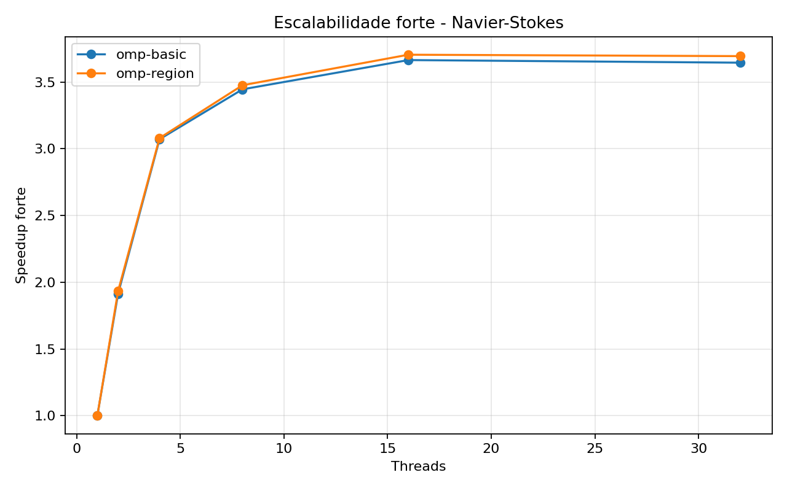

# Tarefa 12 - Escalabilidade do Navier-Stokes no NPAD

## Objetivo

Avaliar a escalabilidade do codigo de Navier-Stokes simplificado em um no de
computacao do NPAD. Foram comparadas duas versoes paralelas:

- `omp-basic`: cria uma regiao paralela em cada passo de tempo.
- `omp-region`: mantem uma unica regiao paralela ao longo de todos os passos,
  reduzindo overhead de criacao/sincronizacao de threads.

## Configuracao

- Passos: `1000`
- Escalonamento: `static`
- Chunk: `0`
- Collapse: `1`
- Inicializacao: perturbacao central
- Condicao de estabilidade: `dt * nu <= 0.25`

## Validacao numerica

Em todas as execucoes o campo permaneceu estavel. O valor maximo inicial foi
`1.000000` e o primeiro resultado registrado terminou com maximo
`0.999256`. A norma L2 tambem foi monitorada em todas as rodadas.

## Escalabilidade forte

Na escalabilidade forte, o tamanho do problema fica fixo e o numero de threads varia.
O ideal seria o tempo cair proporcionalmente ao numero de threads.

|Versao|Threads|Malha|Rodadas|Media (s)|Min (s)|Max (s)|Speedup|Eficiencia|
|---|---:|---:|---:|---:|---:|---:|---:|---:|
|omp-basic|1|2048x2048|3|6.529634|6.521298|6.535384|1.00|1.00|
|omp-basic|2|2048x2048|3|3.414947|3.406885|3.420093|1.91|0.95|
|omp-basic|4|2048x2048|3|2.129182|2.123220|2.135191|3.06|0.77|
|omp-basic|8|2048x2048|3|1.899235|1.892844|1.904388|3.43|0.43|
|omp-basic|16|2048x2048|3|1.782756|1.779627|1.784536|3.66|0.23|
|omp-basic|32|2048x2048|3|1.791694|1.789179|1.796187|3.64|0.11|
|omp-region|1|2048x2048|3|6.507249|6.495932|6.519441|1.00|1.00|
|omp-region|2|2048x2048|3|3.411885|3.360271|3.441045|1.90|0.95|
|omp-region|4|2048x2048|3|2.113142|2.109069|2.118903|3.07|0.77|
|omp-region|8|2048x2048|3|1.870998|1.868926|1.873211|3.47|0.43|
|omp-region|16|2048x2048|3|1.754020|1.753498|1.755017|3.70|0.23|
|omp-region|32|2048x2048|3|1.758773|1.758512|1.759043|3.69|0.12|

### Melhores casos por thread

- 1 threads: `omp-region` com media 6.507249s em malha 2048x2048 (speedup 1.00x).
- 2 threads: `omp-region` com media 3.411885s em malha 2048x2048 (speedup 1.90x).
- 4 threads: `omp-region` com media 2.113142s em malha 2048x2048 (speedup 3.07x).
- 8 threads: `omp-region` com media 1.870998s em malha 2048x2048 (speedup 3.47x).
- 16 threads: `omp-region` com media 1.754020s em malha 2048x2048 (speedup 3.70x).
- 32 threads: `omp-region` com media 1.758773s em malha 2048x2048 (speedup 3.69x).

## Escalabilidade fraca

Na escalabilidade fraca, o tamanho da malha cresce aproximadamente com a raiz do
numero de threads, mantendo o numero de celulas por thread quase constante. O ideal
seria o tempo permanecer proximo ao tempo com 1 thread.

|Versao|Threads|Malha|Celulas/thread|Rodadas|Media (s)|Min (s)|Max (s)|Eficiencia fraca|
|---|---:|---:|---:|---:|---:|---:|---:|---:|
|omp-basic|1|1024x1024|1048576|3|0.850414|0.849439|0.852336|1.00|
|omp-basic|2|1448x1448|1048352|3|2.667415|2.661783|2.674074|0.32|
|omp-basic|4|2048x2048|1048576|3|2.111824|2.106214|2.117978|0.40|
|omp-basic|8|2896x2896|1048352|3|3.666319|3.652625|3.673190|0.23|
|omp-basic|16|4096x4096|1048576|3|7.119258|7.114997|7.125171|0.12|
|omp-basic|32|5793x5793|1048714|3|14.407268|14.398931|14.413807|0.06|
|omp-region|1|1024x1024|1048576|3|0.861763|0.861042|0.863040|1.00|
|omp-region|2|1448x1448|1048352|3|2.752225|2.720508|2.815495|0.31|
|omp-region|4|2048x2048|1048576|3|2.078641|2.073233|2.082272|0.41|
|omp-region|8|2896x2896|1048352|3|3.645032|3.636627|3.656035|0.24|
|omp-region|16|4096x4096|1048576|3|7.098064|7.094450|7.103040|0.12|
|omp-region|32|5793x5793|1048714|3|14.313625|14.302583|14.328435|0.06|

### Melhores casos por thread

- 1 threads: `omp-basic` com media 0.850414s em malha 1024x1024 (eficiencia fraca 1.00).
- 2 threads: `omp-basic` com media 2.667415s em malha 1448x1448 (eficiencia fraca 0.32).
- 4 threads: `omp-region` com media 2.078641s em malha 2048x2048 (eficiencia fraca 0.41).
- 8 threads: `omp-region` com media 3.645032s em malha 2896x2896 (eficiencia fraca 0.24).
- 16 threads: `omp-region` com media 7.098064s em malha 4096x4096 (eficiencia fraca 0.12).
- 32 threads: `omp-region` com media 14.313625s em malha 5793x5793 (eficiencia fraca 0.06).

## Graficos

## Analise

A versao `omp-region` tende a ser melhor quando o numero de passos e alto, porque
evita recriar a equipe de threads a cada iteracao temporal. A versao `omp-basic`
representa uma primeira paralelizacao direta, adequada como ponto de partida, mas com
mais overhead de runtime.

Na escalabilidade forte, o ganho deixa de ser linear quando o custo de acesso a memoria
e as barreiras entre passos passam a dominar. Cada celula usa poucos calculos e acessa
varios vizinhos, portanto o kernel e sensivel a largura de banda de memoria e cache.

Na escalabilidade fraca, o objetivo e manter tempo aproximadamente constante ao crescer
o problema junto com o numero de threads. Quedas de eficiencia indicam overhead de
sincronizacao, limite de banda de memoria ou efeito de afinidade entre threads e nucleos.

## Artefatos

- Codigo: `Tarefa-12/navier_scaling.c`
- Coleta: `Tarefa-12/coletar_npad.py`
- CSV: `Tarefa-12/resultados/tarefa12_resultados.csv`
- Graficos: `Tarefa-12/resultados/strong_scaling.png` e `Tarefa-12/resultados/weak_scaling.png`
- Relatorio: `Tarefa-12/resultados/relatorio_tarefa12.md`
