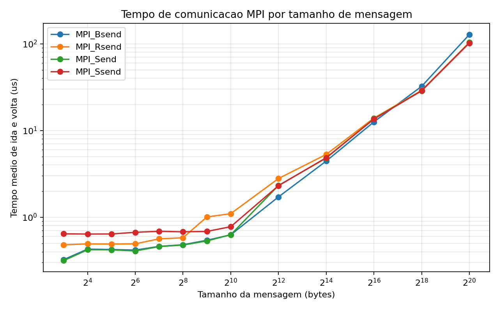
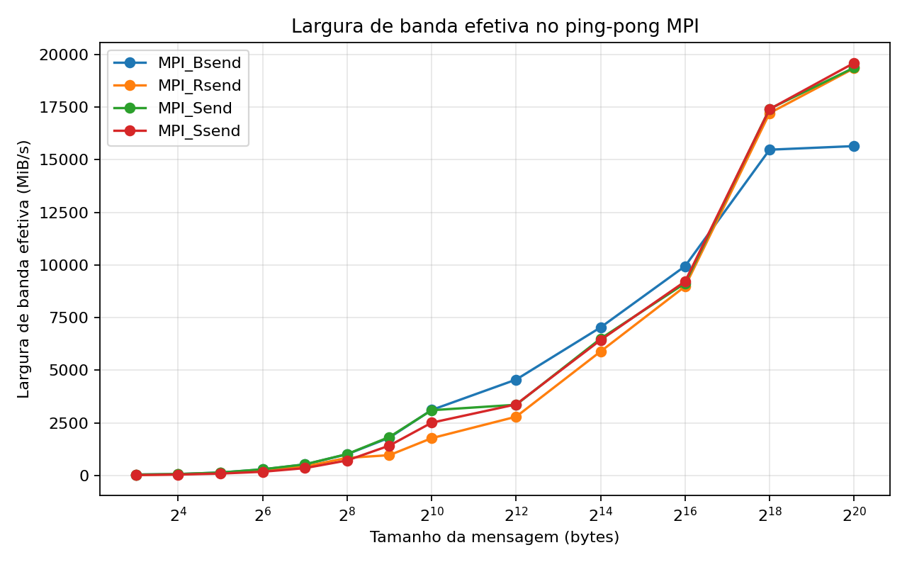

# Tarefa 14 - Comunicacao MPI

## Objetivo

Implementar quatro benchmarks MPI com exatamente dois processos. O processo 0 envia
uma mensagem ao processo 1 e o processo 1 devolve imediatamente a mesma mensagem. O
tempo e medido com `MPI_Wtime` durante varias trocas consecutivas.

## Implementacoes

- `MPI_Send`: envio bloqueante padrao. A chamada pode completar quando a mensagem foi
  copiada para um buffer interno do MPI ou quando o recebimento correspondente avancou.
- `MPI_Bsend`: envio bloqueante com buffer anexado pelo usuario por `MPI_Buffer_attach`.
  A chamada depende de haver espaco no buffer fornecido para armazenar a mensagem.
- `MPI_Rsend`: envio em modo ready. Ele so e correto se o recebimento correspondente
  ja tiver sido iniciado. Nesta versao introdutoria, foram usadas mensagens simples
  de controle com `MPI_Send` e `MPI_Recv` para indicar que o processo receptor esta
  pronto para a troca.
- `MPI_Ssend`: envio bloqueante sincrono. A chamada so completa quando o processo
  receptor iniciou o recebimento correspondente, expondo melhor o custo de sincronizacao.

Todos os programas usam `MPI_Recv` para receber a mensagem de ida e a resposta. O
tempo e medido no processo 0, que participa de todas as trocas completas.

## Configuracao

- Processos MPI: `2`
- Tamanhos testados: `8, 16, 32, 64, 128, 256, 512, 1024, 4096, 16384, 65536, 262144, 1048576 bytes`
- Repeticoes por tamanho e funcao: `3`
- Metrica principal: tempo medio de ida e volta por mensagem
- Latencia estimada: metade do tempo medio de ida e volta
- Largura de banda efetiva: bytes enviados na ida e na volta divididos pelo tempo total

O codigo foi mantido propositalmente simples, usando comunicacao ponto a ponto:
`MPI_Send`, `MPI_Bsend`, `MPI_Rsend`, `MPI_Ssend`, `MPI_Recv` e `MPI_Wtime`. Nao foram
usadas rotinas coletivas.

## Resultados

|Funcao|Bytes|Iteracoes|Rodadas|Ida e volta medio (us)|Latencia estimada (us)|Banda efetiva (MiB/s)|
|---|---:|---:|---:|---:|---:|---:|
|MPI_Bsend|8|20000|3|0.326|0.163|46.74|
|MPI_Bsend|16|20000|3|0.433|0.216|70.54|
|MPI_Bsend|32|20000|3|0.429|0.214|142.34|
|MPI_Bsend|64|20000|3|0.420|0.210|290.34|
|MPI_Bsend|128|20000|3|0.473|0.236|516.44|
|MPI_Bsend|256|20000|3|0.489|0.244|998.90|
|MPI_Bsend|512|20000|3|0.556|0.278|1755.87|
|MPI_Bsend|1024|20000|3|0.647|0.324|3018.86|
|MPI_Bsend|4096|5000|3|1.719|0.860|4544.50|
|MPI_Bsend|16384|5000|3|4.482|2.241|6972.26|
|MPI_Bsend|65536|5000|3|12.581|6.290|9935.69|
|MPI_Bsend|262144|1000|3|32.438|16.219|15414.01|
|MPI_Bsend|1048576|1000|3|129.943|64.972|15393.92|
|MPI_Rsend|8|20000|3|0.486|0.243|31.40|
|MPI_Rsend|16|20000|3|0.495|0.248|61.60|
|MPI_Rsend|32|20000|3|0.495|0.247|123.40|
|MPI_Rsend|64|20000|3|0.504|0.252|242.49|
|MPI_Rsend|128|20000|3|0.566|0.283|431.64|
|MPI_Rsend|256|20000|3|0.597|0.299|818.03|
|MPI_Rsend|512|20000|3|1.034|0.517|944.61|
|MPI_Rsend|1024|20000|3|1.129|0.564|1731.24|
|MPI_Rsend|4096|5000|3|2.811|1.405|2779.32|
|MPI_Rsend|16384|5000|3|5.331|2.666|5861.97|
|MPI_Rsend|65536|5000|3|14.421|7.211|8684.41|
|MPI_Rsend|262144|1000|3|29.236|14.618|17103.04|
|MPI_Rsend|1048576|1000|3|103.874|51.937|19254.26|
|MPI_Send|8|20000|3|0.318|0.159|48.05|
|MPI_Send|16|20000|3|0.424|0.212|71.93|
|MPI_Send|32|20000|3|0.425|0.212|143.69|
|MPI_Send|64|20000|3|0.413|0.206|295.94|
|MPI_Send|128|20000|3|0.462|0.231|528.66|
|MPI_Send|256|20000|3|0.482|0.241|1013.54|
|MPI_Send|512|20000|3|0.571|0.286|1717.56|
|MPI_Send|1024|20000|3|0.660|0.330|2963.03|
|MPI_Send|4096|5000|3|2.350|1.175|3324.09|
|MPI_Send|16384|5000|3|4.815|2.407|6490.82|
|MPI_Send|65536|5000|3|13.862|6.931|9018.52|
|MPI_Send|262144|1000|3|28.862|14.431|17324.35|
|MPI_Send|1048576|1000|3|103.545|51.772|19315.39|
|MPI_Ssend|8|20000|3|0.660|0.330|23.13|
|MPI_Ssend|16|20000|3|0.660|0.330|46.26|
|MPI_Ssend|32|20000|3|0.651|0.325|93.82|
|MPI_Ssend|64|20000|3|0.682|0.341|179.02|
|MPI_Ssend|128|20000|3|0.701|0.351|348.23|
|MPI_Ssend|256|20000|3|0.698|0.349|699.85|
|MPI_Ssend|512|20000|3|0.692|0.346|1411.58|
|MPI_Ssend|1024|20000|3|0.788|0.394|2477.76|
|MPI_Ssend|4096|5000|3|2.374|1.187|3292.76|
|MPI_Ssend|16384|5000|3|4.904|2.452|6372.32|
|MPI_Ssend|65536|5000|3|13.638|6.819|9165.62|
|MPI_Ssend|262144|1000|3|28.851|14.426|17330.60|
|MPI_Ssend|1048576|1000|3|102.719|51.359|19471.12|

## Graficos

## Analise

Para mensagens pequenas, o tempo varia pouco com o tamanho da mensagem. Esse e o
regime dominado por latencia: custo de chamada MPI, sincronizacao entre processos,
progresso do runtime e passagem pelos buffers internos pesam mais do que copiar os
bytes da mensagem.

Quando o tamanho cresce, a curva de tempo passa a aumentar de forma mais clara. Esse
e o regime dominado por largura de banda: a transferencia de dados e as copias de
memoria passam a representar a maior parte do custo. Nesse regime, a comparacao mais
importante deixa de ser apenas o tempo absoluto e passa a ser a banda efetiva obtida.

Nos dados coletados, para a maior mensagem testada o melhor caso de banda foi
`MPI_Ssend`, com `19471.12 MiB/s` em
mensagens de `1048576` bytes.

Resumo por funcao:

- `MPI_Bsend`: menor mensagem 8 bytes com 0.326 us de ida e volta; maior mensagem 1048576 bytes com banda efetiva de 15393.92 MiB/s.
- `MPI_Rsend`: menor mensagem 8 bytes com 0.486 us de ida e volta; maior mensagem 1048576 bytes com banda efetiva de 19254.26 MiB/s.
- `MPI_Send`: menor mensagem 8 bytes com 0.318 us de ida e volta; maior mensagem 1048576 bytes com banda efetiva de 19315.39 MiB/s.
- `MPI_Ssend`: menor mensagem 8 bytes com 0.660 us de ida e volta; maior mensagem 1048576 bytes com banda efetiva de 19471.12 MiB/s.

## Artefatos

- Codigos: `Tarefa-14/mpi_send.c`, `Tarefa-14/mpi_bsend.c`,
  `Tarefa-14/mpi_rsend.c` e `Tarefa-14/mpi_ssend.c`
- Coleta: `Tarefa-14/coletar_mpi.py`
- CSV: `Tarefa-14/resultados/tarefa14_resultados.csv`
- Graficos: `Tarefa-14/resultados/tempo_por_tamanho.png` e
  `Tarefa-14/resultados/largura_banda.png`
- Relatorio: `Tarefa-14/resultados/relatorio_tarefa14.md`
