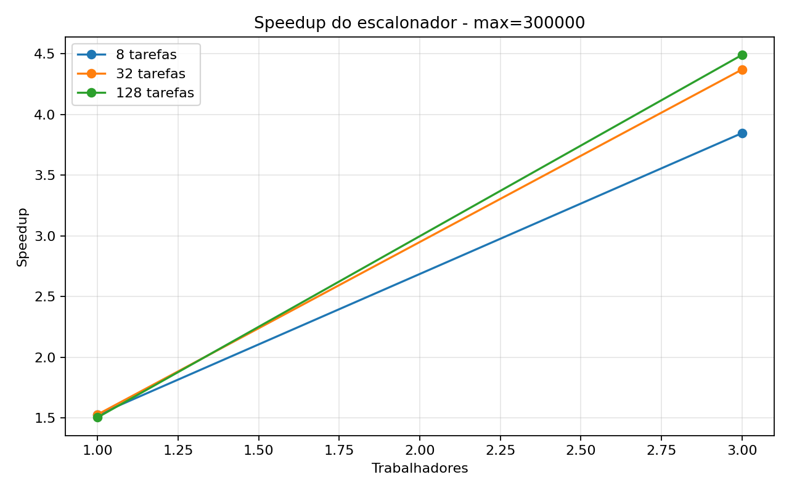
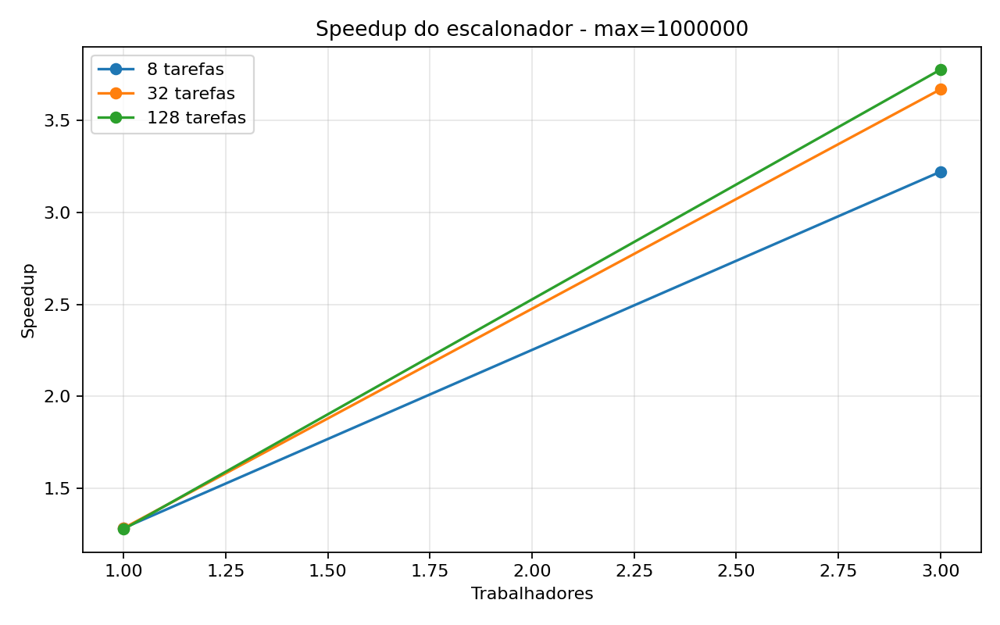
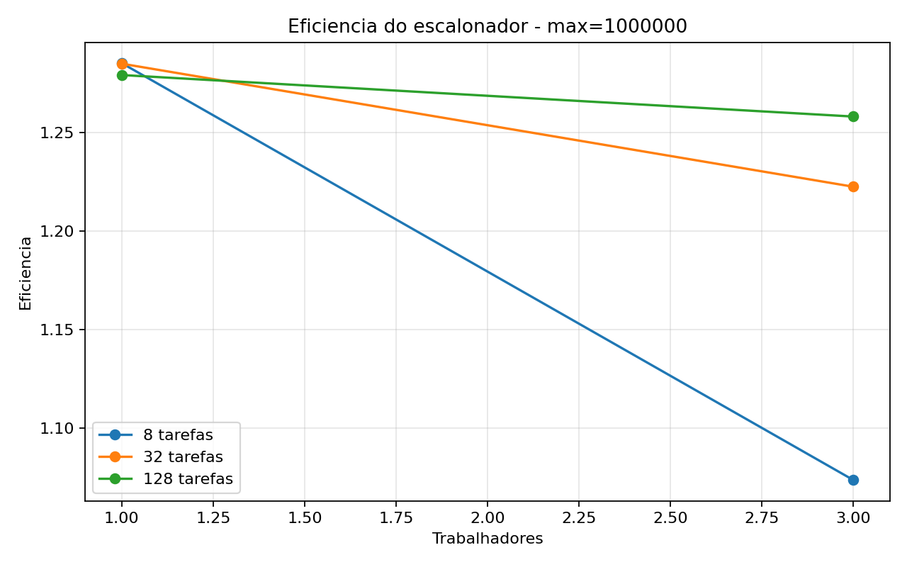

# Tarefa 16 - Escalonador lider-trabalhador com MPI

## Objetivo

Desenvolver um escalonador dinamico de tarefas em MPI no modelo
lider-trabalhador. O processo `0` atua como lider: distribui tarefas, recebe
resultados dos trabalhadores e envia novas tarefas conforme cada trabalhador termina
a anterior.

A aplicacao escolhida foi a contagem de numeros primos no intervalo de `2` ate um
valor maximo. Cada tarefa corresponde a um subintervalo de numeros.

## Funcoes MPI usadas

A implementacao usa apenas os conceitos dos materiais 21, 22 e 23:

- `MPI_Init`, `MPI_Finalize`, `MPI_Comm_rank` e `MPI_Comm_size`;
- `MPI_Send` e `MPI_Recv` para troca ponto a ponto;
- `MPI_ANY_SOURCE`, visto junto com `MPI_Recv`, para o lider receber resultado de
  qualquer trabalhador que terminar primeiro;
- `MPI_ANY_TAG`, usado pelos trabalhadores para receber tarefa ou sinal de parada;
- `MPI_Wtime` para medir o tempo da parte MPI.

Nao foram usadas rotinas coletivas. O speedup e a eficiencia sao calculados no script
Python a partir do tempo sequencial e do tempo MPI.

## Como o escalonador evita deadlock

O fluxo de mensagens foi organizado para evitar espera circular:

1. O lider envia uma tarefa inicial para cada trabalhador.
2. Cada trabalhador recebe uma tarefa, calcula o numero de primos do subintervalo e
   envia o resultado ao lider.
3. O lider fica em `MPI_Recv` com `MPI_ANY_SOURCE`, aceitando o primeiro trabalhador
   que terminar.
4. Ao receber um resultado, o lider envia outra tarefa para o mesmo trabalhador ou
   envia uma mensagem de parada.
5. O trabalhador so espera nova mensagem depois de enviar seu resultado.

Assim, nao ha ciclo em que todos os processos estejam esperando envio uns dos outros.
O lider sempre esta preparado para receber resultados, e os trabalhadores sempre
voltam a receber depois de concluir uma tarefa.

## Configuracao

- Valores maximos testados: `300000, 1000000`
- Quantidades de tarefas: `8, 32, 128`
- Processos MPI testados: `2, 4`
- Trabalhadores: processos MPI menos o lider
- Rodadas por configuracao: `3`
- Compilacao sequencial: `gcc -O3 -Wall -Wextra -lm`
- Compilacao MPI: `mpicc -O3 -Wall -Wextra -lm`

## Resultados

|Max|Tarefas|Processos|Trabalhadores|Rodadas|Tempo seq (s)|Media MPI (s)|Speedup|Eficiencia|Primos|
|---:|---:|---:|---:|---:|---:|---:|---:|---:|---:|
|300000|8|2|1|3|0.011349|0.007469|1.52|1.52|25997|
|300000|8|4|3|3|0.011349|0.002988|3.80|1.27|25997|
|300000|32|2|1|3|0.011349|0.007457|1.52|1.52|25997|
|300000|32|4|3|3|0.011349|0.002606|4.36|1.45|25997|
|300000|128|2|1|3|0.011349|0.007550|1.50|1.50|25997|
|300000|128|4|3|3|0.011349|0.002557|4.44|1.48|25997|
|1000000|8|2|1|3|0.049915|0.038982|1.28|1.28|78498|
|1000000|8|4|3|3|0.049915|0.015538|3.21|1.07|78498|
|1000000|32|2|1|3|0.049915|0.038876|1.28|1.28|78498|
|1000000|32|4|3|3|0.049915|0.013638|3.66|1.22|78498|
|1000000|128|2|1|3|0.049915|0.039042|1.28|1.28|78498|
|1000000|128|4|3|3|0.049915|0.013250|3.77|1.26|78498|

## Graficos







## Melhores casos

- Max=300000, 1 trabalhadores: 32 tarefas, media 0.007457s, speedup 1.52, eficiencia 1.52.
- Max=300000, 3 trabalhadores: 128 tarefas, media 0.002557s, speedup 4.44, eficiencia 1.48.
- Max=1000000, 1 trabalhadores: 32 tarefas, media 0.038876s, speedup 1.28, eficiencia 1.28.
- Max=1000000, 3 trabalhadores: 128 tarefas, media 0.013250s, speedup 3.77, eficiencia 1.26.

## Analise

O escalonamento dinamico permite que o lider entregue novas tarefas a trabalhadores
conforme eles terminam. Isso e util para a contagem de primos porque subintervalos
maiores ou com numeros maiores podem custar mais: testar primalidade perto do fim do
intervalo exige mais divisoes do que testar numeros pequenos.

Quando ha poucas tarefas, a distribuicao pode ficar menos equilibrada: um trabalhador
pode receber um bloco mais pesado e atrasar o fim da execucao. Ao aumentar a
quantidade de tarefas, os blocos ficam menores e o lider consegue redistribuir melhor
o trabalho. Por outro lado, tarefas demais tambem aumentam o numero de mensagens e o
overhead de escalonamento.

O speedup compara o tempo sequencial com o tempo MPI. A eficiencia divide esse
speedup pelo numero de trabalhadores. Eficiencia proxima de `1.0` indicaria uso quase
ideal dos trabalhadores; quedas indicam overhead de comunicacao, desequilibrio de
carga ou custo do lider coordenando as tarefas.

## Conclusao

A Tarefa 16 implementa um escalonador lider-trabalhador sem deadlock usando apenas
comunicacao ponto a ponto. O lider nunca fica preso esperando um trabalhador
especifico: ele recebe de qualquer trabalhador que concluir primeiro. Os trabalhadores
tambem seguem um ciclo simples de receber tarefa, calcular, enviar resultado e esperar
nova tarefa ou parada.

Esse modelo e adequado para problemas com tarefas independentes, como contar primos
em subintervalos. A quantidade de tarefas deve ser escolhida com cuidado: tarefas
demais aumentam a comunicacao, enquanto tarefas de menos podem causar desequilibrio
entre trabalhadores.

## Codigos

### `primos_seq.c`

```c
#include <math.h>
#include <stdio.h>
#include <stdlib.h>
#include <string.h>
#include <sys/time.h>

static int ler_inteiro(int argc, char **argv, const char *opcao, int padrao)
{
    for (int i = 1; i + 1 < argc; i++) {
        if (strcmp(argv[i], opcao) == 0) {
            return atoi(argv[i + 1]);
        }
    }
    return padrao;
}

static double tempo_agora(void)
{
    struct timeval tv;
    gettimeofday(&tv, NULL);
    return (double)tv.tv_sec + (double)tv.tv_usec * 0.000001;
}

static int eh_primo(int n)
{
    if (n < 2) {
        return 0;
    }
    if (n == 2) {
        return 1;
    }
    if (n % 2 == 0) {
        return 0;
    }

    int limite = (int)sqrt((double)n);
    for (int d = 3; d <= limite; d += 2) {
        if (n % d == 0) {
            return 0;
        }
    }
    return 1;
}

int main(int argc, char **argv)
{
    int maximo = ler_inteiro(argc, argv, "--max", 1000000);
    int total = 0;

    double inicio = tempo_agora();
    for (int n = 2; n <= maximo; n++) {
        total += eh_primo(n);
    }
    double fim = tempo_agora();

    printf(
        "RESULT versao=seq max=%d primos=%d tempo=%.9f\n",
        maximo,
        total,
        fim - inicio
    );

    return 0;
}
```

### `leader_worker_primes.c`

```c
#include <math.h>
#include <mpi.h>
#include <stdio.h>
#include <stdlib.h>
#include <string.h>

#define TAG_TAREFA 10
#define TAG_RESULTADO 20
#define TAG_PARAR 30

static int ler_inteiro(int argc, char **argv, const char *opcao, int padrao)
{
    for (int i = 1; i + 1 < argc; i++) {
        if (strcmp(argv[i], opcao) == 0) {
            return atoi(argv[i + 1]);
        }
    }
    return padrao;
}

static int eh_primo(int n)
{
    if (n < 2) {
        return 0;
    }
    if (n == 2) {
        return 1;
    }
    if (n % 2 == 0) {
        return 0;
    }

    int limite = (int)sqrt((double)n);
    for (int d = 3; d <= limite; d += 2) {
        if (n % d == 0) {
            return 0;
        }
    }
    return 1;
}

static int contar_primos(int inicio, int fim)
{
    int total = 0;
    for (int n = inicio; n <= fim; n++) {
        total += eh_primo(n);
    }
    return total;
}

static void montar_tarefa(int indice, int total_tarefas, int maximo, int tarefa[3])
{
    int quantidade = maximo - 1;
    int base = quantidade / total_tarefas;
    int resto = quantidade % total_tarefas;
    int tamanho = base + (indice < resto ? 1 : 0);
    int deslocamento = indice * base + (indice < resto ? indice : resto);

    tarefa[0] = indice;
    tarefa[1] = 2 + deslocamento;
    tarefa[2] = tarefa[1] + tamanho - 1;
}

static void lider(int size, int maximo, int total_tarefas)
{
    int trabalhadores = size - 1;
    int proxima_tarefa = 0;
    int tarefas_concluidas = 0;
    int total_primos = 0;
    int tarefas_por_trabalhador[size];
    MPI_Status status;

    for (int i = 0; i < size; i++) {
        tarefas_por_trabalhador[i] = 0;
    }

    double inicio = MPI_Wtime();

    for (int worker = 1; worker <= trabalhadores; worker++) {
        if (proxima_tarefa < total_tarefas) {
            int tarefa[3];
            montar_tarefa(proxima_tarefa, total_tarefas, maximo, tarefa);
            MPI_Send(tarefa, 3, MPI_INT, worker, TAG_TAREFA, MPI_COMM_WORLD);
            proxima_tarefa++;
        } else {
            int vazio[3] = {-1, 0, 0};
            MPI_Send(vazio, 3, MPI_INT, worker, TAG_PARAR, MPI_COMM_WORLD);
        }
    }

    while (tarefas_concluidas < total_tarefas) {
        int resultado[3];
        MPI_Recv(resultado, 3, MPI_INT, MPI_ANY_SOURCE, TAG_RESULTADO, MPI_COMM_WORLD, &status);

        int worker = status.MPI_SOURCE;
        tarefas_concluidas++;
        total_primos += resultado[2];
        tarefas_por_trabalhador[worker]++;

        if (proxima_tarefa < total_tarefas) {
            int tarefa[3];
            montar_tarefa(proxima_tarefa, total_tarefas, maximo, tarefa);
            MPI_Send(tarefa, 3, MPI_INT, worker, TAG_TAREFA, MPI_COMM_WORLD);
            proxima_tarefa++;
        } else {
            int vazio[3] = {-1, 0, 0};
            MPI_Send(vazio, 3, MPI_INT, worker, TAG_PARAR, MPI_COMM_WORLD);
        }
    }

    double fim = MPI_Wtime();

    printf(
        "RESULT versao=leader_worker processos=%d trabalhadores=%d max=%d tarefas=%d primos=%d tempo=%.9f",
        size,
        trabalhadores,
        maximo,
        total_tarefas,
        total_primos,
        fim - inicio
    );
    for (int worker = 1; worker <= trabalhadores; worker++) {
        printf(" w%d=%d", worker, tarefas_por_trabalhador[worker]);
    }
    printf("\n");
}

static void trabalhador(int rank)
{
    MPI_Status status;

    while (1) {
        int tarefa[3];
        MPI_Recv(tarefa, 3, MPI_INT, 0, MPI_ANY_TAG, MPI_COMM_WORLD, &status);

        if (status.MPI_TAG == TAG_PARAR || tarefa[0] < 0) {
            break;
        }

        int resultado[3];
        resultado[0] = tarefa[0];
        resultado[1] = rank;
        resultado[2] = contar_primos(tarefa[1], tarefa[2]);
        MPI_Send(resultado, 3, MPI_INT, 0, TAG_RESULTADO, MPI_COMM_WORLD);
    }
}

int main(int argc, char **argv)
{
    int rank;
    int size;
    int maximo;
    int total_tarefas;

    MPI_Init(&argc, &argv);
    MPI_Comm_rank(MPI_COMM_WORLD, &rank);
    MPI_Comm_size(MPI_COMM_WORLD, &size);

    maximo = ler_inteiro(argc, argv, "--max", 1000000);
    total_tarefas = ler_inteiro(argc, argv, "--tarefas", 32);

    if (size < 2) {
        if (rank == 0) {
            printf("Execute com pelo menos 2 processos: 1 lider e 1 trabalhador.\n");
        }
        MPI_Finalize();
        return 1;
    }

    if (total_tarefas < 1 || maximo < 2) {
        if (rank == 0) {
            printf("Use --max >= 2 e --tarefas >= 1.\n");
        }
        MPI_Finalize();
        return 1;
    }

    if (rank == 0) {
        lider(size, maximo, total_tarefas);
    } else {
        trabalhador(rank);
    }

    MPI_Finalize();
    return 0;
}
```
