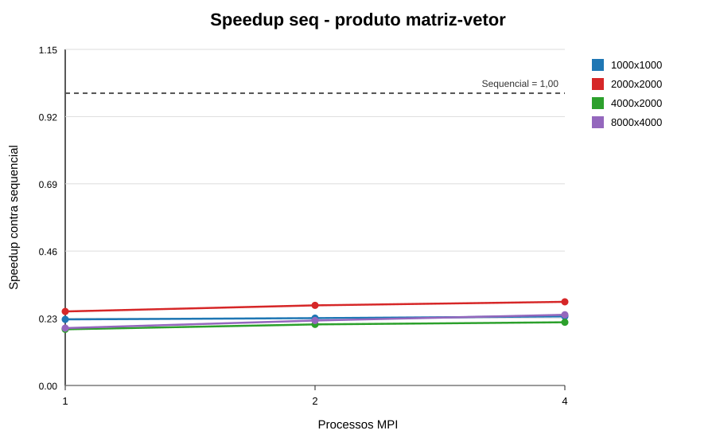
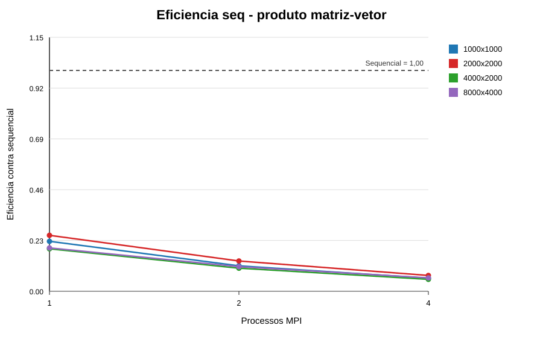
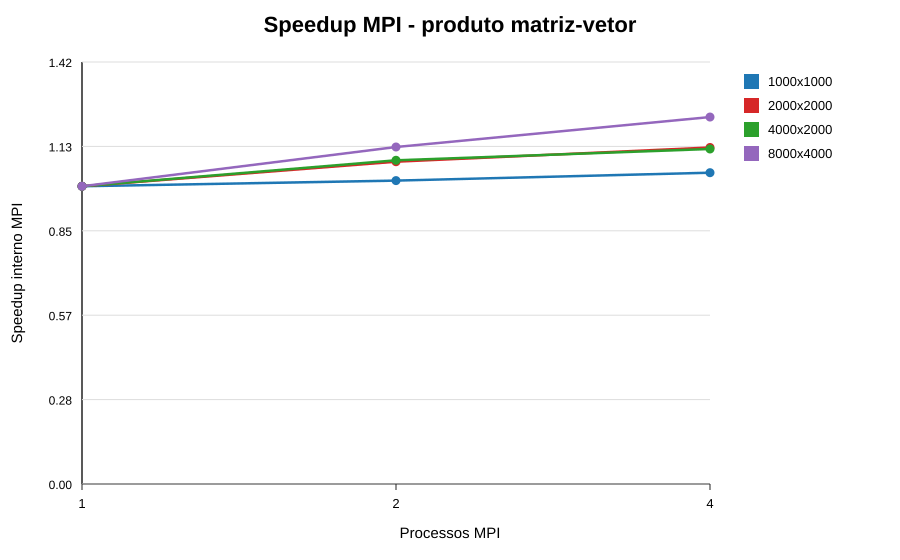
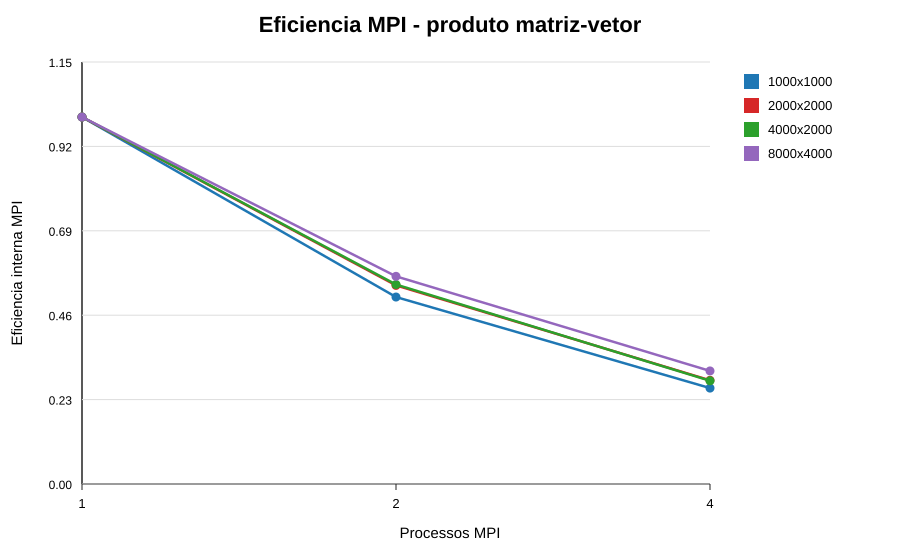

# Tarefa 17 - Multiplicacao matriz-vetor com MPI coletivo

## Objetivo

Implementar o produto `y = A * x`, onde `A` e uma matriz `M x N` e `x` e um vetor de
tamanho `N`. A matriz e dividida por linhas entre os processos com `MPI_Scatter`, o
vetor completo e distribuido com `MPI_Bcast`, e os trechos de `y` sao reunidos no
processo `0` com `MPI_Gather`.

## Funcoes MPI usadas

A implementacao usa as rotinas de comunicacao coletiva apresentadas no conteudo 24:

- `MPI_Bcast`: envia o vetor `x` completo do processo `0` para todos os processos.
- `MPI_Scatter`: divide a matriz `A` por blocos de linhas, enviando um bloco para
  cada processo.
- `MPI_Gather`: junta os blocos locais de `y` calculados por cada processo no
  processo `0`.
- `MPI_Barrier`: faz todos os processos chegarem ao mesmo ponto antes do inicio da
  medicao de tempo.
- `MPI_Reduce`: soma os checksums locais e tambem agrega os tempos locais com
  `MPI_MAX` para representar o processo mais lento.

Tambem foram usadas as rotinas basicas ja vistas antes: `MPI_Init`,
`MPI_Comm_rank`, `MPI_Comm_size`, `MPI_Wtime` e `MPI_Finalize`.

Como o enunciado pede `MPI_Scatter`, foi usada a divisao simples em que `M` deve ser
divisivel pelo numero de processos. Os testes foram escolhidos respeitando essa
condicao.

## Configuracao

- Tamanhos de matriz testados: `1000x1000, 2000x2000, 4000x2000, 8000x4000`
- Processos MPI testados: `1, 2, 4`
- Rodadas por configuracao: `3`
- Compilacao sequencial: `gcc -O3 -Wall -Wextra -fopenmp`
- Compilacao MPI: `mpicc -O3 -Wall -Wextra`
- Medicao de tempo: `MPI_Wtime` na versao MPI e `omp_get_wtime` na versao sequencial

O checksum do vetor `y` foi comparado entre as versoes para validar os resultados.
O tempo MPI reportado e o maior tempo local entre os processos, calculado com
`MPI_Reduce` e `MPI_MAX`.

Foram calculados dois tipos de speedup:

- A linha `Sequencial` e a base da comparacao, portanto tem `speedup_seq = 1.00` e
  `eficiencia_seq = 1.00`.
- `speedup_seq = tempo_sequencial / tempo_mpi_total`
- `speedup_mpi = tempo_mpi_1_processo / tempo_mpi_p_processos`

## Resultados

|M|N|Versao|Proc.|Linhas/proc.|Rodadas|Tempo medio (s)|Speedup seq|Efic. seq|Speedup MPI|Efic. MPI|Checksum|
|---:|---:|:---|---:|---:|---:|---:|---:|---:|---:|---:|---:|
|1000|1000|Sequencial|-|-|1|0.000514|1.00|1.00|-|-|307461.92|
|1000|1000|MPI|1|1000|3|0.002274|0.23|0.23|1.00|1.00|307461.92|
|1000|1000|MPI|2|500|3|0.002231|0.23|0.12|1.02|0.51|307461.92|
|1000|1000|MPI|4|250|3|0.002176|0.24|0.06|1.05|0.26|307461.92|
|2000|2000|Sequencial|-|-|1|0.002532|1.00|1.00|-|-|1230001.15|
|2000|2000|MPI|1|2000|3|0.009997|0.25|0.25|1.00|1.00|1230001.15|
|2000|2000|MPI|2|1000|3|0.009236|0.27|0.14|1.08|0.54|1230001.15|
|2000|2000|MPI|4|500|3|0.008848|0.29|0.07|1.13|0.28|1230001.15|
|4000|2000|Sequencial|-|-|1|0.003810|1.00|1.00|-|-|2460001.74|
|4000|2000|MPI|1|4000|3|0.019823|0.19|0.19|1.00|1.00|2460001.74|
|4000|2000|MPI|2|2000|3|0.018235|0.21|0.10|1.09|0.54|2460001.74|
|4000|2000|MPI|4|1000|3|0.017620|0.22|0.05|1.13|0.28|2460001.74|
|8000|4000|Sequencial|-|-|1|0.015336|1.00|1.00|-|-|9842461.98|
|8000|4000|MPI|1|8000|3|0.078119|0.20|0.20|1.00|1.00|9842461.98|
|8000|4000|MPI|2|4000|3|0.069022|0.22|0.11|1.13|0.57|9842461.98|
|8000|4000|MPI|4|2000|3|0.063390|0.24|0.06|1.23|0.31|9842461.98|

## Tempos parciais medios

|M|N|Proc.|Bcast (s)|Scatter (s)|Calculo (s)|Gather (s)|Reduce (s)|
|---:|---:|---:|---:|---:|---:|---:|---:|
|1000|1000|1|0.000000|0.001883|0.000386|0.000004|0.000000|
|1000|1000|2|0.000010|0.002017|0.000194|0.000021|0.000003|
|1000|1000|4|0.000020|0.002027|0.000114|0.000021|0.001085|
|2000|2000|1|0.000000|0.008025|0.001964|0.000006|0.000001|
|2000|2000|2|0.000012|0.008191|0.000999|0.000028|0.000016|
|2000|2000|4|0.000015|0.008286|0.000561|0.000048|0.004233|
|4000|2000|1|0.000000|0.016005|0.003806|0.000010|0.000000|
|4000|2000|2|0.000014|0.016167|0.002017|0.000031|0.000017|
|4000|2000|4|0.000015|0.016544|0.001015|0.008400|0.000026|
|8000|4000|1|0.000000|0.062834|0.015264|0.000016|0.000001|
|8000|4000|2|0.000023|0.060935|0.008009|0.000040|0.000022|
|8000|4000|4|0.000025|0.059309|0.004089|0.028967|0.000018|

## Graficos









## Melhores casos

- Matriz 1000x1000: melhor tempo MPI com 4 processos, media 0.002176s, speedup seq 0.24, speedup MPI 1.05. A base sequencial foi 0.000514s (speedup 1.00), ficando 4.23x mais rapida que esse melhor MPI.
- Matriz 2000x2000: melhor tempo MPI com 4 processos, media 0.008848s, speedup seq 0.29, speedup MPI 1.13. A base sequencial foi 0.002532s (speedup 1.00), ficando 3.49x mais rapida que esse melhor MPI.
- Matriz 4000x2000: melhor tempo MPI com 4 processos, media 0.017620s, speedup seq 0.22, speedup MPI 1.13. A base sequencial foi 0.003810s (speedup 1.00), ficando 4.62x mais rapida que esse melhor MPI.
- Matriz 8000x4000: melhor tempo MPI com 4 processos, media 0.063390s, speedup seq 0.24, speedup MPI 1.23. A base sequencial foi 0.015336s (speedup 1.00), ficando 4.13x mais rapida que esse melhor MPI.

## Analise

O custo principal do calculo local e proporcional ao numero de linhas recebidas por
cada processo multiplicado por `N`. Ao aumentar a quantidade de processos, cada
processo recebe menos linhas de `A`, reduzindo o trabalho local.

Nos resultados, o tempo da versao MPI diminuiu quando foram usados mais processos,
principalmente nas matrizes maiores. Nas matrizes pequenas, a diferenca entre 1, 2 e
4 processos foi pequena, porque o custo de comunicacao e preparacao dos dados ficou
parecido com o custo do proprio calculo. Nas matrizes maiores, a reducao de tempo
ficou mais visivel, pois cada processo recebeu uma parte relevante do trabalho e o
calculo local passou a compensar melhor o custo das coletivas.

O `speedup_seq` compara a estrategia MPI completa contra o programa sequencial, que
aparece na tabela como a base `1.00`. Se uma linha MPI fica menor que 1, isso
significa que a versao MPI completa ficou mais lenta que a sequencial. O motivo
principal e que o programa sequencial mede apenas a multiplicacao local, enquanto a
versao MPI tambem precisa distribuir o vetor, distribuir a matriz, reunir o
resultado e sincronizar os processos.

O `speedup_mpi` compara a propria implementacao MPI com 1 processo contra a mesma
implementacao com mais processos. Esse valor mostra a escalabilidade interna da
versao paralela, separada da comparacao com o programa sequencial.

### Efeito de cada funcao coletiva

`MPI_Barrier` foi usado antes da medicao. Ele nao acelera o programa; pelo contrario,
pode adicionar um pequeno custo. Sua funcao aqui e deixar a medicao mais justa,
garantindo que nenhum processo comece a cronometrar a parte principal antes dos
outros estarem prontos. Assim, o tempo medido representa melhor a execucao coletiva
do trecho paralelo.

`MPI_Bcast` distribui o vetor `x` inteiro para todos os processos. Esse custo depende
principalmente de `N` e da quantidade de processos. Como todos os processos precisam
do vetor completo para calcular suas linhas, essa etapa e necessaria. Ela pesa mais
quando a matriz tem poucas linhas por processo, porque o tempo gasto enviando `x`
fica grande em relacao ao tempo de multiplicacao local.

`MPI_Scatter` divide a matriz `A` em blocos de linhas. Essa foi a comunicacao mais
pesada da implementacao, pois a matriz tem `M * N` elementos e apenas o processo `0`
possui a matriz completa antes da divisao. Quando o numero de processos aumenta, cada
processo recebe menos linhas, o que ajuda no calculo local. Ao mesmo tempo, o processo
`0` precisa enviar blocos para mais processos. Por isso, o ganho aparece melhor nas
matrizes maiores: ha mais calculo para cada bloco recebido.

`MPI_Gather` recolhe os pedacos do vetor `y`. O custo dessa etapa e menor que o do
`MPI_Scatter`, porque `y` tem apenas `M` elementos, enquanto `A` tem `M * N`.
Mesmo assim, ela adiciona uma sincronizacao natural ao final: o processo `0` so tem o
resultado completo depois que todos os processos terminam seus calculos locais e
enviam suas partes.

`MPI_Reduce` foi usado para validar o resultado. Cada processo calcula um checksum
local somando os valores do seu bloco de `y`. Em seguida, `MPI_Reduce` aplica a soma
e entrega o checksum global ao processo `0`. Essa chamada movimenta apenas um valor
por processo, entao seu custo e bem menor que o de distribuir a matriz com
`MPI_Scatter`. Mesmo assim, ela tambem e uma coletiva e acrescenta sincronizacao no
fim da execucao medida.

A eficiencia mede quanto do ganho teorico foi aproveitado. Ela caiu quando o numero
de processos aumentou porque o trabalho local por processo diminuiu, mas os custos de
`MPI_Barrier`, `MPI_Bcast`, `MPI_Scatter`, `MPI_Gather` e `MPI_Reduce` continuaram
existindo. Em geral, usar mais processos reduz o trabalho de multiplicacao por
processo, mas aumenta o peso relativo da comunicacao. Por isso, uma configuracao pode
ter melhor tempo absoluto e, ao mesmo tempo, baixa eficiencia em relacao ao ganho
ideal.

## Conclusao

A Tarefa 17 mostra o uso direto das coletivas `MPI_Bcast`, `MPI_Scatter`,
`MPI_Gather`, `MPI_Barrier` e `MPI_Reduce` em um problema regular. A divisao por
linhas e natural para o produto matriz-vetor: cada processo recebe algumas linhas
completas de `A`, usa o mesmo vetor `x` e calcula uma parte independente de `y`.

O programa evita comunicacao ponto a ponto manual e deixa a distribuicao/reuniao dos
dados sob responsabilidade das rotinas coletivas apresentadas no material. O ganho de
desempenho depende do equilibrio entre quantidade de calculo local e custo das
coletivas.

Pelos testes, a paralelizacao com MPI deve ser analisada em duas camadas. A primeira
e a comparacao contra a versao sequencial (`speedup_seq`), que inclui todo o custo da
estrategia MPI. A segunda e a escalabilidade interna da propria versao paralela
(`speedup_mpi`), que mostra o efeito de aumentar o numero de processos mantendo a
mesma organizacao MPI.

Assim, a implementacao esta correta para demonstrar comunicacao coletiva basica: o
vetor e transmitido uma vez para todos, a matriz e dividida por linhas, cada processo
calcula sua parte independente, o resultado final volta para o processo `0`, e o
checksum global e obtido por reducao. Para obter speedup maior em execucoes reais,
seria necessario aumentar mais o tamanho do problema, reduzir custos de distribuicao
ou usar uma organizacao em que os dados ja estejam distribuidos entre os processos
antes da medicao.

## Codigos

### `matvec_seq.c`

```c
#include <omp.h>
#include <stdio.h>
#include <stdlib.h>
#include <string.h>

static int ler_inteiro(int argc, char **argv, const char *opcao, int padrao)
{
    for (int i = 1; i + 1 < argc; i++) {
        if (strcmp(argv[i], opcao) == 0) {
            return atoi(argv[i + 1]);
        }
    }
    return padrao;
}

static double valor_a(int i, int j)
{
    return (double)((i + j) % 13 + 1) / 13.0;
}

static double valor_x(int j)
{
    return (double)(j % 7 + 1) / 7.0;
}

int main(int argc, char **argv)
{
    int m = ler_inteiro(argc, argv, "--m", 2000);
    int n = ler_inteiro(argc, argv, "--n", 2000);
    double *a = malloc((size_t)m * (size_t)n * sizeof(double));
    double *x = malloc((size_t)n * sizeof(double));
    double *y = malloc((size_t)m * sizeof(double));

    if (a == NULL || x == NULL || y == NULL) {
        printf("Erro ao alocar memoria.\n");
        free(a);
        free(x);
        free(y);
        return 1;
    }

    for (int j = 0; j < n; j++) {
        x[j] = valor_x(j);
    }
    for (int i = 0; i < m; i++) {
        for (int j = 0; j < n; j++) {
            a[i * n + j] = valor_a(i, j);
        }
    }

    double inicio = omp_get_wtime();
    for (int i = 0; i < m; i++) {
        double soma = 0.0;
        for (int j = 0; j < n; j++) {
            soma += a[i * n + j] * x[j];
        }
        y[i] = soma;
    }
    double fim = omp_get_wtime();

    double checksum = 0.0;
    for (int i = 0; i < m; i++) {
        checksum += y[i];
    }

    printf(
        "RESULT versao=seq m=%d n=%d tempo=%.9f checksum=%.6f\n",
        m,
        n,
        fim - inicio,
        checksum
    );

    free(a);
    free(x);
    free(y);
    return 0;
}
```

### `matvec_collective.c`

```c
#include <mpi.h>
#include <stdio.h>
#include <stdlib.h>
#include <string.h>

static int ler_inteiro(int argc, char **argv, const char *opcao, int padrao)
{
    for (int i = 1; i + 1 < argc; i++) {
        if (strcmp(argv[i], opcao) == 0) {
            return atoi(argv[i + 1]);
        }
    }
    return padrao;
}

static double valor_a(int i, int j)
{
    return (double)((i + j) % 13 + 1) / 13.0;
}

static double valor_x(int j)
{
    return (double)(j % 7 + 1) / 7.0;
}

static void preencher_matriz(double *a, int m, int n)
{
    for (int i = 0; i < m; i++) {
        for (int j = 0; j < n; j++) {
            a[i * n + j] = valor_a(i, j);
        }
    }
}

static void preencher_vetor(double *x, int n)
{
    for (int j = 0; j < n; j++) {
        x[j] = valor_x(j);
    }
}

static void multiplicar_local(double *a_local, double *x, double *y_local, int linhas, int n)
{
    for (int i = 0; i < linhas; i++) {
        double soma = 0.0;
        for (int j = 0; j < n; j++) {
            soma += a_local[i * n + j] * x[j];
        }
        y_local[i] = soma;
    }
}

int main(int argc, char **argv)
{
    int rank;
    int size;
    int m;
    int n;
    int linhas_locais;
    double *a = NULL;
    double *x = NULL;
    double *y = NULL;
    double *a_local = NULL;
    double *y_local = NULL;

    MPI_Init(&argc, &argv);
    MPI_Comm_rank(MPI_COMM_WORLD, &rank);
    MPI_Comm_size(MPI_COMM_WORLD, &size);

    m = ler_inteiro(argc, argv, "--m", 2000);
    n = ler_inteiro(argc, argv, "--n", 2000);

    if (m % size != 0) {
        if (rank == 0) {
            printf("Para usar MPI_Scatter simples, M deve ser divisivel pelo numero de processos.\n");
        }
        MPI_Finalize();
        return 1;
    }

    linhas_locais = m / size;
    x = malloc((size_t)n * sizeof(double));
    a_local = malloc((size_t)linhas_locais * (size_t)n * sizeof(double));
    y_local = malloc((size_t)linhas_locais * sizeof(double));

    if (rank == 0) {
        a = malloc((size_t)m * (size_t)n * sizeof(double));
        y = malloc((size_t)m * sizeof(double));
        if (a != NULL && y != NULL) {
            preencher_matriz(a, m, n);
        }
    }

    if (x == NULL || a_local == NULL || y_local == NULL || (rank == 0 && (a == NULL || y == NULL))) {
        printf("Erro ao alocar memoria no rank %d.\n", rank);
        free(a);
        free(x);
        free(y);
        free(a_local);
        free(y_local);
        MPI_Finalize();
        return 1;
    }

    if (rank == 0) {
        preencher_vetor(x, n);
    }

    MPI_Barrier(MPI_COMM_WORLD);
    double inicio_total = MPI_Wtime();

    double inicio_etapa = MPI_Wtime();
    MPI_Bcast(x, n, MPI_DOUBLE, 0, MPI_COMM_WORLD);
    double bcast_local = MPI_Wtime() - inicio_etapa;

    inicio_etapa = MPI_Wtime();
    MPI_Scatter(
        a,
        linhas_locais * n,
        MPI_DOUBLE,
        a_local,
        linhas_locais * n,
        MPI_DOUBLE,
        0,
        MPI_COMM_WORLD
    );
    double scatter_local = MPI_Wtime() - inicio_etapa;

    inicio_etapa = MPI_Wtime();
    multiplicar_local(a_local, x, y_local, linhas_locais, n);
    double compute_local = MPI_Wtime() - inicio_etapa;

    double checksum_local = 0.0;
    for (int i = 0; i < linhas_locais; i++) {
        checksum_local += y_local[i];
    }

    inicio_etapa = MPI_Wtime();
    MPI_Gather(
        y_local,
        linhas_locais,
        MPI_DOUBLE,
        y,
        linhas_locais,
        MPI_DOUBLE,
        0,
        MPI_COMM_WORLD
    );
    double gather_local = MPI_Wtime() - inicio_etapa;

    double checksum = 0.0;
    inicio_etapa = MPI_Wtime();
    MPI_Reduce(&checksum_local, &checksum, 1, MPI_DOUBLE, MPI_SUM, 0, MPI_COMM_WORLD);
    double reduce_local = MPI_Wtime() - inicio_etapa;

    double total_local = MPI_Wtime() - inicio_total;

    double bcast_time = 0.0;
    double scatter_time = 0.0;
    double compute_time = 0.0;
    double gather_time = 0.0;
    double reduce_time = 0.0;
    double total_time = 0.0;

    MPI_Reduce(&bcast_local, &bcast_time, 1, MPI_DOUBLE, MPI_MAX, 0, MPI_COMM_WORLD);
    MPI_Reduce(&scatter_local, &scatter_time, 1, MPI_DOUBLE, MPI_MAX, 0, MPI_COMM_WORLD);
    MPI_Reduce(&compute_local, &compute_time, 1, MPI_DOUBLE, MPI_MAX, 0, MPI_COMM_WORLD);
    MPI_Reduce(&gather_local, &gather_time, 1, MPI_DOUBLE, MPI_MAX, 0, MPI_COMM_WORLD);
    MPI_Reduce(&reduce_local, &reduce_time, 1, MPI_DOUBLE, MPI_MAX, 0, MPI_COMM_WORLD);
    MPI_Reduce(&total_local, &total_time, 1, MPI_DOUBLE, MPI_MAX, 0, MPI_COMM_WORLD);

    if (rank == 0) {
        printf(
            "RESULT versao=mpi_collective processos=%d m=%d n=%d linhas_por_processo=%d "
            "tempo=%.9f bcast=%.9f scatter=%.9f compute=%.9f gather=%.9f reduce=%.9f "
            "checksum=%.6f\n",
            size,
            m,
            n,
            linhas_locais,
            total_time,
            bcast_time,
            scatter_time,
            compute_time,
            gather_time,
            reduce_time,
            checksum
        );
    }

    free(a);
    free(x);
    free(y);
    free(a_local);
    free(y_local);
    MPI_Finalize();
    return 0;
}
```

## Artefatos

- Codigo sequencial: `Tarefa-17/matvec_seq.c`
- Codigo MPI: `Tarefa-17/matvec_collective.c`
- Coleta: `Tarefa-17/coletar_mpi.py`
- CSV: `Tarefa-17/resultados/tarefa17_resultados.csv`
- Graficos: `Tarefa-17/resultados/speedup.svg` e
  `Tarefa-17/resultados/eficiencia.svg`
- Graficos MPI: `Tarefa-17/resultados/speedup_mpi.svg` e
  `Tarefa-17/resultados/eficiencia_mpi.svg`
- Relatorio: `Tarefa-17/resultados/relatorio_tarefa17.md`
