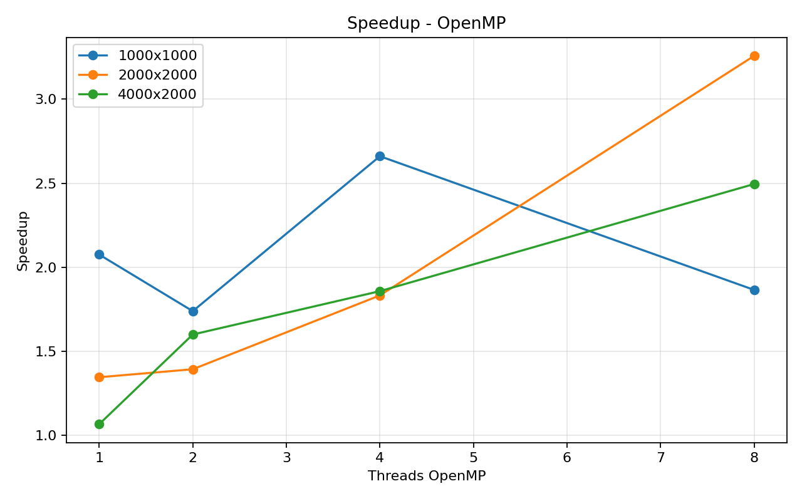
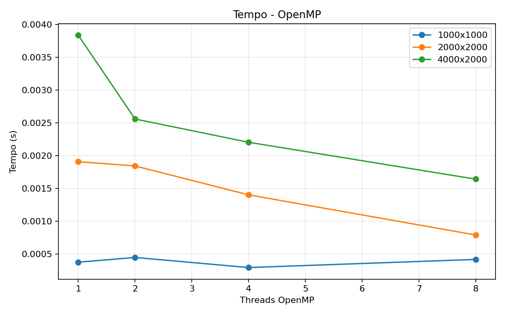

# Tarefa 18 - Versao OpenMP

## Objetivo

Criar uma nova versao paralela do produto `y = A * x` usando OpenMP, mantendo os
resultados MPI atuais em outra pasta. A paralelizacao foi feita no laco externo, em
que cada thread calcula uma faixa de linhas do vetor `y`.

## Implementacao

A matriz em C fica armazenada por linhas. Por isso, paralelizar o laco das linhas e
uma escolha natural: cada thread acessa trechos contiguos de `A` e escreve posicoes
diferentes de `y`. A diretiva usada foi:

```c
#pragma omp parallel for schedule(static)
```

O escalonamento `static` divide as iteracoes entre as threads antes da execucao do
laco. Como cada linha faz aproximadamente a mesma quantidade de trabalho, essa
divisao e adequada e evita overhead desnecessario de escalonamento dinamico.

## Configuracao

- Tamanhos de matriz testados: `1000x1000, 2000x2000, 4000x2000`
- Threads testadas: `1, 2, 4, 8`
- Rodadas por configuracao: `3`
- Compilacao sequencial: `gcc -O3 -Wall -Wextra`
- Compilacao OpenMP: `gcc -O3 -Wall -Wextra -fopenmp`

O tempo sequencial usado como base tambem foi medido em varias rodadas e salvo como
media no CSV. Isso reduz o efeito de uma execucao isolada muito lenta ou muito
rapida, que distorce o speedup em problemas pequenos.

## Resultados

|M|N|Threads|Rodadas|Tempo seq (s)|Media OpenMP (s)|Speedup|Eficiencia|Checksum|
|---:|---:|---:|---:|---:|---:|---:|---:|---:|
|1000|1000|1|3|0.000772|0.000409|1.90|1.90|307461.92|
|1000|1000|2|3|0.000772|0.000484|1.60|0.80|307461.92|
|1000|1000|4|3|0.000772|0.000308|2.52|0.63|307461.92|
|1000|1000|8|3|0.000772|0.000445|1.74|0.22|307461.92|
|2000|2000|1|3|0.002564|0.001946|1.32|1.32|1230001.15|
|2000|2000|2|3|0.002564|0.001989|1.29|0.65|1230001.15|
|2000|2000|4|3|0.002564|0.001667|1.58|0.40|1230001.15|
|2000|2000|8|3|0.002564|0.000947|2.75|0.34|1230001.15|
|4000|2000|1|3|0.004089|0.004086|1.01|1.01|2460001.74|
|4000|2000|2|3|0.004089|0.003360|1.26|0.63|2460001.74|
|4000|2000|4|3|0.004089|0.002593|1.60|0.40|2460001.74|
|4000|2000|8|3|0.004089|0.001668|2.45|0.31|2460001.74|

## Graficos





## Melhores casos

- Matriz 1000x1000: melhor tempo com 4 threads, media 0.000308s, speedup 2.52.
- Matriz 2000x2000: melhor tempo com 8 threads, media 0.000947s, speedup 2.75.
- Matriz 4000x2000: melhor tempo com 8 threads, media 0.001668s, speedup 2.45.

## Analise

Esta versao evita a comunicacao entre processos que aparece nas implementacoes MPI.
Como as threads compartilham a mesma memoria, nao e necessario usar `MPI_Scatter`,
tipos derivados ou `MPI_Reduce`. O trabalho principal fica concentrado no calculo
das linhas de `y`.

O ganho depende do tamanho da matriz. Em matrizes pequenas, o tempo sequencial ja e
muito baixo, entao a criacao e coordenacao das threads pode reduzir o beneficio. Em
matrizes maiores, ha mais linhas para distribuir e o custo fixo do paralelismo pesa
menos em relacao ao calculo.

Mesmo no OpenMP, o speedup nao cresce indefinidamente. O produto matriz-vetor acessa
muitos dados da matriz `A`, entao o desempenho pode ficar limitado pela largura de
banda de memoria. Ao aumentar o numero de threads, mais nucleos tentam ler dados da
memoria ao mesmo tempo, e o gargalo passa a ser o acesso aos dados, nao apenas a
quantidade de operacoes aritmeticas.

## Conclusao

A versao OpenMP e mais direta para este problema em uma unica maquina, porque a
distribuicao de trabalho por linhas combina com o layout da matriz e nao exige
copias ou comunicacao explicita. Ela serve como comparacao importante com as versoes
MPI: quando todos os dados ja estao na mesma memoria, OpenMP tende a ter overhead
menor.

## Codigo

### `matvec_openmp.c`

```c
#include <omp.h>
#include <stdio.h>
#include <stdlib.h>
#include <string.h>
#include <sys/time.h>

static int ler_inteiro(int argc, char **argv, const char *opcao, int padrao)
{
    for (int i = 1; i + 1 < argc; i++) {
        if (strcmp(argv[i], opcao) == 0) {
            return atoi(argv[i + 1]);
        }
    }
    return padrao;
}

static double tempo_agora(void)
{
    struct timeval tv;
    gettimeofday(&tv, NULL);
    return (double)tv.tv_sec + (double)tv.tv_usec * 0.000001;
}

static double valor_a(int i, int j)
{
    return (double)((i + j) % 13 + 1) / 13.0;
}

static double valor_x(int j)
{
    return (double)(j % 7 + 1) / 7.0;
}

int main(int argc, char **argv)
{
    int m = ler_inteiro(argc, argv, "--m", 2000);
    int n = ler_inteiro(argc, argv, "--n", 2000);
    int threads = ler_inteiro(argc, argv, "--threads", 4);
    double *a = malloc((size_t)m * (size_t)n * sizeof(double));
    double *x = malloc((size_t)n * sizeof(double));
    double *y = malloc((size_t)m * sizeof(double));

    if (a == NULL || x == NULL || y == NULL) {
        printf("Erro ao alocar memoria.\n");
        free(a);
        free(x);
        free(y);
        return 1;
    }

    omp_set_dynamic(0);
    omp_set_num_threads(threads);

    for (int j = 0; j < n; j++) {
        x[j] = valor_x(j);
    }
    for (int i = 0; i < m; i++) {
        for (int j = 0; j < n; j++) {
            a[i * n + j] = valor_a(i, j);
        }
    }

    double inicio = tempo_agora();

    #pragma omp parallel for schedule(static)
    for (int i = 0; i < m; i++) {
        double soma = 0.0;
        for (int j = 0; j < n; j++) {
            soma += a[i * n + j] * x[j];
        }
        y[i] = soma;
    }

    double fim = tempo_agora();

    double checksum = 0.0;
    for (int i = 0; i < m; i++) {
        checksum += y[i];
    }

    printf(
        "RESULT versao=openmp threads=%d m=%d n=%d tempo=%.9f checksum=%.6f\n",
        threads,
        m,
        n,
        fim - inicio,
        checksum
    );

    free(a);
    free(x);
    free(y);
    return 0;
}
```

## Artefatos

- Codigo OpenMP: `Tarefa-18-OpenMP/matvec_openmp.c`
- Coleta: `Tarefa-18-OpenMP/coletar_openmp.py`
- CSV: `Tarefa-18-OpenMP/resultados/tarefa18_openmp_resultados.csv`
- Graficos: `Tarefa-18-OpenMP/resultados/speedup.png` e
  `Tarefa-18-OpenMP/resultados/tempo.png`
- Relatorio: `Tarefa-18-OpenMP/resultados/relatorio_tarefa18_openmp.md`
