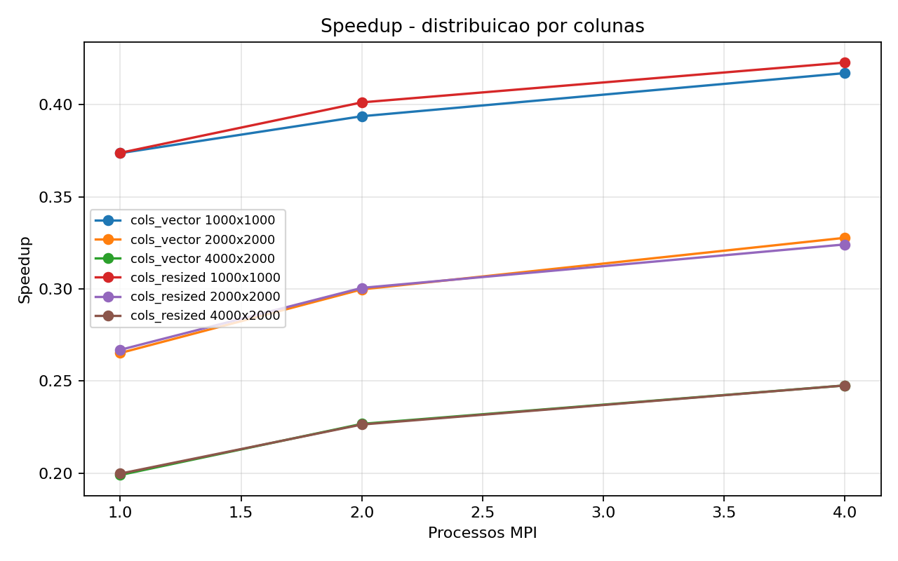
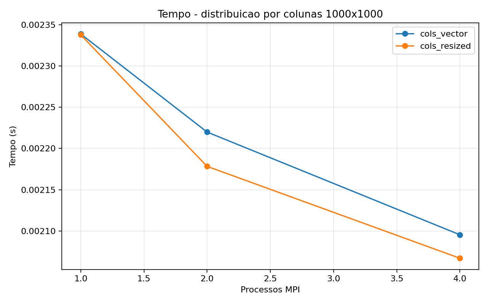
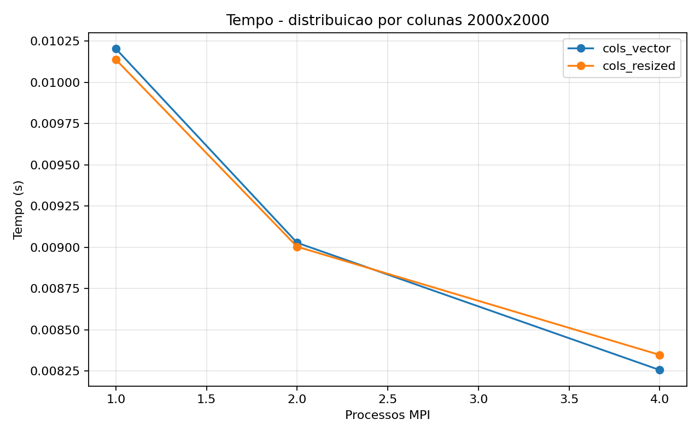
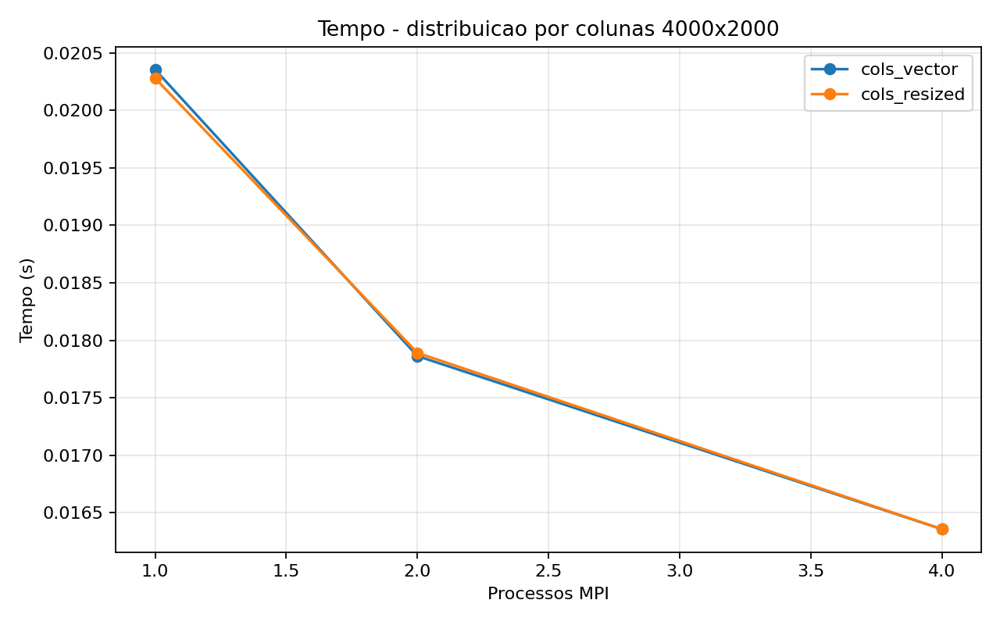

# Tarefa 18 - Produto matriz-vetor com tipos derivados MPI

## Objetivo

Reimplementar o produto `y = A * x` da Tarefa 17, mas agora distribuindo colunas da
matriz entre os processos. Cada processo recebe um bloco de colunas de `A` e o
segmento correspondente de `x`, calcula uma contribuicao parcial para todos os
elementos de `y`, e o processo `0` recebe a soma final com `MPI_Reduce` e `MPI_SUM`.

Foram feitas duas versoes:

- `cols_vector`: usa `MPI_Type_vector` para representar um bloco de colunas.
- `cols_resized`: usa `MPI_Type_vector` e depois `MPI_Type_create_resized` para
  ajustar a extensao do tipo derivado.

## Funcoes MPI usadas

- `MPI_Type_vector`: cria um tipo derivado para selecionar, em cada linha, um bloco
  de colunas. O parametro `count` representa o numero de linhas, `blocklength`
  representa o numero de colunas locais e `stride` e o tamanho total da linha `N`.
- `MPI_Type_create_resized`: altera a extensao do tipo derivado para que o proximo
  bloco enviado por `MPI_Scatter` comece logo na proxima coluna do bloco anterior.
- `MPI_Type_commit`: registra o tipo derivado antes do uso.
- `MPI_Type_free`: libera os tipos derivados ao final.
- `MPI_Scatter`: distribui os blocos de colunas da matriz e os segmentos do vetor
  `x`.
- `MPI_Reduce` com `MPI_SUM`: soma os vetores parciais `y_parcial` e forma o vetor
  final `y` no processo `0`.
- `MPI_Barrier`: alinha os processos antes do trecho medido.

## Configuracao

- Tamanhos de matriz testados: `1000x1000, 2000x2000, 4000x2000`
- Processos MPI testados: `1, 2, 4`
- Rodadas por configuracao: `3`
- Compilacao sequencial: `gcc -O3 -Wall -Wextra`
- Compilacao MPI: `mpicc -O3 -Wall -Wextra`
- Medicao de tempo: `MPI_Wtime` nas versoes MPI e `gettimeofday` na versao
  sequencial da Tarefa 17

Os valores de `N` foram escolhidos divisiveis por `1`, `2` e `4`, pois a divisao por
colunas usa `MPI_Scatter` simples. O checksum foi comparado com a versao sequencial
para validar o resultado.

## Resultados da Tarefa 18

|Versao|M|N|Processos|Colunas/processo|Rodadas|Tempo seq (s)|Media MPI (s)|Speedup|Eficiencia|Checksum|
|---|---:|---:|---:|---:|---:|---:|---:|---:|---:|---:|
|cols_resized|1000|1000|1|1000|3|0.000874|0.002416|0.36|0.36|307461.92|
|cols_resized|1000|1000|2|500|3|0.000874|0.002192|0.40|0.20|307461.92|
|cols_resized|1000|1000|4|250|3|0.000874|0.002124|0.41|0.10|307461.92|
|cols_resized|2000|2000|1|2000|3|0.002706|0.010208|0.27|0.27|1230001.15|
|cols_resized|2000|2000|2|1000|3|0.002706|0.009038|0.30|0.15|1230001.15|
|cols_resized|2000|2000|4|500|3|0.002706|0.008403|0.32|0.08|1230001.15|
|cols_resized|4000|2000|1|2000|3|0.004050|0.020454|0.20|0.20|2460001.74|
|cols_resized|4000|2000|2|1000|3|0.004050|0.017920|0.23|0.11|2460001.74|
|cols_resized|4000|2000|4|500|3|0.004050|0.016559|0.24|0.06|2460001.74|
|cols_vector|1000|1000|1|1000|3|0.000874|0.002434|0.36|0.36|307461.92|
|cols_vector|1000|1000|2|500|3|0.000874|0.002270|0.39|0.19|307461.92|
|cols_vector|1000|1000|4|250|3|0.000874|0.002133|0.41|0.10|307461.92|
|cols_vector|2000|2000|1|2000|3|0.002706|0.010290|0.26|0.26|1230001.15|
|cols_vector|2000|2000|2|1000|3|0.002706|0.009092|0.30|0.15|1230001.15|
|cols_vector|2000|2000|4|500|3|0.002706|0.008280|0.33|0.08|1230001.15|
|cols_vector|4000|2000|1|2000|3|0.004050|0.020517|0.20|0.20|2460001.74|
|cols_vector|4000|2000|2|1000|3|0.004050|0.018052|0.22|0.11|2460001.74|
|cols_vector|4000|2000|4|500|3|0.004050|0.016486|0.25|0.06|2460001.74|

## Comparacao com a Tarefa 17

|M|N|Processos|T17 linhas (s)|T18 vector (s)|T18 resized (s)|
|---:|---:|---:|---:|---:|---:|
|1000|1000|1|0.002264|0.002434|0.002416|
|1000|1000|2|0.002298|0.002270|0.002192|
|1000|1000|4|0.002158|0.002133|0.002124|
|2000|2000|1|0.009868|0.010290|0.010208|
|2000|2000|2|0.009466|0.009092|0.009038|
|2000|2000|4|0.008894|0.008280|0.008403|
|4000|2000|1|0.019627|0.020517|0.020454|
|4000|2000|2|0.018565|0.018052|0.017920|
|4000|2000|4|0.017736|0.016486|0.016559|

## Graficos









## Melhores casos

- cols_resized 1000x1000: melhor tempo com 4 processos, media 0.002124s, speedup 0.41.
- cols_vector 1000x1000: melhor tempo com 4 processos, media 0.002133s, speedup 0.41.
- cols_resized 2000x2000: melhor tempo com 4 processos, media 0.008403s, speedup 0.32.
- cols_vector 2000x2000: melhor tempo com 4 processos, media 0.008280s, speedup 0.33.
- cols_resized 4000x2000: melhor tempo com 4 processos, media 0.016559s, speedup 0.24.
- cols_vector 4000x2000: melhor tempo com 4 processos, media 0.016486s, speedup 0.25.

## Analise

Na Tarefa 17, a matriz foi distribuida por linhas. Esse caso combina bem com o layout
padrao de matrizes em C, que armazena os elementos em ordem por linhas. Assim, cada
processo recebe linhas completas e contiguas de memoria, calcula diretamente os
elementos correspondentes de `y` e depois usa `MPI_Gather` para reunir o resultado.

Na Tarefa 18, a divisao e por colunas. Como as colunas nao ficam contiguas em uma
matriz `M x N` armazenada por linhas, foi necessario usar tipo derivado. O
`MPI_Type_vector` descreve esse padrao nao contiguo: em cada linha, ele seleciona
`colunas_por_processo` elementos e pula `N` posicoes para chegar ao proximo bloco da
linha seguinte.

A versao `cols_vector` mostra uma limitacao importante. O tipo criado por
`MPI_Type_vector` tem uma extensao natural que vai do primeiro elemento do bloco ate
o final do ultimo bloco, incluindo os espacos entre as linhas. Quando esse tipo e
usado diretamente em `MPI_Scatter`, o MPI avanca de um processo para o proximo usando
essa extensao. Por isso, o processo `0` precisa preparar um buffer com espacamento
entre os blocos de cada processo. A comunicacao ainda usa o tipo derivado, mas ha
custo extra de memoria e preparacao. Essa preparacao ocorre antes do trecho medido
no script de testes, mas ainda e uma diferenca importante da implementacao.

A versao `cols_resized` corrige esse problema. Depois de criar o tipo com
`MPI_Type_vector`, `MPI_Type_create_resized` define a extensao como
`colunas_por_processo * sizeof(double)`. Com isso, no `MPI_Scatter`, o bloco do
processo seguinte comeca na proxima coluna do bloco anterior. Essa versao consegue
usar a matriz em seu layout normal no processo `0`, sem criar um buffer artificial
com lacunas.

Mesmo com `resized`, a distribuicao por colunas tende a ter desempenho diferente da
distribuicao por linhas. Cada processo calcula uma contribuicao parcial para todos os
elementos de `y`, entao cada processo escreve um vetor parcial de tamanho `M`. No
fim, `MPI_Reduce` soma esses vetores parciais. Isso contrasta com a Tarefa 17, em
que cada processo calcula apenas algumas linhas finais de `y` e o processo `0`
apenas junta os blocos com `MPI_Gather`.

O acesso a memoria local tambem muda. Depois do recebimento, os blocos locais foram
guardados em memoria contigua para simplificar o calculo. Ainda assim, a etapa de
envio a partir do processo `0` precisa ler a matriz em padrao de colunas, ou seja,
com saltos entre linhas. Esse padrao costuma ser menos favoravel para cache do que
enviar linhas contiguas.

Nos resultados medidos, `cols_vector` e `cols_resized` ficaram proximas. Isso ocorre
porque as duas usam o mesmo padrao de comunicacao principal: `MPI_Scatter` para a
matriz, `MPI_Scatter` para o segmento de `x` e `MPI_Reduce` para somar `y`. A
diferenca principal entre elas esta na organizacao do buffer no processo `0`, nao no
calculo local. A versao com `resized` e mais direta e representa melhor o layout real
da matriz, mesmo quando o tempo medido fica parecido.

Comparando com a Tarefa 17, os tempos ficaram na mesma ordem de grandeza. Em alguns
casos com 2 e 4 processos, as versoes por colunas ficaram levemente mais rapidas que
a versao por linhas medida na Tarefa 17. Isso nao significa que colunas sejam sempre
melhores; neste ambiente local, o custo das coletivas e a variacao de execucao podem
pesar bastante. A diferenca estrutural continua sendo que a Tarefa 17 distribui
partes finais de `y`, enquanto a Tarefa 18 exige uma reducao completa de um vetor de
tamanho `M`.

## Conclusao

A Tarefa 18 evidencia por que tipos derivados sao uteis em MPI. Eles permitem
descrever blocos nao contiguos da matriz sem empacotar manualmente cada elemento.
`MPI_Type_vector` e suficiente para representar o desenho das colunas, mas sua
extensao natural atrapalha o uso direto com multiplos blocos em `MPI_Scatter`.

`MPI_Type_create_resized` resolve esse ponto ao redefinir a extensao do tipo
derivado. Por isso, a versao `cols_resized` representa melhor a solucao esperada para
espalhar blocos de colunas de uma matriz armazenada por linhas.

Comparada com a Tarefa 17, a divisao por colunas tem uma comunicacao final mais
pesada, pois usa `MPI_Reduce` em um vetor de tamanho `M`, e nao apenas uma reuniao
dos pedacos finais de `y`. Ela tambem exige acesso nao contiguo na matriz original.
Assim, a distribuicao por linhas tende a ser mais natural para o produto
matriz-vetor em C, enquanto a distribuicao por colunas serve para demonstrar bem o
uso de tipos derivados.

## Codigos

### `matvec_cols_vector.c`

```c
#include <mpi.h>
#include <stdio.h>
#include <stdlib.h>
#include <string.h>

static int ler_inteiro(int argc, char **argv, const char *opcao, int padrao)
{
    for (int i = 1; i + 1 < argc; i++) {
        if (strcmp(argv[i], opcao) == 0) {
            return atoi(argv[i + 1]);
        }
    }
    return padrao;
}

static double valor_a(int i, int j)
{
    return (double)((i + j) % 13 + 1) / 13.0;
}

static double valor_x(int j)
{
    return (double)(j % 7 + 1) / 7.0;
}

static void preencher_x(double *x, int n)
{
    for (int j = 0; j < n; j++) {
        x[j] = valor_x(j);
    }
}

static void preencher_buffer_com_espacamento(double *a_envio, int m, int n, int processos, int colunas_locais, int extensao)
{
    for (int p = 0; p < processos; p++) {
        int coluna_inicial = p * colunas_locais;
        double *base = a_envio + (size_t)p * (size_t)extensao;
        for (int i = 0; i < m; i++) {
            for (int j = 0; j < colunas_locais; j++) {
                base[i * n + j] = valor_a(i, coluna_inicial + j);
            }
        }
    }
}

static void calcular_parcial(double *a_local, double *x_local, double *y_parcial, int m, int colunas_locais)
{
    for (int i = 0; i < m; i++) {
        double soma = 0.0;
        for (int j = 0; j < colunas_locais; j++) {
            soma += a_local[i * colunas_locais + j] * x_local[j];
        }
        y_parcial[i] = soma;
    }
}

int main(int argc, char **argv)
{
    int rank;
    int size;
    int m;
    int n;
    int colunas_locais;
    int extensao_tipo;
    double *a_envio = NULL;
    double *x = NULL;
    double *a_local = NULL;
    double *x_local = NULL;
    double *y_parcial = NULL;
    double *y = NULL;
    MPI_Datatype tipo_colunas;

    MPI_Init(&argc, &argv);
    MPI_Comm_rank(MPI_COMM_WORLD, &rank);
    MPI_Comm_size(MPI_COMM_WORLD, &size);

    m = ler_inteiro(argc, argv, "--m", 2000);
    n = ler_inteiro(argc, argv, "--n", 2000);

    if (n % size != 0) {
        if (rank == 0) {
            printf("Para distribuir colunas com MPI_Scatter simples, N deve ser divisivel pelo numero de processos.\n");
        }
        MPI_Finalize();
        return 1;
    }

    colunas_locais = n / size;
    extensao_tipo = (m - 1) * n + colunas_locais;

    MPI_Type_vector(m, colunas_locais, n, MPI_DOUBLE, &tipo_colunas);
    MPI_Type_commit(&tipo_colunas);

    x_local = malloc((size_t)colunas_locais * sizeof(double));
    a_local = malloc((size_t)m * (size_t)colunas_locais * sizeof(double));
    y_parcial = malloc((size_t)m * sizeof(double));

    if (rank == 0) {
        x = malloc((size_t)n * sizeof(double));
        y = malloc((size_t)m * sizeof(double));
        a_envio = calloc((size_t)size * (size_t)extensao_tipo, sizeof(double));
        if (x != NULL && a_envio != NULL) {
            preencher_x(x, n);
            preencher_buffer_com_espacamento(a_envio, m, n, size, colunas_locais, extensao_tipo);
        }
    }

    if (x_local == NULL || a_local == NULL || y_parcial == NULL || (rank == 0 && (x == NULL || y == NULL || a_envio == NULL))) {
        printf("Erro ao alocar memoria no rank %d.\n", rank);
        free(a_envio);
        free(x);
        free(a_local);
        free(x_local);
        free(y_parcial);
        free(y);
        MPI_Type_free(&tipo_colunas);
        MPI_Finalize();
        return 1;
    }

    MPI_Barrier(MPI_COMM_WORLD);
    double inicio = MPI_Wtime();

    MPI_Scatter(x, colunas_locais, MPI_DOUBLE, x_local, colunas_locais, MPI_DOUBLE, 0, MPI_COMM_WORLD);
    MPI_Scatter(a_envio, 1, tipo_colunas, a_local, m * colunas_locais, MPI_DOUBLE, 0, MPI_COMM_WORLD);

    calcular_parcial(a_local, x_local, y_parcial, m, colunas_locais);

    MPI_Reduce(y_parcial, y, m, MPI_DOUBLE, MPI_SUM, 0, MPI_COMM_WORLD);

    double fim = MPI_Wtime();

    if (rank == 0) {
        double checksum = 0.0;
        for (int i = 0; i < m; i++) {
            checksum += y[i];
        }
        printf(
            "RESULT versao=cols_vector processos=%d m=%d n=%d colunas_por_processo=%d tempo=%.9f checksum=%.6f\n",
            size,
            m,
            n,
            colunas_locais,
            fim - inicio,
            checksum
        );
    }

    free(a_envio);
    free(x);
    free(a_local);
    free(x_local);
    free(y_parcial);
    free(y);
    MPI_Type_free(&tipo_colunas);
    MPI_Finalize();
    return 0;
}
```

### `matvec_cols_resized.c`

```c
#include <mpi.h>
#include <stdio.h>
#include <stdlib.h>
#include <string.h>

static int ler_inteiro(int argc, char **argv, const char *opcao, int padrao)
{
    for (int i = 1; i + 1 < argc; i++) {
        if (strcmp(argv[i], opcao) == 0) {
            return atoi(argv[i + 1]);
        }
    }
    return padrao;
}

static double valor_a(int i, int j)
{
    return (double)((i + j) % 13 + 1) / 13.0;
}

static double valor_x(int j)
{
    return (double)(j % 7 + 1) / 7.0;
}

static void preencher_matriz(double *a, int m, int n)
{
    for (int i = 0; i < m; i++) {
        for (int j = 0; j < n; j++) {
            a[i * n + j] = valor_a(i, j);
        }
    }
}

static void preencher_x(double *x, int n)
{
    for (int j = 0; j < n; j++) {
        x[j] = valor_x(j);
    }
}

static void calcular_parcial(double *a_local, double *x_local, double *y_parcial, int m, int colunas_locais)
{
    for (int i = 0; i < m; i++) {
        double soma = 0.0;
        for (int j = 0; j < colunas_locais; j++) {
            soma += a_local[i * colunas_locais + j] * x_local[j];
        }
        y_parcial[i] = soma;
    }
}

int main(int argc, char **argv)
{
    int rank;
    int size;
    int m;
    int n;
    int colunas_locais;
    double *a = NULL;
    double *x = NULL;
    double *a_local = NULL;
    double *x_local = NULL;
    double *y_parcial = NULL;
    double *y = NULL;
    MPI_Datatype tipo_colunas;
    MPI_Datatype tipo_colunas_redimensionado;

    MPI_Init(&argc, &argv);
    MPI_Comm_rank(MPI_COMM_WORLD, &rank);
    MPI_Comm_size(MPI_COMM_WORLD, &size);

    m = ler_inteiro(argc, argv, "--m", 2000);
    n = ler_inteiro(argc, argv, "--n", 2000);

    if (n % size != 0) {
        if (rank == 0) {
            printf("Para distribuir colunas com MPI_Scatter simples, N deve ser divisivel pelo numero de processos.\n");
        }
        MPI_Finalize();
        return 1;
    }

    colunas_locais = n / size;

    MPI_Type_vector(m, colunas_locais, n, MPI_DOUBLE, &tipo_colunas);
    MPI_Type_create_resized(tipo_colunas, 0, (MPI_Aint)colunas_locais * (MPI_Aint)sizeof(double), &tipo_colunas_redimensionado);
    MPI_Type_commit(&tipo_colunas_redimensionado);

    x_local = malloc((size_t)colunas_locais * sizeof(double));
    a_local = malloc((size_t)m * (size_t)colunas_locais * sizeof(double));
    y_parcial = malloc((size_t)m * sizeof(double));

    if (rank == 0) {
        a = malloc((size_t)m * (size_t)n * sizeof(double));
        x = malloc((size_t)n * sizeof(double));
        y = malloc((size_t)m * sizeof(double));
        if (a != NULL && x != NULL) {
            preencher_matriz(a, m, n);
            preencher_x(x, n);
        }
    }

    if (x_local == NULL || a_local == NULL || y_parcial == NULL || (rank == 0 && (a == NULL || x == NULL || y == NULL))) {
        printf("Erro ao alocar memoria no rank %d.\n", rank);
        free(a);
        free(x);
        free(a_local);
        free(x_local);
        free(y_parcial);
        free(y);
        MPI_Type_free(&tipo_colunas_redimensionado);
        MPI_Type_free(&tipo_colunas);
        MPI_Finalize();
        return 1;
    }

    MPI_Barrier(MPI_COMM_WORLD);
    double inicio = MPI_Wtime();

    MPI_Scatter(x, colunas_locais, MPI_DOUBLE, x_local, colunas_locais, MPI_DOUBLE, 0, MPI_COMM_WORLD);
    MPI_Scatter(a, 1, tipo_colunas_redimensionado, a_local, m * colunas_locais, MPI_DOUBLE, 0, MPI_COMM_WORLD);

    calcular_parcial(a_local, x_local, y_parcial, m, colunas_locais);

    MPI_Reduce(y_parcial, y, m, MPI_DOUBLE, MPI_SUM, 0, MPI_COMM_WORLD);

    double fim = MPI_Wtime();

    if (rank == 0) {
        double checksum = 0.0;
        for (int i = 0; i < m; i++) {
            checksum += y[i];
        }
        printf(
            "RESULT versao=cols_resized processos=%d m=%d n=%d colunas_por_processo=%d tempo=%.9f checksum=%.6f\n",
            size,
            m,
            n,
            colunas_locais,
            fim - inicio,
            checksum
        );
    }

    free(a);
    free(x);
    free(a_local);
    free(x_local);
    free(y_parcial);
    free(y);
    MPI_Type_free(&tipo_colunas_redimensionado);
    MPI_Type_free(&tipo_colunas);
    MPI_Finalize();
    return 0;
}
```

## Artefatos

- Codigo com `MPI_Type_vector`: `Tarefa-18/matvec_cols_vector.c`
- Codigo com `MPI_Type_create_resized`: `Tarefa-18/matvec_cols_resized.c`
- Coleta: `Tarefa-18/coletar_mpi.py`
- CSV: `Tarefa-18/resultados/tarefa18_resultados.csv`
- Graficos: `Tarefa-18/resultados/speedup.png` e `Tarefa-18/resultados/tempo_*.png`
- Relatorio: `Tarefa-18/resultados/relatorio_tarefa18.md`
