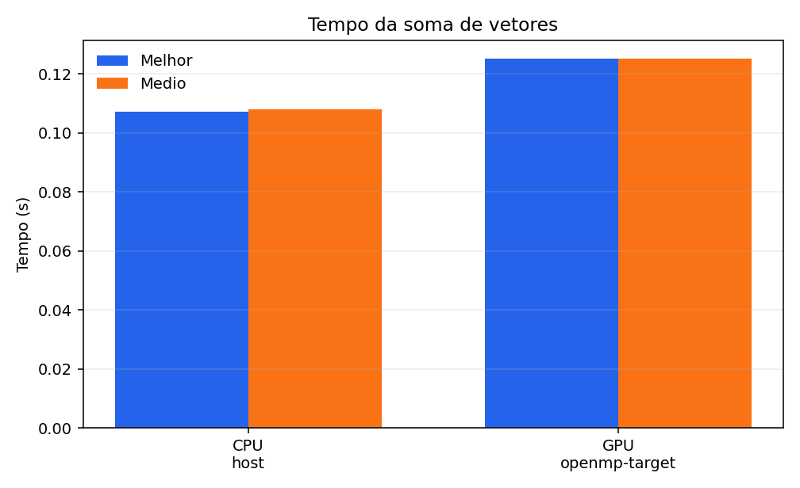

# Tarefa 19 - Relatorio de resultados

## Fonte dos dados

Dados lidos de: `tarefa19_resultados_1858301.csv`.

## Resultados

| Variante | Dispositivo | N | Repeticoes | Melhor soma (s) | Media soma (s) | Inicializacao (s) | Validacao (s) | Total aprox. (s) | Erros | Threads | Devices |
| --- | --- | ---: | ---: | ---: | ---: | ---: | ---: | ---: | ---: | ---: | ---: |
| cpu | host | 100000000 | 5 | 0.107329130 | 0.108146763 | 0.501634121 | 0.103204966 | 0.712985850 | 0 | 1 | 0 |
| gpu | openmp-target | 100000000 | 5 | 0.125133038 | 0.125197220 | 0.494171143 | 0.101060152 | 0.720428515 | 0 | 1 | 1 |

## Analise

A GPU obteve speedup de 0.864x, ou seja, ficou 15.8% mais lenta que a CPU no tempo medio da soma.

Todas as execucoes terminaram com `errors = 0`, portanto a soma foi validada
para as duas variantes. A execucao registrada usou `OMP_NUM_THREADS=1`, entao
a linha CPU representa uma CPU com uma thread OpenMP, nao a escalabilidade
multicore completa. Na linha GPU, o tempo da soma inclui a entrada e saida da
regiao `target` e as transferencias determinadas pelas clausulas `map`.

## Graficos

