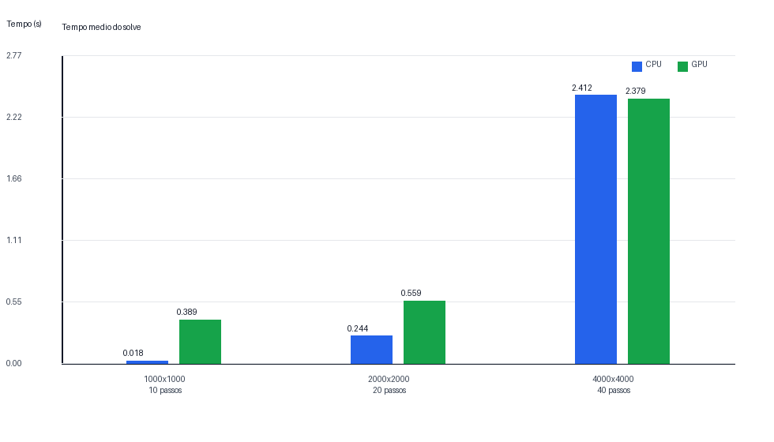
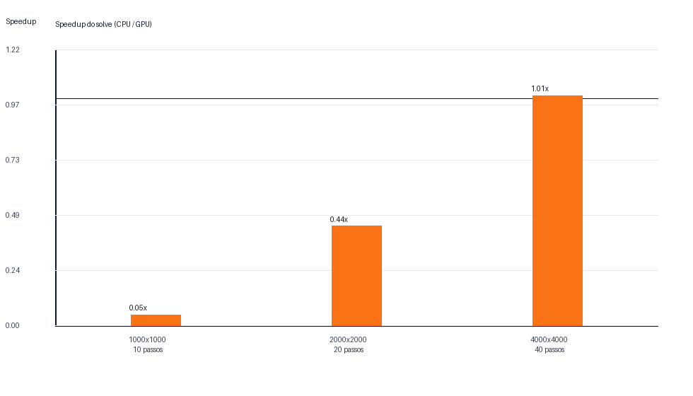

# Comparacao heat CPU x GPU

## Fonte dos dados

CSVs lidos: `heat_resultados_1887840.csv`.

## Resumo

| N | Passos | Reps CPU | Reps GPU | CPU solve medio (s) | GPU solve medio (s) | Speedup solve | CPU total medio (s) | GPU total medio (s) | Speedup total | Delta L2 |
| ---: | ---: | ---: | ---: | ---: | ---: | ---: | ---: | ---: | ---: | ---: |
| 1000 | 10 | 3 | 3 | 0.017980000 | 0.389164000 | 0.046x | 0.035263333 | 0.407935000 | 0.086x | 0.000e+00 |
| 2000 | 20 | 3 | 3 | 0.244055667 | 0.558711333 | 0.437x | 0.309715667 | 0.632066000 | 0.490x | 0.000e+00 |
| 4000 | 40 | 3 | 3 | 2.411507667 | 2.379436667 | 1.013x | 2.680814000 | 2.693343333 | 0.995x | 0.000e+00 |

## Leitura dos resultados

O speedup usa `tempo medio CPU / tempo medio GPU`. Valores acima de 1 indicam
vantagem da versao GPU; valores abaixo de 1 indicam que a versao CPU foi mais
rapida nesse caso.

Melhor speedup de solve: `1.013x` com `N=4000` e
`nsteps=40`.

Menor speedup de solve: `0.046x` com `N=1000` e
`nsteps=10`.

A diferenca `Delta L2` compara o erro numerico medio das duas versoes. Ela deve
ficar muito pequena, porque o stencil calculado e o mesmo; diferencas pequenas
podem aparecer por ordem de execucao e arredondamento.

## Graficos

## Avisos

Nenhum aviso.
