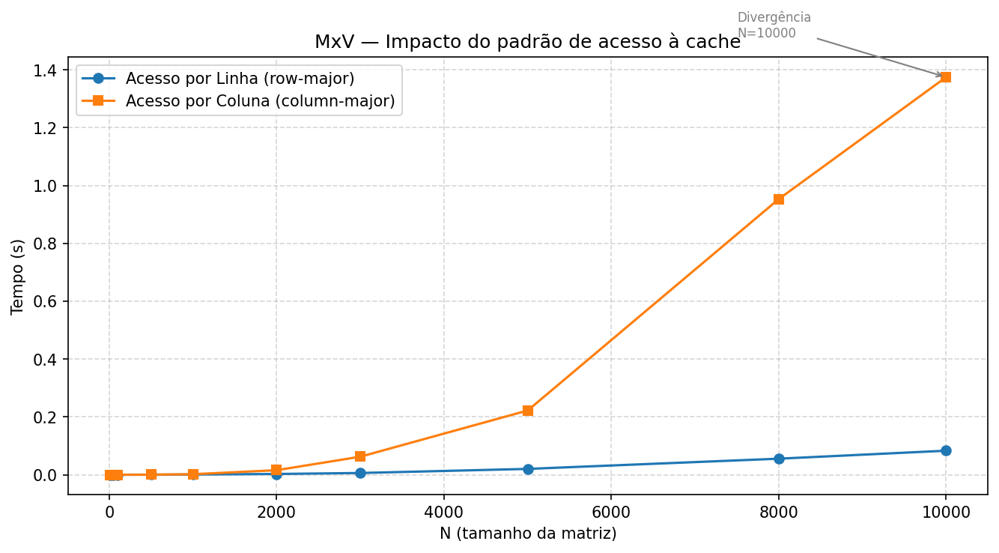
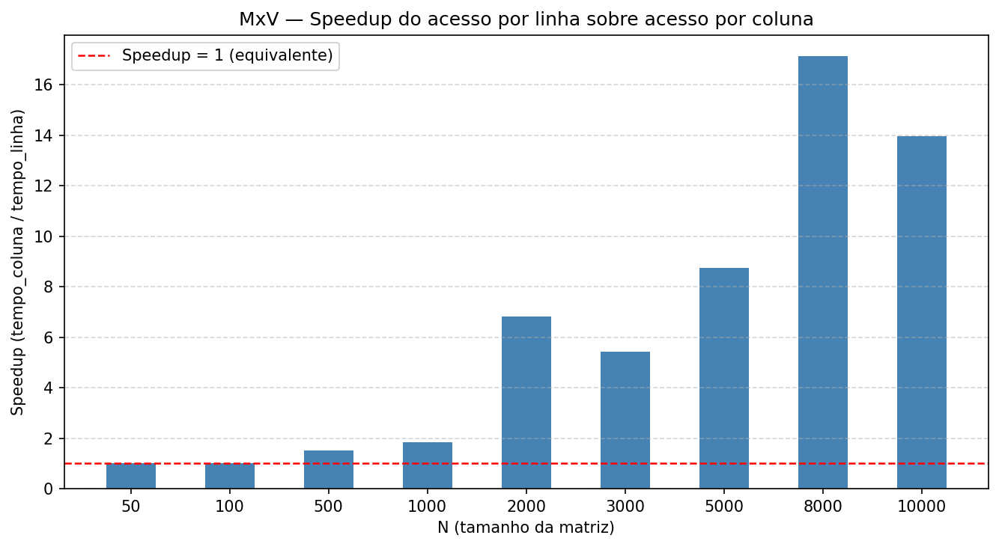

# Relatório — Tarefas 1, 2 e 3

---

## Tarefa 1 — Multiplicação Matriz × Vetor: acesso por linha vs. por coluna

### O que foi feito

Foram implementadas duas versões do produto MxV em C. Na versão **por linha**, o loop externo percorre as linhas e o interno as colunas — exatamente como a matriz está organizada na memória em C (row-major). Na versão **por coluna**, os loops são invertidos: externo percorre colunas e interno as linhas, acessando a memória de forma não-contígua.

### Resultados

| N | Linha (s) | Coluna (s) | Speedup |
|---|---|---|---|
| 100 | 0.000003 | 0.000004 | 1.3× |
| 500 | 0.000126 | 0.000196 | 1.6× |
| 1000 | 0.000925 | 0.001738 | 1.9× |
| 2000 | 0.002326 | 0.011253 | 4.8× |
| 3000 | 0.005962 | 0.044569 | 7.5× |
| 5000 | 0.015551 | 0.160832 | 10.3× |
| 8000 | 0.044284 | 0.853427 | 19.3× |
| 10000 | 0.085745 | 1.254650 | 14.6× |

### Por que isso acontece

C armazena matrizes em **row-major**: os elementos `A[i][0], A[i][1], A[i][2]...` ficam contíguos na memória. No acesso por linha, cada `cache line` carregada (64 bytes = 8 doubles) é totalmente aproveitada nas iterações seguintes — **localidade espacial** em ação.

No acesso por coluna, a cada iteração do loop interno o programa pula N elementos para chegar ao próximo `A[i][j]`. Para N=10000 com `double` (8 bytes), isso é um salto de 80.000 bytes entre acessos consecutivos — cada acesso gera um **cache miss**, e o processador precisa esperar os dados chegarem da RAM.

A divergência começa a partir de **N ≈ 2000**, quando a matriz deixa de caber na cache L2/L3. Em N=8000, o acesso por coluna é ~19× mais lento — quase todo o tempo é gasto esperando dados da memória principal.

---

## Tarefa 2 — ILP: dependências de dados e efeito da otimização do compilador

### O que foi feito

Foram comparados dois estilos de loop de soma acumulativa com **N = 100.000.000 elementos**:

- **Laço 2** (`laco_1e2`): soma com **uma única variável acumuladora** — há dependência entre iterações. A instrução de adição da iteração N só pode começar após a iteração N−1 terminar.
- **Laço 3** (`laco_1e3_K`): soma com **K acumuladores independentes** (2, 4, 8, 12 e 16), quebrando a dependência: cada acumulador soma elementos distintos sem depender do outro.

Cada versão foi compilada com `-O0`, `-O2` e `-O3`.

### Resultados

| Laço | Acumuladores | -O0 (s) | -O2 (s) | -O3 (s) |
|---|---|---|---|---|
| laco2 | 1 | **0.1764** | 0.0225 | 0.0256 |
| laco3_2 | 2 | 0.0863 | 0.0278 | 0.0272 |
| laco3_4 | 4 | 0.0514 | 0.0274 | 0.0279 |
| laco3_8 | 8 | 0.0504 | **0.0223** | 0.0277 |
| laco3_12 | 12 | **0.0455** | 0.0276 | 0.0277 |
| laco3_16 | 16 | 0.0527 | 0.0242 | **0.0259** |

### Análise por nível de otimização

#### Sem otimização (`-O0`) — dependência é o gargalo

Com `-O0`, o compilador não aplica nenhuma transformação — o código é executado exatamente como foi escrito. Aqui o efeito da **dependência de dados** aparece com clareza:

- O **laco2** é o mais lento: **0.176s**. A dependência impõe uma cadeia de instrução: a adição da iteração seguinte só pode entrar no pipeline após a anterior escrever `soma`. Uma instrução `add` em inteiro tem latência de ~1–3 ciclos — multiplicada por 100 milhões de iterações, esse atraso se acumula.

- O **laco3_2** com 2 acumuladores já é **2× mais rápido** (0.086s): como `soma1` e `soma2` são independentes, o processador pode sobrepor as duas adições no pipeline simultaneamente.

- O **laco3_4** melhora para **3.4× mais rápido** (0.051s): 4 cadeias independentes, maior aproveitamento das unidades de execução.

- A partir de **8–12 acumuladores**, o ganho satura (~3.5–3.9×). O laco3_12 atingiu o melhor tempo com -O0 (0.0455s). Isso indica que o hardware já saturou — o processador não tem unidades de execução livres suficientes para aproveitar mais paralelismo independente.

- O **laco3_16** é ligeiramente mais lento que laco3_12, possivelmente por **pressão de registradores**: com 16 variáveis locais ativas, o compilador sem otimização precisa salvar/restaurar valores na pilha com mais frequência.

#### Com otimização (`-O2` e `-O3`) — o compilador resolve sozinho

Com `-O2` e `-O3`, o cenário muda radicalmente. O compilador reconhece o **padrão de redução** do laco2 (`soma += A[i]`) e aplica automaticamente **vetorização SIMD** (instruções AVX/SSE), que internamente usa múltiplos registradores de vetor para acumular parcelas em paralelo — exatamente o que os laços 3 faziam manualmente.

O resultado é que o **laco2 sofre o maior ganho de otimização**: de 0.176s (`-O0`) para 0.022s (`-O2`), um speedup de **~8×** só pela otimização do compilador.

Os laços 3 também melhoram com a otimização, mas de forma menor: o laco3_2 vai de 0.086s para 0.028s (~3×). O motivo é que o corpo de loop mais complexo (mais variáveis, mais operações) dá menos margem para o compilador aplicar transformações adicionais.

Com `-O2`/`-O3`, todos os laços convergem para tempos parecidos (~0.022–0.028s), o que confirma que o compilador **chegou ao mesmo resultado** que o programador tentou alcançar manualmente.

### Resumo dos ganhos

| Comparação | Ganho |
|---|---|
| laco2: -O0 → -O2 | **~8×** (vetorização automática do compilador) |
| laco2 vs laco3_2 em -O0 | **~2×** (quebra manual de dependência) |
| laco2 vs laco3_12 em -O0 | **~3.9×** (melhor resultado manual sem otimização) |
| laco2 vs laco3_12 em -O2 | ~1× (compilador empata o resultado) |

### Conclusão da Tarefa 2

A Tarefa 2 demonstra dois fenômenos complementares:

1. **Dependências de dados** criam gargalos reais no pipeline do processador. Quando o compilador não pode intervir (`-O0`), quebrar a dependência manualmente com múltiplos acumuladores pode dar ganhos de até ~4×.

2. **O compilador moderno é muito eficaz**: com `-O2`/`-O3`, ele identifica o padrão de redução e aplica vetorização automática, eliminando a dependência por conta própria. Código simples e idiomático tende a ser mais fácil de vetorizar do que código manualmente desdobrado.

A lição prática: **escreva código claro, compile com otimização, e só aplique transformações manuais se o profiling mostrar que o compilador não conseguiu fazê-las**.

---

## Tarefa 3 — Aproximação de π pelo algoritmo de Gauss-Legendre

### O que foi feito

Foi implementado o algoritmo iterativo de Gauss-Legendre para aproximação de π. O algoritmo é baseado nas médias aritmética-geométrica e converge **quadraticamente** — a cada iteração, o número de dígitos corretos aproximadamente dobra.

### Resultados

Referência — M_PI como `double`: `3.14159265358979324`

| Iterações | Tempo (s) | π aproximado (17 casas) | Erro absoluto |
|---|---|---|---|
| 1 | 9.6 × 10⁻⁸ | 3.14057925052216900 | 1.013 × 10⁻³ |
| 2 | 4.1 × 10⁻⁸ | 3.14159264621354300 | 7.376 × 10⁻⁹ |
| **3** | **3.9 × 10⁻⁸** | **3.14159265358979**312 | **8.882 × 10⁻¹⁶** |
| 4–50 | cresce linearmente | 3.14159265358979**312** | 8.882 × 10⁻¹⁶ |

> Os dígitos em **negrito** indicam as casas corretas. A diferença entre o valor da iteração 3 e M_PI (`3.14159265358979324`) ocorre apenas nos dois últimos bits da mantissa do `double` — estamos no limite físico da representação de 64 bits.

### Por que converge tão rápido

O algoritmo de Gauss-Legendre tem convergência **quadrática**: a cada iteração, o número de casas decimais corretas aproximadamente dobra.

- **1 iteração**: 3 casas corretas (erro ~10⁻³)
- **2 iterações**: 8 casas corretas (erro ~10⁻⁹)
- **3 iterações**: o algoritmo atinge o **limite de precisão do `double`** (≈ 15–16 dígitos, erro ~8.88 × 10⁻¹⁶ ≈ 4× épsilon da máquina)

A partir da 3ª iteração não há mais ganho — não porque o algoritmo parou de convergir, mas porque o tipo `double` de 64 bits não tem bits suficientes para representar mais casas decimais. Seriam necessários ~120 bits de mantissa para observar a convergência da 4ª iteração.

O tempo cresce linearmente com as iterações (cada uma executa um número fixo de operações de ponto flutuante). O custo com 50 iterações (~290 ns) é irrelevante — o algoritmo é extremamente eficiente.

### Conclusão

3 iterações do algoritmo de Gauss-Legendre são suficientes para obter π com a máxima precisão representável em `double`. Isso contrasta com algoritmos de séries como Leibniz (`π/4 = 1 - 1/3 + 1/5 - ...`), que precisam de milhões de termos para obter apenas algumas casas corretas — e ilustra como a **escolha do algoritmo** impacta o desempenho muito mais do que qualquer otimização de código.
