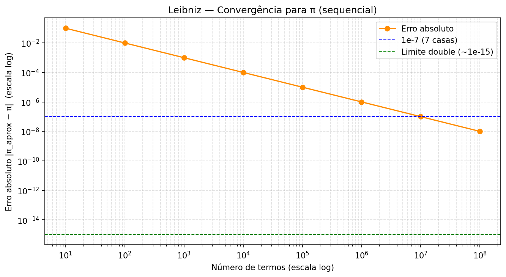
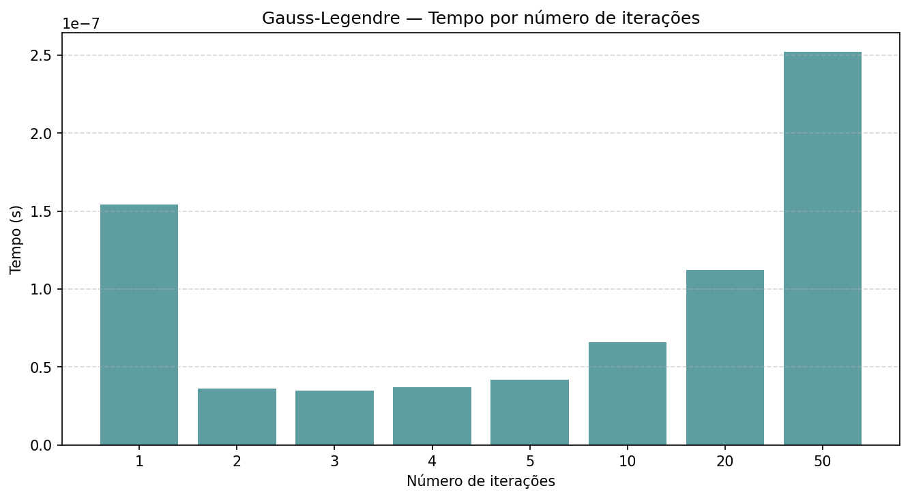

# Tarefa 3 — Aproximação de π pelo algoritmo de Gauss-Legendre

## Objetivo

Implementar o algoritmo de Gauss-Legendre para aproximar π, variar o número de iterações e observar com que velocidade o resultado converge para o valor real.

---

## O que foi implementado

O algoritmo de Gauss-Legendre calcula π por meio de uma sequência de operações matemáticas que se repete. A cada iteração, os valores internos ficam mais próximos de π, e o resultado final é calculado ao fim do laço.

O programa foi testado com 1, 2, 3, 4, 5, 10, 20 e 50 iterações. Os resultados foram impressos com 17 casas decimais para que fosse possível comparar dígito por dígito com o valor real de π.

---

## Resultados

Valor de referência de π: `3.14159265358979323...`

| Iterações | Tempo (s) | π aproximado | Erro |
| --- | --- | --- | --- |
| 1 | 8.7 × 10⁻⁸ | 3.14057925052216858 | 1.013 × 10⁻³ |
| 2 | 3.1 × 10⁻⁸ | 3.14159264621354284 | 7.376 × 10⁻⁹ |
| 3 | 3.4 × 10⁻⁸ | 3.14159265358979400 | 8.882 × 10⁻¹⁶ |
| 4 | 4.0 × 10⁻⁸ | 3.14159265358979400 | 8.882 × 10⁻¹⁶ |
| 5 | 4.4 × 10⁻⁸ | 3.14159265358979400 | 8.882 × 10⁻¹⁶ |
| 10 | 6.8 × 10⁻⁸ | 3.14159265358979400 | 8.882 × 10⁻¹⁶ |
| 20 | 1.19 × 10⁻⁷ | 3.14159265358979400 | 8.882 × 10⁻¹⁶ |
| 50 | 2.70 × 10⁻⁷ | 3.14159265358979400 | 8.882 × 10⁻¹⁶ |

> Os dígitos em negrito marcam onde a aproximação começa a divergir de π real.





---

## Análise

### A cada iteração, o dobro de casas decimais corretas

Comparando os resultados dígito a dígito com π real:

```
π real:  3.14159265358979323...
iter 1:  3.14057925052216858...
              ^--- erra aqui
              apenas 2 casas decimais corretas

π real:  3.14159265358979323...
iter 2:  3.14159264621354284...
                      ^--- erra aqui
              7 casas decimais corretas  (+5 em relação à iteração 1)

π real:  3.14159265358979323...
iter 3:  3.14159265358979400...
                              ^--- erra aqui
              15 casas decimais corretas (+8 em relação à iteração 2)
```

| Iteração | Casas corretas | Ganho |
| --- | --- | --- |
| 1 | 2 | — |
| 2 | 7 | +5 |
| 3 | 15 | +8 |

O padrão é claro: a cada iteração o número de casas corretas **aproximadamente dobra**. Isso é chamado de convergência quadrática — e é o que torna o algoritmo tão eficiente.

### Por que o resultado para de melhorar após a 3ª iteração

A partir da 3ª iteração, o valor calculado não muda mais — todas as iterações seguintes retornam exatamente `3.14159265358979400`. Isso não significa que o algoritmo parou de funcionar. O que acontece é que o computador chegou no **limite de precisão do tipo de número que está usando**.

Números decimais com muitas casas não podem ser guardados exatamente na memória. O tipo `double`, usado neste programa, consegue representar com precisão até cerca de 15–16 casas decimais. Depois disso, qualquer diferença entre os valores é tão pequena que o computador não consegue mais distinguir — é como tentar medir milímetros com uma régua marcada só em centímetros.

Por isso, mesmo que matematicamente houvesse mais casas corretas a ganhar, o programa não consegue mostrá-las — o instrumento de medida chegou no seu limite.

Comparando os últimos dígitos lado a lado:

```
π real:        3.14159265358979 323...
calculado:     3.14159265358979 400...
                               ^^^--- diferença aqui, mas é menor
                                      do que o computador consegue representar
```

### O tempo cresce, mas a precisão não melhora

O tempo aumenta linearmente com o número de iterações — cada iteração custa o mesmo tanto. Com 50 iterações o programa leva ~270 nanossegundos (0.00000027 segundos). Mas toda essa computação extra após a 3ª iteração não agrega nada em termos de precisão.

| Trecho | Tempo (s) | Ganhou precisão? |
| --- | --- | --- |
| 1 → 2 iterações | ~3 × 10⁻⁸ | Sim — de 2 para 7 casas corretas |
| 2 → 3 iterações | ~3 × 10⁻⁹ | Sim — de 7 para 15 casas corretas |
| 3 → 50 iterações | ~2.4 × 10⁻⁷ | Não — resultado congelado |

### Comparação com outros algoritmos

O Gauss-Legendre não é o único jeito de calcular π. Outros algoritmos mais simples existem, mas são muito menos eficientes:

| Algoritmo | Iterações para ~15 casas corretas |
| --- | --- |
| **Gauss-Legendre** | **3** |
| Série de Machin | ~20 termos |
| Série de Leibniz (1 − 1/3 + 1/5 − ...) | ~1.000.000.000.000.000 termos |

A série de Leibniz é a mais intuitiva matematicamente, mas seria necessário somar **um quadrilhão de termos** para chegar ao mesmo resultado que o Gauss-Legendre alcança em 3 iterações.

---

## Conclusão

O algoritmo de Gauss-Legendre chega na precisão máxima possível com apenas **3 iterações**, em menos de 35 nanossegundos. Mais iterações só custam tempo sem trazer benefício.

Isso ilustra um princípio importante: a escolha do algoritmo impacta o resultado muito mais do que qualquer otimização de código. Um algoritmo com boa taxa de crescimento de precisão pode ser milhões de vezes mais eficiente do que um algoritmo mais simples fazendo a mesma tarefa.
