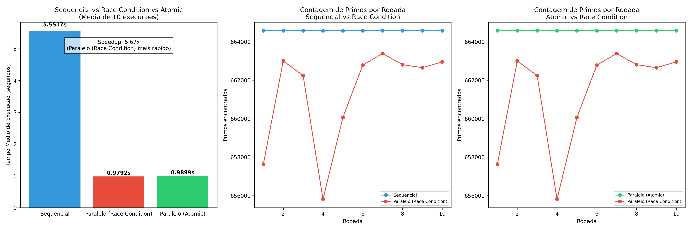

# Tarefa 5 — Race Condition e Sincronização com OpenMP

#### Vinicius Barbosa Ventura Mergulhão

**CPU:** 13th Gen Intel Core i5-13420H (4 P-cores + 8 E-cores = 12 threads lógicos)

---

## 1. Programas implementados

| Programa | Descrição | Sincronização |
|---|---|---|
| `primo_sequencial.c` | Conta primos de 2 a 10.000.000 com laço simples | Nenhuma — single-thread |
| `primos_parallel.c` | Mesmo laço com `#pragma omp parallel for` | **Nenhuma** — race condition intencional |
| `primos_parallel_atomic.c` | Mesmo laço com `#pragma omp parallel for` | `#pragma omp atomic` antes de `count++` |

Os três programas usam a mesma função `is_prime` e o mesmo valor `N = 10.000.000`. A contagem de primos corretos esperada é **664.579**.

---

## 2. O problema central: Race Condition

### O que é `count++` por baixo dos panos

A linha `count++` não é uma instrução atômica. O processador a executa em três passos:

```
1. LOAD  — lê o valor atual de count da memória para um registrador
2. ADD   — incrementa o registrador em 1
3. STORE — escreve o novo valor de volta na memória
```

Quando múltiplas threads executam esse ciclo ao mesmo tempo, a sequência pode se entrelaçar de forma errada:

```
Thread A: LOAD  count → lê 100
Thread B: LOAD  count → lê 100   (antes de A escrever de volta)
Thread A: STORE count ← 101
Thread B: STORE count ← 101      (sobrescreve A — o incremento de A é perdido)
```

O resultado final é `101` quando deveria ser `102`. Isso é uma **race condition** (condição de corrida): o resultado depende da ordem de execução das threads, que é não-determinística. A cada execução, um número diferente de incrementos pode ser perdido — por isso o total de primos varia entre rodadas.

---

## 3. Solução: `#pragma omp atomic`

A diretiva `atomic` instrui o compilador a gerar uma instrução de hardware que executa o ciclo load-add-store de forma indivisível — nenhuma outra thread pode interromper ou enxergar um estado intermediário:

```c
#pragma omp parallel for
for (int i = 2; i <= N; i++) {
    if (is_prime(i)) {
        #pragma omp atomic
        count++;   // garantido: load + add + store acontecem sem interrupção
    }
}
```

`atomic` funciona somente com operações simples sobre um único escalar (incremento, decremento, adição, etc.). Para blocos de código maiores existe o `#pragma omp critical`, que cria uma seção exclusiva — apenas uma thread por vez pode executá-la. O `atomic` é preferido quando aplicável pois tem custo menor.

> **Alternativa com `reduction`:** `#pragma omp parallel for reduction(+:count)` cria uma cópia privada de `count` por thread, cada uma acumula localmente e ao final o OpenMP soma tudo. Evita contenção no hardware e costuma ser mais rápido que `atomic` para acumulações em laços.

---

## 4. Resultados

| Versão | Tempo médio (s) | Speedup vs Seq | Contagem de primos |
|---|---|---|---|
| Sequencial | 5.5517 | 1.00x | 664.579 (sempre) |
| Paralelo — Race Condition | 0.9782 | **5.67x** | variável (657.000–664.000) |
| Paralelo — Atomic | 0.9899 | **5.61x** | 664.579 (sempre) |

---

## 5. Gráficos gerados



O gráfico é dividido em 3 painéis:

**Painel 1 — Tempo médio de execução (barras):**
Mostra os três programas lado a lado. O sequencial (azul) leva ~5.55s. Ambas as versões paralelas chegam próximo de 1s, com speedup de ~5.6–5.7x. A diferença de tempo entre Race Condition e Atomic é pequena (~11ms), mas o significado é totalmente diferente: apenas o Atomic produz resultado correto.

**Painel 2 — Contagem por rodada: Sequencial vs Race Condition:**
A linha azul (sequencial) é perfeitamente estável em 664.579. A linha vermelha (race condition) oscila de forma irregular — em algumas rodadas chega perto de 664.579, em outras cai para ~657.000 ou menos. Essa instabilidade é a assinatura visual de uma race condition: o resultado depende da ordem de execução das threads, que muda a cada run.

**Painel 3 — Contagem por rodada: Atomic vs Race Condition:**
A linha verde (atomic) é tão estável quanto o sequencial — sempre 664.579. A vermelha (race condition) continua oscilando. O contraste entre as duas linhas demonstra que a sincronização com `atomic` resolve completamente o problema de correção sem precisar serializar o código.

---

## 6. Análise

### 6.1 Por que a versão com race condition ainda é rápida?

A versão com race condition não paga nenhum custo de sincronização: cada thread lê e escreve `count` sem coordenação. Isso a torna ligeiramente mais rápida que a versão com `atomic` (~11ms de diferença), mas o resultado é incorreto. A velocidade sem correção não tem valor prático.

### 6.2 Por que o speedup não é 12x com 12 threads?

O i5-13420H tem 4 P-cores + 8 E-cores. Os E-cores (Efficient) são menores e mais lentos que os P-cores (Performance). O OpenMP divide o trabalho de forma igual (`schedule(static)`) entre todos os threads, mas os E-cores terminam depois dos P-cores. A barreira implícita no final do `parallel for` faz todos esperarem o mais lento — isso é **desbalanceamento de carga** causado pela heterogeneidade da CPU.

### 6.3 `atomic` vs `critical` vs `reduction`

| Mecanismo | Granularidade | Custo | Quando usar |
|---|---|---|---|
| `atomic` | Uma operação escalar | Baixo (instrução de hw) | `count++`, `sum += x`, etc. |
| `critical` | Bloco de código arbitrário | Médio (mutex) | Lógica complexa, estruturas de dados |
| `reduction` | Acumulação em laço | Muito baixo (sem contenção) | Somas, produtos, min/max em `parallel for` |

Para este problema, `reduction(+:count)` seria a solução mais eficiente. O `atomic` foi escolhido aqui por ser o mecanismo mais explícito para ilustrar o conceito de operação indivisível.

### 6.4 Memória compartilhada e o modelo de threads OpenMP

No modelo de memória compartilhada do OpenMP, todas as threads de uma região paralela enxergam o mesmo espaço de endereços. Variáveis declaradas antes do `parallel for` são **compartilhadas** por padrão — qualquer thread pode ler e escrever. Variáveis declaradas dentro do laço são **privadas** automaticamente.

`count` é declarada antes do laço → é compartilhada → precisa de sincronização se múltiplas threads a modificam.

---

## 7. Conclusão

| Aspecto | Sequencial | Paralelo (Race Condition) | Paralelo (Atomic) |
|---|---|---|---|
| Resultado | Correto | **Incorreto** (varia) | Correto |
| Tempo | ~5.55s | ~0.98s | ~0.99s |
| Speedup | 1.00x | 5.67x | 5.61x |
| Sincronização | — | Nenhuma | `atomic` |

A tarefa evidencia o principal desafio da programação paralela com memória compartilhada: **paralelizar um laço é simples; garantir correção não é**. A versão com race condition é ligeiramente mais rápida e parece funcionar, mas produz resultados errados de forma não-determinística — o pior tipo de bug, pois pode passar despercebido. A versão com `atomic` obtém o mesmo speedup (~5.6x) com resultado garantidamente correto.

> O custo de sincronização com `atomic` neste caso é desprezível (~11ms em 1s de execução) porque a região crítica é mínima (`count++`) e rara em proporção ao total de iterações (664.579 incrementos em 10.000.000 iterações).

---

<div style="page-break-before: always;"></div>

## Código

### primo_sequencial.c

```c
#include <stdio.h>
#include <stdlib.h>
#include <omp.h>

int is_prime(long int n) {
    if (n <= 1) return 0;
    for (int i = 2; i * i <= n; i++) {
        if (n % i == 0) return 0;
    }
    return 1;
}

#define N 10000000

int main() {
    double start_time = omp_get_wtime();

    int count = 0;
    for (int i = 2; i <= N; i++) {
        if (is_prime(i)) {
            count++;
        }
    }
    double end_time = omp_get_wtime();
    printf("Total de numeros primos entre 1 e %d: %d\n", N, count);
    printf("Tempo de execucao: %f segundos\n", end_time - start_time);
    return 0;
}
```

<div style="page-break-before: always;"></div>

### primos_parallel.c (Race Condition)

```c
#include <stdio.h>
#include <stdlib.h>
#include <omp.h>

int is_prime(long int n) {
    if (n <= 1) return 0;
    for (int i = 2; i * i <= n; i++) {
        if (n % i == 0) return 0;
    }
    return 1;
}

#define N 10000000

int main() {
    double start_time = omp_get_wtime();

    int count = 0;
    #pragma omp parallel for
    for (int i = 2; i <= N; i++) {
        if (is_prime(i)) {
            count++;   // race condition: sem sincronizacao
        }
    }
    double end_time = omp_get_wtime();
    printf("Total de numeros primos entre 1 e %d: %d\n", N, count);
    printf("Tempo de execucao: %f segundos\n", end_time - start_time);
    return 0;
}
```

<div style="page-break-before: always;"></div>

### primos_parallel_atomic.c

```c
#include <stdio.h>
#include <stdlib.h>
#include <omp.h>

int is_prime(long int n) {
    if (n <= 1) return 0;
    for (int i = 2; i * i <= n; i++) {
        if (n % i == 0) return 0;
    }
    return 1;
}

#define N 10000000

int main() {
    double start_time = omp_get_wtime();

    int count = 0;
    #pragma omp parallel for
    for (int i = 2; i <= N; i++) {
        if (is_prime(i)) {
            #pragma omp atomic
            count++;   // operacao atomica: load + add + store indivisivel
        }
    }
    double end_time = omp_get_wtime();
    printf("Total de numeros primos entre 1 e %d: %d\n", N, count);
    printf("Tempo de execucao: %f segundos\n", end_time - start_time);
    return 0;
}
```
