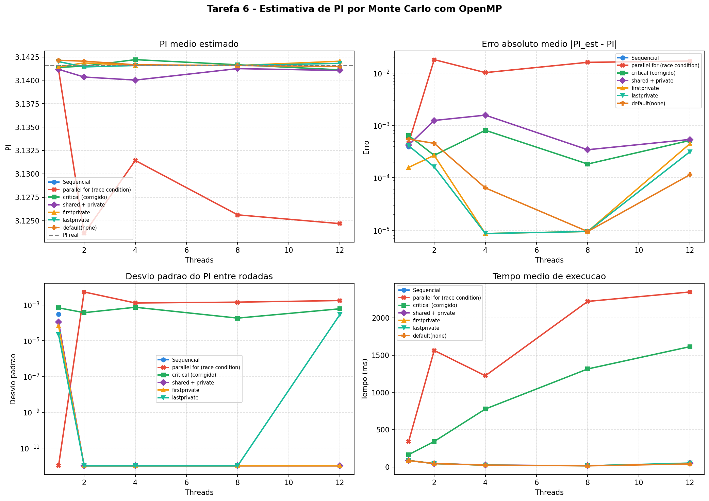

# Tarefa 6 — Calculo de PI Paralelo com OpenMP

#### Vinicius Barbosa Ventura Mergulhao

**CPU:** 13th Gen Intel Core i5-13420H (4 P-cores + 8 E-cores = 12 threads logicos)

---

## 1. Objetivo

Implementar a estimativa estocastica de PI pelo metodo de Monte Carlo, paralelizar com `#pragma omp parallel for`, identificar e explicar a condicao de corrida resultante, corrigi-la com `#pragma omp critical`, e testar as clausulas `private`, `firstprivate`, `lastprivate`, `shared` e `default(none)`.

---

## 2. Metodo de Monte Carlo para estimar PI

O metodo consiste em sortear `N` pontos aleatorios no quadrado unitario `[0,1] x [0,1]` e contar quantos caem dentro do circulo de raio 1 centrado na origem. A razao entre os pontos dentro do circulo e o total aproxima `PI/4`:

```
PI ≈ 4 * (pontos dentro do circulo) / (total de pontos)
```

A condicao para um ponto `(x, y)` estar dentro do circulo e `x² + y² <= 1`.

---

## 3. Programas implementados

| Arquivo | Descricao | Diretivas OpenMP |
|---|---|---|
| `pi_sequencial.c` | Versao sequencial de referencia | nenhuma |
| `pi_parallel_for.c` | Paralelizacao ingenua com race condition | `parallel for` |
| `pi_critical.c` | Correcao com regiao critica | `parallel`, `for`, `critical`, `single` |
| `pi_clauses.c` | 4 testes com clausulas de escopo | `parallel`, `for`, `critical`, `single`, `private`, `firstprivate`, `lastprivate`, `shared`, `default(none)` |

---

## 4. A condicao de corrida

### O problema

A versao `pi_parallel_for.c` usa `#pragma omp parallel for` sem nenhuma protecao:

```c
#pragma omp parallel for
for (int i = 0; i < N; i++) {
    x = (double)rand() / RAND_MAX;
    y = (double)rand() / RAND_MAX;
    if (x * x + y * y <= 1.0)
        count++;  /* RACE CONDITION */
}
```

Ha dois problemas simultaneos:

1. **Race condition em `count++`:** a variavel `count` e compartilhada entre todas as threads. Quando multiplas threads leem, incrementam e escrevem `count` ao mesmo tempo, atualizacoes sao perdidas (*lost updates*). Duas threads podem ler `count = 500`, ambas calculam `501`, e ambas escrevem `501` — um incremento se perde.

2. **`rand()` nao e thread-safe:** a funcao `rand()` usa estado global interno. Multiplas threads acessando esse estado geram numeros repetidos ou correlacionados, comprometendo a aleatoriedade da amostragem.

### Evidencia nos dados

| Threads | PI medio | Erro medio | Rodadas precisas (de 10) |
|---|---|---|---|
| 1 | 3.14113000 | 0.0004627 | 10/10 |
| 2 | 3.12362132 | 0.0179713 | 0/10 |
| 4 | 3.13142916 | 0.0101635 | 5/10 |
| 8 | 3.12561744 | 0.0159752 | 0/10 |
| 12 | 3.12467820 | 0.0169145 | 0/10 |

Com 1 thread nao ha concorrencia e o resultado e correto. A partir de 2 threads, o PI estimado cai significativamente — consistente com incrementos perdidos no `count++`. O desvio padrao tambem aumenta (0.0053 com 2 threads vs. 0.0 com 1), confirmando comportamento nao-deterministico.

---

## 5. Correcao com `critical`

A versao `pi_critical.c` resolve ambos os problemas reestruturando o codigo com `#pragma omp parallel` seguido de `#pragma omp for`:

```c
#pragma omp parallel
{
    unsigned int seed = time(NULL) ^ omp_get_thread_num();
    double x, y;

    #pragma omp for
    for (int i = 0; i < N; i++) {
        x = (double)rand_r(&seed) / RAND_MAX;
        y = (double)rand_r(&seed) / RAND_MAX;
        if (x * x + y * y <= 1.0) {
            #pragma omp critical
            {
                count++;
            }
        }
    }
}
```

- **`rand_r(&seed)`** com seed privada por thread substitui `rand()`, eliminando o problema de thread-safety.
- **`#pragma omp critical`** garante que apenas uma thread por vez executa `count++`, eliminando a race condition.

### Resultados

| Threads | PI medio | Erro medio | Rodadas precisas | Tempo medio (ms) |
|---|---|---|---|---|
| 1 | 3.14137976 | 0.0006419 | 10/10 | 164 |
| 2 | 3.14151680 | 0.0002684 | 10/10 | 341 |
| 4 | 3.14220904 | 0.0008070 | 10/10 | 777 |
| 8 | 3.14166264 | 0.0001831 | 10/10 | 1314 |
| 12 | 3.14111880 | 0.0005168 | 10/10 | 1614 |

Todas as 50 rodadas (10 por configuracao) produziram resultados precisos. Porem, o tempo **aumenta** com mais threads. Isso ocorre porque `#pragma omp critical` serializa o incremento: a cada iteracao onde o ponto cai dentro do circulo (~78.5% das vezes), as threads competem pelo mesmo mutex. Com mais threads, a contencao cresce e o overhead supera o beneficio do paralelismo.

---

## 6. Clausulas de escopo de variaveis

Para evitar o overhead do `critical` a cada iteracao, as versoes em `pi_clauses.c` usam acumuladores locais (`local_count`) e somam ao `count` compartilhado apenas uma vez ao final. A diferenca entre os testes esta nas clausulas que controlam o escopo das variaveis.

### 6.1 `shared` + `private`

```c
#pragma omp parallel default(none) shared(count, threads_used, N)
                     private(x, y, seed, local_count)
{
    seed = time(NULL) ^ omp_get_thread_num();
    local_count = 0;  /* Necessario! private nao inicializa */
    ...
}
```

- **`shared(count)`**: todas as threads compartilham a mesma variavel `count`. Requer protecao para escrita.
- **`private(local_count)`**: cada thread recebe uma copia propria, **nao inicializada**. O valor comeca com lixo de memoria — por isso e obrigatorio fazer `local_count = 0` manualmente.

| Threads | PI medio | Erro medio | Tempo medio (ms) |
|---|---|---|---|
| 1 | 3.14117264 | 0.0004200 | 86.1 |
| 2 | 3.14035080 | 0.0012419 | 45.1 |
| 4 | 3.14002400 | 0.0015687 | 25.6 |
| 8 | 3.14124920 | 0.0003435 | 15.7 |
| 12 | 3.14105320 | 0.0005395 | 46.8 |

### 6.2 `firstprivate`

```c
int local_count = 0;  /* valor copiado para cada thread */

#pragma omp parallel default(none) shared(count, threads_used, N)
                     firstprivate(local_count) private(x, y, seed)
{
    /* local_count ja vale 0 — nao precisa inicializar */
    ...
}
```

- **`firstprivate(local_count)`**: cada thread recebe uma copia **inicializada com o valor que a variavel tinha antes da regiao paralela**. Como `local_count = 0` antes do `parallel`, cada thread comeca automaticamente com 0.
- Diferenca pratica de `private`: elimina a necessidade de inicializacao manual, reduzindo risco de bugs.

| Threads | PI medio | Erro medio | Tempo medio (ms) |
|---|---|---|---|
| 1 | 3.14143480 | 0.0001579 | 86.5 |
| 2 | 3.14186080 | 0.0002681 | 44.6 |
| 4 | 3.14158400 | 0.0000087 | 23.6 |
| 8 | 3.14158320 | 0.0000095 | 16.5 |
| 12 | 3.14204160 | 0.0004489 | 43.1 |

### 6.3 `lastprivate`

```c
#pragma omp parallel default(none) shared(count, threads_used, N, last_i)
                     private(x, y, seed, local_count)
{
    ...
    #pragma omp for lastprivate(last_i)
    for (int i = 0; i < N; i++) {
        ...
        last_i = i;
    }
}
```

- **`lastprivate(last_i)`**: aplicada na diretiva `for` (nao no `parallel`). Durante o loop, cada thread tem sua copia privada de `last_i`. Ao final, a variavel assume o **valor da ultima iteracao na ordem sequencial** (`i = N-1`).
- Util quando o resultado final do loop precisa ser preservado, como se ele tivesse sido executado sequencialmente.
- Nota: `lastprivate` so e valido em diretivas de worksharing (`for`, `sections`), nao em `parallel`.

| Threads | PI medio | Erro medio | Tempo medio (ms) |
|---|---|---|---|
| 1 | 3.14200392 | 0.0004113 | 85.9 |
| 2 | 3.14143080 | 0.0001619 | 44.6 |
| 4 | 3.14158400 | 0.0000087 | 23.9 |
| 8 | 3.14158320 | 0.0000095 | 15.3 |
| 12 | 3.14181616 | 0.0003152 | 51.5 |

Em todas as rodadas, `last_i` recebeu corretamente o valor `9999999` (= N-1).

### 6.4 `default(none)`

```c
#pragma omp parallel default(none) \
    shared(count, threads_used, N) \
    firstprivate(local_count) \
    private(x, y, seed)
```

- **`default(none)`**: obriga o programador a declarar explicitamente o escopo de **toda** variavel usada na regiao paralela. Se alguma variavel for esquecida, o compilador emite erro.
- Sem `default(none)`, o padrao e `default(shared)` — todas as variaveis nao declaradas sao compartilhadas, o que pode causar race conditions silenciosas.

| Threads | PI medio | Erro medio | Tempo medio (ms) |
|---|---|---|---|
| 1 | 3.14213960 | 0.0005469 | 84.9 |
| 2 | 3.14204720 | 0.0004545 | 44.7 |
| 4 | 3.14165680 | 0.0000641 | 24.0 |
| 8 | 3.14158320 | 0.0000095 | 14.3 |
| 12 | 3.14147800 | 0.0001147 | 39.8 |

---

## 7. Comparacao de desempenho

### Versao sequencial vs. todas as versoes paralelas

| Versao | 1 thread (ms) | 8 threads (ms) | Speedup (8T) | Precisao |
|---|---|---|---|---|
| Sequencial | 86.1 | — | — | Correta |
| parallel for (bug) | 340.1 | 2220.7 | **0.04x** (pior) | **Incorreta** |
| critical | 164.1 | 1314.3 | **0.07x** (pior) | Correta |
| shared + private | 86.1 | 15.7 | **5.5x** | Correta |
| firstprivate | 86.5 | 16.5 | **5.2x** | Correta |
| lastprivate | 85.9 | 15.3 | **5.6x** | Correta |
| default(none) | 84.9 | 14.3 | **5.9x** | Correta |

As versoes com clausulas de escopo (acumulador local + critical apenas ao final) atingem speedup de ~5-6x com 8 threads. A versao com `critical` a cada iteracao e mais lenta que a sequencial — o overhead de contencao no mutex supera o ganho do paralelismo.

---

## 8. Graficos



**Painel 1 — PI medio estimado:**
A versao `parallel_for` (vermelho) desvia claramente do valor real de PI, ficando abaixo em todas as configuracoes com mais de 1 thread. Todas as versoes corrigidas permanecem proximas ao valor real (linha tracejada).

**Painel 2 — Erro absoluto medio:**
A escala logaritmica evidencia que o `parallel_for` tem erro ~100x maior que as versoes corrigidas. As versoes com clausulas de escopo atingem erros da ordem de 10⁻⁵, enquanto o `parallel_for` fica na ordem de 10⁻².

**Painel 3 — Desvio padrao entre rodadas:**
O `parallel_for` apresenta alta variacao entre execucoes (comportamento nao-deterministico da race condition). As versoes corrigidas com acumulador local apresentam desvio padrao zero ou proximo de zero em varias configuracoes — resultado da seed deterministica por thread.

**Painel 4 — Tempo medio de execucao:**
As versoes com clausulas escalam bem ate 8 threads (~15 ms) e sobem levemente com 12 threads (overhead de coordenacao). A versao `critical` e a `parallel_for` sao as mais lentas, ambas crescendo com o numero de threads devido a contencao.

---

## 9. Resumo das clausulas

| Clausula | Comportamento | Quando usar |
|---|---|---|
| `shared(var)` | Variavel compartilhada entre todas as threads | Variaveis que precisam ser lidas/escritas por todas (com protecao) |
| `private(var)` | Copia propria por thread, **nao inicializada** | Variaveis temporarias do loop (ex: `x`, `y`) |
| `firstprivate(var)` | Copia propria, **inicializada** com valor pre-paralelo | Quando a thread precisa de um valor inicial sem risco de lixo |
| `lastprivate(var)` | Copia propria; ao final, assume valor da ultima iteracao | Quando o resultado final do loop importa (apenas em `for`/`sections`) |
| `default(none)` | Obriga declaracao explicita de todas as variaveis | **Sempre** em programas complexos — previne bugs silenciosos |

---

## 10. Conclusao

| Aspecto | `parallel_for` (bug) | `critical` | Clausulas de escopo |
|---|---|---|---|
| Resultado | **Incorreto** | Correto | Correto |
| Causa do problema | Race condition em `count++` | — | — |
| Correcao | — | Mutex a cada iteracao | Acumulador local + mutex ao final |
| Desempenho (8T) | 2220 ms (pior que sequencial) | 1314 ms (pior que sequencial) | ~15 ms (**5.5x speedup**) |

A tarefa demonstra tres licoes fundamentais da programacao em memoria compartilhada:

1. **Race conditions sao silenciosas.** O programa com `parallel_for` compila sem warnings, executa sem crashes e produz um numero — que esta errado. Com 1 thread, o resultado e correto. O bug so se manifesta com paralelismo real.

2. **Corrigir nao basta; a estrategia importa.** Usar `critical` a cada iteracao elimina a race condition mas introduz contencao que torna o programa mais lento que a versao sequencial. A solucao eficiente e acumular localmente e sincronizar apenas ao final.

3. **`default(none)` e uma rede de seguranca.** Sem essa clausula, variaveis nao declaradas sao implicitamente `shared` — exatamente o cenario que causa a race condition. Com `default(none)`, o compilador obriga o programador a decidir explicitamente o escopo de cada variavel, transformando um bug de runtime em um erro de compilacao.

---

<div style="page-break-before: always;"></div>

## Codigo

### pi_sequencial.c

```c
#include <stdio.h>
#include <stdlib.h>
#include <time.h>
#include <math.h>

#ifndef M_PI
#define M_PI 3.14159265358979323846
#endif

int main(int argc, char *argv[]) {
    int N = 10000000;
    if (argc > 1) N = atoi(argv[1]);

    int count = 0;
    double x, y;
    unsigned int seed = time(NULL);

    struct timespec t0, t1;
    clock_gettime(CLOCK_MONOTONIC, &t0);

    for (int i = 0; i < N; i++) {
        x = (double)rand_r(&seed) / RAND_MAX;
        y = (double)rand_r(&seed) / RAND_MAX;
        if (x * x + y * y <= 1.0)
            count++;
    }

    clock_gettime(CLOCK_MONOTONIC, &t1);
    double elapsed = (t1.tv_sec - t0.tv_sec) + (t1.tv_nsec - t0.tv_nsec) / 1e9;
    double pi = 4.0 * count / N;
    double error = fabs(pi - M_PI);

    printf("CONFIG program=sequencial n=%d threads=1\n", N);
    printf("RESULT pi=%.10f count=%d total=%d error=%.10f elapsed=%.6f\n",
           pi, count, N, error, elapsed);

    return 0;
}
```

<div style="page-break-before: always;"></div>

### pi_parallel_for.c (versao com race condition)

```c
#include <stdio.h>
#include <stdlib.h>
#include <time.h>
#include <math.h>
#include <omp.h>

#ifndef M_PI
#define M_PI 3.14159265358979323846
#endif

int main(int argc, char *argv[]) {
    int N = 10000000;
    if (argc > 1) N = atoi(argv[1]);

    int count = 0;
    double x, y;
    int threads_used;

    double t0 = omp_get_wtime();

    /* CONDICAO DE CORRIDA: count compartilhado sem protecao, rand() nao thread-safe */
    #pragma omp parallel for
    for (int i = 0; i < N; i++) {
        x = (double)rand() / RAND_MAX;
        y = (double)rand() / RAND_MAX;
        if (x * x + y * y <= 1.0)
            count++;  /* RACE CONDITION */
    }

    double t1 = omp_get_wtime();
    double elapsed = t1 - t0;
    double pi = 4.0 * count / N;
    double error = fabs(pi - M_PI);

    #pragma omp parallel
    {
        #pragma omp single
        threads_used = omp_get_num_threads();
    }

    printf("CONFIG program=parallel_for n=%d threads=%d\n", N, threads_used);
    printf("RESULT pi=%.10f count=%d total=%d error=%.10f elapsed=%.6f\n",
           pi, count, N, error, elapsed);

    return 0;
}
```

<div style="page-break-before: always;"></div>

### pi_critical.c (correcao com critical)

```c
#include <stdio.h>
#include <stdlib.h>
#include <time.h>
#include <math.h>
#include <omp.h>

#ifndef M_PI
#define M_PI 3.14159265358979323846
#endif

int main(int argc, char *argv[]) {
    int N = 10000000;
    if (argc > 1) N = atoi(argv[1]);

    int count = 0;
    int threads_used;

    double t0 = omp_get_wtime();

    #pragma omp parallel
    {
        unsigned int seed = time(NULL) ^ omp_get_thread_num();
        double x, y;

        #pragma omp single
        threads_used = omp_get_num_threads();

        #pragma omp for
        for (int i = 0; i < N; i++) {
            x = (double)rand_r(&seed) / RAND_MAX;
            y = (double)rand_r(&seed) / RAND_MAX;
            if (x * x + y * y <= 1.0) {
                #pragma omp critical
                {
                    count++;
                }
            }
        }
    }

    double t1 = omp_get_wtime();
    double elapsed = t1 - t0;
    double pi = 4.0 * count / N;
    double error = fabs(pi - M_PI);

    printf("CONFIG program=critical n=%d threads=%d\n", N, threads_used);
    printf("RESULT pi=%.10f count=%d total=%d error=%.10f elapsed=%.6f\n",
           pi, count, N, error, elapsed);

    return 0;
}
```

<div style="page-break-before: always;"></div>

### pi_clauses.c (testes com clausulas de escopo)

```c
#include <stdio.h>
#include <stdlib.h>
#include <time.h>
#include <math.h>
#include <omp.h>

#ifndef M_PI
#define M_PI 3.14159265358979323846
#endif

/* TESTE 1: shared + private */
void teste_shared_private(int N) {
    int count = 0;
    double x, y;
    unsigned int seed;
    int local_count;
    int threads_used;

    double t0 = omp_get_wtime();

    #pragma omp parallel default(none) shared(count, threads_used, N) \
                         private(x, y, seed, local_count)
    {
        seed = time(NULL) ^ omp_get_thread_num();
        local_count = 0;  /* Necessario! private nao inicializa */

        #pragma omp single
        threads_used = omp_get_num_threads();

        #pragma omp for
        for (int i = 0; i < N; i++) {
            x = (double)rand_r(&seed) / RAND_MAX;
            y = (double)rand_r(&seed) / RAND_MAX;
            if (x * x + y * y <= 1.0)
                local_count++;
        }

        #pragma omp critical
        { count += local_count; }
    }

    double pi = 4.0 * count / N;
    printf("CONFIG program=shared_private n=%d threads=%d\n", N, threads_used);
    printf("RESULT pi=%.10f count=%d total=%d error=%.10f elapsed=%.6f\n",
           pi, count, N, fabs(pi - M_PI), omp_get_wtime() - t0);
}

/* TESTE 2: firstprivate */
void teste_firstprivate(int N) {
    int count = 0;
    int local_count = 0;  /* valor copiado via firstprivate */
    double x, y;
    unsigned int seed;
    int threads_used;

    double t0 = omp_get_wtime();

    #pragma omp parallel default(none) shared(count, threads_used, N) \
                         firstprivate(local_count) private(x, y, seed)
    {
        seed = time(NULL) ^ omp_get_thread_num();

        #pragma omp single
        threads_used = omp_get_num_threads();

        #pragma omp for
        for (int i = 0; i < N; i++) {
            x = (double)rand_r(&seed) / RAND_MAX;
            y = (double)rand_r(&seed) / RAND_MAX;
            if (x * x + y * y <= 1.0)
                local_count++;
        }

        #pragma omp critical
        { count += local_count; }
    }

    double pi = 4.0 * count / N;
    printf("CONFIG program=firstprivate n=%d threads=%d\n", N, threads_used);
    printf("RESULT pi=%.10f count=%d total=%d error=%.10f elapsed=%.6f\n",
           pi, count, N, fabs(pi - M_PI), omp_get_wtime() - t0);
}

/* TESTE 3: lastprivate */
void teste_lastprivate(int N) {
    int count = 0;
    int local_count;
    int last_i = -1;
    double x, y;
    unsigned int seed;
    int threads_used;

    double t0 = omp_get_wtime();

    #pragma omp parallel default(none) shared(count, threads_used, N, last_i) \
                         private(x, y, seed, local_count)
    {
        seed = time(NULL) ^ omp_get_thread_num();
        local_count = 0;

        #pragma omp single
        threads_used = omp_get_num_threads();

        #pragma omp for lastprivate(last_i)
        for (int i = 0; i < N; i++) {
            x = (double)rand_r(&seed) / RAND_MAX;
            y = (double)rand_r(&seed) / RAND_MAX;
            if (x * x + y * y <= 1.0)
                local_count++;
            last_i = i;
        }

        #pragma omp critical
        { count += local_count; }
    }

    double pi = 4.0 * count / N;
    printf("CONFIG program=lastprivate n=%d threads=%d\n", N, threads_used);
    printf("RESULT pi=%.10f count=%d total=%d error=%.10f elapsed=%.6f last_i=%d\n",
           pi, count, N, fabs(pi - M_PI), omp_get_wtime() - t0, last_i);
}

/* TESTE 4: default(none) */
void teste_default_none(int N) {
    int count = 0;
    int local_count = 0;
    double x, y;
    unsigned int seed;
    int threads_used;

    double t0 = omp_get_wtime();

    #pragma omp parallel default(none) \
        shared(count, threads_used, N) \
        firstprivate(local_count) \
        private(x, y, seed)
    {
        seed = time(NULL) ^ omp_get_thread_num();

        #pragma omp single
        threads_used = omp_get_num_threads();

        #pragma omp for
        for (int i = 0; i < N; i++) {
            x = (double)rand_r(&seed) / RAND_MAX;
            y = (double)rand_r(&seed) / RAND_MAX;
            if (x * x + y * y <= 1.0)
                local_count++;
        }

        #pragma omp critical
        { count += local_count; }
    }

    double pi = 4.0 * count / N;
    printf("CONFIG program=default_none n=%d threads=%d\n", N, threads_used);
    printf("RESULT pi=%.10f count=%d total=%d error=%.10f elapsed=%.6f\n",
           pi, count, N, fabs(pi - M_PI), omp_get_wtime() - t0);
}

int main(int argc, char *argv[]) {
    if (argc < 2) {
        fprintf(stderr, "Uso: %s <teste> [N]\n", argv[0]);
        fprintf(stderr, "  1=shared+private 2=firstprivate 3=lastprivate 4=default_none\n");
        return 1;
    }

    int teste = atoi(argv[1]);
    int N = 10000000;
    if (argc > 2) N = atoi(argv[2]);

    switch (teste) {
        case 1: teste_shared_private(N); break;
        case 2: teste_firstprivate(N); break;
        case 3: teste_lastprivate(N); break;
        case 4: teste_default_none(N); break;
        default:
            fprintf(stderr, "Teste invalido: %d (use 1-4)\n", teste);
            return 1;
    }
    return 0;
}
```
