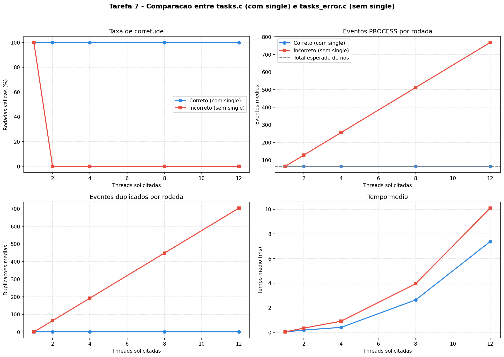

# Tarefa 7 — Processamento Paralelo de Lista Encadeada com OpenMP Tasks

#### Vinicius Barbosa Ventura Mergulhao

**CPU:** 13th Gen Intel Core i5-13420H (4 P-cores + 8 E-cores = 12 threads logicos)

---

## 1. Programas implementados

| Programa | Descricao | Diretivas OpenMP |
|---|---|---|
| `tasks.c` | Percorre uma lista encadeada e cria uma task por no | `parallel`, `single`, `task firstprivate`, `critical`, `taskwait` |
| `tasks_error.c` | Mesmo programa sem a diretiva `single` | `parallel`, `task`, `critical`, `taskwait` |

Ambos os programas criam uma lista encadeada com 64 nos, cada um contendo o nome de um arquivo ficticio (`file0.txt`, `file1.txt`, ...). Dentro de uma regiao paralela, a lista e percorrida e uma task e criada para processar cada no — imprimindo o indice, o nome do arquivo e a thread que executou.

---

## 2. O problema central: duplicacao de trabalho sem `single`

### Por que `single` e necessario

Quando o OpenMP entra em uma regiao `parallel`, **todas** as threads executam o codigo dentro dela. Sem a diretiva `single`, cada thread percorre a lista encadeada inteira e cria tasks para **todos** os nos. Com `N` threads, cada no recebe `N` tasks — o trabalho e multiplicado, nao dividido.

```
Sem single (2 threads, lista com 3 nos):

Thread 0: percorre lista → cria task(no0), task(no1), task(no2)
Thread 1: percorre lista → cria task(no0), task(no1), task(no2)

Total: 6 tasks para 3 nos → cada no processado 2 vezes
```

Com `single`, apenas **uma** thread percorre a lista e cria as tasks. As demais threads ficam disponiveis no pool para **executar** as tasks criadas:

```
Com single (2 threads, lista com 3 nos):

Thread 0 (single): percorre lista → cria task(no0), task(no1), task(no2)
Thread 1: executa tasks do pool

Total: 3 tasks para 3 nos → cada no processado exatamente 1 vez
```

### Diferenca no codigo

A unica diferenca entre os dois programas e a presenca de `#pragma omp single`:

```c
// tasks.c — CORRETO
#pragma omp parallel
{
    #pragma omp single          // <-- apenas 1 thread cria tasks
    {
        struct Node *atual = head;
        while (atual != NULL) {
            struct Node *node = atual;
            #pragma omp task firstprivate(node)
            {
                #pragma omp critical(output)
                printf("PROCESS node=%d file=%s thread=%d\n",
                       node->index, node->file, omp_get_thread_num());
            }
            atual = atual->proximo;
        }
        #pragma omp taskwait
    }
}
```

```c
// tasks_error.c — INCORRETO
#pragma omp parallel
{
    // sem single — TODAS as threads criam tasks
    {
        struct Node *atual = head;
        while (atual != NULL) {
            struct Node *node = atual;
            #pragma omp task              // sem firstprivate tambem
            {
                #pragma omp critical(output)
                printf("PROCESS node=%d file=%s thread=%d\n",
                       node->index, node->file, omp_get_thread_num());
            }
            atual = atual->proximo;
        }
        #pragma omp taskwait
    }
}
```

Alem da ausencia do `single`, `tasks_error.c` tambem omite `firstprivate(node)`. Sem `firstprivate`, a variavel `node` e compartilhada e pode ser sobrescrita por outra iteracao antes que a task a leia — mais uma fonte de erro.

---

## 3. Por que `critical` nao resolve o problema

A diretiva `critical(output)` serializa apenas o `printf` — garante que as linhas de saida nao se embaralhem no terminal. Ela **nao** impede que varias threads criem tasks duplicadas para o mesmo no.

| Diretiva | O que protege | O que NAO protege |
|---|---|---|
| `single` | Garante que apenas 1 thread percorre a lista e cria tasks | — |
| `critical` | Serializa o acesso ao `printf` (saida legivel) | Nao impede duplicacao de tasks |
| `taskwait` | Faz a thread esperar todas as tasks filhas terminarem | Nao impede duplicacao |

O erro de `tasks_error.c` nao e de sincronizacao de saida — e de **criacao duplicada de trabalho**.

---

## 4. Resultados

### Versao correta (`tasks.c`)

| Threads | Rodadas | Validas | Eventos medios | Duplicacoes medias | Ordens distintas | Tempo medio (ms) |
|---|---|---|---|---|---|---|
| 1 | 20 | 20 | 64.00 | 0.00 | 1 | 0.038 |
| 2 | 20 | 20 | 64.00 | 0.00 | 8 | 0.192 |
| 4 | 20 | 20 | 64.00 | 0.00 | 15 | 0.408 |
| 8 | 20 | 20 | 64.00 | 0.00 | 20 | 2.635 |
| 12 | 20 | 20 | 64.00 | 0.00 | 20 | 7.381 |

### Versao incorreta (`tasks_error.c`)

| Threads | Rodadas | Validas | Eventos medios | Duplicacoes medias | Ordens distintas | Tempo medio (ms) |
|---|---|---|---|---|---|---|
| 1 | 20 | 20 | 64.00 | 0.00 | 1 | 0.041 |
| 2 | 20 | 0 | 128.00 | 64.00 | 15 | 0.349 |
| 4 | 20 | 0 | 256.00 | 192.00 | 20 | 0.910 |
| 8 | 20 | 0 | 512.00 | 448.00 | 20 | 3.950 |
| 12 | 20 | 0 | 768.00 | 704.00 | 20 | 10.101 |

---

## 5. Graficos gerados



O grafico e dividido em 4 paineis:

**Painel 1 — Taxa de corretude:**
A versao correta (azul) mantem 100% de rodadas validas em todas as configuracoes de threads. A versao incorreta (vermelho) cai para 0% assim que mais de 1 thread e utilizada. Com 1 thread, ambas se comportam de forma identica — o problema so se manifesta com paralelismo real.

**Painel 2 — Eventos PROCESS por rodada:**
A versao correta produz exatamente 64 eventos (um por no) independente do numero de threads. A versao incorreta escala linearmente: 128 com 2 threads, 256 com 4, 512 com 8, 768 com 12 — confirmando que cada thread cria tasks para todos os 64 nos, resultando em `threads x 64` eventos.

**Painel 3 — Eventos duplicados por rodada:**
A versao correta tem zero duplicacoes. A versao incorreta apresenta `(threads - 1) x 64` duplicacoes, crescendo linearmente. Com 12 threads, 704 dos 768 eventos sao duplicados.

**Painel 4 — Tempo medio:**
Ambas as versoes ficam mais lentas com mais threads — o que e esperado para uma carga tao pequena (64 nos com operacao trivial). O overhead de criacao de threads e tasks domina o tempo. A versao incorreta e consistentemente mais lenta porque cria mais tasks para o mesmo trabalho.

---

## 6. Analise

### 6.1 O modelo de tasks do OpenMP

O modelo de tasks do OpenMP foi projetado para paralelismo irregular — estruturas que nao se encaixam em `parallel for`, como listas encadeadas, arvores e grafos. O padrao e:

1. Uma thread (`single`) percorre a estrutura e **cria** tasks.
2. As demais threads do pool **executam** as tasks criadas.
3. `taskwait` sincroniza — a execucao so continua quando todas as tasks terminam.

Esse modelo separa **quem descobre o trabalho** (a thread `single`) de **quem executa** (o pool). Sem `single`, essa separacao se perde e todas as threads tanto descobrem quanto criam trabalho duplicado.

### 6.2 Por que o tempo aumenta com mais threads?

Para 64 nos com operacao trivial (`printf`), o trabalho util e minimo. O custo dominante e:

- Criacao e destruicao do time de threads
- Criacao e escalonamento de tasks
- Contenção no `critical(output)` — todas as tasks competem pelo mesmo mutex para imprimir

Com mais threads, o overhead de coordenacao cresce mais rapido que o beneficio do paralelismo. Em aplicacoes reais, onde cada task tem trabalho substancial (processar um arquivo, calcular um subproblema), o speedup seria visivel.

### 6.3 A variacao de ordem entre execucoes

A coluna "Ordens distintas" mostra que, com mais de 1 thread, a ordem de processamento muda entre execucoes. Com 4 threads, 15 das 20 rodadas produziram ordens diferentes. Com 12 threads, todas as 20 rodadas tiveram ordens unicas.

Isso e esperado e **correto**: o escalonador do OpenMP distribui tasks entre threads de forma nao-deterministica. A corretude do programa nao depende da ordem — depende apenas de que cada no seja processado exatamente uma vez.

### 6.4 Conexao com o tema da disciplina

Conforme discutido no material da disciplina (slides 12-14), programas multitarefas trazem dificuldades adicionais de **sincronizacao**, **comunicacao** e **equilibrio de carga**. A Tarefa 7 ilustra especificamente o problema de sincronizacao:

- A Tarefa 5 mostrou race condition em uma operacao escalar (`count++`) — o problema era de **acesso concorrente a uma variavel**.
- A Tarefa 7 mostra um problema diferente: **duplicacao de trabalho** por falta de coordenacao sobre quem percorre a estrutura de dados.

Em ambos os casos, o programa incorreto parece funcionar (compila, executa, produz saida), mas o resultado e errado. A diferenca e sutil — uma unica diretiva (`atomic` na Tarefa 5, `single` na Tarefa 7) separa o programa correto do incorreto.

---

## 7. Conclusao

| Aspecto | `tasks.c` (com `single`) | `tasks_error.c` (sem `single`) |
|---|---|---|
| Resultado | Correto — 64 eventos, 0 duplicacoes | **Incorreto** — `N x 64` eventos |
| Validade | 100% das rodadas | 0% com mais de 1 thread |
| Ordem deterministica | Nao (esperado e correto) | Nao |
| Tempo (12 threads) | 7.38 ms | 10.10 ms |

A tarefa demonstra que o modelo de tasks do OpenMP exige disciplina na separacao entre **criacao** e **execucao** de tarefas. A diretiva `single` nao e opcional — e o mecanismo que garante que a travessia da estrutura de dados aconteca uma unica vez.

O erro de `tasks_error.c` e especialmente perigoso porque:

1. **Compila sem warnings** — o compilador nao detecta a ausencia do `single`.
2. **Funciona com 1 thread** — testes sequenciais nao revelam o bug.
3. **Escala o erro** — com mais threads, o problema piora proporcionalmente.

Esse padrao — codigo que parece correto em testes simples mas falha em producao com paralelismo real — e o principal desafio da programacao paralela com memoria compartilhada.

> A programacao paralela nao e apenas sobre dividir trabalho entre threads. E sobre garantir que cada unidade de trabalho seja executada **exatamente uma vez**, pela thread certa, no momento certo — e que o resultado final seja independente da ordem de execucao.

---

<div style="page-break-before: always;"></div>

## Codigo

### tasks.c (versao correta — com `single`)

```c
#include <omp.h>
#include <stdio.h>
#include <stdlib.h>
#include <string.h>

#define DEFAULT_TOTAL_NODES 11

struct Node {
    int index;
    char file[30];
    struct Node *proximo;
};

static struct Node *criar_no(int index) {
    struct Node *novo_no = (struct Node *)malloc(sizeof(struct Node));
    if (novo_no == NULL) {
        fprintf(stderr, "Erro: falha ao alocar o no %d\n", index);
        exit(1);
    }

    novo_no->index = index;
    snprintf(novo_no->file, sizeof(novo_no->file), "file%d.txt", index);
    novo_no->proximo = NULL;
    return novo_no;
}

static struct Node *criar_lista(int total_nos) {
    struct Node *head = criar_no(0);
    struct Node *tail = head;

    for (int i = 1; i < total_nos; i++) {
        struct Node *novo_no = criar_no(i);
        tail->proximo = novo_no;
        tail = tail->proximo;
    }

    return head;
}

static void liberar_lista(struct Node *head) {
    struct Node *atual = head;
    while (atual != NULL) {
        struct Node *temp = atual;
        atual = atual->proximo;
        free(temp);
    }
}

int main(int argc, char *argv[]) {
    int total_nos = DEFAULT_TOTAL_NODES;
    if (argc > 1) {
        total_nos = atoi(argv[1]);
        if (total_nos <= 0) {
            fprintf(stderr, "Uso: %s [total_nos > 0]\n", argv[0]);
            return 1;
        }
    }

    struct Node *head = criar_lista(total_nos);

    printf("CONFIG total_nodes=%d requested_threads=%d\n",
           total_nos, omp_get_max_threads());

    double start = omp_get_wtime();

    #pragma omp parallel
    {
        #pragma omp single
        {
            struct Node *atual = head;
            while (atual != NULL) {
                struct Node *node = atual;

                #pragma omp task firstprivate(node)
                {
                    #pragma omp critical(output)
                    printf("PROCESS node=%d file=%s thread=%d\n",
                           node->index, node->file, omp_get_thread_num());
                }

                atual = atual->proximo;
            }

            #pragma omp taskwait
        }
    }

    printf("SUMMARY total_nodes=%d elapsed_seconds=%.6f\n",
           total_nos, omp_get_wtime() - start);

    liberar_lista(head);
    return 0;
}
```

<div style="page-break-before: always;"></div>

### tasks_error.c (versao incorreta — sem `single`)

```c
#include <omp.h>
#include <stdio.h>
#include <stdlib.h>
#include <string.h>

#define DEFAULT_TOTAL_NODES 11

struct Node {
    int index;
    char file[30];
    struct Node *proximo;
};

static struct Node *criar_no(int index) {
    struct Node *novo_no = (struct Node *)malloc(sizeof(struct Node));
    if (novo_no == NULL) {
        fprintf(stderr, "Erro: falha ao alocar o no %d\n", index);
        exit(1);
    }

    novo_no->index = index;
    snprintf(novo_no->file, sizeof(novo_no->file), "file%d.txt", index);
    novo_no->proximo = NULL;
    return novo_no;
}

static struct Node *criar_lista(int total_nos) {
    struct Node *head = criar_no(0);
    struct Node *tail = head;

    for (int i = 1; i < total_nos; i++) {
        struct Node *novo_no = criar_no(i);
        tail->proximo = novo_no;
        tail = tail->proximo;
    }

    return head;
}

static void liberar_lista(struct Node *head) {
    struct Node *atual = head;
    while (atual != NULL) {
        struct Node *temp = atual;
        atual = atual->proximo;
        free(temp);
    }
}

int main(int argc, char *argv[]) {
    int total_nos = DEFAULT_TOTAL_NODES;
    if (argc > 1) {
        total_nos = atoi(argv[1]);
        if (total_nos <= 0) {
            fprintf(stderr, "Uso: %s [total_nos > 0]\n", argv[0]);
            return 1;
        }
    }

    struct Node *head = criar_lista(total_nos);

    printf("CONFIG total_nodes=%d requested_threads=%d\n",
           total_nos, omp_get_max_threads());

    double start = omp_get_wtime();

    #pragma omp parallel
    {
        {
            struct Node *atual = head;
            while (atual != NULL) {
                struct Node *node = atual;

                #pragma omp task
                {
                    #pragma omp critical(output)
                    printf("PROCESS node=%d file=%s thread=%d\n",
                           node->index, node->file, omp_get_thread_num());
                }

                atual = atual->proximo;
            }

            #pragma omp taskwait
        }
    }

    printf("SUMMARY total_nodes=%d elapsed_seconds=%.6f\n",
           total_nos, omp_get_wtime() - start);

    liberar_lista(head);
    return 0;
}
```
