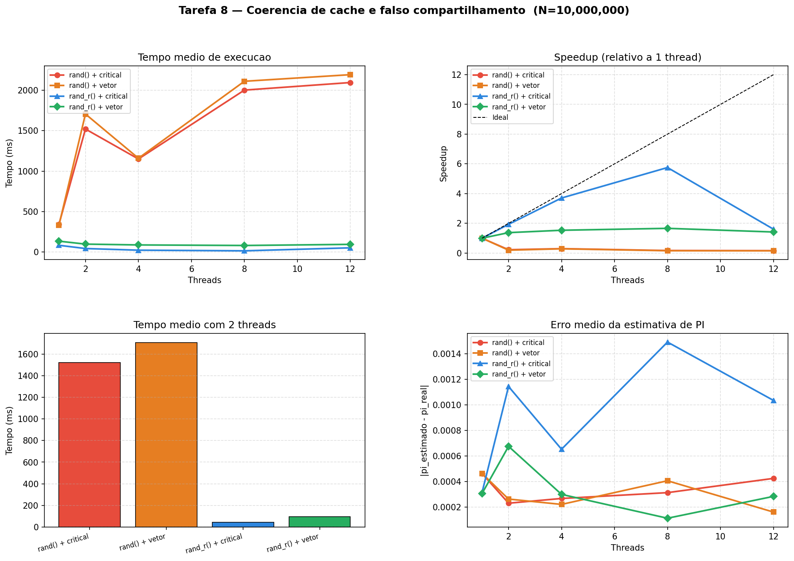

# Tarefa 8 — Coerência de Cache e Falso Compartilhamento

#### Vinicius Barbosa Ventura Mergulhao

**CPU:** 13th Gen Intel Core i5-13420H (4 P-cores + 8 E-cores = 12 threads logicos)

---

## 1. Programas implementados

| Programa | Gerador | Acumulacao | Caracteristica principal |
|---|---|---|---|
| `pi_rand_critical.c`  | `rand()`   | Variavel privada + `#pragma omp critical` | rand() usa mutex global interno |
| `pi_rand_vector.c`    | `rand()`   | `hits[tid]` + laco serial pos-paralelo   | rand() + false sharing no vetor |
| `pi_randr_critical.c` | `rand_r()` | Variavel privada + `#pragma omp critical` | RNG privado por thread, sem lock |
| `pi_randr_vector.c`   | `rand_r()` | `hits[tid]` + laco serial pos-paralelo   | False sharing isolado do RNG     |

Todos os programas estimam PI pelo metodo de Monte Carlo: geram N pontos aleatorios `(x, y)` no quadrado `[0,1]²` e contam quantos caem dentro do quarto de circulo unitario. A estimativa é `π ≈ 4 × acertos / N`. O experimento usou **N = 10.000.000** pontos por execucao, **10 rodadas** por configuracao de threads, nas configuracoes **1, 2, 4, 8 e 12 threads**.

---

## 2. O problema central: rand() nao é thread-safe

`rand()` mantem um estado global unico protegido por um mutex interno (em implementacoes POSIX). Cada chamada feita por qualquer thread precisa:

1. Adquirir o mutex do estado global
2. Gerar o numero
3. Liberar o mutex

Com N = 10.000.000 iteracoes e 2 chamadas `rand()` por iteracao, cada thread faz **20 milhoes de aquisicoes de mutex** durante toda a execucao. Com 2 ou mais threads disputando o mesmo lock, o resultado é serializacao quase total — as threads ficam mais tempo esperando o lock do que calculando.

`rand_r()` resolve isso recebendo a seed por referencia: cada thread usa sua propria seed, sem estado compartilhado e sem nenhum lock interno. A geracao de numeros passa a ser verdadeiramente paralela.

```c
// rand() — estado global, mutex interno, serializacao implicita
double x = (double)rand() / RAND_MAX;

// rand_r() — seed privada por thread, sem lock, paralelo de verdade
unsigned int seed = (unsigned int)(time(NULL)) ^ (unsigned int)(tid * 2654435761u);
double x = (double)rand_r(&seed) / RAND_MAX;
```

---

## 3. O problema secundario: falso compartilhamento (false sharing)

A versao com vetor acumula os acertos em `hits[tid]` — cada thread escreve apenas na sua propria posicao, sem corrida de dados. Mesmo assim, o desempenho é pior do que a versao com variavel privada.

O motivo é o **falso compartilhamento**: um cache line tipico tem 64 bytes. O vetor `hits` é declarado como `long hits[MAX_THREADS]` — cada `long` ocupa 8 bytes, entao **8 posicoes vizinhas compartilham o mesmo cache line**. Quando a thread 0 escreve em `hits[0]`, o protocolo de coerencia de cache (MESI/MOESI) invalida aquela linha de cache para todas as outras threads — mesmo que a thread 1 acesse apenas `hits[1]`, que nao foi modificado.

```
Cache line de 64 bytes:
[ hits[0] | hits[1] | hits[2] | hits[3] | hits[4] | hits[5] | hits[6] | hits[7] ]
     ^           ^
  Thread 0    Thread 1
  escreve    invalida a linha inteira ao ler, forcando recarga
```

Isso gera trafego constante de coerencia no barramento de cache sem nenhum beneficio logico.

A versao com variavel privada nao sofre esse problema: a variavel `local_count` vive na pilha (ou em um registrador) de cada thread. So existe um `critical` ao final — executado uma unica vez por thread — para somar ao total global.

---

## 4. Resultados

### 4.1 rand() + variavel privada + critical

| Threads | Rodadas | Media (ms) | Min (ms) | Max (ms) | Erro medio |
|---|---|---|---|---|---|
| 1  | 10 | 343.52  | 325.34  | 361.37  | 0.00046265 |
| 2  | 10 | 1520.98 | 973.89  | 1995.01 | 0.00023027 |
| 4  | 10 | 1150.57 | 1100.33 | 1171.52 | 0.00026722 |
| 8  | 10 | 2002.67 | 1947.44 | 2086.34 | 0.00031277 |
| 12 | 10 | 2096.25 | 2039.53 | 2154.41 | 0.00042427 |

### 4.2 rand() + vetor compartilhado (false sharing)

| Threads | Rodadas | Media (ms) | Min (ms) | Max (ms) | Erro medio |
|---|---|---|---|---|---|
| 1  | 10 | 332.18  | 317.99  | 347.64  | 0.00046265 |
| 2  | 10 | 1706.79 | 1465.52 | 1832.15 | 0.00026261 |
| 4  | 10 | 1159.72 | 1094.73 | 1219.21 | 0.00022080 |
| 8  | 10 | 2111.89 | 2050.50 | 2202.88 | 0.00040571 |
| 12 | 10 | 2193.56 | 2059.44 | 2281.80 | 0.00016098 |

### 4.3 rand_r() + variavel privada + critical

| Threads | Rodadas | Media (ms) | Min (ms) | Max (ms) | Erro medio |
|---|---|---|---|---|---|
| 1  | 10 | 82.86  | 81.27  | 84.87  | 0.00031475 |
| 2  | 10 | 42.87  | 40.84  | 44.74  | 0.00114265 |
| 4  | 10 | 22.37  | 21.45  | 24.12  | 0.00065220 |
| 8  | 10 | 14.40  | 13.24  | 15.45  | 0.00149015 |
| 12 | 10 | 51.51  | 33.60  | 66.47  | 0.00103415 |

### 4.4 rand_r() + vetor compartilhado (false sharing)

| Threads | Rodadas | Media (ms) | Min (ms) | Max (ms) | Erro medio |
|---|---|---|---|---|---|
| 1  | 10 | 134.00 | 128.20  | 142.73  | 0.00030617 |
| 2  | 10 | 97.43  | 79.70   | 120.12  | 0.00067487 |
| 4  | 10 | 87.30  | 49.64   | 121.34  | 0.00029919 |
| 8  | 10 | 80.53  | 56.48   | 99.22   | 0.00011269 |
| 12 | 10 | 94.48  | 60.55   | 121.02  | 0.00028345 |

---

<div style="page-break-before: always;"></div>


## 5. Graficos gerados



O grafico é dividido em 4 paineis:

**Painel 1 — Tempo medio de execucao:**
As versoes com `rand()` ficam 4 a 6 vezes mais lentas ao adicionar threads — curvas que sobem ao inves de descer. As versoes com `rand_r()` mostram o comportamento esperado: tempo caindo com mais threads. `randr_critical` é a curva mais baixa em quase todos os pontos.

**Painel 2 — Speedup relativo a 1 thread:**
`randr_critical` atinge speedup ~5.75x com 8 threads (proximo do ideal de 8x). `randr_vector` melhora mas fica muito aquem do ideal — o false sharing limita o ganho. As versoes `rand` tem speedup negativo: ficam mais lentas que a execucao serial.

**Painel 3 — Comparacao em barras com 2 threads:**
A diferenca visual é dramatica: `randr_critical` demora ~43ms enquanto `rand_critical` demora ~1521ms — uma diferenca de **35x** para o mesmo calculo com o mesmo numero de threads.

**Painel 4 — Erro medio da estimativa:**
Todas as versoes produzem estimativas igualmente precisas (~0.0003 a 0.0015 de erro absoluto sobre π). O metodo de Monte Carlo com N = 10M tem precisao estatistica equivalente independente da estrategia de paralelizacao — o que confirma que nenhum programa tem race condition ou resultado incorreto.

---

## 6. Analise

### 6.1 rand() transforma paralelismo em serializacao

Com 1 thread, `rand_critical` demora 343ms. Com 2 threads, sobe para **1521ms** — **4.43 vezes mais lento**. Isso nao é intuicao contraria ao esperado: é a consequencia direta do mutex global de `rand()`.

Com 2 threads cada fazendo 20 milhoes de chamadas a `rand()`, as threads ficam quase o tempo todo esperando o lock que a outra segura. O paralelismo real é praticamente zero — o programa é sequencial com overhead adicional de gerenciamento de threads.

A alta variancia nos resultados com 2 threads (min 974ms, max 1995ms) confirma o comportamento: dependendo do escalonamento do SO, as threads as vezes conseguem se alternar de forma menos conflituosa, mas o resultado é sempre muito pior que a versao serial.

### 6.2 rand_r() permite paralelismo real — e revela o custo do false sharing

Sem o mutex do `rand()`, `randr_critical` escala quase linearmente:

| Threads | Speedup (randr_critical) | Speedup (randr_vector) |
|---|---|---|
| 1  | 1.00x (base) | 0.62x (mais lento que randr_critical!) |
| 2  | 1.93x        | 0.85x |
| 4  | 3.70x        | 0.95x |
| 8  | 5.75x        | 1.03x |
| 12 | 1.61x        | 0.87x |

O false sharing é visivel mesmo com 1 thread: `randr_vector` (134ms) é 62% mais lento que `randr_critical` (83ms) com a mesma carga e o mesmo gerador. A diferenca é que `local_count` é uma variavel local que o compilador aloca em registrador, enquanto `hits[tid]` é um acesso a memoria (array na pilha, mas ainda assim acesso a L1/L2 cache). Com multiplas threads, o custo do false sharing cresce: com 4 threads, `randr_vector` demora **3.9x mais** que `randr_critical`.

### 6.3 A regressao em 12 threads

O `randr_critical` sobe de 14ms (8 threads) para 51ms (12 threads). A CPU i5-13420H tem arquitetura hibrida: 4 P-cores (desempenho) + 8 E-cores (eficiencia). Os E-cores sao significativamente mais lentos que os P-cores. Com 12 threads, o OpenMP precisa usar os E-cores, que tem frequencia e throughput menores — e o trabalho da thread mais lenta determina o tempo total (barreira implicita no `#pragma omp for`).

`randr_vector` nao sofre tanto porque ja era limitado pelo false sharing, que nivela as threads num patamar mais alto de latencia independente do tipo de core.

### 6.4 Comparacao com as tarefas anteriores

| Tarefa | Problema | Causa | Solucao |
|---|---|---|---|
| Tarefa 5 | Race condition em `count++` | Leitura-modificacao-escrita nao atomica | `atomic`, `critical`, reducao |
| Tarefa 7 | Duplicacao de trabalho | Todas as threads criam tasks | `single` isola o criador de tasks |
| Tarefa 8 | Serializacao + false sharing | Mutex de `rand()` e invalidacao de cache line | `rand_r()` + variavel privada |

As tres tarefas ilustram que o problema mais comum em programacao paralela nao é o algoritmo errado — é o **estado compartilhado nao intencional**: uma variavel global em `count++`, a falta de `single` que deixa todas as threads criar tasks, ou o estado global do gerador de numeros aleatorios em `rand()`.

---

## 7. Conclusao

| Versao | Tempo 1 thread | Tempo 8 threads | Speedup 8T | Gargalo |
|---|---|---|---|---|
| rand_critical  | 343.5ms | 2002.7ms | **0.17x** | Mutex global de `rand()` |
| rand_vector    | 332.2ms | 2111.9ms | **0.16x** | Mutex de `rand()` + false sharing |
| randr_critical | 82.9ms  | **14.4ms**   | **5.75x**  | Nenhum relevante ate 8 threads |
| randr_vector   | 134.0ms | 80.5ms   | 1.66x  | False sharing no vetor `hits[]` |

A comparacao dos quatro programas demonstra dois principios fundamentais de programacao paralela com memoria compartilhada:

1. **Todo estado compartilhado é um gargalo em potencial.** `rand()` parece inofensivo — é uma funcao da biblioteca padrao. Mas seu estado global a transforma em um ponto de serializacao que anula completamente o beneficio do paralelismo. A solucao `rand_r()` é direta: eliminar o compartilhamento passando a seed como parametro.

2. **Compartilhamento falso e tao danoso quanto compartilhamento real.** O vetor `hits[tid]` esta logicamente correto — cada thread acessa apenas a sua posicao. Mas o hardware nao opera no nivel de variaveis: opera no nivel de cache lines. Posicoes vizinhas no mesmo cache line causam invalidacoes constantes, degradando o desempenho mesmo sem nenhuma corrida de dados. A solucao é usar variaveis locais (na pilha ou em registradores) e um `critical` no final — pagando o custo de sincronizacao apenas uma vez por thread.

> `randr_critical` reune os dois principios: elimina o estado compartilhado do RNG com `rand_r()` e elimina o false sharing com `local_count`. O resultado é speedup proximo do teorico ate 8 threads em hardware real.

---

<div style="page-break-before: always;"></div>

## Codigo

### pi_rand_critical.c

```c
#include <math.h>
#include <omp.h>
#include <stdio.h>
#include <stdlib.h>

#ifndef M_PI
#define M_PI 3.14159265358979323846
#endif

int main(int argc, char *argv[]) {
    long N = 10000000L;
    if (argc > 1) N = atol(argv[1]);
    long count = 0;
    int threads_used = 0;
    double t0 = omp_get_wtime();

    #pragma omp parallel
    {
        long local_count = 0;
        #pragma omp single
        threads_used = omp_get_num_threads();
        #pragma omp for schedule(static)
        for (long i = 0; i < N; i++) {
            double x = (double)rand() / RAND_MAX;
            double y = (double)rand() / RAND_MAX;
            if (x * x + y * y <= 1.0)
                local_count++;
        }
        #pragma omp critical
        count += local_count;
    }
    double elapsed = omp_get_wtime() - t0;
    double pi      = 4.0 * (double)count / (double)N;
    double error   = fabs(pi - M_PI);

    printf("CONFIG program=rand_critical n=%ld threads=%d\n", N, threads_used);
    printf("RESULT pi=%.10f count=%ld total=%ld error=%.10f elapsed=%.6f\n",
           pi, count, N, error, elapsed);
    return 0;
}
```

<div style="page-break-before: always;"></div>

### pi_rand_vector.c

```c
#include <math.h>
#include <omp.h>
#include <stdio.h>
#include <stdlib.h>
#include <string.h>

#ifndef M_PI
#define M_PI 3.14159265358979323846
#endif

#define MAX_THREADS 256
int main(int argc, char *argv[]) {
    long N = 10000000L;
    if (argc > 1) N = atol(argv[1]);
    /* vetor compartilhado — posicoes adjacentes no mesmo cache line */
    long hits[MAX_THREADS];
    memset(hits, 0, sizeof(hits));
    int threads_used = 0;
    double t0 = omp_get_wtime();
    
    #pragma omp parallel
    {
        int tid = omp_get_thread_num();
        #pragma omp single
        threads_used = omp_get_num_threads();
        #pragma omp for schedule(static)
        for (long i = 0; i < N; i++) {
            double x = (double)rand() / RAND_MAX;
            double y = (double)rand() / RAND_MAX;
            if (x * x + y * y <= 1.0)
                hits[tid]++;  
        }
    }
    /* acumulacao serial apos a regiao paralela */
    long count = 0;
    for (int t = 0; t < threads_used; t++)
        count += hits[t];
    double elapsed = omp_get_wtime() - t0;
    double pi      = 4.0 * (double)count / (double)N;
    double error   = fabs(pi - M_PI);

    printf("CONFIG program=rand_vector n=%ld threads=%d\n", N, threads_used);
    printf("RESULT pi=%.10f count=%ld total=%ld error=%.10f elapsed=%.6f\n",
           pi, count, N, error, elapsed);
    return 0;
}
```

<div style="page-break-before: always;"></div>

### pi_randr_critical.c

```c
#include <math.h>
#include <omp.h>
#include <stdio.h>
#include <stdlib.h>
#include <string.h>

#ifndef M_PI
#define M_PI 3.14159265358979323846
#endif

#define MAX_THREADS 256

int main(int argc, char *argv[]) {
    long N = 10000000L;
    if (argc > 1) N = atol(argv[1]);
    /* vetor compartilhado — posicoes adjacentes no mesmo cache line */
    long hits[MAX_THREADS];
    memset(hits, 0, sizeof(hits));
    int threads_used = 0;
    double t0 = omp_get_wtime();
    #pragma omp parallel
    {
        int tid = omp_get_thread_num();
        #pragma omp single
        threads_used = omp_get_num_threads();
        #pragma omp for schedule(static)
        for (long i = 0; i < N; i++) {
            double x = (double)rand() / RAND_MAX;
            double y = (double)rand() / RAND_MAX;
            if (x * x + y * y <= 1.0)
                hits[tid]++;   /* false sharing: mesmo cache line que hits[tid±1] */
        }
    }
    /* acumulacao serial apos a regiao paralela */
    long count = 0;
    for (int t = 0; t < threads_used; t++)
        count += hits[t];
    double elapsed = omp_get_wtime() - t0;
    double pi      = 4.0 * (double)count / (double)N;
    double error   = fabs(pi - M_PI);
    printf("CONFIG program=rand_vector n=%ld threads=%d\n", N, threads_used);
    printf("RESULT pi=%.10f count=%ld total=%ld error=%.10f elapsed=%.6f\n",
           pi, count, N, error, elapsed);
    return 0;
}
```

<div style="page-break-before: always;"></div>


### pi_randr_vector.c

```c
#include <math.h>
#include <omp.h>
#include <stdio.h>
#include <stdlib.h>
#include <string.h>
#include <time.h>

#ifndef M_PI
#define M_PI 3.14159265358979323846
#endif
#define MAX_THREADS 256

int main(int argc, char *argv[]) {
    long N = 10000000L;
    if (argc > 1) N = atol(argv[1]);
    /* vetor compartilhado — false sharing entre posicoes adjacentes */
    long hits[MAX_THREADS];
    memset(hits, 0, sizeof(hits));
    int threads_used = 0;
    double t0 = omp_get_wtime();
    #pragma omp parallel
    {
        int tid = omp_get_thread_num();
        unsigned int seed = (unsigned int)(time(NULL)) ^ (unsigned int)(tid * 2654435761u); // seed privada por thread 
        #pragma omp single
        threads_used = omp_get_num_threads();
        #pragma omp for schedule(static)
        for (long i = 0; i < N; i++) {
            double x = (double)rand_r(&seed) / RAND_MAX;
            double y = (double)rand_r(&seed) / RAND_MAX;
            if (x * x + y * y <= 1.0)
                hits[tid]++;   /* false sharing: invalida o cache line vizinho */
        }
    }
    /* acumulacao serial apos a regiao paralela */
    long count = 0;
    for (int t = 0; t < threads_used; t++)
        count += hits[t];
    double elapsed = omp_get_wtime() - t0;
    double pi      = 4.0 * (double)count / (double)N;
    double error   = fabs(pi - M_PI);
    printf("CONFIG program=randr_vector n=%ld threads=%d\n", N, threads_used);
    printf("RESULT pi=%.10f count=%ld total=%ld error=%.10f elapsed=%.6f\n", pi, count, N, error, elapsed);
    return 0;
}
```
