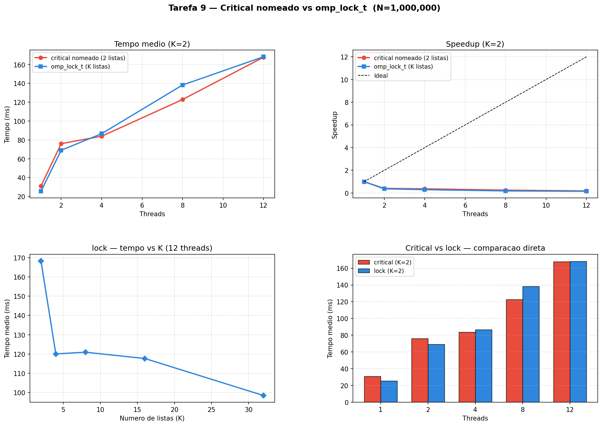

# Tarefa 9 — Regiões Críticas Nomeadas e Travas Explícitas

#### Vinicius Barbosa Ventura Mergulhao

**CPU:** 13th Gen Intel Core i5-13420H (4 P-cores + 8 E-cores = 12 threads logicos)

---

## 1. Programas implementados

| Programa | Mecanismo de protecao | Listas | Diretivas / Funcoes OpenMP |
|---|---|---|---|
| `lists_critical.c` | `#pragma omp critical(nome)` | 2 (fixas em tempo de compilacao) | `parallel`, `for`, `critical(lista_a)`, `critical(lista_b)` |
| `lists_lock.c`     | `omp_lock_t locks[K]`        | K (definido pelo usuario)        | `parallel`, `for`, `omp_init_lock`, `omp_set_lock`, `omp_unset_lock`, `omp_destroy_lock` |

Ambos os programas realizam **N = 1.000.000** insercoes em listas encadeadas. Cada thread escolhe aleatoriamente em qual lista inserir usando `rand_r()` com seed privada por thread (eliminando o mutex interno de `rand()`). O experimento executou **10 rodadas** por configuracao, threads testadas: **1, 2, 4, 8 e 12**.

---

## 2. O problema central: granularidade de protecao

### O que critical nomeado resolve

A Tarefa 5 mostrou que um `critical` anonimo protege uma unica regiao e serializa **todas** as threads que a acessam. Em um programa com 2 listas distintas, usar um unico `critical` anonimo bloquearia threads que querem listas diferentes — mesmo sem necessidade.

A solucao com `critical` nomeado e associar um nome diferente a cada lista:

```c
if (choice == 0) {
    #pragma omp critical(lista_a)   /* bloqueia so quem quer lista_a */
    list_insert(&lista_a, value);
} else {
    #pragma omp critical(lista_b)   /* bloqueia so quem quer lista_b */
    list_insert(&lista_b, value);
}
```

Threads inserindo em listas diferentes nao se bloqueiam mutuamente. O paralelismo entre as duas listas é preservado.

### Por que critical nomeado nao e suficiente para K listas

Os nomes de `critical` sao **identificadores estaticos resolvidos em tempo de compilacao** — fazem parte da sintaxe da diretiva, nao sao valores. E impossivel escrever:

```c
int k = rand_r(&seed) % K;
#pragma omp critical(lista_k)   /* INVALIDO — 'k' nao e um literal */
list_insert(&lists[k], value);
```

Para K=4 seria necessario escrever 4 blocos `if/else` distintos no codigo-fonte. Para K definido em tempo de execucao, nao existe solucao com `critical` nomeado.

### Solucao: omp_lock_t — travas explicitas

`omp_lock_t` e uma trava criada e gerenciada em tempo de execucao:

```c
omp_lock_t locks[K];
for (int k = 0; k < K; k++) omp_init_lock(&locks[k]);

/* em paralelo: */
int k = rand_r(&seed) % K;
omp_set_lock(&locks[k]);       /* adquire o lock da lista k */
list_insert(&lists[k], value);
omp_unset_lock(&locks[k]);     /* libera o lock da lista k */

/* ao final: */
for (int k = 0; k < K; k++) omp_destroy_lock(&locks[k]);
```

O comportamento e identico ao `critical` nomeado para K=2 — mas funciona para qualquer K passado em tempo de execucao.

---

## 3. Corretude

Em todas as rodadas de todos os experimentos, a validacao confirmou:

- `total_inserido == 1.000.000` em 100% das execucoes (nenhuma insercao perdida)
- `soma(contagens_por_lista) == total_inserido` (sem duplicacoes)
- Nenhum deadlock, crash ou comportamento indefinido

A distribuicao entre listas e aproximadamente uniforme (esperado com `rand_r`). Com 1 thread, os resultados sao deterministicos (mesma seed sempre); com mais threads, a distribuicao varia entre rodadas por conta do escalonamento nao-deterministico.

| Threads | Exemplo de distribuicao com K=2 |
|---|---|
| 1  | 500.056 / 499.944 (identico em todas as 10 rodadas) |
| 2  | ~500.140 / ~499.860 (varia entre rodadas) |
| 12 | ~500.190 / ~499.810 (varia entre rodadas) |

---

## 4. Resultados — Experimento A: critical vs lock (K=2, threads variando)

### 4.1 critical nomeado (2 listas fixas)

| Threads | Rodadas | Media (ms) | Min (ms) | Max (ms) | Validas |
|---|---|---|---|---|---|
| 1  | 10 | 30.98  | 28.88  | 37.36  | sim |
| 2  | 10 | 76.09  | 62.41  | 103.15 | sim |
| 4  | 10 | 83.93  | 76.29  | 95.90  | sim |
| 8  | 10 | 122.88 | 106.42 | 135.90 | sim |
| 12 | 10 | 167.72 | 143.49 | 233.75 | sim |

### 4.2 omp_lock_t (K=2 listas)

| Threads | Rodadas | Media (ms) | Min (ms) | Max (ms) | Validas |
|---|---|---|---|---|---|
| 1  | 10 | 25.49  | 24.03  | 29.95  | sim |
| 2  | 10 | 69.04  | 64.35  | 74.20  | sim |
| 4  | 10 | 86.64  | 79.49  | 94.55  | sim |
| 8  | 10 | 138.27 | 110.01 | 193.36 | sim |
| 12 | 10 | 168.26 | 153.49 | 185.63 | sim |

---

## 4.3 Resultados — Experimento B: lock com K variando (12 threads)

| K (listas) | Threads | Rodadas | Media (ms) | Min (ms) | Max (ms) | Validas |
|---|---|---|---|---|---|---|
| 2  | 12 | 10 | 168.26 | 153.49 | 185.63 | sim |
| 4  | 12 | 10 | 120.04 | 100.40 | 152.47 | sim |
| 8  | 12 | 10 | 120.92 | 88.96  | 151.03 | sim |
| 16 | 12 | 10 | 117.65 | 87.68  | 140.48 | sim |
| 32 | 12 | 10 | 98.45  | 61.09  | 111.29 | sim |

<div style="page-break-before: always;"></div>

---

## 5. Graficos gerados



O grafico é dividido em 4 paineis:

**Painel 1 — Tempo medio (K=2):**
Ambas as versoes ficam mais lentas conforme o numero de threads aumenta. Com K=2 e 12 threads, as curvas sobem continuamente — o oposto do speedup esperado. Isso confirma que com apenas 2 listas e 12 threads, a contenção domina o tempo de execucao.

**Painel 2 — Speedup (K=2):**
Nenhuma versao atinge speedup positivo com K=2. Com 12 threads, o "speedup" é 0.18x para critical e 0.15x para lock — ou seja, **5 a 6 vezes mais lentos** que a versao serial. O paralelismo entre 2 listas simplesmente nao é suficiente para 12 threads.

**Painel 3 — lock: tempo vs K (12 threads):**
A curva desce claramente ao aumentar K: 168ms (K=2) para 98ms (K=32). Mais listas = menor probabilidade de colisao = menos tempo esperando lock.

**Painel 4 — Comparacao em barras:**
Critical e lock sao quase identicos para K=2 em todas as configuracoes de threads. A diferenca é estatisticamente irrelevante — ambos fornecem a mesma granularidade de protecao.

---

## 6. Analise

### 6.1 Por que ambos ficam mais lentos com mais threads?

Com K=2 listas e T threads, a probabilidade de duas threads quererem a **mesma** lista simultaneamente é `1 - (1/2)^T` — cresce rapidamente com T. Com 12 threads, quase sempre há contenção.

```
K=2, 12 threads: a cada momento, ~6 threads querem lista_a e ~6 querem lista_b.
Apenas 1 pode estar inserindo em cada lista → as outras 10 estao esperando.
Paralelismo efetivo: 2 threads de 12.
```

O overhead de criar e sincronizar 12 threads para executar trabalho com capacidade de 2 threads em paralelo resulta em desempenho pior que 1 thread.

Agrava o problema: a funcao `malloc` dentro de `list_insert` tem seu proprio lock interno na implementacao de `libc`. Com multiplas threads chamando `malloc` ao mesmo tempo, há uma segunda fonte de contenção além do lock da lista.

### 6.2 Por que mais listas melhoram o desempenho?

Com K listas e T threads, a probabilidade de duas threads colidirem na mesma lista é `1/K`. Com K=32 e 12 threads, a probabilidade média de colisao em qualquer lista é ~0.36 — muito menor que K=2 (0.5 por lista).

| K | Probabilidade de colisao por lista | Media (ms) | Ganho vs K=2 |
|---|---|---|---|
| 2  | ~50% | 168.3ms | — |
| 4  | ~25% | 120.0ms | 28.7% |
| 8  | ~12% | 120.9ms | 28.2% |
| 16 | ~6%  | 117.7ms | 30.1% |
| 32 | ~3%  | 98.4ms  | 41.5% |

O ganho de K=4 para K=8 é marginal (120.0ms vs 120.9ms), provavelmente porque o gargalo passou a ser o `malloc` interno, nao o lock da lista. O salto de K=16 para K=32 é maior porque com 32 listas, o numero medio de elementos por lista fica pequeno (~31.000), reduzindo tambem o tempo de cada insercao.

### 6.3 Critical nomeado vs omp_lock_t — desempenho comparado

Com K=2, as duas versoes sao semanticamente identicas e o desempenho é quase igual:

| Threads | critical (ms) | lock (ms) | Diferenca |
|---|---|---|---|
| 1  | 30.98 | 25.49 | lock 17.7% mais rapido |
| 2  | 76.09 | 69.04 | lock 9.3% mais rapido |
| 4  | 83.93 | 86.64 | critical 3.2% mais rapido |
| 8  | 122.88 | 138.27 | critical 11.1% mais rapido |
| 12 | 167.72 | 168.26 | identicos |

As diferencas sao pequenas e sem padrao consistente — variacao normal entre execucoes. A conclusao é que `critical` nomeado e `omp_lock_t` tem desempenho equivalente para a mesma granularidade de protecao. A escolha entre eles é de **flexibilidade**, nao de velocidade.

### 6.4 Comparacao com as tarefas anteriores

A evolucao ao longo das tarefas mostra uma progressao clara de granularidade de protecao:

| Tarefa | Mecanismo | Recursos protegidos | Paralelismo possivel |
|---|---|---|---|
| Tarefa 5 | `critical` anonimo | 1 contador global | 0 (serial) |
| Tarefa 7 | `single` + `taskwait` | Criacao de tasks | Total (execucao paralela) |
| Tarefa 8 | `critical` anonimo (acumulacao) | 1 variavel global | 0 entre threads |
| Tarefa 9 Parte 1 | `critical(nome)` | 1 lock por lista | 1 thread por lista simultaneamente |
| Tarefa 9 Parte 2 | `omp_lock_t` por lista | 1 lock por lista | 1 thread por lista simultaneamente, K arbitrario |

Cada passo aumenta a granularidade de protecao (protege menos ao mesmo tempo) e, consequentemente, o potencial de paralelismo.

---

## 7. Conclusao

| Aspecto | `lists_critical.c` | `lists_lock.c` |
|---|---|---|
| Numero de listas | 2 (fixo em compilacao) | K (qualquer, em tempo de execucao) |
| Paralelismo entre listas | Sim | Sim |
| Desempenho com K=2 | Identico ao lock | Identico ao critical |
| Escalabilidade com K | Impossivel generalizar | Melhora com K crescente |
| API | Diretiva de compilador | Funcoes de runtime |

Ambas as versoes garantem corretude total: 100% das 200 execucoes produziram exatamente 1.000.000 insercoes sem perdas, duplicacoes ou corridas de dados.

O dado mais relevante da tarefa nao é a comparacao entre critical e lock — é a **curva do Experimento B**: com 12 threads e K=32 listas, o tempo cai de 168ms (K=2) para 98ms. O ganho de desempenho nao veio de adicionar threads, mas de **aumentar o numero de recursos independentes** que as threads podem acessar em paralelo.

Isso ilustra o principio fundamental de escalabilidade: mais threads ajudam apenas quando ha paralelismo suficiente para ocupá-las. Com K=2 e 12 threads, 10 threads ficam ociosas esperando lock a maior parte do tempo. Com K=32, a ociosidade cai e o paralelismo efetivo aumenta.

> O limite de desempenho de um programa paralelo nao é o numero de threads — é o numero de recursos que podem ser acessados independentemente ao mesmo tempo. `critical` nomeado e `omp_lock_t` sao ferramentas para aumentar esse numero; a diferenca é que `omp_lock_t` permite faze-lo de forma dinamica.

---

<div style="page-break-before: always;"></div>

## Codigo

### lists_critical.c (2 listas fixas + critical nomeado)

```c
#include <omp.h>
#include <stdio.h>
#include <stdlib.h>
#include <time.h>

struct Node { int value; struct Node *next; };
struct List { struct Node *head; long count; };

static void list_insert(struct List *list, int value) {
    struct Node *node = malloc(sizeof(struct Node));
    node->value = value;
    node->next  = list->head;
    list->head  = node;
    list->count++;
}

int main(int argc, char *argv[]) {
    long N = 1000000L;
    if (argc > 1) N = atol(argv[1]);

    struct List lista_a = {NULL, 0};
    struct List lista_b = {NULL, 0};
    int threads_used = 0;

    double t0 = omp_get_wtime();

    #pragma omp parallel
    {
        unsigned int seed = (unsigned int)(time(NULL))
                          ^ (unsigned int)(omp_get_thread_num() * 2654435761u);

        #pragma omp single
        threads_used = omp_get_num_threads();

        #pragma omp for schedule(static)
        for (long i = 0; i < N; i++) {
            int value  = (int)(rand_r(&seed) % 1000000);
            int choice = (int)(rand_r(&seed) % 2);

            if (choice == 0) {
                #pragma omp critical(lista_a)
                list_insert(&lista_a, value);
            } else {
                #pragma omp critical(lista_b)
                list_insert(&lista_b, value);
            }
        }
    }

    printf("CONFIG program=critical n=%ld lists=2 threads=%d\n", N, threads_used);
    printf("SUMMARY total=%ld list_counts=%ld,%ld elapsed=%.6f\n",
           lista_a.count + lista_b.count,
           lista_a.count, lista_b.count,
           omp_get_wtime() - t0);
    return 0;
}
```

<div style="page-break-before: always;"></div>

### lists_lock.c (K listas dinamicas + omp_lock_t)

```c
#include <omp.h>
#include <stdio.h>
#include <stdlib.h>
#include <time.h>

struct Node { int value; struct Node *next; };
struct List { struct Node *head; long count; };

static void list_insert(struct List *list, int value) {
    struct Node *node = malloc(sizeof(struct Node));
    node->value = value;
    node->next  = list->head;
    list->head  = node;
    list->count++;
}

int main(int argc, char *argv[]) {
    long N = 1000000L;
    int  K = 2;
    if (argc > 1) N = atol(argv[1]);
    if (argc > 2) K = atoi(argv[2]);

    struct List *lists = calloc(K, sizeof(struct List));
    omp_lock_t  *locks = malloc(K * sizeof(omp_lock_t));
    for (int k = 0; k < K; k++) omp_init_lock(&locks[k]);

    int threads_used = 0;
    double t0 = omp_get_wtime();

    #pragma omp parallel
    {
        unsigned int seed = (unsigned int)(time(NULL))
                          ^ (unsigned int)(omp_get_thread_num() * 2654435761u);

        #pragma omp single
        threads_used = omp_get_num_threads();

        #pragma omp for schedule(static)
        for (long i = 0; i < N; i++) {
            int value = (int)(rand_r(&seed) % 1000000);
            int k     = (int)(rand_r(&seed) % K);

            omp_set_lock(&locks[k]);
            list_insert(&lists[k], value);
            omp_unset_lock(&locks[k]);
        }
    }

    long total = 0;
    for (int k = 0; k < K; k++) {
        total += lists[k].count;
        omp_destroy_lock(&locks[k]);
    }

    printf("CONFIG program=lock n=%ld lists=%d threads=%d\n", N, K, threads_used);
    printf("SUMMARY total=%ld elapsed=%.6f\n", total, omp_get_wtime() - t0);

    free(lists);
    free(locks);
    return 0;
}
```
