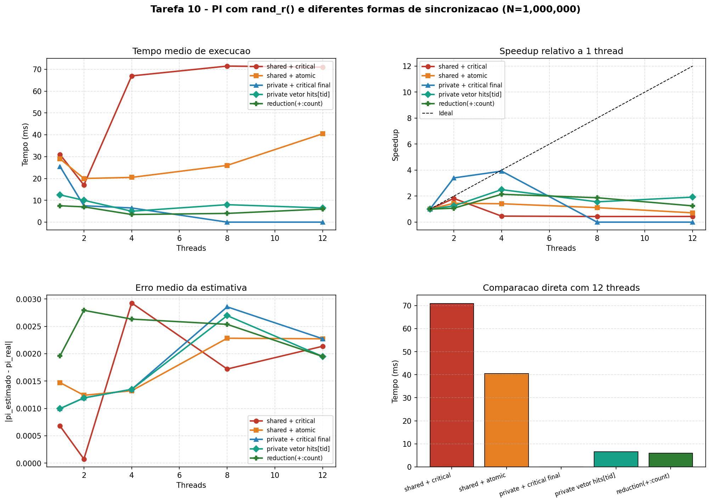

# Tarefa 10 - Comparar critical, atomic, contadores privados e reduction no estimador de PI

## Objetivo

Implementar cinco versoes da estimativa de PI, todas usando `rand_r()` com seed privada
por thread, para comparar custo de sincronizacao, speedup, corretude e impacto de
false sharing. O foco agora nao e mais o gerador aleatorio, e sim **como os acertos
sao acumulados**.

## Como rodar no Ubuntu

```bash
sudo apt update && sudo apt install -y build-essential python3 python3-pip
python3 -m pip install --user matplotlib

cd atividades-aula
python3 Tarefa-10/run_tests.py
```

Para regenerar apenas grafico e relatorio a partir do JSON salvo:

```bash
python3 Tarefa-10/run_tests.py --report-only
```

Argumentos opcionais: `python3 Tarefa-10/run_tests.py [N] [rodadas]`

## Configuracao

- N = 1,000,000 pontos por execucao
- 2 rodadas por configuracao de threads
- Threads testadas: 1, 2, 4, 8, 12
- Compilacao: `gcc -O2 -fopenmp`
- Escalonamento: `schedule(static)` em todas as versoes

## Programas comparados

| ID | Arquivo | Estrategia |
|---|---|---|
| shared_critical  | pi_randr_shared_critical.c  | contador global com `critical` a cada acerto |
| shared_atomic    | pi_randr_shared_atomic.c    | contador global com `atomic` a cada acerto |
| private_critical | pi_randr_private_critical.c | contador local por thread + `critical` final |
| private_vector   | pi_randr_private_vector.c   | `hits[tid]` em vetor compartilhado |
| reduction        | pi_randr_reduction.c        | `reduction(+:count)` |

## Resultados por programa

### shared + critical

_Cada acerto entra em critical; maior serializacao do contador global._

|Threads|Rodadas|Media (ms)|Min (ms)|Max (ms)|Erro medio|Validas|
|---|---|---|---|---|---|---|
|1|2|31.000|24.000|38.000|0.00067935|sim|
|2|2|17.000|10.000|24.000|0.00007535|sim|
|4|2|67.000|50.000|84.000|0.00292735|sim|
|8|2|71.500|69.000|74.000|0.00172000|sim|
|12|2|71.000|61.000|81.000|0.00213665|sim|

### shared + atomic

_Cada acerto atualiza o contador global com atomic; menor overhead que critical para incrementos simples._

|Threads|Rodadas|Media (ms)|Min (ms)|Max (ms)|Erro medio|Validas|
|---|---|---|---|---|---|---|
|1|2|29.000|27.000|31.000|0.00147265|sim|
|2|2|20.000|16.000|24.000|0.00124065|sim|
|4|2|20.500|18.000|23.000|0.00132335|sim|
|8|2|26.000|23.000|29.000|0.00228265|sim|
|12|2|40.500|32.000|49.000|0.00227265|sim|

### private + critical final

_Cada thread soma localmente e entra em critical apenas uma vez no final._

|Threads|Rodadas|Media (ms)|Min (ms)|Max (ms)|Erro medio|Validas|
|---|---|---|---|---|---|---|
|1|2|25.500|16.000|35.000|0.00099665|sim|
|2|2|7.500|7.000|8.000|0.00119265|sim|
|4|2|6.500|4.000|9.000|0.00134865|sim|
|8|2|0.000|0.000|0.000|0.00285665|sim|
|12|2|0.000|0.000|0.000|0.00227265|sim|

### private vetor hits[tid]

_Acumula em hits[tid] contiguos; pode sofrer false sharing entre threads vizinhas._

|Threads|Rodadas|Media (ms)|Min (ms)|Max (ms)|Erro medio|Validas|
|---|---|---|---|---|---|---|
|1|2|12.500|12.000|13.000|0.00099665|sim|
|2|2|10.000|9.000|11.000|0.00119265|sim|
|4|2|5.000|4.000|6.000|0.00134865|sim|
|8|2|8.000|3.000|13.000|0.00269665|sim|
|12|2|6.500|4.000|9.000|0.00194865|sim|

### reduction(+:count)

_OpenMP cria acumuladores privados e combina automaticamente ao final do loop._

|Threads|Rodadas|Media (ms)|Min (ms)|Max (ms)|Erro medio|Validas|
|---|---|---|---|---|---|---|
|1|2|7.500|7.000|8.000|0.00196065|sim|
|2|2|7.000|5.000|9.000|0.00279265|sim|
|4|2|3.500|0.000|7.000|0.00263265|sim|
|8|2|4.000|0.000|8.000|0.00253665|sim|
|12|2|6.000|0.000|12.000|0.00194865|sim|



## Comparacoes diretas (12 threads)

- shared + critical vs shared + atomic (12 threads): 71.000 ms vs 40.500 ms; shared + atomic ficou 43.0% mais rapido.
- shared + atomic vs private + critical final (12 threads): 40.500 ms vs 0.000 ms; comparacao limitada pela resolucao do timer.
- shared + critical vs private + critical final (12 threads): 71.000 ms vs 0.000 ms; comparacao limitada pela resolucao do timer.
- private + critical final vs private vetor hits[tid] (12 threads): 0.000 ms vs 6.500 ms; comparacao limitada pela resolucao do timer.
- private + critical final vs reduction(+:count) (12 threads): 0.000 ms vs 6.000 ms; comparacao limitada pela resolucao do timer.
- private vetor hits[tid] vs reduction(+:count) (12 threads): 6.500 ms vs 6.000 ms; reduction(+:count) ficou 7.7% mais rapido.
- shared + atomic vs reduction(+:count) (12 threads): 40.500 ms vs 6.000 ms; reduction(+:count) ficou 85.2% mais rapido.
- shared + critical vs reduction(+:count) (12 threads): 71.000 ms vs 6.000 ms; reduction(+:count) ficou 91.5% mais rapido.

## Ranking por numero de threads

- 1 threads: reduction=7.50ms, private_vector=12.50ms, private_critical=25.50ms, shared_atomic=29.00ms, shared_critical=31.00ms
- 2 threads: reduction=7.00ms, private_critical=7.50ms, private_vector=10.00ms, shared_critical=17.00ms, shared_atomic=20.00ms
- 4 threads: reduction=3.50ms, private_vector=5.00ms, private_critical=6.50ms, shared_atomic=20.50ms, shared_critical=67.00ms
- 8 threads: private_critical=0.00ms, reduction=4.00ms, private_vector=8.00ms, shared_atomic=26.00ms, shared_critical=71.50ms
- 12 threads: private_critical=0.00ms, reduction=6.00ms, private_vector=6.50ms, shared_atomic=40.50ms, shared_critical=71.00ms

## Analise conceitual

### 1. shared_critical vs shared_atomic

As duas versoes atualizam a mesma variavel global em alta frequencia. A diferenca e
que `atomic` protege exatamente a operacao de incremento, enquanto `critical` precisa
entrar e sair de uma regiao mutua mais geral. Para `count++`, `atomic` tende a ser a
escolha correta porque expressa melhor a intencao e reduz overhead.

### 2. shared_* vs private_critical

Mover a contagem para uma variavel privada por thread reduz drasticamente a contencao:
em vez de sincronizar a cada acerto, cada thread sincroniza apenas uma vez no final.
Essa mudanca costuma produzir um salto de desempenho muito maior do que trocar
`critical` por `atomic`.

### 3. private_critical vs private_vector

Ambas evitam disputar uma variavel global a cada acerto, mas `private_vector`
materializa os contadores em um vetor compartilhado contiguo. Isso pode introduzir
false sharing: threads escrevem em posicoes diferentes, porem no mesmo cache line.
`private_critical` normalmente vence porque preserva os contadores no contexto local
da thread durante quase toda a execucao.

### 4. Todas as anteriores vs reduction

`reduction(+:count)` e o caso mais natural para OpenMP: soma associativa simples.
O compilador/runtime criam acumuladores privados e fazem a combinacao final de forma
otimizada. Alem do desempenho esperado, a versao e a mais curta e menos sujeita a
erros de sincronizacao no codigo-fonte.

## Roteiro de escolha do mecanismo

- Use `reduction` quando o problema for uma reducao associativa simples, como soma, maximo ou minimo.
- Use `atomic` quando houver uma atualizacao simples em variavel compartilhada e a operacao nao puder ser modelada como `reduction`.
- Use `critical` para trechos curtos que exigem exclusao mutua, mas nao cabem em `atomic`.
- Use `critical(nome)` quando existirem poucos recursos fixos independentes conhecidos em tempo de compilacao.
- Use `omp_lock_t` quando a granularidade do bloqueio precisar ser dinamica em tempo de execucao.

## Conclusao

O experimento separa dois tipos de decisao. A primeira e **micro**: entre `critical`
e `atomic`, `atomic` costuma ganhar quando a operacao e apenas um incremento. A segunda
e **estrutural**: evitar sincronizacao por iteracao quase sempre vale mais do que
otimizar a forma da trava. Por isso, `private_critical` e `reduction` tendem a dominar
as versoes com contador compartilhado. Entre elas, `reduction` costuma ser a melhor
combinacao de produtividade e desempenho quando o padrao do problema coincide com uma
reducao classica.

## Artefatos gerados

- CSV bruto: `dados/tarefa10_runs.csv`
- Resumo JSON: `dados/tarefa10_summary.json`
- Grafico: `relatorios/tarefa10_resultados.png`
- Relatorio: `relatorios/relatorio_tarefa10.md`
