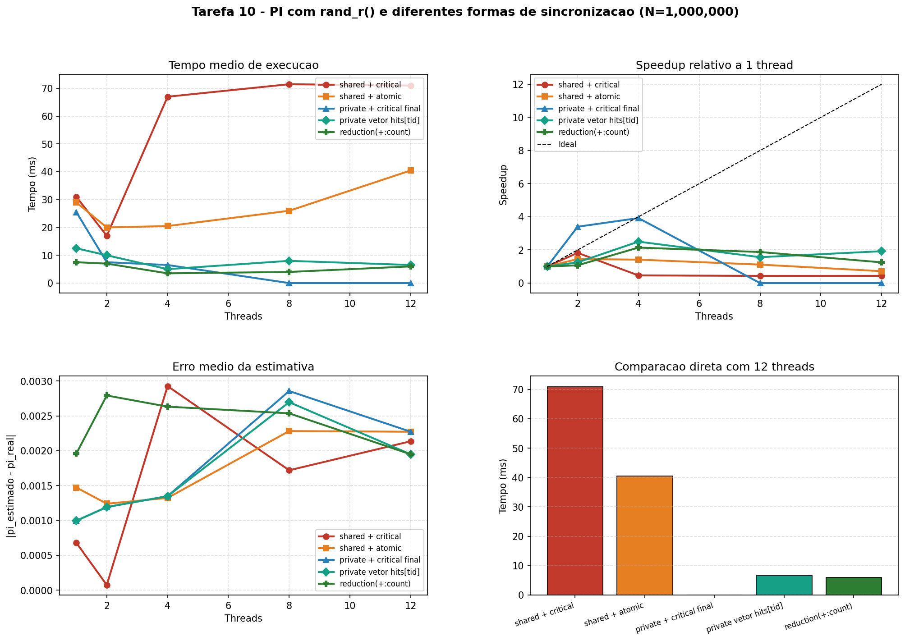

# Tarefa 10 - Comparar critical, atomic, contadores privados e reduction no estimador de PI

## Objetivo

Implementar cinco versoes da estimativa de PI, todas usando `rand_r()` com seed privada
por thread, para comparar custo de sincronizacao, speedup, corretude e impacto de
false sharing. O foco agora nao e mais o gerador aleatorio, e sim **como os acertos
sao acumulados**.

## Como rodar no Ubuntu

```bash
sudo apt update && sudo apt install -y build-essential python3 python3-pip
python3 -m pip install --user matplotlib

cd atividades-aula
python3 Tarefa-10/run_tests.py
```

Para regenerar apenas grafico e relatorio a partir do JSON salvo:

```bash
python3 Tarefa-10/run_tests.py --report-only
```

Argumentos opcionais: `python3 Tarefa-10/run_tests.py [N] [rodadas]`

## Configuracao

- N = 1,000,000 pontos por execucao
- 2 rodadas por configuracao de threads
- Threads testadas: 1, 2, 4, 8, 12
- Compilacao: `gcc -O2 -fopenmp`
- Escalonamento: `schedule(static)` em todas as versoes

## Programas comparados

| ID | Arquivo | Estrategia |
|---|---|---|
| shared_critical  | pi_randr_shared_critical.c  | contador global com `critical` a cada acerto |
| shared_atomic    | pi_randr_shared_atomic.c    | contador global com `atomic` a cada acerto |
| private_critical | pi_randr_private_critical.c | contador local por thread + `critical` final |
| private_vector   | pi_randr_private_vector.c   | `hits[tid]` em vetor compartilhado |
| reduction        | pi_randr_reduction.c        | `reduction(+:count)` |

## Resultados por programa

### shared + critical

_Cada acerto entra em critical; maior serializacao do contador global._

|Threads|Rodadas|Media (ms)|Min (ms)|Max (ms)|Erro medio|Validas|
|---|---|---|---|---|---|---|
|1|2|31.000|24.000|38.000|0.00067935|sim|
|2|2|17.000|10.000|24.000|0.00007535|sim|
|4|2|67.000|50.000|84.000|0.00292735|sim|
|8|2|71.500|69.000|74.000|0.00172000|sim|
|12|2|71.000|61.000|81.000|0.00213665|sim|

### shared + atomic

_Cada acerto atualiza o contador global com atomic; menor overhead que critical para incrementos simples._

|Threads|Rodadas|Media (ms)|Min (ms)|Max (ms)|Erro medio|Validas|
|---|---|---|---|---|---|---|
|1|2|29.000|27.000|31.000|0.00147265|sim|
|2|2|20.000|16.000|24.000|0.00124065|sim|
|4|2|20.500|18.000|23.000|0.00132335|sim|
|8|2|26.000|23.000|29.000|0.00228265|sim|
|12|2|40.500|32.000|49.000|0.00227265|sim|

### private + critical final

_Cada thread soma localmente e entra em critical apenas uma vez no final._

|Threads|Rodadas|Media (ms)|Min (ms)|Max (ms)|Erro medio|Validas|
|---|---|---|---|---|---|---|
|1|2|25.500|16.000|35.000|0.00099665|sim|
|2|2|7.500|7.000|8.000|0.00119265|sim|
|4|2|6.500|4.000|9.000|0.00134865|sim|
|8|2|0.000|0.000|0.000|0.00285665|sim|
|12|2|0.000|0.000|0.000|0.00227265|sim|

### private vetor hits[tid]

_Acumula em hits[tid] contiguos; pode sofrer false sharing entre threads vizinhas._

|Threads|Rodadas|Media (ms)|Min (ms)|Max (ms)|Erro medio|Validas|
|---|---|---|---|---|---|---|
|1|2|12.500|12.000|13.000|0.00099665|sim|
|2|2|10.000|9.000|11.000|0.00119265|sim|
|4|2|5.000|4.000|6.000|0.00134865|sim|
|8|2|8.000|3.000|13.000|0.00269665|sim|
|12|2|6.500|4.000|9.000|0.00194865|sim|

### reduction(+:count)

_OpenMP cria acumuladores privados e combina automaticamente ao final do loop._

|Threads|Rodadas|Media (ms)|Min (ms)|Max (ms)|Erro medio|Validas|
|---|---|---|---|---|---|---|
|1|2|7.500|7.000|8.000|0.00196065|sim|
|2|2|7.000|5.000|9.000|0.00279265|sim|
|4|2|3.500|0.000|7.000|0.00263265|sim|
|8|2|4.000|0.000|8.000|0.00253665|sim|
|12|2|6.000|0.000|12.000|0.00194865|sim|



## Comparacoes diretas (12 threads)

- shared + critical vs shared + atomic (12 threads): 71.000 ms vs 40.500 ms; shared + atomic ficou 43.0% mais rapido.
- shared + atomic vs private + critical final (12 threads): 40.500 ms vs 0.000 ms; comparacao limitada pela resolucao do timer.
- shared + critical vs private + critical final (12 threads): 71.000 ms vs 0.000 ms; comparacao limitada pela resolucao do timer.
- private + critical final vs private vetor hits[tid] (12 threads): 0.000 ms vs 6.500 ms; comparacao limitada pela resolucao do timer.
- private + critical final vs reduction(+:count) (12 threads): 0.000 ms vs 6.000 ms; comparacao limitada pela resolucao do timer.
- private vetor hits[tid] vs reduction(+:count) (12 threads): 6.500 ms vs 6.000 ms; reduction(+:count) ficou 7.7% mais rapido.
- shared + atomic vs reduction(+:count) (12 threads): 40.500 ms vs 6.000 ms; reduction(+:count) ficou 85.2% mais rapido.
- shared + critical vs reduction(+:count) (12 threads): 71.000 ms vs 6.000 ms; reduction(+:count) ficou 91.5% mais rapido.

## Ranking por numero de threads

- 1 threads: reduction=7.50ms, private_vector=12.50ms, private_critical=25.50ms, shared_atomic=29.00ms, shared_critical=31.00ms
- 2 threads: reduction=7.00ms, private_critical=7.50ms, private_vector=10.00ms, shared_critical=17.00ms, shared_atomic=20.00ms
- 4 threads: reduction=3.50ms, private_vector=5.00ms, private_critical=6.50ms, shared_atomic=20.50ms, shared_critical=67.00ms
- 8 threads: private_critical=0.00ms, reduction=4.00ms, private_vector=8.00ms, shared_atomic=26.00ms, shared_critical=71.50ms
- 12 threads: private_critical=0.00ms, reduction=6.00ms, private_vector=6.50ms, shared_atomic=40.50ms, shared_critical=71.00ms

## Analise conceitual

### 1. shared_critical vs shared_atomic

As duas versoes atualizam a mesma variavel global em alta frequencia. A diferenca e
que `atomic` protege exatamente a operacao de incremento, enquanto `critical` precisa
entrar e sair de uma regiao mutua mais geral. Para `count++`, `atomic` tende a ser a
escolha correta porque expressa melhor a intencao e reduz overhead.

### 2. shared_* vs private_critical

Mover a contagem para uma variavel privada por thread reduz drasticamente a contencao:
em vez de sincronizar a cada acerto, cada thread sincroniza apenas uma vez no final.
Essa mudanca costuma produzir um salto de desempenho muito maior do que trocar
`critical` por `atomic`.

### 3. private_critical vs private_vector

Ambas evitam disputar uma variavel global a cada acerto, mas `private_vector`
materializa os contadores em um vetor compartilhado contiguo. Isso pode introduzir
false sharing: threads escrevem em posicoes diferentes, porem no mesmo cache line.
`private_critical` normalmente vence porque preserva os contadores no contexto local
da thread durante quase toda a execucao.

### 4. Todas as anteriores vs reduction

`reduction(+:count)` e o caso mais natural para OpenMP: soma associativa simples.
O compilador/runtime criam acumuladores privados e fazem a combinacao final de forma
otimizada. Alem do desempenho esperado, a versao e a mais curta e menos sujeita a
erros de sincronizacao no codigo-fonte.

## Roteiro de escolha do mecanismo

- Use `reduction` quando o problema for uma reducao associativa simples, como soma, maximo ou minimo.
- Use `atomic` quando houver uma atualizacao simples em variavel compartilhada e a operacao nao puder ser modelada como `reduction`.
- Use `critical` para trechos curtos que exigem exclusao mutua, mas nao cabem em `atomic`.
- Use `critical(nome)` quando existirem poucos recursos fixos independentes conhecidos em tempo de compilacao.
- Use `omp_lock_t` quando a granularidade do bloqueio precisar ser dinamica em tempo de execucao.

## Conclusao

O experimento separa dois tipos de decisao. A primeira e **micro**: entre `critical`
e `atomic`, `atomic` costuma ganhar quando a operacao e apenas um incremento. A segunda
e **estrutural**: evitar sincronizacao por iteracao quase sempre vale mais do que
otimizar a forma da trava. Por isso, `private_critical` e `reduction` tendem a dominar
as versoes com contador compartilhado. Entre elas, `reduction` costuma ser a melhor
combinacao de produtividade e desempenho quando o padrao do problema coincide com uma
reducao classica.

## Artefatos gerados

- CSV bruto: `dados/tarefa10_runs.csv`
- Resumo JSON: `dados/tarefa10_summary.json`
- Grafico: `relatorios/tarefa10_resultados.png`
- Relatorio: `relatorios/relatorio_tarefa10.md`

<!-- codigos-fonte-c-inicio -->
## Codigos fonte C usados nos testes

### `Tarefa-10/pi_randr_private_critical.c`

```c
/*
 * Tarefa 10 - Versao 3: rand_r() + contador privado + critical final
 *
 * Cada thread acumula acertos em local_count e entra em critical apenas
 * uma vez para combinar o resultado no contador global.
 *
 * Compilar: gcc -O2 -fopenmp -o pi_randr_private_critical pi_randr_private_critical.c -lm
 * Executar: ./pi_randr_private_critical [N]
 */

#include <math.h>
#include <omp.h>
#include <stdio.h>
#include <stdlib.h>
#include <time.h>

#include "portable_rand_r.h"

#ifndef M_PI
#define M_PI 3.14159265358979323846
#endif

int main(int argc, char *argv[]) {
    long N = 10000000L;
    if (argc > 1) {
        N = atol(argv[1]);
    }

    long count       = 0;
    int threads_used = 0;

    double t0 = omp_get_wtime();

    #pragma omp parallel
    {
        unsigned int seed = (unsigned int)(time(NULL))
                          ^ (unsigned int)(omp_get_thread_num() * 2654435761u);
        long local_count = 0;

        #pragma omp single
        threads_used = omp_get_num_threads();

        #pragma omp for schedule(static)
        for (long i = 0; i < N; i++) {
            double x = (double)rand_r(&seed) / (double)RAND_MAX;
            double y = (double)rand_r(&seed) / (double)RAND_MAX;
            if (x * x + y * y <= 1.0) {
                local_count++;
            }
        }

        #pragma omp critical
        count += local_count;
    }

    double elapsed = omp_get_wtime() - t0;
    double pi      = 4.0 * (double)count / (double)N;
    double error   = fabs(pi - M_PI);

    printf("CONFIG program=private_critical n=%ld threads=%d\n", N, threads_used);
    printf("RESULT pi=%.10f count=%ld total=%ld error=%.10f elapsed=%.6f\n",
           pi, count, N, error, elapsed);

    return 0;
}
```

### `Tarefa-10/pi_randr_private_vector.c`

```c
/*
 * Tarefa 10 - Versao 4: rand_r() + vetor compartilhado hits[tid]
 *
 * Cada thread atualiza uma posicao propria do vetor compartilhado.
 * Nao ha corrida de dados, mas ha potencial de false sharing entre
 * posicoes adjacentes ocupando o mesmo cache line.
 *
 * Compilar: gcc -O2 -fopenmp -o pi_randr_private_vector pi_randr_private_vector.c -lm
 * Executar: ./pi_randr_private_vector [N]
 */

#include <math.h>
#include <omp.h>
#include <stdio.h>
#include <stdlib.h>
#include <time.h>

#include "portable_rand_r.h"

#ifndef M_PI
#define M_PI 3.14159265358979323846
#endif

int main(int argc, char *argv[]) {
    long N = 10000000L;
    if (argc > 1) {
        N = atol(argv[1]);
    }

    int max_threads = omp_get_max_threads();
    long *hits      = (long *)calloc((size_t)max_threads, sizeof(long));
    if (hits == NULL) {
        fprintf(stderr, "Falha ao alocar vetor de hits.\n");
        return 1;
    }

    int threads_used = 0;

    double t0 = omp_get_wtime();

    #pragma omp parallel
    {
        int tid = omp_get_thread_num();
        unsigned int seed = (unsigned int)(time(NULL))
                          ^ (unsigned int)(tid * 2654435761u);

        #pragma omp single
        threads_used = omp_get_num_threads();

        #pragma omp for schedule(static)
        for (long i = 0; i < N; i++) {
            double x = (double)rand_r(&seed) / (double)RAND_MAX;
            double y = (double)rand_r(&seed) / (double)RAND_MAX;
            if (x * x + y * y <= 1.0) {
                hits[tid]++;
            }
        }
    }

    long count = 0;
    for (int t = 0; t < threads_used; t++) {
        count += hits[t];
    }
    free(hits);

    double elapsed = omp_get_wtime() - t0;
    double pi      = 4.0 * (double)count / (double)N;
    double error   = fabs(pi - M_PI);

    printf("CONFIG program=private_vector n=%ld threads=%d\n", N, threads_used);
    printf("RESULT pi=%.10f count=%ld total=%ld error=%.10f elapsed=%.6f\n",
           pi, count, N, error, elapsed);

    return 0;
}
```

### `Tarefa-10/pi_randr_reduction.c`

```c
/*
 * Tarefa 10 - Versao 5: rand_r() + reduction(+:count)
 *
 * OpenMP gera acumuladores privados e combina os resultados ao final
 * do loop, sem necessidade de critical nem atomic no codigo-fonte.
 *
 * Compilar: gcc -O2 -fopenmp -o pi_randr_reduction pi_randr_reduction.c -lm
 * Executar: ./pi_randr_reduction [N]
 */

#include <math.h>
#include <omp.h>
#include <stdio.h>
#include <stdlib.h>
#include <time.h>

#include "portable_rand_r.h"

#ifndef M_PI
#define M_PI 3.14159265358979323846
#endif

int main(int argc, char *argv[]) {
    long N = 10000000L;
    if (argc > 1) {
        N = atol(argv[1]);
    }

    long count       = 0;
    int threads_used = 0;

    double t0 = omp_get_wtime();

    #pragma omp parallel
    {
        unsigned int seed = (unsigned int)(time(NULL))
                          ^ (unsigned int)(omp_get_thread_num() * 2654435761u);

        #pragma omp single
        threads_used = omp_get_num_threads();

        #pragma omp for schedule(static) reduction(+:count)
        for (long i = 0; i < N; i++) {
            double x = (double)rand_r(&seed) / (double)RAND_MAX;
            double y = (double)rand_r(&seed) / (double)RAND_MAX;
            if (x * x + y * y <= 1.0) {
                count++;
            }
        }
    }

    double elapsed = omp_get_wtime() - t0;
    double pi      = 4.0 * (double)count / (double)N;
    double error   = fabs(pi - M_PI);

    printf("CONFIG program=reduction n=%ld threads=%d\n", N, threads_used);
    printf("RESULT pi=%.10f count=%ld total=%ld error=%.10f elapsed=%.6f\n",
           pi, count, N, error, elapsed);

    return 0;
}
```

### `Tarefa-10/pi_randr_shared_atomic.c`

```c
/*
 * Tarefa 10 - Versao 2: rand_r() + contador compartilhado + atomic
 *
 * Cada acerto executa count++ protegido por #pragma omp atomic.
 * O objetivo e comparar o custo de sincronizacao simples de atomic
 * contra a serializacao mais pesada de critical.
 *
 * Compilar: gcc -O2 -fopenmp -o pi_randr_shared_atomic pi_randr_shared_atomic.c -lm
 * Executar: ./pi_randr_shared_atomic [N]
 */

#include <math.h>
#include <omp.h>
#include <stdio.h>
#include <stdlib.h>
#include <time.h>

#include "portable_rand_r.h"

#ifndef M_PI
#define M_PI 3.14159265358979323846
#endif

int main(int argc, char *argv[]) {
    long N = 10000000L;
    if (argc > 1) {
        N = atol(argv[1]);
    }

    long count       = 0;
    int threads_used = 0;

    double t0 = omp_get_wtime();

    #pragma omp parallel
    {
        unsigned int seed = (unsigned int)(time(NULL))
                          ^ (unsigned int)(omp_get_thread_num() * 2654435761u);

        #pragma omp single
        threads_used = omp_get_num_threads();

        #pragma omp for schedule(static)
        for (long i = 0; i < N; i++) {
            double x = (double)rand_r(&seed) / (double)RAND_MAX;
            double y = (double)rand_r(&seed) / (double)RAND_MAX;
            if (x * x + y * y <= 1.0) {
                #pragma omp atomic
                count++;
            }
        }
    }

    double elapsed = omp_get_wtime() - t0;
    double pi      = 4.0 * (double)count / (double)N;
    double error   = fabs(pi - M_PI);

    printf("CONFIG program=shared_atomic n=%ld threads=%d\n", N, threads_used);
    printf("RESULT pi=%.10f count=%ld total=%ld error=%.10f elapsed=%.6f\n",
           pi, count, N, error, elapsed);

    return 0;
}
```

### `Tarefa-10/pi_randr_shared_critical.c`

```c
/*
 * Tarefa 10 - Versao 1: rand_r() + contador compartilhado + critical
 *
 * Cada acerto executa count++ dentro de uma regiao critica anonima.
 * Esta versao maximiza a serializacao no contador compartilhado e serve
 * como baseline de maior custo de sincronizacao.
 *
 * Compilar: gcc -O2 -fopenmp -o pi_randr_shared_critical pi_randr_shared_critical.c -lm
 * Executar: ./pi_randr_shared_critical [N]
 */

#include <math.h>
#include <omp.h>
#include <stdio.h>
#include <stdlib.h>
#include <time.h>

#include "portable_rand_r.h"

#ifndef M_PI
#define M_PI 3.14159265358979323846
#endif

int main(int argc, char *argv[]) {
    long N = 10000000L;
    if (argc > 1) {
        N = atol(argv[1]);
    }

    long count       = 0;
    int threads_used = 0;

    double t0 = omp_get_wtime();

    #pragma omp parallel
    {
        unsigned int seed = (unsigned int)(time(NULL))
                          ^ (unsigned int)(omp_get_thread_num() * 2654435761u);

        #pragma omp single
        threads_used = omp_get_num_threads();

        #pragma omp for schedule(static)
        for (long i = 0; i < N; i++) {
            double x = (double)rand_r(&seed) / (double)RAND_MAX;
            double y = (double)rand_r(&seed) / (double)RAND_MAX;
            if (x * x + y * y <= 1.0) {
                #pragma omp critical
                count++;
            }
        }
    }

    double elapsed = omp_get_wtime() - t0;
    double pi      = 4.0 * (double)count / (double)N;
    double error   = fabs(pi - M_PI);

    printf("CONFIG program=shared_critical n=%ld threads=%d\n", N, threads_used);
    printf("RESULT pi=%.10f count=%ld total=%ld error=%.10f elapsed=%.6f\n",
           pi, count, N, error, elapsed);

    return 0;
}
```

### `Tarefa-10/portable_rand_r.h`

```c
/*
 * Compatibilidade para ambientes onde rand_r() nao esta disponivel
 * (como algumas distribuicoes MinGW no Windows).
 */

#ifndef TAREFA10_PORTABLE_RAND_R_H
#define TAREFA10_PORTABLE_RAND_R_H

#if defined(_WIN32)
static unsigned int portable_rand_r(unsigned int *seed) {
    *seed = (*seed * 1103515245u) + 12345u;
    return (*seed / 65536u) % 32768u;
}

#define rand_r portable_rand_r
#endif

#endif
```

<!-- codigos-fonte-c-fim -->

<!-- scripts-sbatch-npad-inicio -->
## Scripts sbatch do NPAD

Nao ha script `sbatch` do NPAD associado a esta tarefa no repositorio.
<!-- scripts-sbatch-npad-fim -->
