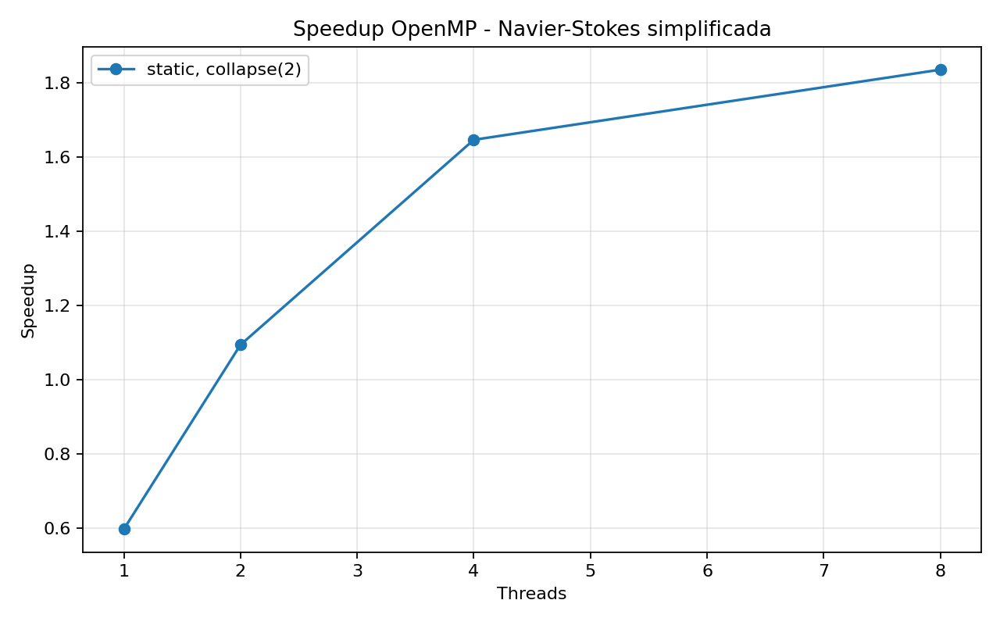
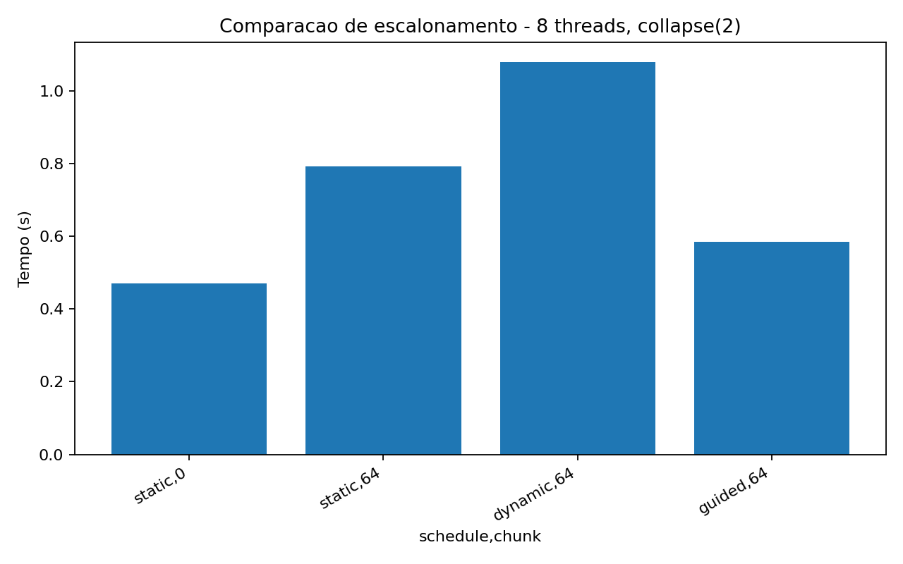

# Tarefa 11 - Escalonamento com OpenMP na equacao de Navier-Stokes simplificada

## Objetivo

Implementar uma simulacao 2D simplificada do movimento de um fluido usando apenas o
efeito da viscosidade. Pressao, forcas externas e termo convectivo foram
desconsiderados. Na pratica, a atualizacao numerica se reduz a uma equacao de
difusao aplicada ao campo de velocidade.

Depois da validacao numerica, o objetivo principal foi paralelizar o laco de
atualizacao com OpenMP e comparar o impacto das clausulas `schedule` e `collapse`
no desempenho.

## Configuracao

- Malha: `1024 x 1024`
- Passos de tempo: `1000`
- Viscosidade: `nu = 0.1`
- Passo temporal: `dt = 0.1`
- Inicializacao: perturbacao gaussiana central
- Rodadas por configuracao: `3`
- Threads testadas: `1`, `2`, `4`, `8`
- Compilacao: `gcc -O3 -fopenmp`
- Escalonamentos testados: `static`, `static,64`, `dynamic,64`, `guided,64`
- Valores de `collapse`: `1` e `2`

O criterio de estabilidade usado foi `dt * nu <= 0.25`, considerando `dx = dy = 1`.
Como `dt * nu = 0.01`, todos os testes foram executados em regime estavel.

## Algoritmo implementado

O campo de velocidade foi representado por uma matriz escalar `u[i][j]`. Essa matriz
pode ser interpretada como uma componente da velocidade. A cada passo, as celulas
internas sao atualizadas por diferencas finitas:

```c
u_next[i][j] = u[i][j] + dt * nu * (
    u[i-1][j] + u[i+1][j] + u[i][j-1] + u[i][j+1] - 4*u[i][j]
);
```

Foram usados dois buffers (`u` e `u_next`) para evitar sobrescrever valores que ainda
serao lidos no mesmo passo de tempo. As bordas usam uma condicao de contorno simples
que copia as celulas vizinhas internas, preservando um campo uniforme constante.

## Validacao fisica

|Rodadas|Media (s)|Min (s)|Max (s)|Max inicial|Max final|L2 inicial|L2 final|
|---|---|---|---|---|---|---|---|
|3|0.889140|0.864984|0.916512|1.000000|0.997029|145.199419|144.983542|

A perturbacao inicial teve valor maximo `1.0` e, apos 1000 passos, caiu para
`0.997029`. A norma L2 tambem diminuiu de `145.199419` para `144.983542`. Isso indica
que a perturbacao se difundiu suavemente, sem explosao numerica.

Todos os modos OpenMP chegaram exatamente aos mesmos valores finais de `max`, `L2` e
`sum`, mostrando que a paralelizacao nao alterou o resultado numerico.

## Resultados por configuracao

|Threads|Schedule|Chunk|Collapse|Media (s)|Min (s)|Max (s)|Speedup medio|Eficiencia media|
|---|---|---:|---:|---:|---:|---:|---:|---:|
|1|dynamic|64|1|0.871483|0.861237|0.881820|0.99|0.99|
|1|dynamic|64|2|1.684808|1.670696|1.705636|0.51|0.51|
|1|guided|64|1|0.879741|0.870860|0.890158|0.98|0.98|
|1|guided|64|2|1.466813|1.436881|1.503321|0.59|0.59|
|1|static|0|1|0.920210|0.881074|0.969163|0.94|0.94|
|1|static|0|2|1.489763|1.448673|1.533655|0.58|0.58|
|1|static|64|1|0.879332|0.867739|0.886026|0.98|0.98|
|1|static|64|2|1.454487|1.436545|1.487768|0.59|0.59|
|2|dynamic|64|1|0.575829|0.570027|0.583475|1.50|0.75|
|2|dynamic|64|2|1.435263|1.419344|1.465586|0.60|0.30|
|2|guided|64|1|0.593688|0.579767|0.604558|1.46|0.73|
|2|guided|64|2|0.825563|0.823828|0.828549|1.05|0.52|
|2|static|0|1|0.617971|0.597039|0.631537|1.40|0.70|
|2|static|0|2|0.811322|0.790573|0.826506|1.07|0.53|
|2|static|64|1|0.596840|0.568840|0.638964|1.45|0.73|
|2|static|64|2|1.149098|1.132591|1.175369|0.75|0.38|
|4|dynamic|64|1|0.411421|0.390946|0.448455|2.11|0.53|
|4|dynamic|64|2|1.360580|1.351199|1.376050|0.64|0.16|
|4|guided|64|1|0.422482|0.403325|0.452131|2.05|0.51|
|4|guided|64|2|0.495883|0.479389|0.521946|1.75|0.44|
|4|static|0|1|0.402733|0.377158|0.438719|2.16|0.54|
|4|static|0|2|0.588294|0.525233|0.627079|1.48|0.37|
|4|static|64|1|0.412265|0.383245|0.435120|2.10|0.53|
|4|static|64|2|1.023220|0.969473|1.097540|0.85|0.21|
|8|dynamic|64|1|0.356794|0.334984|0.388558|2.43|0.30|
|8|dynamic|64|2|1.337084|1.080013|1.481006|0.66|0.08|
|8|guided|64|1|0.349616|0.323484|0.391958|2.49|0.31|
|8|guided|64|2|0.597385|0.584182|0.612281|1.45|0.18|
|8|static|0|1|0.304990|0.278316|0.356029|2.87|0.36|
|8|static|0|2|0.479985|0.471119|0.486606|1.80|0.23|
|8|static|64|1|0.314263|0.300707|0.341093|2.76|0.35|
|8|static|64|2|0.825347|0.791397|0.866827|1.05|0.13|





## Ranking por numero de threads

- 1 threads: `dynamic chunk=64 collapse=1` = 0.871s, `static chunk=64 collapse=1` = 0.879s, `guided chunk=64 collapse=1` = 0.880s, `static chunk=0 collapse=1` = 0.920s.
- 2 threads: `dynamic chunk=64 collapse=1` = 0.576s, `guided chunk=64 collapse=1` = 0.594s, `static chunk=64 collapse=1` = 0.597s, `static chunk=0 collapse=1` = 0.618s.
- 4 threads: `static chunk=0 collapse=1` = 0.403s, `dynamic chunk=64 collapse=1` = 0.411s, `static chunk=64 collapse=1` = 0.412s, `guided chunk=64 collapse=1` = 0.422s.
- 8 threads: `static chunk=0 collapse=1` = 0.305s, `static chunk=64 collapse=1` = 0.314s, `guided chunk=64 collapse=1` = 0.350s, `dynamic chunk=64 collapse=1` = 0.357s.

O melhor resultado geral foi `static collapse=1` com 8 threads: media de `0.305s` e
speedup medio de `2.87x`. A melhor rodada individual nessa configuracao foi
`0.278s`, equivalente a `3.11x` sobre o melhor tempo sequencial.

## Analise conceitual

### 1. `schedule(static)`

O laco da simulacao e bastante regular: cada celula interna executa praticamente as
mesmas leituras, a mesma quantidade de operacoes aritmeticas e uma escrita. Por isso,
o escalonamento `static` combina bem com o problema. Ele divide o trabalho entre as
threads com pouca sobrecarga de runtime.

Com 8 threads, `static collapse=1` foi a configuracao mais rapida, com media de
`0.305s` e speedup de `2.87x`.

### 2. `schedule(dynamic)`

O escalonamento `dynamic` e util quando as iteracoes tem cargas muito diferentes.
Esse nao e o caso aqui. Como cada celula tem custo parecido, a redistribuicao dinamica
adiciona overhead sem resolver um desbalanceamento real.

Mesmo assim, com `collapse=1`, o `dynamic,64` ainda escalou ate 8 threads, chegando a
`0.357s` e speedup de `2.43x`. O resultado foi pior que `static`, mas nao inutil.

### 3. `schedule(guided)`

O `guided` ficou entre `static` e `dynamic` em varios casos. Ele reduz a granularidade
dos blocos ao longo da execucao, tentando equilibrar overhead e balanceamento.

Com 8 threads e `collapse=1`, obteve media de `0.350s`, melhor que `dynamic,64`, mas
ainda pior que `static`.

### 4. Impacto de `collapse(2)`

Neste experimento, `collapse(2)` piorou o desempenho na maioria das configuracoes.
Com 8 threads e `schedule(static)`, o tempo medio subiu de `0.305s` para `0.480s`,
uma piora de aproximadamente `57.4%`.

Isso acontece porque o laco externo ja possui muitas iteracoes (`1022` linhas
internas), suficientes para distribuir trabalho entre ate 8 threads. Ao colapsar os
dois lacos, o OpenMP passa a dividir um espaco linear muito maior, mas pode prejudicar
a localidade de acesso e aumentar overhead de escalonamento.

O pior caso foi `dynamic,64 collapse=2` com 8 threads: media de `1.337s`, mais lento
que a propria versao sequencial. Esse resultado reforca que `collapse` nao e
automaticamente melhor; ele ajuda quando o laco externo tem poucas iteracoes ou quando
ha desbalanceamento relevante.

## Comparacoes diretas com 8 threads

- `static collapse=1`: 0.305s, speedup 2.87x.
- `static,64 collapse=1`: 0.314s, speedup 2.76x.
- `guided,64 collapse=1`: 0.350s, speedup 2.49x.
- `dynamic,64 collapse=1`: 0.357s, speedup 2.43x.
- `static collapse=2`: 0.480s, speedup 1.80x.
- `dynamic,64 collapse=2`: 1.337s, speedup 0.66x.

## Conclusao

A simulacao confirmou o comportamento esperado da equacao viscosa simplificada: uma
perturbacao localizada se difunde suavemente e o campo permanece estavel. A versao
OpenMP manteve os mesmos resultados numericos da versao sequencial.

Do ponto de vista de desempenho, o melhor caminho foi usar `schedule(static)` sem
`collapse(2)`. O problema tem carga uniforme por celula e quantidade suficiente de
linhas para dividir entre as threads. Assim, a politica estatica reduz overhead e
preserva melhor a localidade dos dados.

As politicas `dynamic` e `guided` sao importantes para estudo, mas nao dominaram este
caso porque o trabalho nao e irregular. O `collapse(2)` tambem nao compensou nesta
malha; ele aumentou o custo de escalonamento e piorou a localidade sem trazer ganho de
balanceamento.

## Código

```c
#include <math.h>
#ifdef _OPENMP
#include <omp.h>
#else
#include <time.h>
static double omp_get_wtime(void) {
    return (double)clock() / (double)CLOCKS_PER_SEC;
}
static int omp_get_max_threads(void) {
    return 1;
}
#endif
#include <stdio.h>
#include <stdlib.h>
#include <string.h>

typedef struct {
    int nx;
    int ny;
    int steps;
    double nu;
    double dt;
    const char *mode;
    const char *init;
    double u0;
    const char *schedule_name;
    int chunk;
    int collapse;
} Config;

typedef struct {
    double min;
    double max;
    double l2;
    double sum;
} Stats;

static int idx(int i, int j, int ny) {
    return i * ny + j;
}

static void set_defaults(Config *cfg) {
    cfg->nx = 512;
    cfg->ny = 512;
    cfg->steps = 2000;
    cfg->nu = 0.1;
    cfg->dt = 0.1;
    cfg->mode = "seq";
    cfg->init = "perturb";
    cfg->u0 = 1.0;
    cfg->schedule_name = "static";
    cfg->chunk = 0;
    cfg->collapse = 1;
}

static void usage(const char *prog) {
    printf("Uso: %s [opcoes]\n", prog);
    printf("  --mode seq|omp\n");
    printf("  --nx <int> --ny <int> --steps <int>\n");
    printf("  --nu <double> --dt <double>\n");
    printf("  --init zero|uniform|perturb --u0 <double>\n");
    printf("  --schedule static|dynamic|guided|auto --chunk <int>\n");
    printf("  --collapse 1|2\n");
}

static int parse_int(const char *s, int *out) {
    char *end = NULL;
    long v = strtol(s, &end, 10);
    if (end == s || *end != '\0') {
        return 0;
    }
    *out = (int)v;
    return 1;
}

static int parse_double(const char *s, double *out) {
    char *end = NULL;
    double v = strtod(s, &end);
    if (end == s || *end != '\0') {
        return 0;
    }
    *out = v;
    return 1;
}

static int parse_args(int argc, char **argv, Config *cfg) {
    int i;
    for (i = 1; i < argc; i++) {
        if (strcmp(argv[i], "--mode") == 0 && i + 1 < argc) {
            cfg->mode = argv[++i];
        } else if (strcmp(argv[i], "--nx") == 0 && i + 1 < argc) {
            if (!parse_int(argv[++i], &cfg->nx)) return 0;
        } else if (strcmp(argv[i], "--ny") == 0 && i + 1 < argc) {
            if (!parse_int(argv[++i], &cfg->ny)) return 0;
        } else if (strcmp(argv[i], "--steps") == 0 && i + 1 < argc) {
            if (!parse_int(argv[++i], &cfg->steps)) return 0;
        } else if (strcmp(argv[i], "--nu") == 0 && i + 1 < argc) {
            if (!parse_double(argv[++i], &cfg->nu)) return 0;
        } else if (strcmp(argv[i], "--dt") == 0 && i + 1 < argc) {
            if (!parse_double(argv[++i], &cfg->dt)) return 0;
        } else if (strcmp(argv[i], "--init") == 0 && i + 1 < argc) {
            cfg->init = argv[++i];
        } else if (strcmp(argv[i], "--u0") == 0 && i + 1 < argc) {
            if (!parse_double(argv[++i], &cfg->u0)) return 0;
        } else if (strcmp(argv[i], "--schedule") == 0 && i + 1 < argc) {
            cfg->schedule_name = argv[++i];
        } else if (strcmp(argv[i], "--chunk") == 0 && i + 1 < argc) {
            if (!parse_int(argv[++i], &cfg->chunk)) return 0;
        } else if (strcmp(argv[i], "--collapse") == 0 && i + 1 < argc) {
            if (!parse_int(argv[++i], &cfg->collapse)) return 0;
        } else {
            return 0;
        }
    }
    return 1;
}

static int validate_config(const Config *cfg) {
    if (cfg->nx < 3 || cfg->ny < 3 || cfg->steps < 0) return 0;
    if (cfg->nu <= 0.0 || cfg->dt <= 0.0) return 0;
    if (strcmp(cfg->mode, "seq") != 0 && strcmp(cfg->mode, "omp") != 0) return 0;
    if (strcmp(cfg->init, "zero") != 0 &&
        strcmp(cfg->init, "uniform") != 0 &&
        strcmp(cfg->init, "perturb") != 0) return 0;
    if (strcmp(cfg->schedule_name, "static") != 0 &&
        strcmp(cfg->schedule_name, "dynamic") != 0 &&
        strcmp(cfg->schedule_name, "guided") != 0 &&
        strcmp(cfg->schedule_name, "auto") != 0) return 0;
    if (cfg->chunk < 0) return 0;
    if (cfg->collapse != 1 && cfg->collapse != 2) return 0;
    return 1;
}

static int is_stable(const Config *cfg) {
    return cfg->dt * cfg->nu <= 0.25;
}

static void apply_boundary(double *u, int nx, int ny) {
    int i, j;

    for (j = 1; j < ny - 1; j++) {
        u[idx(0, j, ny)] = u[idx(1, j, ny)];
        u[idx(nx - 1, j, ny)] = u[idx(nx - 2, j, ny)];
    }
    for (i = 1; i < nx - 1; i++) {
        u[idx(i, 0, ny)] = u[idx(i, 1, ny)];
        u[idx(i, ny - 1, ny)] = u[idx(i, ny - 2, ny)];
    }

    u[idx(0, 0, ny)] = u[idx(1, 1, ny)];
    u[idx(0, ny - 1, ny)] = u[idx(1, ny - 2, ny)];
    u[idx(nx - 1, 0, ny)] = u[idx(nx - 2, 1, ny)];
    u[idx(nx - 1, ny - 1, ny)] = u[idx(nx - 2, ny - 2, ny)];
}

static void init_field(double *u, const Config *cfg) {
    int i, j;
    int cx = cfg->nx / 2;
    int cy = cfg->ny / 2;

    for (i = 0; i < cfg->nx; i++) {
        for (j = 0; j < cfg->ny; j++) {
            u[idx(i, j, cfg->ny)] = 0.0;
        }
    }

    if (strcmp(cfg->init, "uniform") == 0) {
        for (i = 0; i < cfg->nx; i++) {
            for (j = 0; j < cfg->ny; j++) {
                u[idx(i, j, cfg->ny)] = cfg->u0;
            }
        }
    } else if (strcmp(cfg->init, "perturb") == 0) {
        double sigma = 0.08 * (cfg->nx < cfg->ny ? cfg->nx : cfg->ny);
        if (sigma < 1.0) sigma = 1.0;
        for (i = 1; i < cfg->nx - 1; i++) {
            for (j = 1; j < cfg->ny - 1; j++) {
                double dx = (double)(i - cx);
                double dy = (double)(j - cy);
                double r2 = dx * dx + dy * dy;
                u[idx(i, j, cfg->ny)] = cfg->u0 * exp(-r2 / (2.0 * sigma * sigma));
            }
        }
        apply_boundary(u, cfg->nx, cfg->ny);
    }
}

static void step_seq(const double *u, double *u_next, const Config *cfg) {
    int i, j;
    double alpha = cfg->dt * cfg->nu;

    for (i = 1; i < cfg->nx - 1; i++) {
        for (j = 1; j < cfg->ny - 1; j++) {
            double c = u[idx(i, j, cfg->ny)];
            double lap = u[idx(i - 1, j, cfg->ny)] +
                         u[idx(i + 1, j, cfg->ny)] +
                         u[idx(i, j - 1, cfg->ny)] +
                         u[idx(i, j + 1, cfg->ny)] -
                         4.0 * c;
            u_next[idx(i, j, cfg->ny)] = c + alpha * lap;
        }
    }

    apply_boundary(u_next, cfg->nx, cfg->ny);
}

#ifdef _OPENMP
static omp_sched_t to_omp_sched(const char *name) {
    if (strcmp(name, "dynamic") == 0) return omp_sched_dynamic;
    if (strcmp(name, "guided") == 0) return omp_sched_guided;
    if (strcmp(name, "auto") == 0) return omp_sched_auto;
    return omp_sched_static;
}

static void step_omp(const double *u, double *u_next, const Config *cfg) {
    int i, j;
    double alpha = cfg->dt * cfg->nu;
    omp_set_schedule(to_omp_sched(cfg->schedule_name), cfg->chunk);

    if (cfg->collapse == 2) {
#pragma omp parallel for collapse(2) schedule(runtime)
        for (i = 1; i < cfg->nx - 1; i++) {
            for (j = 1; j < cfg->ny - 1; j++) {
                double c = u[idx(i, j, cfg->ny)];
                double lap = u[idx(i - 1, j, cfg->ny)] +
                             u[idx(i + 1, j, cfg->ny)] +
                             u[idx(i, j - 1, cfg->ny)] +
                             u[idx(i, j + 1, cfg->ny)] -
                             4.0 * c;
                u_next[idx(i, j, cfg->ny)] = c + alpha * lap;
            }
        }
    } else {
#pragma omp parallel for schedule(runtime)
        for (i = 1; i < cfg->nx - 1; i++) {
            for (j = 1; j < cfg->ny - 1; j++) {
                double c = u[idx(i, j, cfg->ny)];
                double lap = u[idx(i - 1, j, cfg->ny)] +
                             u[idx(i + 1, j, cfg->ny)] +
                             u[idx(i, j - 1, cfg->ny)] +
                             u[idx(i, j + 1, cfg->ny)] -
                             4.0 * c;
                u_next[idx(i, j, cfg->ny)] = c + alpha * lap;
            }
        }
    }

    apply_boundary(u_next, cfg->nx, cfg->ny);
}
#else
static void step_omp(const double *u, double *u_next, const Config *cfg) {
    step_seq(u, u_next, cfg);
}
#endif

static Stats field_stats(const double *u, int nx, int ny) {
    int i;
    int n = nx * ny;
    Stats s;
    double acc = 0.0;

    s.min = u[0];
    s.max = u[0];
    s.sum = 0.0;

    for (i = 0; i < n; i++) {
        if (u[i] < s.min) s.min = u[i];
        if (u[i] > s.max) s.max = u[i];
        acc += u[i] * u[i];
        s.sum += u[i];
    }

    s.l2 = sqrt(acc);
    return s;
}

int main(int argc, char **argv) {
    Config cfg;
    double *u = NULL;
    double *u_next = NULL;
    int n_cells;
    int t;
    double t0, t1;
    Stats initial;
    Stats final;

    set_defaults(&cfg);
    if (!parse_args(argc, argv, &cfg) || !validate_config(&cfg)) {
        usage(argv[0]);
        return 1;
    }

    if (!is_stable(&cfg)) {
        fprintf(stderr,
                "Aviso: dt*nu=%.6f excede o limite recomendado 0.25 para dx=dy=1.\n",
                cfg.dt * cfg.nu);
    }

    n_cells = cfg.nx * cfg.ny;
    u = (double *)malloc((size_t)n_cells * sizeof(double));
    u_next = (double *)malloc((size_t)n_cells * sizeof(double));
    if (!u || !u_next) {
        fprintf(stderr, "Erro: falha de alocacao.\n");
        free(u);
        free(u_next);
        return 1;
    }

    init_field(u, &cfg);
    init_field(u_next, &cfg);
    initial = field_stats(u, cfg.nx, cfg.ny);

    t0 = omp_get_wtime();
    for (t = 0; t < cfg.steps; t++) {
        if (strcmp(cfg.mode, "omp") == 0) {
            step_omp(u, u_next, &cfg);
        } else {
            step_seq(u, u_next, &cfg);
        }

        {
            double *tmp = u;
            u = u_next;
            u_next = tmp;
        }
    }
    t1 = omp_get_wtime();

    final = field_stats(u, cfg.nx, cfg.ny);

    printf("CONFIG mode=%s nx=%d ny=%d steps=%d nu=%.8f dt=%.8f init=%s u0=%.8f schedule=%s chunk=%d collapse=%d threads=%d stable=%s\n",
           cfg.mode,
           cfg.nx,
           cfg.ny,
           cfg.steps,
           cfg.nu,
           cfg.dt,
           cfg.init,
           cfg.u0,
           cfg.schedule_name,
           cfg.chunk,
           cfg.collapse,
           omp_get_max_threads(),
           is_stable(&cfg) ? "yes" : "no");
    printf("INITIAL min=%.12f max=%.12f l2=%.12f sum=%.12f\n",
           initial.min, initial.max, initial.l2, initial.sum);
    printf("RESULT elapsed=%.9f min=%.12f max=%.12f l2=%.12f sum=%.12f\n",
           t1 - t0, final.min, final.max, final.l2, final.sum);

    free(u);
    free(u_next);
    return 0;
}
```