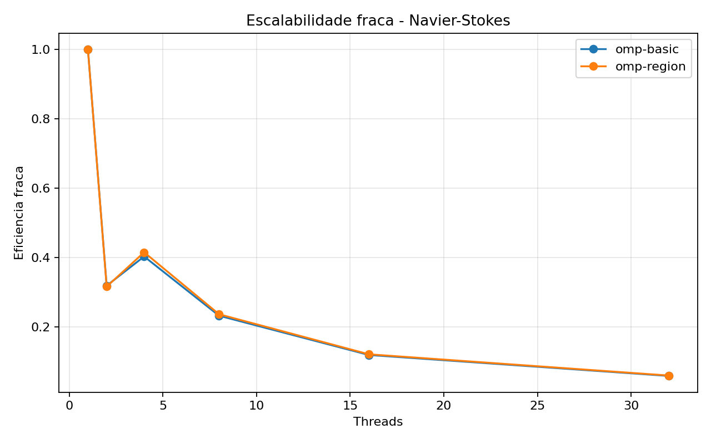

# Tarefa 12 - Escalabilidade do Navier-Stokes no NPAD

## Objetivo

Avaliar a escalabilidade do codigo de Navier-Stokes simplificado em um no de
computacao do NPAD. A Tarefa 11 ja havia validado a simulacao e comparado politicas
de escalonamento (`schedule`) e `collapse`; nesta tarefa, o foco passou a ser medir
como o mesmo problema escala ao aumentar o numero de threads.

Foram analisadas duas formas de evolucao do codigo:

- `omp-basic`: paralelizacao direta, criando uma regiao paralela a cada passo de tempo.
- `omp-region`: versao otimizada, mantendo uma unica regiao paralela durante todos os
  passos de tempo para reduzir overhead de criacao de threads.

## Configuracao

- Ambiente: no de computacao do NPAD, particao `intel-128`
- Threads testadas: `1`, `2`, `4`, `8`, `16`, `32`
- Rodadas por configuracao: `3`
- Passos de tempo: `1000`
- Viscosidade: `nu = 0.1`
- Passo temporal: `dt = 0.1`
- Inicializacao: perturbacao gaussiana central
- Escalonamento: `schedule(static)`
- Chunk: `0`
- Collapse: `1`
- Compilacao: `gcc -O3 -march=native -fopenmp`

O criterio de estabilidade usado foi `dt * nu <= 0.25`, considerando `dx = dy = 1`.
Como `dt * nu = 0.01`, todos os testes foram executados em regime estavel.

## Algoritmo implementado

O campo de velocidade foi representado por uma matriz escalar `u[i][j]`, interpretada
como uma componente da velocidade. A atualizacao por diferencas finitas usa o
Laplaciano discreto:

```c
u_next[i][j] = u[i][j] + dt * nu * (
    u[i-1][j] + u[i+1][j] + u[i][j-1] + u[i][j+1] - 4*u[i][j]
);
```

Assim como na Tarefa 11, foram usados dois buffers (`u` e `u_next`) para evitar
sobrescrever valores que ainda precisam ser lidos no mesmo passo de tempo.

## Validacao fisica

|Experimento|Rodadas|Max inicial|Max final|L2 inicial|L2 final|Estavel|
|---|---:|---:|---:|---:|---:|---|
|Escalabilidade forte|36|1.000000|0.999256|290.398839|290.290718|sim|
|Escalabilidade fraca|36|1.000000|varia por malha|varia por malha|menor que L2 inicial|sim|

Na malha fixa `2048 x 2048`, o valor maximo caiu de `1.000000` para `0.999256` e a
norma L2 caiu de `290.398839` para `290.290718`. Isso mostra que a perturbacao se
difundiu suavemente, sem explosao numerica.

O CSV final tem `73` linhas: `72` execucoes mais o cabecalho. Isso corresponde a
`2` experimentos, `2` versoes, `6` quantidades de threads e `3` rodadas por
configuracao.

## Escalabilidade forte

Na escalabilidade forte, o tamanho do problema fica fixo e o numero de threads varia.
Foi usada a malha `2048 x 2048` para todas as execucoes.

|Versao|Threads|Malha|Rodadas|Media (s)|Min (s)|Max (s)|Speedup|Eficiencia|
|---|---:|---:|---:|---:|---:|---:|---:|---:|
|omp-basic|1|2048x2048|3|6.529634|6.521298|6.535384|1.00|1.00|
|omp-basic|2|2048x2048|3|3.414947|3.406885|3.420093|1.91|0.95|
|omp-basic|4|2048x2048|3|2.129182|2.123220|2.135191|3.06|0.77|
|omp-basic|8|2048x2048|3|1.899235|1.892844|1.904388|3.43|0.43|
|omp-basic|16|2048x2048|3|1.782756|1.779627|1.784536|3.66|0.23|
|omp-basic|32|2048x2048|3|1.791694|1.789179|1.796187|3.64|0.11|
|omp-region|1|2048x2048|3|6.507249|6.495932|6.519441|1.00|1.00|
|omp-region|2|2048x2048|3|3.411885|3.360271|3.441045|1.90|0.95|
|omp-region|4|2048x2048|3|2.113142|2.109069|2.118903|3.07|0.77|
|omp-region|8|2048x2048|3|1.870998|1.868926|1.873211|3.47|0.43|
|omp-region|16|2048x2048|3|1.754020|1.753498|1.755017|3.70|0.23|
|omp-region|32|2048x2048|3|1.758773|1.758512|1.759043|3.69|0.12|


## Escalabilidade fraca

Na escalabilidade fraca, o tamanho da malha cresce junto com o numero de threads para
manter aproximadamente `1.048.576` celulas por thread.

|Versao|Threads|Malha|Celulas/thread|Rodadas|Media (s)|Min (s)|Max (s)|Eficiencia fraca|
|---|---:|---:|---:|---:|---:|---:|---:|---:|
|omp-basic|1|1024x1024|1048576|3|0.850414|0.849439|0.852336|1.00|
|omp-basic|2|1448x1448|1048352|3|2.667415|2.661783|2.674074|0.32|
|omp-basic|4|2048x2048|1048576|3|2.111824|2.106214|2.117978|0.40|
|omp-basic|8|2896x2896|1048352|3|3.666319|3.652625|3.673190|0.23|
|omp-basic|16|4096x4096|1048576|3|7.119258|7.114997|7.125171|0.12|
|omp-basic|32|5793x5793|1048714|3|14.407268|14.398931|14.413807|0.06|
|omp-region|1|1024x1024|1048576|3|0.861763|0.861042|0.863040|1.00|
|omp-region|2|1448x1448|1048352|3|2.752225|2.720508|2.815495|0.31|
|omp-region|4|2048x2048|1048576|3|2.078641|2.073233|2.082272|0.41|
|omp-region|8|2896x2896|1048352|3|3.645032|3.636627|3.656035|0.24|
|omp-region|16|4096x4096|1048576|3|7.098064|7.094450|7.103040|0.12|
|omp-region|32|5793x5793|1048714|3|14.313625|14.302583|14.328435|0.06|



## Ranking por numero de threads

### Escalabilidade forte

- 1 thread: `omp-region` = 6.507s, `omp-basic` = 6.530s.
- 2 threads: `omp-region` = 3.412s, `omp-basic` = 3.415s.
- 4 threads: `omp-region` = 2.113s, `omp-basic` = 2.129s.
- 8 threads: `omp-region` = 1.871s, `omp-basic` = 1.899s.
- 16 threads: `omp-region` = 1.754s, `omp-basic` = 1.783s.
- 32 threads: `omp-region` = 1.759s, `omp-basic` = 1.792s.

### Escalabilidade fraca

- 1 thread: `omp-basic` = 0.850s, `omp-region` = 0.862s.
- 2 threads: `omp-basic` = 2.667s, `omp-region` = 2.752s.
- 4 threads: `omp-region` = 2.079s, `omp-basic` = 2.112s.
- 8 threads: `omp-region` = 3.645s, `omp-basic` = 3.666s.
- 16 threads: `omp-region` = 7.098s, `omp-basic` = 7.119s.
- 32 threads: `omp-region` = 14.314s, `omp-basic` = 14.407s.

## Analise conceitual

### 1. Escalabilidade forte

O melhor resultado forte foi obtido por `omp-region` com 16 threads: media de
`1.754s` e speedup de `3.70x`. Com 32 threads, o tempo ficou praticamente igual
(`1.759s`) e o speedup caiu levemente para `3.69x`.

Isso mostra que o codigo escala bem ate 4 threads, ainda ganha ate 8 e 16 threads,
mas entra em saturacao depois disso. O problema faz poucas operacoes aritmeticas por
celula e acessa varios valores de memoria (`centro`, `cima`, `baixo`, `esquerda`,
`direita`). Portanto, o gargalo mais provavel passa a ser largura de banda de memoria
e sincronizacao entre passos de tempo.

### 2. Escalabilidade fraca

Na escalabilidade fraca, o ideal seria o tempo permanecer proximo ao tempo com
1 thread. Isso nao ocorreu: para `omp-region`, o tempo subiu de `0.862s` em
`1024 x 1024` com 1 thread para `14.314s` em `5793 x 5793` com 32 threads.

A eficiencia fraca caiu de `1.00` para `0.06`. Esse comportamento indica que manter
o mesmo numero de celulas por thread nao foi suficiente para preservar desempenho. Ao
crescer a malha, aumentam a pressao sobre memoria/cache, o custo de varrer arrays
maiores e o impacto das barreiras entre passos.

### 3. `omp-basic` vs `omp-region`

A versao `omp-region` foi consistentemente melhor na escalabilidade forte. A diferenca
nao foi enorme, mas foi estavel: com 32 threads, `omp-region` fez `1.759s`, enquanto
`omp-basic` fez `1.792s`.

Isso confirma a ideia da evolucao do codigo: evitar recriar a regiao paralela a cada
passo reduz overhead. No entanto, como o kernel e dominado por memoria, essa otimizacao
nao muda completamente o limite de escalabilidade.

### 4. Gargalos observados

O principal gargalo aparece depois de 8 a 16 threads. A eficiencia forte de
`omp-region` caiu de `0.77` com 4 threads para `0.43` com 8 threads, `0.23` com
16 threads e `0.12` com 32 threads.

Essa queda e esperada para um stencil 2D simples: cada atualizacao usa poucos calculos
e muitos acessos a memoria. A partir de certo ponto, adicionar threads aumenta disputa
por banda de memoria e nao reduz proporcionalmente o tempo total.

## Comparacao com a Tarefa 11

Na Tarefa 11, o foco era comparar politicas de divisao de trabalho em uma malha
`1024 x 1024`, testando `schedule(static)`, `dynamic`, `guided` e `collapse`. O melhor
caso foi `schedule(static)` com `collapse=1` e 8 threads: `0.305s`, speedup medio de
`2.87x`.

Na Tarefa 12, o foco mudou para escalabilidade em um no do NPAD. A malha forte foi
maior (`2048 x 2048`) e foram testadas ate 32 threads. O melhor caso forte foi
`omp-region` com 16 threads: `1.754s`, speedup de `3.70x`. Com 32 threads, o tempo
ficou em `1.759s`, praticamente sem ganho adicional.

As duas tarefas chegam a conclusoes compatíveis:

- `schedule(static)` continua sendo a escolha adequada para esse stencil regular.
- `collapse(2)` nao foi necessario, pois o laco externo ja tinha iteracoes suficientes.
- O gargalo principal nao e balanceamento de carga, mas memoria e sincronizacao.
- Aumentar threads ajuda ate certo ponto; depois a eficiencia cai rapidamente.

A Tarefa 11 mostrou qual configuracao OpenMP era mais adequada. A Tarefa 12 mostrou o
limite dessa configuracao em um ambiente de alto desempenho: a versao otimizada escala
ate cerca de 16 threads, mas satura antes de aproveitar completamente 32 threads.

## Conclusao

A Tarefa 12 confirmou que a simulacao permanece numericamente estavel no NPAD e que a
versao otimizada `omp-region` melhora levemente a execucao em relacao a `omp-basic`.
Na escalabilidade forte, houve bom ganho ate 4 threads, ganho moderado ate 8 e 16
threads, e saturacao em 32 threads.

Na escalabilidade fraca, a eficiencia caiu significativamente conforme o problema
cresceu. Isso reforca que o kernel e limitado por memoria: mesmo aumentando o tamanho
do problema junto com o numero de threads, o custo de movimentar dados e sincronizar
os passos domina a execucao.

## Códigos

```c
#include <math.h>
#include <omp.h>
#include <stdio.h>
#include <stdlib.h>
#include <string.h>

typedef struct {
    int nx;
    int ny;
    int steps;
    double nu;
    double dt;
    const char *mode;
    const char *init;
    const char *schedule_name;
    int chunk;
    int collapse;
    double u0;
} Config;

typedef struct {
    double min;
    double max;
    double l2;
    double sum;
} Stats;

static int idx(int i, int j, int ny) {
    return i * ny + j;
}

static void set_defaults(Config *cfg) {
    cfg->nx = 1024;
    cfg->ny = 1024;
    cfg->steps = 1000;
    cfg->nu = 0.1;
    cfg->dt = 0.1;
    cfg->mode = "omp-region";
    cfg->init = "perturb";
    cfg->schedule_name = "static";
    cfg->chunk = 0;
    cfg->collapse = 1;
    cfg->u0 = 1.0;
}

static void usage(const char *prog) {
    printf("Uso: %s [opcoes]\n", prog);
    printf("  --mode seq|omp-basic|omp-region\n");
    printf("  --nx <int> --ny <int> --steps <int>\n");
    printf("  --nu <double> --dt <double>\n");
    printf("  --init zero|uniform|perturb --u0 <double>\n");
    printf("  --schedule static|dynamic|guided|auto --chunk <int>\n");
    printf("  --collapse 1|2\n");
}

static int parse_int(const char *s, int *out) {
    char *end = NULL;
    long v = strtol(s, &end, 10);
    if (end == s || *end != '\0') return 0;
    *out = (int)v;
    return 1;
}

static int parse_double(const char *s, double *out) {
    char *end = NULL;
    double v = strtod(s, &end);
    if (end == s || *end != '\0') return 0;
    *out = v;
    return 1;
}

static int parse_args(int argc, char **argv, Config *cfg) {
    int i;
    for (i = 1; i < argc; i++) {
        if (strcmp(argv[i], "--mode") == 0 && i + 1 < argc) {
            cfg->mode = argv[++i];
        } else if (strcmp(argv[i], "--nx") == 0 && i + 1 < argc) {
            if (!parse_int(argv[++i], &cfg->nx)) return 0;
        } else if (strcmp(argv[i], "--ny") == 0 && i + 1 < argc) {
            if (!parse_int(argv[++i], &cfg->ny)) return 0;
        } else if (strcmp(argv[i], "--steps") == 0 && i + 1 < argc) {
            if (!parse_int(argv[++i], &cfg->steps)) return 0;
        } else if (strcmp(argv[i], "--nu") == 0 && i + 1 < argc) {
            if (!parse_double(argv[++i], &cfg->nu)) return 0;
        } else if (strcmp(argv[i], "--dt") == 0 && i + 1 < argc) {
            if (!parse_double(argv[++i], &cfg->dt)) return 0;
        } else if (strcmp(argv[i], "--init") == 0 && i + 1 < argc) {
            cfg->init = argv[++i];
        } else if (strcmp(argv[i], "--u0") == 0 && i + 1 < argc) {
            if (!parse_double(argv[++i], &cfg->u0)) return 0;
        } else if (strcmp(argv[i], "--schedule") == 0 && i + 1 < argc) {
            cfg->schedule_name = argv[++i];
        } else if (strcmp(argv[i], "--chunk") == 0 && i + 1 < argc) {
            if (!parse_int(argv[++i], &cfg->chunk)) return 0;
        } else if (strcmp(argv[i], "--collapse") == 0 && i + 1 < argc) {
            if (!parse_int(argv[++i], &cfg->collapse)) return 0;
        } else {
            return 0;
        }
    }
    return 1;
}

static int validate_config(const Config *cfg) {
    if (cfg->nx < 3 || cfg->ny < 3 || cfg->steps < 0) return 0;
    if (cfg->nu <= 0.0 || cfg->dt <= 0.0) return 0;
    if (strcmp(cfg->mode, "seq") != 0 &&
        strcmp(cfg->mode, "omp-basic") != 0 &&
        strcmp(cfg->mode, "omp-region") != 0) return 0;
    if (strcmp(cfg->init, "zero") != 0 &&
        strcmp(cfg->init, "uniform") != 0 &&
        strcmp(cfg->init, "perturb") != 0) return 0;
    if (strcmp(cfg->schedule_name, "static") != 0 &&
        strcmp(cfg->schedule_name, "dynamic") != 0 &&
        strcmp(cfg->schedule_name, "guided") != 0 &&
        strcmp(cfg->schedule_name, "auto") != 0) return 0;
    if (cfg->chunk < 0) return 0;
    if (cfg->collapse != 1 && cfg->collapse != 2) return 0;
    return 1;
}

static int is_stable(const Config *cfg) {
    return cfg->dt * cfg->nu <= 0.25;
}

static omp_sched_t to_omp_sched(const char *name) {
    if (strcmp(name, "dynamic") == 0) return omp_sched_dynamic;
    if (strcmp(name, "guided") == 0) return omp_sched_guided;
    if (strcmp(name, "auto") == 0) return omp_sched_auto;
    return omp_sched_static;
}

static void apply_boundary_seq(double *u, int nx, int ny) {
    int i, j;
    for (j = 1; j < ny - 1; j++) {
        u[idx(0, j, ny)] = u[idx(1, j, ny)];
        u[idx(nx - 1, j, ny)] = u[idx(nx - 2, j, ny)];
    }
    for (i = 1; i < nx - 1; i++) {
        u[idx(i, 0, ny)] = u[idx(i, 1, ny)];
        u[idx(i, ny - 1, ny)] = u[idx(i, ny - 2, ny)];
    }
    u[idx(0, 0, ny)] = u[idx(1, 1, ny)];
    u[idx(0, ny - 1, ny)] = u[idx(1, ny - 2, ny)];
    u[idx(nx - 1, 0, ny)] = u[idx(nx - 2, 1, ny)];
    u[idx(nx - 1, ny - 1, ny)] = u[idx(nx - 2, ny - 2, ny)];
}

static void init_field(double *u, const Config *cfg) {
    int i, j;
    int cx = cfg->nx / 2;
    int cy = cfg->ny / 2;

    for (i = 0; i < cfg->nx; i++) {
        for (j = 0; j < cfg->ny; j++) {
            u[idx(i, j, cfg->ny)] = 0.0;
        }
    }

    if (strcmp(cfg->init, "uniform") == 0) {
        for (i = 0; i < cfg->nx; i++) {
            for (j = 0; j < cfg->ny; j++) {
                u[idx(i, j, cfg->ny)] = cfg->u0;
            }
        }
    } else if (strcmp(cfg->init, "perturb") == 0) {
        double sigma = 0.08 * (cfg->nx < cfg->ny ? cfg->nx : cfg->ny);
        if (sigma < 1.0) sigma = 1.0;
        for (i = 1; i < cfg->nx - 1; i++) {
            for (j = 1; j < cfg->ny - 1; j++) {
                double dx = (double)(i - cx);
                double dy = (double)(j - cy);
                double r2 = dx * dx + dy * dy;
                u[idx(i, j, cfg->ny)] = cfg->u0 * exp(-r2 / (2.0 * sigma * sigma));
            }
        }
        apply_boundary_seq(u, cfg->nx, cfg->ny);
    }
}

static void step_seq(const double *restrict u, double *restrict u_next, const Config *cfg) {
    int i, j;
    int ny = cfg->ny;
    double alpha = cfg->dt * cfg->nu;

    for (i = 1; i < cfg->nx - 1; i++) {
        for (j = 1; j < cfg->ny - 1; j++) {
            int p = idx(i, j, ny);
            double c = u[p];
            double lap = u[p - ny] + u[p + ny] + u[p - 1] + u[p + 1] - 4.0 * c;
            u_next[p] = c + alpha * lap;
        }
    }
    apply_boundary_seq(u_next, cfg->nx, cfg->ny);
}

static void simulate_seq(double **u_ptr, double **u_next_ptr, const Config *cfg) {
    int t;
    double *u = *u_ptr;
    double *u_next = *u_next_ptr;
    for (t = 0; t < cfg->steps; t++) {
        double *tmp;
        step_seq(u, u_next, cfg);
        tmp = u;
        u = u_next;
        u_next = tmp;
    }
    *u_ptr = u;
    *u_next_ptr = u_next;
}

static void step_omp_basic(const double *restrict u, double *restrict u_next, const Config *cfg) {
    int i, j;
    int ny = cfg->ny;
    double alpha = cfg->dt * cfg->nu;
    omp_set_schedule(to_omp_sched(cfg->schedule_name), cfg->chunk);

    if (cfg->collapse == 2) {
#pragma omp parallel for collapse(2) schedule(runtime)
        for (i = 1; i < cfg->nx - 1; i++) {
            for (j = 1; j < cfg->ny - 1; j++) {
                int p = idx(i, j, ny);
                double c = u[p];
                double lap = u[p - ny] + u[p + ny] + u[p - 1] + u[p + 1] - 4.0 * c;
                u_next[p] = c + alpha * lap;
            }
        }
    } else {
#pragma omp parallel for schedule(runtime)
        for (i = 1; i < cfg->nx - 1; i++) {
            for (j = 1; j < cfg->ny - 1; j++) {
                int p = idx(i, j, ny);
                double c = u[p];
                double lap = u[p - ny] + u[p + ny] + u[p - 1] + u[p + 1] - 4.0 * c;
                u_next[p] = c + alpha * lap;
            }
        }
    }
    apply_boundary_seq(u_next, cfg->nx, cfg->ny);
}

static void simulate_omp_basic(double **u_ptr, double **u_next_ptr, const Config *cfg) {
    int t;
    double *u = *u_ptr;
    double *u_next = *u_next_ptr;
    for (t = 0; t < cfg->steps; t++) {
        double *tmp;
        step_omp_basic(u, u_next, cfg);
        tmp = u;
        u = u_next;
        u_next = tmp;
    }
    *u_ptr = u;
    *u_next_ptr = u_next;
}

static void simulate_omp_region(double **u_ptr, double **u_next_ptr, const Config *cfg) {
    int nx = cfg->nx;
    int ny = cfg->ny;
    double alpha = cfg->dt * cfg->nu;
    double *u = *u_ptr;
    double *u_next = *u_next_ptr;

    omp_set_schedule(to_omp_sched(cfg->schedule_name), cfg->chunk);

#pragma omp parallel shared(u, u_next)
    {
        int i, j;
        int step;
        for (step = 0; step < cfg->steps; step++) {
            if (cfg->collapse == 2) {
#pragma omp for collapse(2) schedule(runtime)
                for (i = 1; i < nx - 1; i++) {
                    for (j = 1; j < ny - 1; j++) {
                        int p = idx(i, j, ny);
                        double c = u[p];
                        double lap = u[p - ny] + u[p + ny] + u[p - 1] + u[p + 1] - 4.0 * c;
                        u_next[p] = c + alpha * lap;
                    }
                }
            } else {
#pragma omp for schedule(runtime)
                for (i = 1; i < nx - 1; i++) {
                    for (j = 1; j < ny - 1; j++) {
                        int p = idx(i, j, ny);
                        double c = u[p];
                        double lap = u[p - ny] + u[p + ny] + u[p - 1] + u[p + 1] - 4.0 * c;
                        u_next[p] = c + alpha * lap;
                    }
                }
            }

#pragma omp for schedule(static)
            for (j = 1; j < ny - 1; j++) {
                u_next[idx(0, j, ny)] = u_next[idx(1, j, ny)];
                u_next[idx(nx - 1, j, ny)] = u_next[idx(nx - 2, j, ny)];
            }
#pragma omp for schedule(static)
            for (i = 1; i < nx - 1; i++) {
                u_next[idx(i, 0, ny)] = u_next[idx(i, 1, ny)];
                u_next[idx(i, ny - 1, ny)] = u_next[idx(i, ny - 2, ny)];
            }
#pragma omp single
            {
                double *tmp;
                u_next[idx(0, 0, ny)] = u_next[idx(1, 1, ny)];
                u_next[idx(0, ny - 1, ny)] = u_next[idx(1, ny - 2, ny)];
                u_next[idx(nx - 1, 0, ny)] = u_next[idx(nx - 2, 1, ny)];
                u_next[idx(nx - 1, ny - 1, ny)] = u_next[idx(nx - 2, ny - 2, ny)];

                tmp = u;
                u = u_next;
                u_next = tmp;
            }
        }
    }

    *u_ptr = u;
    *u_next_ptr = u_next;
}

static Stats field_stats(const double *u, int nx, int ny) {
    int i;
    int n = nx * ny;
    Stats s;
    double acc = 0.0;
    s.min = u[0];
    s.max = u[0];
    s.sum = 0.0;

    for (i = 0; i < n; i++) {
        if (u[i] < s.min) s.min = u[i];
        if (u[i] > s.max) s.max = u[i];
        acc += u[i] * u[i];
        s.sum += u[i];
    }
    s.l2 = sqrt(acc);
    return s;
}

int main(int argc, char **argv) {
    Config cfg;
    double *u = NULL;
    double *u_next = NULL;
    int n_cells;
    double t0, t1;
    Stats initial, final;

    set_defaults(&cfg);
    if (!parse_args(argc, argv, &cfg) || !validate_config(&cfg)) {
        usage(argv[0]);
        return 1;
    }

    if (!is_stable(&cfg)) {
        fprintf(stderr, "Aviso: dt*nu=%.6f excede 0.25 para dx=dy=1.\n", cfg.dt * cfg.nu);
    }

    n_cells = cfg.nx * cfg.ny;
    u = (double *)malloc((size_t)n_cells * sizeof(double));
    u_next = (double *)malloc((size_t)n_cells * sizeof(double));
    if (!u || !u_next) {
        fprintf(stderr, "Erro: falha de alocacao para %d celulas.\n", n_cells);
        free(u);
        free(u_next);
        return 1;
    }

    init_field(u, &cfg);
    init_field(u_next, &cfg);
    initial = field_stats(u, cfg.nx, cfg.ny);

    t0 = omp_get_wtime();
    if (strcmp(cfg.mode, "seq") == 0) {
        simulate_seq(&u, &u_next, &cfg);
    } else if (strcmp(cfg.mode, "omp-basic") == 0) {
        simulate_omp_basic(&u, &u_next, &cfg);
    } else {
        simulate_omp_region(&u, &u_next, &cfg);
    }
    t1 = omp_get_wtime();

    final = field_stats(u, cfg.nx, cfg.ny);

    printf("CONFIG mode=%s nx=%d ny=%d steps=%d nu=%.8f dt=%.8f init=%s u0=%.8f schedule=%s chunk=%d collapse=%d threads=%d stable=%s\n",
           cfg.mode, cfg.nx, cfg.ny, cfg.steps, cfg.nu, cfg.dt, cfg.init, cfg.u0,
           cfg.schedule_name, cfg.chunk, cfg.collapse, omp_get_max_threads(),
           is_stable(&cfg) ? "yes" : "no");
    printf("INITIAL min=%.12f max=%.12f l2=%.12f sum=%.12f\n",
           initial.min, initial.max, initial.l2, initial.sum);
    printf("RESULT elapsed=%.9f min=%.12f max=%.12f l2=%.12f sum=%.12f\n",
           t1 - t0, final.min, final.max, final.l2, final.sum);

    free(u);
    free(u_next);
    return 0;
}
```