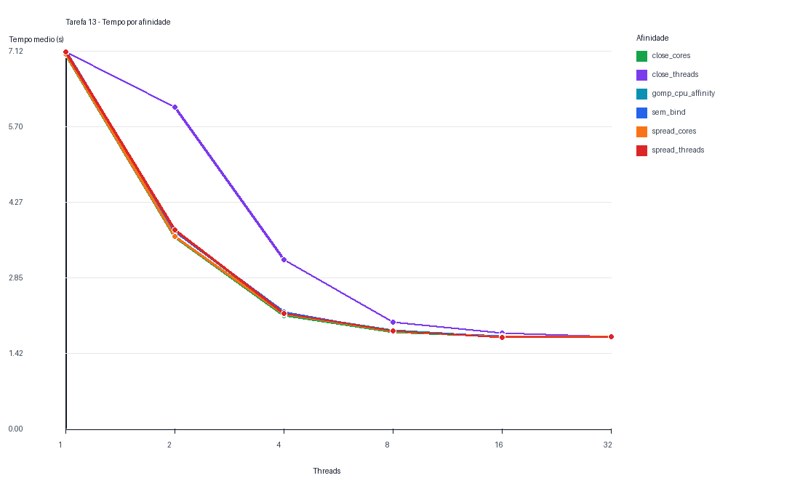
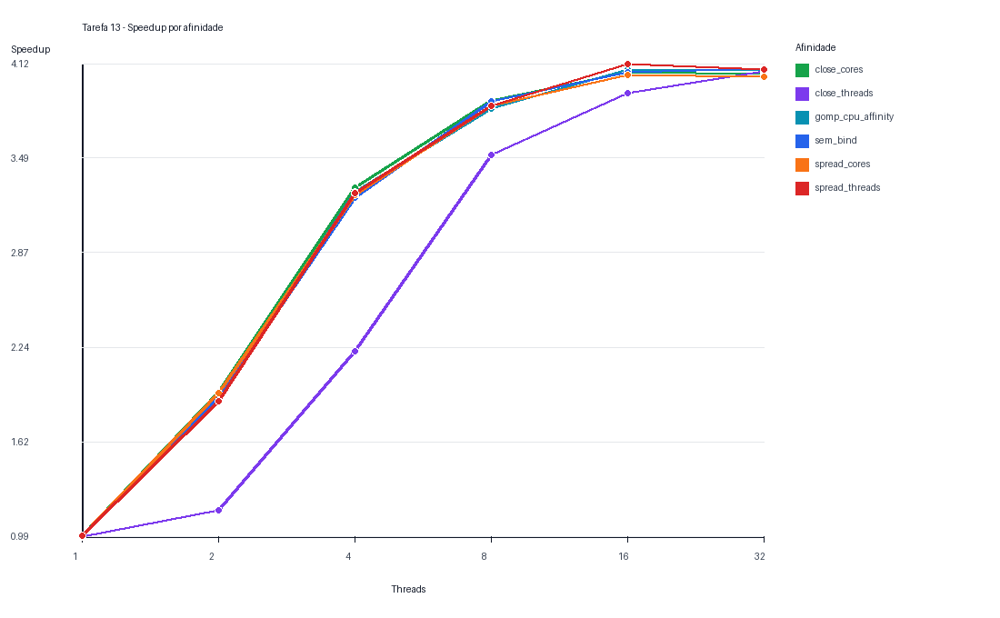

# Tarefa 13 - Afinidade de Threads no Navier-Stokes

## Objetivo

Avaliar como a escalabilidade do codigo de Navier-Stokes da Tarefa 12 muda quando
alteramos a afinidade das threads no mesmo no de computacao do NPAD.

Como a Tarefa 12 mostrou que `omp-region` foi a versao mais consistente na
escalabilidade forte, a Tarefa 13 usa essa versao como base e varia apenas a politica
de afinidade. Isso isola melhor o efeito de `OMP_PROC_BIND`, `OMP_PLACES` e
`GOMP_CPU_AFFINITY`.

## Configuracao

- Modo do codigo: `omp-region`
- Malha fixa: `2048 x 2048`
- Passos de tempo: `1000`
- Escalonamento: `schedule(static)`
- Chunk: `0`
- Collapse: `1`
- Threads testadas: `1, 2, 4, 8, 16, 32`
- Afinidades testadas: `6`
- Rodadas coletadas: `108`
- Compilacao: `gcc -O3 -march=native -fopenmp`

## Politicas de afinidade

- `sem_bind`: `OMP_PROC_BIND=false`, sem `OMP_PLACES` explicito.
- `close_cores`: `OMP_PROC_BIND=close` e `OMP_PLACES=cores`.
- `spread_cores`: `OMP_PROC_BIND=spread` e `OMP_PLACES=cores`.
- `close_threads`: `OMP_PROC_BIND=close` e `OMP_PLACES=threads`.
- `spread_threads`: `OMP_PROC_BIND=spread` e `OMP_PLACES=threads`.
- `gomp_cpu_affinity`: usa `GOMP_CPU_AFFINITY` para listar explicitamente as CPUs
  disponiveis ao processo, uma extensao do runtime GNU OpenMP.

## Validacao numerica

O mesmo criterio numerico da Tarefa 12 foi mantido: `dt * nu <= 0.25`. A execucao
registrada iniciou com maximo `1.000000` e terminou com maximo
`0.999256` no primeiro caso coletado. A norma L2 tambem foi registrada
em todas as rodadas para confirmar que a mudanca de afinidade nao altera o resultado
fisico, apenas o tempo de execucao.

## Resultados

|Afinidade|Threads|OMP_PROC_BIND|OMP_PLACES|Rodadas|Media (s)|Min (s)|Max (s)|Speedup|Eficiencia|
|---|---:|---|---|---:|---:|---:|---:|---:|---:|
|close_cores|1|close|cores|3|7.054435|7.041570|7.078738|1.00|1.00|
|close_cores|2|close|cores|3|3.615176|3.609295|3.619673|1.95|0.97|
|close_cores|4|close|cores|3|2.136567|2.133575|2.140000|3.30|0.82|
|close_cores|8|close|cores|3|1.817856|1.805036|1.838859|3.87|0.48|
|close_cores|16|close|cores|3|1.735049|1.730766|1.739202|4.06|0.25|
|close_cores|32|close|cores|3|1.740236|1.739996|1.740429|4.05|0.13|
|close_threads|1|close|threads|3|7.108468|7.061370|7.146916|0.99|0.99|
|close_threads|2|close|threads|3|6.061661|6.056218|6.064670|1.16|0.58|
|close_threads|4|close|threads|3|3.188963|3.187868|3.190675|2.21|0.55|
|close_threads|8|close|threads|3|2.010926|2.005471|2.019658|3.51|0.44|
|close_threads|16|close|threads|3|1.801664|1.797556|1.803991|3.92|0.24|
|close_threads|32|close|threads|3|1.735626|1.734961|1.736062|4.07|0.13|
|gomp_cpu_affinity|1|-|-|3|7.102990|7.068519|7.165997|1.00|1.00|
|gomp_cpu_affinity|2|-|-|3|3.726741|3.722072|3.731056|1.90|0.95|
|gomp_cpu_affinity|4|-|-|3|2.164960|2.151888|2.178513|3.27|0.82|
|gomp_cpu_affinity|8|-|-|3|1.849523|1.848763|1.850192|3.82|0.48|
|gomp_cpu_affinity|16|-|-|3|1.731968|1.730508|1.733557|4.08|0.26|
|gomp_cpu_affinity|32|-|-|3|1.736284|1.736243|1.736358|4.07|0.13|
|sem_bind|1|false|-|3|7.123393|7.087278|7.177207|0.99|0.99|
|sem_bind|2|false|-|3|3.717072|3.686663|3.747390|1.91|0.95|
|sem_bind|4|false|-|3|2.192430|2.190027|2.194006|3.23|0.81|
|sem_bind|8|false|-|3|1.830975|1.828843|1.832696|3.87|0.48|
|sem_bind|16|false|-|3|1.744570|1.730988|1.754475|4.06|0.25|
|sem_bind|32|false|-|3|1.736150|1.735671|1.736468|4.08|0.13|
|spread_cores|1|spread|cores|3|7.056997|7.018930|7.084616|0.99|0.99|
|spread_cores|2|spread|cores|3|3.619500|3.573061|3.657120|1.94|0.97|
|spread_cores|4|spread|cores|3|2.161321|2.134826|2.210120|3.25|0.81|
|spread_cores|8|spread|cores|3|1.829668|1.803823|1.842835|3.84|0.48|
|spread_cores|16|spread|cores|3|1.736381|1.732204|1.740155|4.04|0.25|
|spread_cores|32|spread|cores|3|1.741618|1.741434|1.741759|4.03|0.13|
|spread_threads|1|spread|threads|3|7.108342|7.071734|7.139409|0.99|0.99|
|spread_threads|2|spread|threads|3|3.750598|3.740731|3.755898|1.89|0.94|
|spread_threads|4|spread|threads|3|2.169655|2.157935|2.175730|3.26|0.81|
|spread_threads|8|spread|threads|3|1.843063|1.821013|1.856067|3.84|0.48|
|spread_threads|16|spread|threads|3|1.717527|1.717233|1.717769|4.12|0.26|
|spread_threads|32|spread|threads|3|1.733905|1.728820|1.741087|4.08|0.13|





## Ranking por numero de threads

- 1 threads: melhor `close_cores` com media 7.054435s; pior `sem_bind` com media 7.123393s; diferenca de 1.0%.
- 2 threads: melhor `close_cores` com media 3.615176s; pior `close_threads` com media 6.061661s; diferenca de 67.7%.
- 4 threads: melhor `close_cores` com media 2.136567s; pior `close_threads` com media 3.188963s; diferenca de 49.3%.
- 8 threads: melhor `close_cores` com media 1.817856s; pior `close_threads` com media 2.010926s; diferenca de 10.6%.
- 16 threads: melhor `spread_threads` com media 1.717527s; pior `close_threads` com media 1.801664s; diferenca de 4.9%.
- 32 threads: melhor `spread_threads` com media 1.733905s; pior `spread_cores` com media 1.741618s; diferenca de 0.4%.

## Analise

O melhor caso agregado foi `spread_threads` com `16` threads,
media de `1.717527s` e speedup de `4.12x` dentro da propria
politica de afinidade.

As politicas `close` tendem a favorecer localidade de cache, porque mantem threads em
posicoes proximas. Isso pode ajudar quando o trabalho compartilha dados proximos na
memoria. As politicas `spread` tendem a distribuir threads pelo no, o que pode reduzir
competicao local por recursos de um mesmo nucleo fisico ou socket. Para este stencil
2D, que faz poucos calculos por celula e muitos acessos a memoria, o resultado tende
a depender fortemente da largura de banda de memoria e da topologia do no.

Na Tarefa 12, o desempenho saturou depois de 8 a 16 threads. A Tarefa 13 verifica se
essa saturacao muda quando o runtime fixa as threads em nucleos proximos, espalha as
threads pelo no ou deixa o sistema operacional migrar threads. Se `sem_bind` for pior,
isso indica custo de migracao e perda de localidade. Se `spread_cores` for melhor em
altas contagens de threads, isso sugere que distribuir o acesso a memoria e aos caches
do no foi mais importante que manter as threads proximas.

## Artefatos

- Codigo: `Tarefa-13/navier_scaling.c`
- Coleta: `Tarefa-13/coletar_afinidade.py`
- CSV: `Tarefa-13/resultados/tarefa13_afinidade.csv`
- Graficos: `Tarefa-13/resultados/affinity_elapsed.png` e
  `Tarefa-13/resultados/affinity_speedup.png`
- Relatorio: `Tarefa-13/resultados/relatorio_tarefa13.md`

<!-- codigos-fonte-c-inicio -->
## Codigos fonte C usados nos testes

### `Tarefa-13/navier_scaling.c`

```c
#include <math.h>
#include <omp.h>
#include <stdio.h>
#include <stdlib.h>
#include <string.h>

typedef struct {
    int nx;
    int ny;
    int steps;
    double nu;
    double dt;
    const char *mode;
    const char *init;
    const char *schedule_name;
    int chunk;
    int collapse;
    double u0;
} Config;

typedef struct {
    double min;
    double max;
    double l2;
    double sum;
} Stats;

static int idx(int i, int j, int ny) {
    return i * ny + j;
}

static void set_defaults(Config *cfg) {
    cfg->nx = 1024;
    cfg->ny = 1024;
    cfg->steps = 1000;
    cfg->nu = 0.1;
    cfg->dt = 0.1;
    cfg->mode = "omp-region";
    cfg->init = "perturb";
    cfg->schedule_name = "static";
    cfg->chunk = 0;
    cfg->collapse = 1;
    cfg->u0 = 1.0;
}

static void usage(const char *prog) {
    printf("Uso: %s [opcoes]\n", prog);
    printf("  --mode seq|omp-basic|omp-region\n");
    printf("  --nx <int> --ny <int> --steps <int>\n");
    printf("  --nu <double> --dt <double>\n");
    printf("  --init zero|uniform|perturb --u0 <double>\n");
    printf("  --schedule static|dynamic|guided|auto --chunk <int>\n");
    printf("  --collapse 1|2\n");
}

static int parse_int(const char *s, int *out) {
    char *end = NULL;
    long v = strtol(s, &end, 10);
    if (end == s || *end != '\0') return 0;
    *out = (int)v;
    return 1;
}

static int parse_double(const char *s, double *out) {
    char *end = NULL;
    double v = strtod(s, &end);
    if (end == s || *end != '\0') return 0;
    *out = v;
    return 1;
}

static int parse_args(int argc, char **argv, Config *cfg) {
    int i;
    for (i = 1; i < argc; i++) {
        if (strcmp(argv[i], "--mode") == 0 && i + 1 < argc) {
            cfg->mode = argv[++i];
        } else if (strcmp(argv[i], "--nx") == 0 && i + 1 < argc) {
            if (!parse_int(argv[++i], &cfg->nx)) return 0;
        } else if (strcmp(argv[i], "--ny") == 0 && i + 1 < argc) {
            if (!parse_int(argv[++i], &cfg->ny)) return 0;
        } else if (strcmp(argv[i], "--steps") == 0 && i + 1 < argc) {
            if (!parse_int(argv[++i], &cfg->steps)) return 0;
        } else if (strcmp(argv[i], "--nu") == 0 && i + 1 < argc) {
            if (!parse_double(argv[++i], &cfg->nu)) return 0;
        } else if (strcmp(argv[i], "--dt") == 0 && i + 1 < argc) {
            if (!parse_double(argv[++i], &cfg->dt)) return 0;
        } else if (strcmp(argv[i], "--init") == 0 && i + 1 < argc) {
            cfg->init = argv[++i];
        } else if (strcmp(argv[i], "--u0") == 0 && i + 1 < argc) {
            if (!parse_double(argv[++i], &cfg->u0)) return 0;
        } else if (strcmp(argv[i], "--schedule") == 0 && i + 1 < argc) {
            cfg->schedule_name = argv[++i];
        } else if (strcmp(argv[i], "--chunk") == 0 && i + 1 < argc) {
            if (!parse_int(argv[++i], &cfg->chunk)) return 0;
        } else if (strcmp(argv[i], "--collapse") == 0 && i + 1 < argc) {
            if (!parse_int(argv[++i], &cfg->collapse)) return 0;
        } else {
            return 0;
        }
    }
    return 1;
}

static int validate_config(const Config *cfg) {
    if (cfg->nx < 3 || cfg->ny < 3 || cfg->steps < 0) return 0;
    if (cfg->nu <= 0.0 || cfg->dt <= 0.0) return 0;
    if (strcmp(cfg->mode, "seq") != 0 &&
        strcmp(cfg->mode, "omp-basic") != 0 &&
        strcmp(cfg->mode, "omp-region") != 0) return 0;
    if (strcmp(cfg->init, "zero") != 0 &&
        strcmp(cfg->init, "uniform") != 0 &&
        strcmp(cfg->init, "perturb") != 0) return 0;
    if (strcmp(cfg->schedule_name, "static") != 0 &&
        strcmp(cfg->schedule_name, "dynamic") != 0 &&
        strcmp(cfg->schedule_name, "guided") != 0 &&
        strcmp(cfg->schedule_name, "auto") != 0) return 0;
    if (cfg->chunk < 0) return 0;
    if (cfg->collapse != 1 && cfg->collapse != 2) return 0;
    return 1;
}

static int is_stable(const Config *cfg) {
    return cfg->dt * cfg->nu <= 0.25;
}

static omp_sched_t to_omp_sched(const char *name) {
    if (strcmp(name, "dynamic") == 0) return omp_sched_dynamic;
    if (strcmp(name, "guided") == 0) return omp_sched_guided;
    if (strcmp(name, "auto") == 0) return omp_sched_auto;
    return omp_sched_static;
}

static void apply_boundary_seq(double *u, int nx, int ny) {
    int i, j;
    for (j = 1; j < ny - 1; j++) {
        u[idx(0, j, ny)] = u[idx(1, j, ny)];
        u[idx(nx - 1, j, ny)] = u[idx(nx - 2, j, ny)];
    }
    for (i = 1; i < nx - 1; i++) {
        u[idx(i, 0, ny)] = u[idx(i, 1, ny)];
        u[idx(i, ny - 1, ny)] = u[idx(i, ny - 2, ny)];
    }
    u[idx(0, 0, ny)] = u[idx(1, 1, ny)];
    u[idx(0, ny - 1, ny)] = u[idx(1, ny - 2, ny)];
    u[idx(nx - 1, 0, ny)] = u[idx(nx - 2, 1, ny)];
    u[idx(nx - 1, ny - 1, ny)] = u[idx(nx - 2, ny - 2, ny)];
}

static void init_field(double *u, const Config *cfg) {
    int i, j;
    int cx = cfg->nx / 2;
    int cy = cfg->ny / 2;

    for (i = 0; i < cfg->nx; i++) {
        for (j = 0; j < cfg->ny; j++) {
            u[idx(i, j, cfg->ny)] = 0.0;
        }
    }

    if (strcmp(cfg->init, "uniform") == 0) {
        for (i = 0; i < cfg->nx; i++) {
            for (j = 0; j < cfg->ny; j++) {
                u[idx(i, j, cfg->ny)] = cfg->u0;
            }
        }
    } else if (strcmp(cfg->init, "perturb") == 0) {
        double sigma = 0.08 * (cfg->nx < cfg->ny ? cfg->nx : cfg->ny);
        if (sigma < 1.0) sigma = 1.0;
        for (i = 1; i < cfg->nx - 1; i++) {
            for (j = 1; j < cfg->ny - 1; j++) {
                double dx = (double)(i - cx);
                double dy = (double)(j - cy);
                double r2 = dx * dx + dy * dy;
                u[idx(i, j, cfg->ny)] = cfg->u0 * exp(-r2 / (2.0 * sigma * sigma));
            }
        }
        apply_boundary_seq(u, cfg->nx, cfg->ny);
    }
}

static void step_seq(const double *restrict u, double *restrict u_next, const Config *cfg) {
    int i, j;
    int ny = cfg->ny;
    double alpha = cfg->dt * cfg->nu;

    for (i = 1; i < cfg->nx - 1; i++) {
        for (j = 1; j < cfg->ny - 1; j++) {
            int p = idx(i, j, ny);
            double c = u[p];
            double lap = u[p - ny] + u[p + ny] + u[p - 1] + u[p + 1] - 4.0 * c;
            u_next[p] = c + alpha * lap;
        }
    }
    apply_boundary_seq(u_next, cfg->nx, cfg->ny);
}

static void simulate_seq(double **u_ptr, double **u_next_ptr, const Config *cfg) {
    int t;
    double *u = *u_ptr;
    double *u_next = *u_next_ptr;
    for (t = 0; t < cfg->steps; t++) {
        double *tmp;
        step_seq(u, u_next, cfg);
        tmp = u;
        u = u_next;
        u_next = tmp;
    }
    *u_ptr = u;
    *u_next_ptr = u_next;
}

static void step_omp_basic(const double *restrict u, double *restrict u_next, const Config *cfg) {
    int i, j;
    int ny = cfg->ny;
    double alpha = cfg->dt * cfg->nu;
    omp_set_schedule(to_omp_sched(cfg->schedule_name), cfg->chunk);

    if (cfg->collapse == 2) {
#pragma omp parallel for collapse(2) schedule(runtime)
        for (i = 1; i < cfg->nx - 1; i++) {
            for (j = 1; j < cfg->ny - 1; j++) {
                int p = idx(i, j, ny);
                double c = u[p];
                double lap = u[p - ny] + u[p + ny] + u[p - 1] + u[p + 1] - 4.0 * c;
                u_next[p] = c + alpha * lap;
            }
        }
    } else {
#pragma omp parallel for schedule(runtime)
        for (i = 1; i < cfg->nx - 1; i++) {
            for (j = 1; j < cfg->ny - 1; j++) {
                int p = idx(i, j, ny);
                double c = u[p];
                double lap = u[p - ny] + u[p + ny] + u[p - 1] + u[p + 1] - 4.0 * c;
                u_next[p] = c + alpha * lap;
            }
        }
    }
    apply_boundary_seq(u_next, cfg->nx, cfg->ny);
}

static void simulate_omp_basic(double **u_ptr, double **u_next_ptr, const Config *cfg) {
    int t;
    double *u = *u_ptr;
    double *u_next = *u_next_ptr;
    for (t = 0; t < cfg->steps; t++) {
        double *tmp;
        step_omp_basic(u, u_next, cfg);
        tmp = u;
        u = u_next;
        u_next = tmp;
    }
    *u_ptr = u;
    *u_next_ptr = u_next;
}

static void simulate_omp_region(double **u_ptr, double **u_next_ptr, const Config *cfg) {
    int nx = cfg->nx;
    int ny = cfg->ny;
    double alpha = cfg->dt * cfg->nu;
    double *u = *u_ptr;
    double *u_next = *u_next_ptr;

    omp_set_schedule(to_omp_sched(cfg->schedule_name), cfg->chunk);

#pragma omp parallel shared(u, u_next)
    {
        int i, j;
        int step;
        for (step = 0; step < cfg->steps; step++) {
            if (cfg->collapse == 2) {
#pragma omp for collapse(2) schedule(runtime)
                for (i = 1; i < nx - 1; i++) {
                    for (j = 1; j < ny - 1; j++) {
                        int p = idx(i, j, ny);
                        double c = u[p];
                        double lap = u[p - ny] + u[p + ny] + u[p - 1] + u[p + 1] - 4.0 * c;
                        u_next[p] = c + alpha * lap;
                    }
                }
            } else {
#pragma omp for schedule(runtime)
                for (i = 1; i < nx - 1; i++) {
                    for (j = 1; j < ny - 1; j++) {
                        int p = idx(i, j, ny);
                        double c = u[p];
                        double lap = u[p - ny] + u[p + ny] + u[p - 1] + u[p + 1] - 4.0 * c;
                        u_next[p] = c + alpha * lap;
                    }
                }
            }

#pragma omp for schedule(static)
            for (j = 1; j < ny - 1; j++) {
                u_next[idx(0, j, ny)] = u_next[idx(1, j, ny)];
                u_next[idx(nx - 1, j, ny)] = u_next[idx(nx - 2, j, ny)];
            }
#pragma omp for schedule(static)
            for (i = 1; i < nx - 1; i++) {
                u_next[idx(i, 0, ny)] = u_next[idx(i, 1, ny)];
                u_next[idx(i, ny - 1, ny)] = u_next[idx(i, ny - 2, ny)];
            }
#pragma omp single
            {
                double *tmp;
                u_next[idx(0, 0, ny)] = u_next[idx(1, 1, ny)];
                u_next[idx(0, ny - 1, ny)] = u_next[idx(1, ny - 2, ny)];
                u_next[idx(nx - 1, 0, ny)] = u_next[idx(nx - 2, 1, ny)];
                u_next[idx(nx - 1, ny - 1, ny)] = u_next[idx(nx - 2, ny - 2, ny)];

                tmp = u;
                u = u_next;
                u_next = tmp;
            }
        }
    }

    *u_ptr = u;
    *u_next_ptr = u_next;
}

static Stats field_stats(const double *u, int nx, int ny) {
    int i;
    int n = nx * ny;
    Stats s;
    double acc = 0.0;
    s.min = u[0];
    s.max = u[0];
    s.sum = 0.0;

    for (i = 0; i < n; i++) {
        if (u[i] < s.min) s.min = u[i];
        if (u[i] > s.max) s.max = u[i];
        acc += u[i] * u[i];
        s.sum += u[i];
    }
    s.l2 = sqrt(acc);
    return s;
}

int main(int argc, char **argv) {
    Config cfg;
    double *u = NULL;
    double *u_next = NULL;
    int n_cells;
    double t0, t1;
    Stats initial, final;

    set_defaults(&cfg);
    if (!parse_args(argc, argv, &cfg) || !validate_config(&cfg)) {
        usage(argv[0]);
        return 1;
    }

    if (!is_stable(&cfg)) {
        fprintf(stderr, "Aviso: dt*nu=%.6f excede 0.25 para dx=dy=1.\n", cfg.dt * cfg.nu);
    }

    n_cells = cfg.nx * cfg.ny;
    u = (double *)malloc((size_t)n_cells * sizeof(double));
    u_next = (double *)malloc((size_t)n_cells * sizeof(double));
    if (!u || !u_next) {
        fprintf(stderr, "Erro: falha de alocacao para %d celulas.\n", n_cells);
        free(u);
        free(u_next);
        return 1;
    }

    init_field(u, &cfg);
    init_field(u_next, &cfg);
    initial = field_stats(u, cfg.nx, cfg.ny);

    t0 = omp_get_wtime();
    if (strcmp(cfg.mode, "seq") == 0) {
        simulate_seq(&u, &u_next, &cfg);
    } else if (strcmp(cfg.mode, "omp-basic") == 0) {
        simulate_omp_basic(&u, &u_next, &cfg);
    } else {
        simulate_omp_region(&u, &u_next, &cfg);
    }
    t1 = omp_get_wtime();

    final = field_stats(u, cfg.nx, cfg.ny);

    printf("CONFIG mode=%s nx=%d ny=%d steps=%d nu=%.8f dt=%.8f init=%s u0=%.8f schedule=%s chunk=%d collapse=%d threads=%d stable=%s\n",
           cfg.mode, cfg.nx, cfg.ny, cfg.steps, cfg.nu, cfg.dt, cfg.init, cfg.u0,
           cfg.schedule_name, cfg.chunk, cfg.collapse, omp_get_max_threads(),
           is_stable(&cfg) ? "yes" : "no");
    printf("INITIAL min=%.12f max=%.12f l2=%.12f sum=%.12f\n",
           initial.min, initial.max, initial.l2, initial.sum);
    printf("RESULT elapsed=%.9f min=%.12f max=%.12f l2=%.12f sum=%.12f\n",
           t1 - t0, final.min, final.max, final.l2, final.sum);

    free(u);
    free(u_next);
    return 0;
}
```

<!-- codigos-fonte-c-fim -->

<!-- scripts-sbatch-npad-inicio -->
## Scripts sbatch do NPAD

### `Tarefa-13/run_npad.sbatch`

```bash
#!/bin/bash
#SBATCH --partition=intel-128
#SBATCH --job-name=tarefa13-affinity
#SBATCH --output=resultados/slurm-%j.out
#SBATCH --error=resultados/slurm-%j.err
#SBATCH --nodes=1
#SBATCH --ntasks=1
#SBATCH --cpus-per-task=32
#SBATCH --time=01:30:00

set -euo pipefail

cd "$SLURM_SUBMIT_DIR"
mkdir -p resultados

# Descomente e ajuste se o NPAD exigir carregamento explicito de compilador.
# module purge
# module load gcc

python3 -m venv .venv
source .venv/bin/activate
python -m pip install --upgrade pip
python -m pip install matplotlib

python coletar_afinidade.py \
  --max-threads "${SLURM_CPUS_PER_TASK}" \
  --repeats 3 \
  --steps 1000 \
  --n 2048 \
  --mode omp-region \
  --schedule static \
  --collapse 1 \
  --affinities all

python gerar_relatorio.py
```

<!-- scripts-sbatch-npad-fim -->
