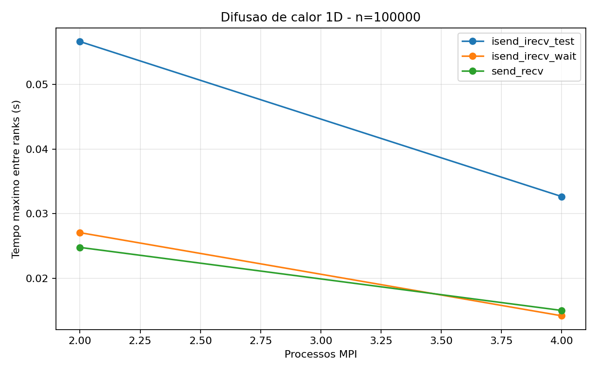
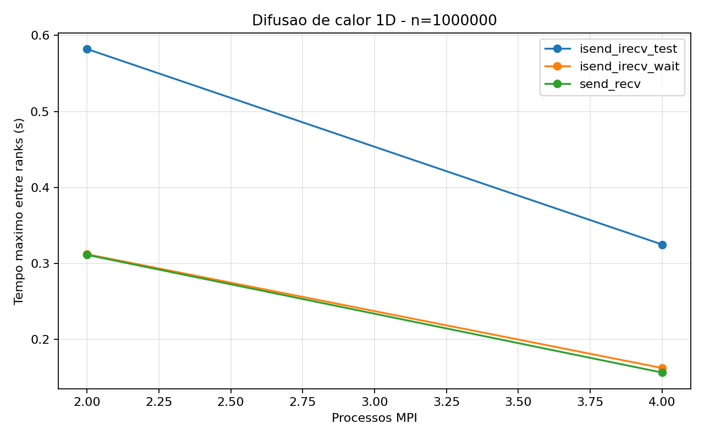
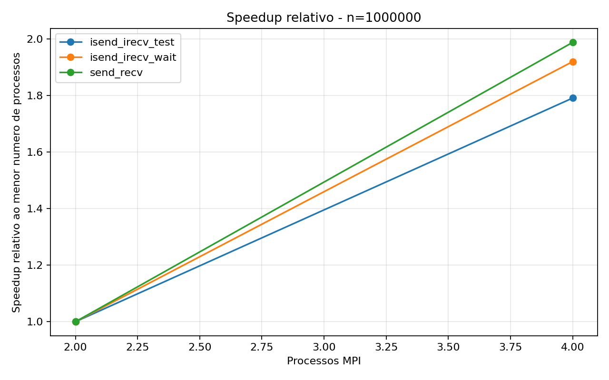

# Tarefa 15 - Difusao de calor 1D com MPI

## Objetivo

Implementar uma simulacao de difusao de calor em uma barra 1D dividida entre dois
ou mais processos MPI. Cada processo calcula um trecho da barra e mantem duas celulas
extras: uma borda fantasma a esquerda e outra a direita. Essas celulas recebem os
valores dos vizinhos por troca de mensagens.

Foram implementadas tres versoes:

- `send_recv`: comunicacao bloqueante com `MPI_Send` e `MPI_Recv`.
- `isend_irecv_wait`: comunicacao nao bloqueante com `MPI_Isend`, `MPI_Irecv` e
  espera explicita com `MPI_Wait`.
- `isend_irecv_test`: comunicacao nao bloqueante com `MPI_Isend`, `MPI_Irecv` e
  consultas com `MPI_Test`, atualizando pontos internos enquanto a comunicacao das
  bordas ainda pode estar em andamento.

## Modelo numerico

A barra 1D usa a atualizacao explicita:

```c
novo[i] = u[i] + alpha * (u[i - 1] - 2.0 * u[i] + u[i + 1]);
```

Foi usado `alpha = 0.25`, valor estavel para este esquema simples. A condicao inicial
coloca uma regiao quente no inicio global da barra, entre as posicoes `45` e `55`,
com temperatura `100.0`; o restante inicia com `0.0`.

## Configuracao

- Processos testados: `2, 4`
- Tamanhos da barra: `100000, 1000000`
- Passos de tempo: `2000`
- Rodadas por configuracao: `3`
- Compilacao: `mpicc -O3 -Wall -Wextra -lm`
- Medicao de tempo: `MPI_Wtime`

## Resultados

|Versao|Processos|N|Passos|Rodadas|Media (s)|Min (s)|Max (s)|Soma final|
|---|---:|---:|---:|---:|---:|---:|---:|---:|
|isend_irecv_test|2|100000|2000|3|0.056750|0.056597|0.056869|980.561916|
|isend_irecv_test|2|1000000|2000|3|0.587059|0.581999|0.591014|980.561916|
|isend_irecv_test|4|100000|2000|3|0.034861|0.032656|0.038032|980.561916|
|isend_irecv_test|4|1000000|2000|3|0.333596|0.324992|0.344962|980.561916|
|isend_irecv_wait|2|100000|2000|3|0.027810|0.027078|0.029253|980.561916|
|isend_irecv_wait|2|1000000|2000|3|0.325639|0.312176|0.344634|980.561916|
|isend_irecv_wait|4|100000|2000|3|0.016564|0.014232|0.019110|980.561916|
|isend_irecv_wait|4|1000000|2000|3|0.163649|0.162628|0.165168|980.561916|
|send_recv|2|100000|2000|3|0.025401|0.024800|0.026504|980.561916|
|send_recv|2|1000000|2000|3|0.318999|0.311325|0.333607|980.561916|
|send_recv|4|100000|2000|3|0.016370|0.015059|0.017386|980.561916|
|send_recv|4|1000000|2000|3|0.168722|0.156634|0.189791|980.561916|

## Graficos







## Melhores casos

- 2 processos, N=100000: `send_recv` com media 0.025401s.
- 2 processos, N=1000000: `send_recv` com media 0.318999s.
- 4 processos, N=100000: `send_recv` com media 0.016370s.
- 4 processos, N=1000000: `isend_irecv_wait` com media 0.163649s.

## Analise

Na versao `send_recv`, a troca de bordas e bloqueante. O processo fica parado enquanto
espera receber valores dos vizinhos e so depois atualiza seus pontos. Essa versao e a
mais simples para entender a comunicacao, mas tende a expor mais o custo de espera.

Na versao `isend_irecv_wait`, as operacoes de envio e recebimento sao iniciadas com
`MPI_Isend` e `MPI_Irecv`. Em seguida, o programa usa `MPI_Wait` para garantir que as
mensagens chegaram antes de atualizar a barra. Essa versao evita algumas esperas de
envio e recebimento bloqueantes, mas ainda nao sobrepoe muito calculo e comunicacao,
pois espera pelas bordas antes de calcular os pontos.

Na versao `isend_irecv_test`, as mensagens tambem sao iniciadas de forma nao
bloqueante, mas os pontos internos da barra sao calculados enquanto o programa chama
`MPI_Test` para verificar se as bordas chegaram. Os pontos internos nao dependem das
celulas fantasmas, portanto podem ser atualizados antes da conclusao da comunicacao.
Depois que as bordas chegam, os pontos das extremidades locais sao atualizados.

O ganho esperado com sobreposicao aparece quando ha trabalho interno suficiente para
ocupar o tempo em que as mensagens de borda trafegam. Por isso, tamanhos maiores de
barra tendem a favorecer mais a versao com `MPI_Test`. Em problemas pequenos, o custo
de iniciar as mensagens e testar requisicoes pode ser parecido ou maior do que o ganho
da sobreposicao.

Nos dados coletados nesta maquina, a versao `isend_irecv_test` ficou mais lenta que
as outras. Isso ocorreu porque o programa chama `MPI_Test` repetidamente enquanto
atualiza os pontos internos. Como cada processo troca apenas dois valores de borda por
passo, a comunicacao e pequena; assim, o custo extra de testar as requisicoes muitas
vezes ficou maior que o beneficio da sobreposicao. O melhor resultado para `N=1000000`
com 4 processos foi `isend_irecv_wait`, enquanto `send_recv` foi melhor nos casos
menores.

## Conclusao

A Tarefa mostra a evolucao natural da comunicacao MPI. A versao com `MPI_Send` e
`MPI_Recv` e adequada como primeira implementacao, pois deixa clara a troca de bordas.
A versao com `MPI_Isend`, `MPI_Irecv` e `MPI_Wait` introduz comunicacao nao bloqueante,
mas ainda espera explicitamente pelas mensagens antes do calculo completo. A versao
com `MPI_Test` explora melhor a ideia da aula 22: enquanto a comunicacao nao termina,
o processo pode atualizar os pontos internos que nao dependem das bordas.

Assim, a principal vantagem da comunicacao nao bloqueante nao e apenas trocar a funcao
de envio ou recepcao, mas reorganizar o algoritmo para sobrepor comunicacao e
computacao.

## Codigos

### `heat_send_recv.c`

```c
#include <mpi.h>
#include <stdio.h>
#include <stdlib.h>
#include <string.h>

#define TAG_DIREITA 10
#define TAG_ESQUERDA 20

static int ler_inteiro(int argc, char **argv, const char *opcao, int padrao)
{
    for (int i = 1; i + 1 < argc; i++) {
        if (strcmp(argv[i], opcao) == 0) {
            return atoi(argv[i + 1]);
        }
    }
    return padrao;
}

static int inicio_local(int rank, int n, int size)
{
    int base = n / size;
    int resto = n % size;
    return rank * base + (rank < resto ? rank : resto);
}

static int tamanho_local(int rank, int n, int size)
{
    int base = n / size;
    int resto = n % size;
    return base + (rank < resto ? 1 : 0);
}

static void inicializar(double *u, int local_n, int inicio)
{
    for (int i = 0; i <= local_n + 1; i++) {
        u[i] = 0.0;
    }
    for (int i = 1; i <= local_n; i++) {
        int global = inicio + i - 1;
        u[i] = (global >= 45 && global <= 55) ? 100.0 : 0.0;
    }
}

static void trocar_bordas(double *u, int local_n, int rank, int size)
{
    MPI_Status status;

    if (size == 1) {
        u[0] = 0.0;
        u[local_n + 1] = 0.0;
        return;
    }

    if (rank == 0) {
        MPI_Send(&u[local_n], 1, MPI_DOUBLE, rank + 1, TAG_DIREITA, MPI_COMM_WORLD);
    } else {
        MPI_Recv(&u[0], 1, MPI_DOUBLE, rank - 1, TAG_DIREITA, MPI_COMM_WORLD, &status);
        if (rank < size - 1) {
            MPI_Send(&u[local_n], 1, MPI_DOUBLE, rank + 1, TAG_DIREITA, MPI_COMM_WORLD);
        }
    }

    if (rank == size - 1) {
        MPI_Send(&u[1], 1, MPI_DOUBLE, rank - 1, TAG_ESQUERDA, MPI_COMM_WORLD);
    } else {
        MPI_Recv(&u[local_n + 1], 1, MPI_DOUBLE, rank + 1, TAG_ESQUERDA, MPI_COMM_WORLD, &status);
        if (rank > 0) {
            MPI_Send(&u[1], 1, MPI_DOUBLE, rank - 1, TAG_ESQUERDA, MPI_COMM_WORLD);
        }
    }

    if (rank == 0) {
        u[0] = 0.0;
    }
    if (rank == size - 1) {
        u[local_n + 1] = 0.0;
    }
}

static void atualizar(double *u, double *novo, int local_n, double alpha)
{
    for (int i = 1; i <= local_n; i++) {
        novo[i] = u[i] + alpha * (u[i - 1] - 2.0 * u[i] + u[i + 1]);
    }
}

static double soma_local(double *u, int local_n)
{
    double soma = 0.0;
    for (int i = 1; i <= local_n; i++) {
        soma += u[i];
    }
    return soma;
}

int main(int argc, char **argv)
{
    int rank;
    int size;
    int n;
    int passos;
    int local_n;
    int inicio;
    double alpha = 0.25;
    double *u;
    double *novo;

    MPI_Init(&argc, &argv);
    MPI_Comm_rank(MPI_COMM_WORLD, &rank);
    MPI_Comm_size(MPI_COMM_WORLD, &size);

    n = ler_inteiro(argc, argv, "--n", 100000);
    passos = ler_inteiro(argc, argv, "--passos", 1000);
    local_n = tamanho_local(rank, n, size);
    inicio = inicio_local(rank, n, size);

    if (local_n <= 0) {
        if (rank == 0) {
            printf("Use n maior ou igual ao numero de processos.\n");
        }
        MPI_Finalize();
        return 1;
    }

    u = malloc((size_t)(local_n + 2) * sizeof(double));
    novo = malloc((size_t)(local_n + 2) * sizeof(double));
    if (u == NULL || novo == NULL) {
        printf("Erro ao alocar memoria no rank %d.\n", rank);
        MPI_Finalize();
        return 1;
    }

    inicializar(u, local_n, inicio);
    inicializar(novo, local_n, inicio);

    double inicio_tempo = MPI_Wtime();
    for (int passo = 0; passo < passos; passo++) {
        trocar_bordas(u, local_n, rank, size);
        atualizar(u, novo, local_n, alpha);
        double *tmp = u;
        u = novo;
        novo = tmp;
    }
    double fim_tempo = MPI_Wtime();

    printf(
        "RESULT versao=send_recv rank=%d processos=%d n=%d local_n=%d passos=%d tempo=%.9f soma=%.6f\n",
        rank,
        size,
        n,
        local_n,
        passos,
        fim_tempo - inicio_tempo,
        soma_local(u, local_n)
    );

    free(u);
    free(novo);
    MPI_Finalize();
    return 0;
}
```

### `heat_isend_irecv_wait.c`

```c
#include <mpi.h>
#include <stdio.h>
#include <stdlib.h>
#include <string.h>

#define TAG_DIREITA 10
#define TAG_ESQUERDA 20

static int ler_inteiro(int argc, char **argv, const char *opcao, int padrao)
{
    for (int i = 1; i + 1 < argc; i++) {
        if (strcmp(argv[i], opcao) == 0) {
            return atoi(argv[i + 1]);
        }
    }
    return padrao;
}

static int inicio_local(int rank, int n, int size)
{
    int base = n / size;
    int resto = n % size;
    return rank * base + (rank < resto ? rank : resto);
}

static int tamanho_local(int rank, int n, int size)
{
    int base = n / size;
    int resto = n % size;
    return base + (rank < resto ? 1 : 0);
}

static void inicializar(double *u, int local_n, int inicio)
{
    for (int i = 0; i <= local_n + 1; i++) {
        u[i] = 0.0;
    }
    for (int i = 1; i <= local_n; i++) {
        int global = inicio + i - 1;
        u[i] = (global >= 45 && global <= 55) ? 100.0 : 0.0;
    }
}

static int iniciar_troca(double *u, int local_n, int rank, int size, MPI_Request pedidos[])
{
    int qtd = 0;

    if (rank > 0) {
        MPI_Irecv(&u[0], 1, MPI_DOUBLE, rank - 1, TAG_DIREITA, MPI_COMM_WORLD, &pedidos[qtd++]);
        MPI_Isend(&u[1], 1, MPI_DOUBLE, rank - 1, TAG_ESQUERDA, MPI_COMM_WORLD, &pedidos[qtd++]);
    } else {
        u[0] = 0.0;
    }

    if (rank < size - 1) {
        MPI_Irecv(&u[local_n + 1], 1, MPI_DOUBLE, rank + 1, TAG_ESQUERDA, MPI_COMM_WORLD, &pedidos[qtd++]);
        MPI_Isend(&u[local_n], 1, MPI_DOUBLE, rank + 1, TAG_DIREITA, MPI_COMM_WORLD, &pedidos[qtd++]);
    } else {
        u[local_n + 1] = 0.0;
    }

    return qtd;
}

static void esperar_troca(MPI_Request pedidos[], int qtd)
{
    MPI_Status status;
    for (int i = 0; i < qtd; i++) {
        MPI_Wait(&pedidos[i], &status);
    }
}

static void atualizar(double *u, double *novo, int local_n, double alpha)
{
    for (int i = 1; i <= local_n; i++) {
        novo[i] = u[i] + alpha * (u[i - 1] - 2.0 * u[i] + u[i + 1]);
    }
}

static double soma_local(double *u, int local_n)
{
    double soma = 0.0;
    for (int i = 1; i <= local_n; i++) {
        soma += u[i];
    }
    return soma;
}

int main(int argc, char **argv)
{
    int rank;
    int size;
    int n;
    int passos;
    int local_n;
    int inicio;
    double alpha = 0.25;
    double *u;
    double *novo;
    MPI_Request pedidos[4];

    MPI_Init(&argc, &argv);
    MPI_Comm_rank(MPI_COMM_WORLD, &rank);
    MPI_Comm_size(MPI_COMM_WORLD, &size);

    n = ler_inteiro(argc, argv, "--n", 100000);
    passos = ler_inteiro(argc, argv, "--passos", 1000);
    local_n = tamanho_local(rank, n, size);
    inicio = inicio_local(rank, n, size);

    if (local_n <= 0) {
        if (rank == 0) {
            printf("Use n maior ou igual ao numero de processos.\n");
        }
        MPI_Finalize();
        return 1;
    }

    u = malloc((size_t)(local_n + 2) * sizeof(double));
    novo = malloc((size_t)(local_n + 2) * sizeof(double));
    if (u == NULL || novo == NULL) {
        printf("Erro ao alocar memoria no rank %d.\n", rank);
        MPI_Finalize();
        return 1;
    }

    inicializar(u, local_n, inicio);
    inicializar(novo, local_n, inicio);

    double inicio_tempo = MPI_Wtime();
    for (int passo = 0; passo < passos; passo++) {
        int qtd = iniciar_troca(u, local_n, rank, size, pedidos);
        esperar_troca(pedidos, qtd);
        atualizar(u, novo, local_n, alpha);
        double *tmp = u;
        u = novo;
        novo = tmp;
    }
    double fim_tempo = MPI_Wtime();

    printf(
        "RESULT versao=isend_irecv_wait rank=%d processos=%d n=%d local_n=%d passos=%d tempo=%.9f soma=%.6f\n",
        rank,
        size,
        n,
        local_n,
        passos,
        fim_tempo - inicio_tempo,
        soma_local(u, local_n)
    );

    free(u);
    free(novo);
    MPI_Finalize();
    return 0;
}
```

### `heat_isend_irecv_test.c`

```c
#include <mpi.h>
#include <stdio.h>
#include <stdlib.h>
#include <string.h>

#define TAG_DIREITA 10
#define TAG_ESQUERDA 20

static int ler_inteiro(int argc, char **argv, const char *opcao, int padrao)
{
    for (int i = 1; i + 1 < argc; i++) {
        if (strcmp(argv[i], opcao) == 0) {
            return atoi(argv[i + 1]);
        }
    }
    return padrao;
}

static int inicio_local(int rank, int n, int size)
{
    int base = n / size;
    int resto = n % size;
    return rank * base + (rank < resto ? rank : resto);
}

static int tamanho_local(int rank, int n, int size)
{
    int base = n / size;
    int resto = n % size;
    return base + (rank < resto ? 1 : 0);
}

static void inicializar(double *u, int local_n, int inicio)
{
    for (int i = 0; i <= local_n + 1; i++) {
        u[i] = 0.0;
    }
    for (int i = 1; i <= local_n; i++) {
        int global = inicio + i - 1;
        u[i] = (global >= 45 && global <= 55) ? 100.0 : 0.0;
    }
}

static double calcular_ponto(double *u, int i, double alpha)
{
    return u[i] + alpha * (u[i - 1] - 2.0 * u[i] + u[i + 1]);
}

static int iniciar_troca(double *u, int local_n, int rank, int size, MPI_Request recvs[], MPI_Request sends[])
{
    int qtd_recvs = 0;
    int qtd_sends = 0;

    if (rank > 0) {
        MPI_Irecv(&u[0], 1, MPI_DOUBLE, rank - 1, TAG_DIREITA, MPI_COMM_WORLD, &recvs[qtd_recvs++]);
        MPI_Isend(&u[1], 1, MPI_DOUBLE, rank - 1, TAG_ESQUERDA, MPI_COMM_WORLD, &sends[qtd_sends++]);
    } else {
        u[0] = 0.0;
    }

    if (rank < size - 1) {
        MPI_Irecv(&u[local_n + 1], 1, MPI_DOUBLE, rank + 1, TAG_ESQUERDA, MPI_COMM_WORLD, &recvs[qtd_recvs++]);
        MPI_Isend(&u[local_n], 1, MPI_DOUBLE, rank + 1, TAG_DIREITA, MPI_COMM_WORLD, &sends[qtd_sends++]);
    } else {
        u[local_n + 1] = 0.0;
    }

    for (int i = qtd_sends; i < 2; i++) {
        sends[i] = MPI_REQUEST_NULL;
    }

    return qtd_recvs;
}

static void testar_recvs(MPI_Request recvs[], int qtd_recvs, int concluidos[])
{
    MPI_Status status;
    for (int i = 0; i < qtd_recvs; i++) {
        if (!concluidos[i]) {
            int flag = 0;
            MPI_Test(&recvs[i], &flag, &status);
            if (flag) {
                concluidos[i] = 1;
            }
        }
    }
}

static void esperar_recvs_com_test(MPI_Request recvs[], int qtd_recvs, int concluidos[])
{
    int total = 0;
    for (int i = 0; i < qtd_recvs; i++) {
        total += concluidos[i];
    }
    while (total < qtd_recvs) {
        testar_recvs(recvs, qtd_recvs, concluidos);
        total = 0;
        for (int i = 0; i < qtd_recvs; i++) {
            total += concluidos[i];
        }
    }
}

static void esperar_sends(MPI_Request sends[])
{
    MPI_Status status;
    for (int i = 0; i < 2; i++) {
        if (sends[i] != MPI_REQUEST_NULL) {
            MPI_Wait(&sends[i], &status);
        }
    }
}

static double soma_local(double *u, int local_n)
{
    double soma = 0.0;
    for (int i = 1; i <= local_n; i++) {
        soma += u[i];
    }
    return soma;
}

int main(int argc, char **argv)
{
    int rank;
    int size;
    int n;
    int passos;
    int local_n;
    int inicio;
    double alpha = 0.25;
    double *u;
    double *novo;
    MPI_Request recvs[2];
    MPI_Request sends[2];

    MPI_Init(&argc, &argv);
    MPI_Comm_rank(MPI_COMM_WORLD, &rank);
    MPI_Comm_size(MPI_COMM_WORLD, &size);

    n = ler_inteiro(argc, argv, "--n", 100000);
    passos = ler_inteiro(argc, argv, "--passos", 1000);
    local_n = tamanho_local(rank, n, size);
    inicio = inicio_local(rank, n, size);

    if (local_n <= 0) {
        if (rank == 0) {
            printf("Use n maior ou igual ao numero de processos.\n");
        }
        MPI_Finalize();
        return 1;
    }

    u = malloc((size_t)(local_n + 2) * sizeof(double));
    novo = malloc((size_t)(local_n + 2) * sizeof(double));
    if (u == NULL || novo == NULL) {
        printf("Erro ao alocar memoria no rank %d.\n", rank);
        MPI_Finalize();
        return 1;
    }

    inicializar(u, local_n, inicio);
    inicializar(novo, local_n, inicio);

    double inicio_tempo = MPI_Wtime();
    for (int passo = 0; passo < passos; passo++) {
        int concluidos[2] = {0, 0};
        int qtd_recvs = iniciar_troca(u, local_n, rank, size, recvs, sends);

        for (int i = 2; i <= local_n - 1; i++) {
            novo[i] = calcular_ponto(u, i, alpha);
            testar_recvs(recvs, qtd_recvs, concluidos);
        }

        esperar_recvs_com_test(recvs, qtd_recvs, concluidos);

        if (local_n == 1) {
            novo[1] = calcular_ponto(u, 1, alpha);
        } else {
            novo[1] = calcular_ponto(u, 1, alpha);
            novo[local_n] = calcular_ponto(u, local_n, alpha);
        }

        esperar_sends(sends);

        double *tmp = u;
        u = novo;
        novo = tmp;
    }
    double fim_tempo = MPI_Wtime();

    printf(
        "RESULT versao=isend_irecv_test rank=%d processos=%d n=%d local_n=%d passos=%d tempo=%.9f soma=%.6f\n",
        rank,
        size,
        n,
        local_n,
        passos,
        fim_tempo - inicio_tempo,
        soma_local(u, local_n)
    );

    free(u);
    free(novo);
    MPI_Finalize();
    return 0;
}
```

## Artefatos

- Codigos: `Tarefa-15/heat_send_recv.c`, `Tarefa-15/heat_isend_irecv_wait.c` e
  `Tarefa-15/heat_isend_irecv_test.c`
- Coleta: `Tarefa-15/coletar_mpi.py`
- CSV: `Tarefa-15/resultados/tarefa15_resultados.csv`
- Graficos: `relatorios/tarefa15_tempo_n100000.png`,
  `relatorios/tarefa15_tempo_n1000000.png` e
  `relatorios/tarefa15_speedup_relativo.png`
- Relatorio: `Tarefa-15/resultados/relatorio_tarefa15.md`
