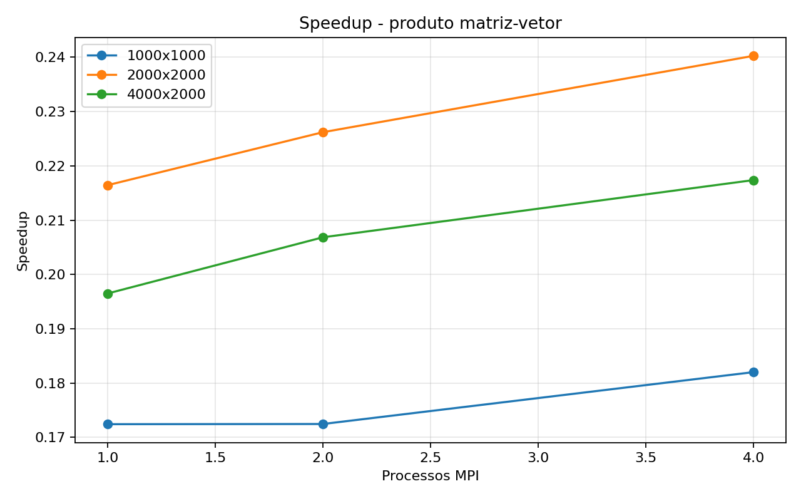
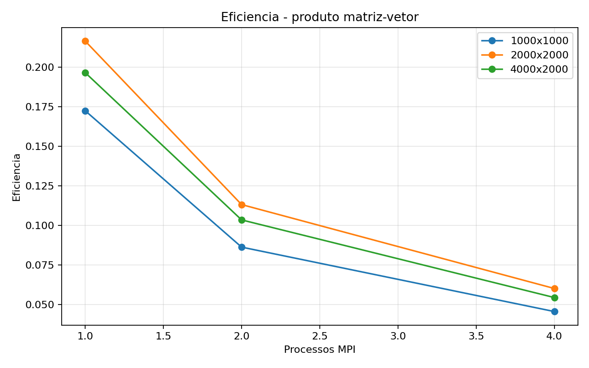

# Tarefa 17 - Multiplicacao matriz-vetor com MPI coletivo

## Objetivo

Implementar o produto `y = A * x`, onde `A` e uma matriz `M x N` e `x` e um vetor de
tamanho `N`. A matriz e dividida por linhas entre os processos com `MPI_Scatter`, o
vetor completo e distribuido com `MPI_Bcast`, e os trechos de `y` sao reunidos no
processo `0` com `MPI_Gather`.

## Funcoes MPI usadas

A implementacao usa as rotinas de comunicacao coletiva apresentadas no conteudo 24:

- `MPI_Bcast`: envia o vetor `x` completo do processo `0` para todos os processos.
- `MPI_Scatter`: divide a matriz `A` por blocos de linhas, enviando um bloco para
  cada processo.
- `MPI_Gather`: junta os blocos locais de `y` calculados por cada processo no
  processo `0`.
- `MPI_Barrier`: faz todos os processos chegarem ao mesmo ponto antes do inicio da
  medicao de tempo.
- `MPI_Reduce`: soma os checksums locais e tambem calcula os tempos maximos entre
  ranks com `MPI_MAX`.

Tambem foram usadas as rotinas basicas ja vistas antes: `MPI_Init`,
`MPI_Comm_rank`, `MPI_Comm_size`, `MPI_Wtime` e `MPI_Finalize`.

Como o enunciado pede `MPI_Scatter`, foi usada a divisao simples em que `M` deve ser
divisivel pelo numero de processos. Os testes foram escolhidos respeitando essa
condicao.

## Configuracao

- Tamanhos de matriz testados: `1000x1000, 2000x2000, 4000x2000`
- Processos MPI testados: `1, 2, 4`
- Rodadas por configuracao: `3`
- Compilacao sequencial: `gcc -O3 -Wall -Wextra`
- Compilacao MPI: `mpicc -O3 -Wall -Wextra`
- Medicao de tempo: `MPI_Wtime` na versao MPI e `gettimeofday` na versao sequencial

Na versao sequencial, o tempo medido comeca depois da inicializacao de `A` e `x` e
mede apenas o laco de calculo de `y = A*x`. Na versao MPI, o tempo total mede a
estrategia paralela completa: `MPI_Bcast`, `MPI_Scatter`, calculo local,
`MPI_Gather` e validacao por checksum. Por isso a tabela separa dois indicadores:

- `Speedup seq`: `tempo_sequencial_de_calculo / tempo_total_MPI`.
- `Speedup MPI`: `tempo_MPI_com_1_processo / tempo_MPI_com_P_processos`.

O tempo total MPI e os tempos parciais sao reduzidos com `MPI_Reduce(MPI_MAX)`,
reportando o rank mais lento. O checksum do vetor `y` foi comparado entre as versoes
para validar os resultados. Os tempos parciais ajudam a identificar gargalos, mas
nao devem ser somados para reconstruir o total, pois o maximo de cada fase pode vir
de ranks diferentes.

## Resultados

|M|N|Proc.|Linhas/proc.|Rodadas|Seq calc. (s)|MPI total max (s)|Bcast|Scatter|Calc. local|Gather|Validacao|Speedup seq|Speedup MPI|Ef. MPI|
|---:|---:|---:|---:|---:|---:|---:|---:|---:|---:|---:|---:|---:|---:|---:|
|1000|1000|1|1000|3|0.000558|0.002400|0.000000|0.002015|0.000380|0.000004|0.000001|0.23|1.00|1.00|
|1000|1000|2|500|3|0.000558|0.002335|0.000010|0.002103|0.000196|0.000025|0.000019|0.24|1.03|0.51|
|1000|1000|4|250|3|0.000558|0.002271|0.000018|0.002135|0.000103|0.000018|0.001107|0.25|1.06|0.26|
|2000|2000|1|2000|3|0.002114|0.009896|0.000000|0.008000|0.001887|0.000008|0.000001|0.21|1.00|1.00|
|2000|2000|2|1000|3|0.002114|0.009292|0.000012|0.008269|0.000981|0.000039|0.000017|0.23|1.07|0.53|
|2000|2000|4|500|3|0.002114|0.008959|0.000013|0.008422|0.000491|0.000017|0.004416|0.24|1.10|0.28|
|4000|2000|1|4000|3|0.004621|0.019580|0.000000|0.015756|0.003813|0.000010|0.000002|0.24|1.00|1.00|
|4000|2000|2|2000|3|0.004621|0.018107|0.000012|0.016053|0.002007|0.000038|0.000017|0.26|1.08|0.54|
|4000|2000|4|1000|3|0.004621|0.017388|0.000014|0.016307|0.001022|0.008324|0.000028|0.27|1.13|0.28|

## Graficos






## Melhores casos

- Matriz 1000x1000: melhor tempo com 4 processos, media 0.002271s, speedup sequencial 0.25 e speedup MPI interno 1.06.
- Matriz 2000x2000: melhor tempo com 4 processos, media 0.008959s, speedup sequencial 0.24 e speedup MPI interno 1.10.
- Matriz 4000x2000: melhor tempo com 4 processos, media 0.017388s, speedup sequencial 0.27 e speedup MPI interno 1.13.

## Analise

O custo principal do calculo local e proporcional ao numero de linhas recebidas por
cada processo multiplicado por `N`. Ao aumentar a quantidade de processos, cada
processo recebe menos linhas de `A`, reduzindo o trabalho local.

Nos resultados, o tempo da versao MPI diminuiu quando foram usados mais processos,
principalmente nas matrizes maiores. Nas matrizes pequenas, a diferenca entre 1, 2 e
4 processos foi pequena, porque o custo de comunicacao e preparacao dos dados ficou
parecido com o custo do proprio calculo. Nas matrizes maiores, a reducao de tempo
ficou mais visivel, pois cada processo recebeu uma parte relevante do trabalho e o
calculo local passou a compensar melhor o custo das coletivas.

Mesmo assim, o speedup em relacao ao programa sequencial ficou menor que 1 em todos
os casos. Isso significa que a versao MPI ficou mais lenta que a sequencial usada
como base. Essa comparacao e intencionalmente conservadora: o sequencial mede so o
calculo, enquanto o tempo MPI total inclui comunicacao, reuniao do resultado e
validacao. O speedup MPI interno, por outro lado, isola melhor a escalabilidade da
implementacao coletiva ao comparar a propria versao MPI com 1 processo contra 2 e 4
processos. Para esses tamanhos e nesse ambiente local, o custo das etapas extras foi
maior que o ganho obtido ao dividir o calculo.

### Efeito de cada funcao coletiva

`MPI_Barrier` foi usado antes da medicao. Ele nao acelera o programa; pelo contrario,
pode adicionar um pequeno custo. Sua funcao aqui e deixar a medicao mais justa,
garantindo que nenhum processo comece a cronometrar a parte principal antes dos
outros estarem prontos. Assim, o tempo medido representa melhor a execucao coletiva
do trecho paralelo.

`MPI_Bcast` distribui o vetor `x` inteiro para todos os processos. Esse custo depende
principalmente de `N` e da quantidade de processos. Como todos os processos precisam
do vetor completo para calcular suas linhas, essa etapa e necessaria. Ela pesa mais
quando a matriz tem poucas linhas por processo, porque o tempo gasto enviando `x`
fica grande em relacao ao tempo de multiplicacao local.

`MPI_Scatter` divide a matriz `A` em blocos de linhas. Essa foi a comunicacao mais
pesada da implementacao, pois a matriz tem `M * N` elementos e apenas o processo `0`
possui a matriz completa antes da divisao. Quando o numero de processos aumenta, cada
processo recebe menos linhas, o que ajuda no calculo local. Ao mesmo tempo, o processo
`0` precisa enviar blocos para mais processos. Por isso, o ganho aparece melhor nas
matrizes maiores: ha mais calculo para cada bloco recebido.

`MPI_Gather` recolhe os pedacos do vetor `y`. O custo dessa etapa e menor que o do
`MPI_Scatter`, porque `y` tem apenas `M` elementos, enquanto `A` tem `M * N`.
Mesmo assim, ela adiciona uma sincronizacao natural ao final: o processo `0` so tem o
resultado completo depois que todos os processos terminam seus calculos locais e
enviam suas partes.

`MPI_Reduce` foi usado de duas formas. Para validar o resultado, cada processo
calcula um checksum local somando os valores do seu bloco de `y`; em seguida,
`MPI_Reduce(MPI_SUM)` entrega o checksum global ao processo `0`. Para medir tempo,
cada rank calcula suas duracoes locais e `MPI_Reduce(MPI_MAX)` reporta o maior valor,
isto e, o tempo observado pelo rank mais lento. Essa escolha evita que a analise
dependa apenas do tempo do rank `0`.

A eficiencia mede quanto do ganho teorico foi aproveitado. Ela caiu quando o numero
de processos aumentou porque o trabalho local por processo diminuiu, mas os custos de
`MPI_Barrier`, `MPI_Bcast`, `MPI_Scatter`, `MPI_Gather` e `MPI_Reduce` continuaram
existindo. Em geral, usar mais processos reduz o trabalho de multiplicacao por
processo, mas aumenta o peso relativo da comunicacao. Por isso, uma configuracao pode
ter melhor tempo absoluto e, ao mesmo tempo, baixa eficiencia em relacao ao ganho
ideal.

## Conclusao

A Tarefa 17 mostra o uso direto das coletivas `MPI_Bcast`, `MPI_Scatter`,
`MPI_Gather`, `MPI_Barrier` e `MPI_Reduce` em um problema regular. A divisao por
linhas e natural para o produto matriz-vetor: cada processo recebe algumas linhas
completas de `A`, usa o mesmo vetor `x` e calcula uma parte independente de `y`.

O programa evita comunicacao ponto a ponto manual e deixa a distribuicao/reuniao dos
dados sob responsabilidade das rotinas coletivas apresentadas no material. O ganho de
desempenho depende do equilibrio entre quantidade de calculo local e custo das
coletivas.

Pelos testes, a paralelizacao com MPI trouxe melhora interna quando comparamos 1, 2 e
4 processos MPI na mesma matriz, mas ainda nao superou a versao sequencial. A perda
contra o sequencial acontece porque as coletivas acrescentam comunicacao,
sincronizacao e copia de dados. O aumento de desempenho aparece quando o calculo
local fica grande o suficiente para compensar parte desse custo.

Assim, a implementacao esta correta para demonstrar comunicacao coletiva basica: o
vetor e transmitido uma vez para todos, a matriz e dividida por linhas, cada processo
calcula sua parte independente, o resultado final volta para o processo `0`, e o
checksum global e obtido por reducao. Para obter speedup maior em execucoes reais,
seria necessario aumentar mais o tamanho do problema, reduzir custos de distribuicao
ou usar uma organizacao em que os dados ja estejam distribuidos entre os processos
antes da medicao.

<!-- codigos-fonte-c-inicio -->
## Codigos fonte C usados nos testes

### `Tarefa-17/matvec_collective.c`

```c
#include <mpi.h>
#include <stdio.h>
#include <stdlib.h>
#include <string.h>

static int ler_inteiro(int argc, char **argv, const char *opcao, int padrao)
{
    for (int i = 1; i + 1 < argc; i++) {
        if (strcmp(argv[i], opcao) == 0) {
            return atoi(argv[i + 1]);
        }
    }
    return padrao;
}

static double valor_a(int i, int j)
{
    return (double)((i + j) % 13 + 1) / 13.0;
}

static double valor_x(int j)
{
    return (double)(j % 7 + 1) / 7.0;
}

static void preencher_matriz(double *a, int m, int n)
{
    for (int i = 0; i < m; i++) {
        for (int j = 0; j < n; j++) {
            a[i * n + j] = valor_a(i, j);
        }
    }
}

static void preencher_vetor(double *x, int n)
{
    for (int j = 0; j < n; j++) {
        x[j] = valor_x(j);
    }
}

static void multiplicar_local(double *a_local, double *x, double *y_local, int linhas, int n)
{
    for (int i = 0; i < linhas; i++) {
        double soma = 0.0;
        for (int j = 0; j < n; j++) {
            soma += a_local[i * n + j] * x[j];
        }
        y_local[i] = soma;
    }
}

int main(int argc, char **argv)
{
    int rank;
    int size;
    int m;
    int n;
    int linhas_locais;
    double *a = NULL;
    double *x = NULL;
    double *y = NULL;
    double *a_local = NULL;
    double *y_local = NULL;

    MPI_Init(&argc, &argv);
    MPI_Comm_rank(MPI_COMM_WORLD, &rank);
    MPI_Comm_size(MPI_COMM_WORLD, &size);

    m = ler_inteiro(argc, argv, "--m", 2000);
    n = ler_inteiro(argc, argv, "--n", 2000);

    if (m % size != 0) {
        if (rank == 0) {
            printf("Para usar MPI_Scatter simples, M deve ser divisivel pelo numero de processos.\n");
        }
        MPI_Finalize();
        return 1;
    }

    linhas_locais = m / size;
    x = malloc((size_t)n * sizeof(double));
    a_local = malloc((size_t)linhas_locais * (size_t)n * sizeof(double));
    y_local = malloc((size_t)linhas_locais * sizeof(double));

    if (rank == 0) {
        a = malloc((size_t)m * (size_t)n * sizeof(double));
        y = malloc((size_t)m * sizeof(double));
        if (a != NULL && y != NULL) {
            preencher_matriz(a, m, n);
        }
    }

    if (x == NULL || a_local == NULL || y_local == NULL || (rank == 0 && (a == NULL || y == NULL))) {
        printf("Erro ao alocar memoria no rank %d.\n", rank);
        free(a);
        free(x);
        free(y);
        free(a_local);
        free(y_local);
        MPI_Finalize();
        return 1;
    }

    if (rank == 0) {
        preencher_vetor(x, n);
    }

    MPI_Barrier(MPI_COMM_WORLD);
    double inicio_total = MPI_Wtime();

    double inicio = MPI_Wtime();
    MPI_Bcast(x, n, MPI_DOUBLE, 0, MPI_COMM_WORLD);
    double tempo_bcast_local = MPI_Wtime() - inicio;

    inicio = MPI_Wtime();
    MPI_Scatter(
        a,
        linhas_locais * n,
        MPI_DOUBLE,
        a_local,
        linhas_locais * n,
        MPI_DOUBLE,
        0,
        MPI_COMM_WORLD
    );
    double tempo_scatter_local = MPI_Wtime() - inicio;

    inicio = MPI_Wtime();
    multiplicar_local(a_local, x, y_local, linhas_locais, n);
    double tempo_compute_local = MPI_Wtime() - inicio;

    inicio = MPI_Wtime();
    MPI_Gather(
        y_local,
        linhas_locais,
        MPI_DOUBLE,
        y,
        linhas_locais,
        MPI_DOUBLE,
        0,
        MPI_COMM_WORLD
    );
    double tempo_gather_local = MPI_Wtime() - inicio;

    inicio = MPI_Wtime();
    double checksum_local = 0.0;
    for (int i = 0; i < linhas_locais; i++) {
        checksum_local += y_local[i];
    }
 
    double checksum = 0.0;
    MPI_Reduce(&checksum_local, &checksum, 1, MPI_DOUBLE, MPI_SUM, 0, MPI_COMM_WORLD);
    double tempo_validacao_local = MPI_Wtime() - inicio;

    double tempo_total_local = MPI_Wtime() - inicio_total;
    double tempo_total = 0.0;
    double tempo_bcast = 0.0;
    double tempo_scatter = 0.0;
    double tempo_compute = 0.0;
    double tempo_gather = 0.0;
    double tempo_validacao = 0.0;

    MPI_Reduce(&tempo_total_local, &tempo_total, 1, MPI_DOUBLE, MPI_MAX, 0, MPI_COMM_WORLD);
    MPI_Reduce(&tempo_bcast_local, &tempo_bcast, 1, MPI_DOUBLE, MPI_MAX, 0, MPI_COMM_WORLD);
    MPI_Reduce(&tempo_scatter_local, &tempo_scatter, 1, MPI_DOUBLE, MPI_MAX, 0, MPI_COMM_WORLD);
    MPI_Reduce(&tempo_compute_local, &tempo_compute, 1, MPI_DOUBLE, MPI_MAX, 0, MPI_COMM_WORLD);
    MPI_Reduce(&tempo_gather_local, &tempo_gather, 1, MPI_DOUBLE, MPI_MAX, 0, MPI_COMM_WORLD);
    MPI_Reduce(&tempo_validacao_local, &tempo_validacao, 1, MPI_DOUBLE, MPI_MAX, 0, MPI_COMM_WORLD);

    if (rank == 0) {
        printf(
            "RESULT versao=mpi_collective processos=%d m=%d n=%d linhas_por_processo=%d "
            "tempo=%.9f bcast=%.9f scatter=%.9f compute=%.9f gather=%.9f validacao=%.9f checksum=%.6f\n",
            size,
            m,
            n,
            linhas_locais,
            tempo_total,
            tempo_bcast,
            tempo_scatter,
            tempo_compute,
            tempo_gather,
            tempo_validacao,
            checksum
        );
    }

    free(a);
    free(x);
    free(y);
    free(a_local);
    free(y_local);
    MPI_Finalize();
    return 0;
}
```

### `Tarefa-17/matvec_seq.c`

```c
#include <stdio.h>
#include <stdlib.h>
#include <string.h>
#include <sys/time.h>

static int ler_inteiro(int argc, char **argv, const char *opcao, int padrao)
{
    for (int i = 1; i + 1 < argc; i++) {
        if (strcmp(argv[i], opcao) == 0) {
            return atoi(argv[i + 1]);
        }
    }
    return padrao;
}

static double tempo_agora(void)
{
    struct timeval tv;
    gettimeofday(&tv, NULL);
    return (double)tv.tv_sec + (double)tv.tv_usec * 0.000001;
}

static double valor_a(int i, int j)
{
    return (double)((i + j) % 13 + 1) / 13.0;
}

static double valor_x(int j)
{
    return (double)(j % 7 + 1) / 7.0;
}

int main(int argc, char **argv)
{
    int m = ler_inteiro(argc, argv, "--m", 2000);
    int n = ler_inteiro(argc, argv, "--n", 2000);
    double *a = malloc((size_t)m * (size_t)n * sizeof(double));
    double *x = malloc((size_t)n * sizeof(double));
    double *y = malloc((size_t)m * sizeof(double));

    if (a == NULL || x == NULL || y == NULL) {
        printf("Erro ao alocar memoria.\n");
        free(a);
        free(x);
        free(y);
        return 1;
    }

    for (int j = 0; j < n; j++) {
        x[j] = valor_x(j);
    }
    for (int i = 0; i < m; i++) {
        for (int j = 0; j < n; j++) {
            a[i * n + j] = valor_a(i, j);
        }
    }

    double inicio = tempo_agora();
    for (int i = 0; i < m; i++) {
        double soma = 0.0;
        for (int j = 0; j < n; j++) {
            soma += a[i * n + j] * x[j];
        }
        y[i] = soma;
    }
    double fim = tempo_agora();

    double checksum = 0.0;
    for (int i = 0; i < m; i++) {
        checksum += y[i];
    }

    printf(
        "RESULT versao=seq m=%d n=%d tempo=%.9f checksum=%.6f\n",
        m,
        n,
        fim - inicio,
        checksum
    );

    free(a);
    free(x);
    free(y);
    return 0;
}
```

<!-- codigos-fonte-c-fim -->

<!-- scripts-sbatch-npad-inicio -->
## Scripts sbatch do NPAD

### `Tarefa-17/run_npad.sbatch`

```bash
#!/bin/bash
#SBATCH --job-name=tarefa17-mpi
#SBATCH --output=resultados/slurm-%j.out
#SBATCH --error=resultados/slurm-%j.err
#SBATCH --nodes=1
#SBATCH --ntasks=4
#SBATCH --cpus-per-task=1
#SBATCH --time=00:30:00

set -euo pipefail

cd "$SLURM_SUBMIT_DIR"
mkdir -p resultados

# Descomente e ajuste se o ambiente exigir carregamento explicito de MPI.
# module purge
# module load openmpi
# module load gcc

python3 -m venv .venv
source .venv/bin/activate
python -m pip install --upgrade pip
python -m pip install matplotlib

python coletar_mpi.py \
  --repeats 3 \
  --sizes 1000x1000 2000x2000 4000x2000 \
  --processes 1 2 4

python gerar_relatorio.py
```

<!-- scripts-sbatch-npad-fim -->
