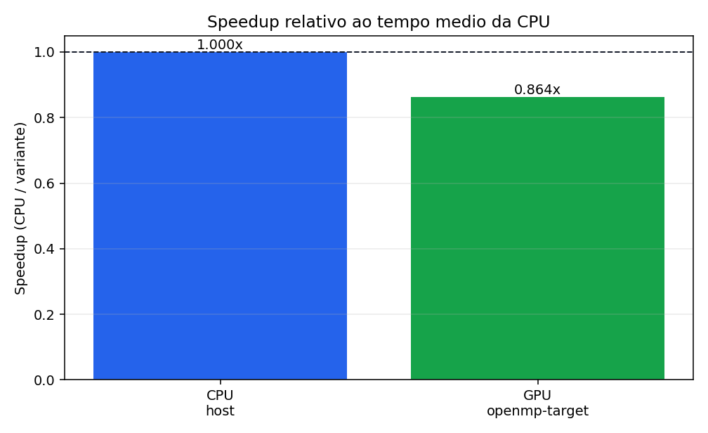
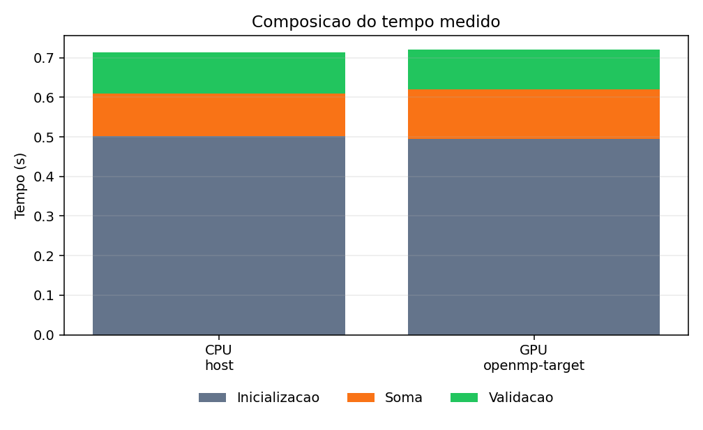

# Tarefa 19 - Adicao de vetores com OpenMP em CPU e GPU

## Objetivo

O objetivo foi reproduzir os exercicios `vadd.c` indicados no tutorial
`conteudos/omp_GPGPU_prog_SC23.pdf`: primeiro a versao paralela em CPU,
com `#pragma omp parallel for`, e depois a versao com offload para GPU,
com `#pragma omp target` seguido de `#pragma omp loop`.

## Implementacao

Foram criados dois programas:

- `vadd_cpu.c`: inicializa tres vetores no host, executa a soma
  `c[i] = a[i] + b[i]` com `#pragma omp parallel for` e valida o
  resultado.
- `vadd_gpu.c`: usa a mesma inicializacao e validacao, mas executa a soma
  em uma regiao `target`. Como os vetores sao alocados dinamicamente, foram
  adicionadas clausulas `map(to: a[0:n], b[0:n])` e `map(from: c[0:n])`.

A mudanca para alocacao dinamica evita estouro de pilha para valores grandes
de `N` e permite variar o tamanho do problema sem recompilar.

## Como executar no NPAD

```bash
sbatch Tarefa-19/run_npad.sbatch
```

O script `run_npad.sbatch` usa:

- particao: `gpu-8-v100`;
- GPU por no: `1`;
- compilador: `compilers/nvidia/nvhpc/24.11`;
- CPU: `nvc -fast -mp`;
- GPU: `nvc -fast -mp=gpu`;
- variavel: `OMP_TARGET_OFFLOAD=MANDATORY`.

O uso de `OMP_TARGET_OFFLOAD=MANDATORY` foi adotado para impedir que a
execucao GPU caia silenciosamente para CPU quando o dispositivo ou o suporte
de offload nao estiverem disponiveis.

## Comparacao de tempos

A execucao foi realizada no NPAD e os dados foram registrados em
`Tarefa-19/resultados/tarefa19_resultados_1858301.csv`. Nos dois programas ha uma
execucao de aquecimento antes das repeticoes medidas. Na versao GPU, o tempo da soma
inclui a entrada e saida da regiao `target` e as transferencias determinadas pelas
clausulas `map`.

| Variante | Dispositivo | N | Repeticoes | Melhor soma (s) | Media soma (s) | Inicializacao (s) | Validacao (s) | Erros | Threads | Devices |
| --- | --- | ---: | ---: | ---: | ---: | ---: | ---: | ---: | ---: | ---: |
| CPU | host | 100000000 | 5 | 0.107329130 | 0.108146763 | 0.501634121 | 0.103204966 | 0 | 1 | 0 |
| GPU | openmp-target | 100000000 | 5 | 0.125133038 | 0.125197220 | 0.494171143 | 0.101060152 | 0 | 1 | 1 |

Com base no tempo medio da soma, o speedup GPU em relacao a CPU foi:

```text
speedup = 0.108146763 / 0.125197220 = 0.864x
```

Portanto, neste caso a GPU ficou aproximadamente 15,8% mais lenta que a CPU de
referencia. Isso nao indica erro de implementacao: todas as execucoes terminaram com
`errors = 0`. O resultado mostra que, para essa versao simples do exercicio, o custo
de entrada/saida da regiao `target` e das copias associadas ao `map` ainda pesa
bastante. A linha CPU foi medida com `OMP_NUM_THREADS=1`, entao ela representa uma
CPU com uma thread OpenMP, nao uma comparacao contra toda a capacidade multicore do
no.

## Graficos

Os graficos gerados a partir do CSV estao abaixo.






## Progresso, problemas e solucoes

1. O enunciado referencia os slides 27 e 48, mas a numeracao fisica do PDF
   nao coincide diretamente com os slides. O texto do PDF foi pesquisado por
   `vadd.c`, identificando os exercicios "Simple vector add in OpenMP on CPU"
   e "Parallel vector addition on a GPU".
2. A solucao do slide usa arrays automaticos. Para `N` grande, isso pode
   exceder a pilha. A solucao adotada usa `malloc` e libera a memoria ao fim.
3. Com arrays alocados no heap, o offload precisa de mapeamento explicito de
   secoes dos vetores. Por isso a versao GPU usa `map(to: a[0:n], b[0:n])`
   e `map(from: c[0:n])`.
4. Para garantir que a execucao realmente use GPU, o script SLURM exporta
   `OMP_TARGET_OFFLOAD=MANDATORY`.
5. A execucao no NPAD produziu `omp_devices = 1` para a variante GPU, confirmando
   que havia dispositivo OpenMP alvo disponivel.
6. A GPU nao superou a CPU nesta medicao porque a versao do exercicio ainda inclui
   overhead de offload e transferencias. Uma evolucao natural e manter dados
   residentes na GPU, como proposto na tarefa seguinte sobre otimizacao de
   transferencia.

<!-- codigos-fonte-c-inicio -->
## Codigos fonte C usados nos testes

### `Tarefa-19/vadd_cpu.c`

```c
#include <math.h>
#include <omp.h>
#include <stdio.h>
#include <stdlib.h>

#define DEFAULT_N 100000000L
#define DEFAULT_REPEATS 5
#define TOL 1.0e-5f

static long parse_long_arg(int argc, char **argv, int index, long fallback)
{
    if (argc <= index) {
        return fallback;
    }

    char *end = NULL;
    long value = strtol(argv[index], &end, 10);
    if (end == argv[index] || value <= 0) {
        fprintf(stderr, "Invalid numeric argument: %s\n", argv[index]);
        exit(2);
    }
    return value;
}

int main(int argc, char **argv)
{
    const long n = parse_long_arg(argc, argv, 1, DEFAULT_N);
    const int repeats = (int)parse_long_arg(argc, argv, 2, DEFAULT_REPEATS);

    float *a = (float *)malloc((size_t)n * sizeof(float));
    float *b = (float *)malloc((size_t)n * sizeof(float));
    float *c = (float *)malloc((size_t)n * sizeof(float));

    if (a == NULL || b == NULL || c == NULL) {
        fprintf(stderr, "Memory allocation failed for n=%ld\n", n);
        free(a);
        free(b);
        free(c);
        return 1;
    }

    double init_time = -omp_get_wtime();
#pragma omp parallel for
    for (long i = 0; i < n; i++) {
        a[i] = (float)i;
        b[i] = 2.0f * (float)i;
        c[i] = 0.0f;
    }
    init_time += omp_get_wtime();

    double best_compute = 1.0e30;
    double sum_compute = 0.0;

    double warmup = -omp_get_wtime();
#pragma omp parallel for
    for (long i = 0; i < n; i++) {
        c[i] = a[i] + b[i];
    }
    warmup += omp_get_wtime();
    (void)warmup;

    for (int r = 0; r < repeats; r++) {
        double t0 = omp_get_wtime();
#pragma omp parallel for
        for (long i = 0; i < n; i++) {
            c[i] = a[i] + b[i];
        }
        double elapsed = omp_get_wtime() - t0;
        if (elapsed < best_compute) {
            best_compute = elapsed;
        }
        sum_compute += elapsed;
    }

    int errors = 0;
    double verify_time = -omp_get_wtime();
#pragma omp parallel for reduction(+ : errors)
    for (long i = 0; i < n; i++) {
        float expected = a[i] + b[i];
        float limit = TOL * fmaxf(1.0f, fabsf(expected));
        if (fabsf(c[i] - expected) > limit) {
            errors++;
        }
    }
    verify_time += omp_get_wtime();

    printf("cpu,host,%ld,%d,%.9f,%.9f,%.9f,%.9f,%d,%d,%d\n",
           n,
           repeats,
           best_compute,
           sum_compute / repeats,
           init_time,
           verify_time,
           errors,
           omp_get_max_threads(),
           omp_get_num_devices());

    free(a);
    free(b);
    free(c);
    return errors == 0 ? 0 : 1;
}
```

### `Tarefa-19/vadd_gpu.c`

```c
#include <math.h>
#include <omp.h>
#include <stdio.h>
#include <stdlib.h>

#define DEFAULT_N 100000000L
#define DEFAULT_REPEATS 5
#define TOL 1.0e-5f

static long parse_long_arg(int argc, char **argv, int index, long fallback)
{
    if (argc <= index) {
        return fallback;
    }

    char *end = NULL;
    long value = strtol(argv[index], &end, 10);
    if (end == argv[index] || value <= 0) {
        fprintf(stderr, "Invalid numeric argument: %s\n", argv[index]);
        exit(2);
    }
    return value;
}

int main(int argc, char **argv)
{
    const long n = parse_long_arg(argc, argv, 1, DEFAULT_N);
    const int repeats = (int)parse_long_arg(argc, argv, 2, DEFAULT_REPEATS);

    float *a = (float *)malloc((size_t)n * sizeof(float));
    float *b = (float *)malloc((size_t)n * sizeof(float));
    float *c = (float *)malloc((size_t)n * sizeof(float));

    if (a == NULL || b == NULL || c == NULL) {
        fprintf(stderr, "Memory allocation failed for n=%ld\n", n);
        free(a);
        free(b);
        free(c);
        return 1;
    }

    double init_time = -omp_get_wtime();
#pragma omp parallel for
    for (long i = 0; i < n; i++) {
        a[i] = (float)i;
        b[i] = 2.0f * (float)i;
        c[i] = 0.0f;
    }
    init_time += omp_get_wtime();

    double warmup = -omp_get_wtime();
#pragma omp target map(to : a[0:n], b[0:n]) map(from : c[0:n])
#pragma omp loop
    for (long i = 0; i < n; i++) {
        c[i] = a[i] + b[i];
    }
    warmup += omp_get_wtime();
    (void)warmup;

    double best_compute = 1.0e30;
    double sum_compute = 0.0;

    for (int r = 0; r < repeats; r++) {
        double t0 = omp_get_wtime();
#pragma omp target map(to : a[0:n], b[0:n]) map(from : c[0:n])
#pragma omp loop
        for (long i = 0; i < n; i++) {
            c[i] = a[i] + b[i];
        }
        double elapsed = omp_get_wtime() - t0;
        if (elapsed < best_compute) {
            best_compute = elapsed;
        }
        sum_compute += elapsed;
    }

    int errors = 0;
    double verify_time = -omp_get_wtime();
#pragma omp parallel for reduction(+ : errors)
    for (long i = 0; i < n; i++) {
        float expected = a[i] + b[i];
        float limit = TOL * fmaxf(1.0f, fabsf(expected));
        if (fabsf(c[i] - expected) > limit) {
            errors++;
        }
    }
    verify_time += omp_get_wtime();

    printf("gpu,openmp-target,%ld,%d,%.9f,%.9f,%.9f,%.9f,%d,%d,%d\n",
           n,
           repeats,
           best_compute,
           sum_compute / repeats,
           init_time,
           verify_time,
           errors,
           omp_get_max_threads(),
           omp_get_num_devices());

    free(a);
    free(b);
    free(c);
    return errors == 0 ? 0 : 1;
}
```

<!-- codigos-fonte-c-fim -->

<!-- scripts-sbatch-npad-inicio -->
## Scripts sbatch do NPAD

### `Tarefa-19/run_npad.sbatch`

```bash
#!/bin/bash
#SBATCH --partition=gpu-8-v100
#SBATCH --gpus-per-node=1
#SBATCH --nodes=1
#SBATCH --ntasks=1
#SBATCH --cpus-per-task=8
#SBATCH --time=00:10:00
#SBATCH --job-name=tarefa19-vadd
#SBATCH --output=Tarefa-19/resultados/tarefa19-%j.out
#SBATCH --error=Tarefa-19/resultados/tarefa19-%j.err

set -euo pipefail

ROOT="${SLURM_SUBMIT_DIR:-$(pwd)}"
if [[ -d "${ROOT}/Tarefa-19" ]]; then
    cd "${ROOT}/Tarefa-19"
else
    cd "$(dirname "$0")"
fi

mkdir -p resultados

module load compilers/nvidia/nvhpc/24.11

make clean
make

N="${N:-100000000}"
REPEATS="${REPEATS:-5}"
export OMP_NUM_THREADS="${OMP_NUM_THREADS:-${SLURM_CPUS_PER_TASK:-8}}"
export OMP_TARGET_OFFLOAD=MANDATORY

JOB_ID="${SLURM_JOB_ID:-local}"
CSV="resultados/tarefa19_resultados_${JOB_ID}.csv"

printf "variant,device,n,repeats,best_compute_s,avg_compute_s,init_s,verify_s,errors,omp_threads,omp_devices\n" > "${CSV}"

echo "Running CPU version with N=${N}, REPEATS=${REPEATS}, OMP_NUM_THREADS=${OMP_NUM_THREADS}"
./vadd_cpu "${N}" "${REPEATS}" | tee -a "${CSV}"

echo "Running GPU version with N=${N}, REPEATS=${REPEATS}, OMP_TARGET_OFFLOAD=${OMP_TARGET_OFFLOAD}"
./vadd_gpu "${N}" "${REPEATS}" | tee -a "${CSV}"

echo "Results written to ${CSV}"
```

<!-- scripts-sbatch-npad-fim -->
